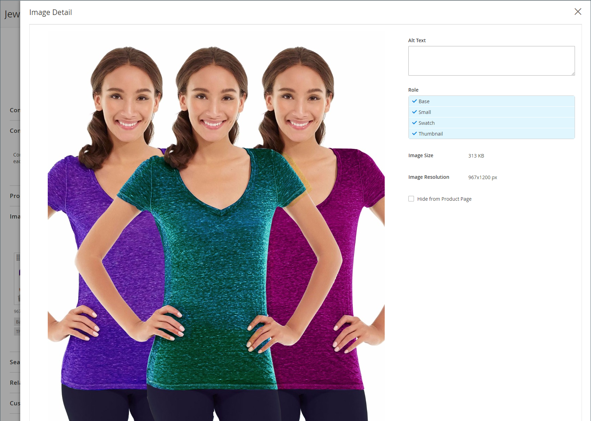

# Afbeeldingen en video&#39;s van producten beheren

Voor elk product kunt u meerdere afbeeldingen en video&#39;s uploaden, de volgorde ervan wijzigen en bepalen hoe elk wordt gebruikt. Als u een groot aantal afbeeldingen wilt beheren, kunt u deze liever als een batch importeren in plaats van ze afzonderlijk te uploaden. Voor meer informatie, zie [&#x200B; het productbeelden van de Invoer &#x200B;](../systems/data-import-product-images.md).

Als u grote afbeeldingen wilt uploaden om deze op de _[!UICONTROL Product Details]_-pagina weer te geven, kunt u overwegen een maximale pixelgrootte (breedte en hoogte) in te stellen en de bestanden tijdens het uploaden automatisch te vergroten of te verkleinen. Er is een optie om het automatisch aanpassen van het formaat van grotere afbeeldingsbestanden tijdens het uploaden in te schakelen. Voor meer informatie, zie {het beeld van het 0} Product resizing [&#128279;](product-image-config.md#product-image-resizing).

## De productafbeeldingen bijwerken

1. Open het product in de bewerkingsmodus.

1. Als u met een specifieke winkelweergave wilt werken, stelt u de **[!UICONTROL Store View]** -kiezer in de linkerbovenhoek in op de toepasselijke weergave.

   >[!NOTE]
   >
   >De nieuwe productafbeeldingen zijn **_altijd_** geupload en zichtbaar in **_alle_** opslagmeningen, zelfs als het `All Store Views` werkingsgebied niet voor upload wordt gebruikt.    om het even welke productbeeld van een specifieke opslagmening te verbergen, moet u aan die Mening van de Opslag overschakelen, **[!UICONTROL Hide from Product Page]** checkbox voor het beeld selecteren, en **[!UICONTROL Save]** klikken.

1. Schuif omlaag en vouw de sectie _[!UICONTROL Images and Videos]_&#x200B;uit.

### Een afbeelding uploaden

Voor de beste compatibiliteit wordt aangeraden alle productafbeeldingen te uploaden met het kleurprofiel `sRGB` . Alle andere kleurprofielen worden automatisch omgezet in het `sRGB` -kleurprofiel tijdens het uploaden van de productafbeelding, wat kleurinconsistentie in de geüploade afbeelding kan veroorzaken.

De naam van het afbeeldingsbestand mag niet langer zijn dan 90 tekens, inclusief de extensie.

Voer een van de volgende handelingen uit om een afbeelding te uploaden:

- Sleep een beeld van uw Desktop en laat vallen het op de _Tile van de Camera_ ( ) in de _[!UICONTROL Images And Videos]_&#x200B;doos.

- In het _[!UICONTROL Images And Videos]_&#x200B;vakje, klik de_ 2&rbrace; ( ) tegel, selecteer het beelddossier op uw computer, en klik **[!UICONTROL Open]**._

  {width="600" zoomable="yes"}

### Afbeeldingen opnieuw rangschikken

Om de orde van beelden in de galerij te veranderen, klik het _[!UICONTROL Sort]_( ) pictogram bij de bodem van de beeldtegel en sleep het beeld aan een verschillende positie in&#x200B;_[!UICONTROL Images And Videos]_ doos.

{width="600" zoomable="yes"}

### Een afbeelding verwijderen

Om een beeld uit de galerij te verwijderen, klik het **[!UICONTROL Delete]** ( ) pictogram in de hoger-juiste hoek van de beeldtegel en klik **[!UICONTROL Save]**.

### Afbeeldingsdetails instellen

Klik op de afbeelding die u in de gedetailleerde weergave wilt openen en voer een van de volgende handelingen uit:

{width="600" zoomable="yes"}

Om detailmening te sluiten, klik _dicht_ ( ) pictogram in de hoger-juiste hoek.

Klik op **[!UICONTROL Save]** als de bewerking is voltooid.

#### Alternatieve tekst invoeren

Schermlezers verwijzen naar Alt-tekst voor afbeeldingen om de webtoegankelijkheid te verbeteren en naar zoekprogramma&#39;s om de site te indexeren. In sommige browsers wordt de Alt-tekst weergegeven bij mouseover. Alt-tekst kan meerdere woorden lang zijn en zorgvuldig geselecteerde trefwoorden bevatten.

Voer in het vak _[!UICONTROL Alt Text]_&#x200B;een korte beschrijving van de afbeelding in.

#### Rollen toewijzen

Standaard worden alle rollen toegewezen aan de eerste afbeelding die naar het product is geüpload. Ga als volgt te werk om een rol toe te wijzen aan een andere afbeelding:

Kies in het vak _[!UICONTROL Role]_&#x200B;de rol die u aan de afbeelding wilt toewijzen.

Wanneer u aan de _Beelden en de sectie van Video&#39;s_ terugkeert, verschijnen de momenteel toegewezen rollen onder elk beeld.

{width="600" zoomable="yes"}

#### Een afbeelding verbergen

Als u een afbeelding wilt uitsluiten van de miniatuurgalerie, schakelt u het selectievakje **[!UICONTROL Hidden]** in en klikt u op **[!UICONTROL Save]** .

{width="600" zoomable="yes"}

## Afbeeldingsrollen

| Rol afbeelding | Beschrijving |
|--- |--- |
| [!UICONTROL Thumbnail] | Miniatuurafbeeldingen worden weergegeven in de miniatuurgalerie, winkelwagentje en in sommige blokken, zoals Verwante items. Voorbeeld: 50 x 50 pixels |
| [!UICONTROL Small Image] | De kleine afbeelding wordt gebruikt voor de productafbeeldingen in rubrieken en zoekresultaten en voor het weergeven van de productafbeeldingen die nodig zijn voor secties zoals Up-sells, Cross-sells en de lijst Nieuwe producten. Voorbeeld: 470 x 470 pixels |
| [!UICONTROL Base Image] | De basisafbeelding is de hoofdafbeelding op de pagina met productdetails. Het zoomen van de afbeelding wordt geactiveerd als u een afbeelding uploadt die groter is dan de afbeeldingscontainer. Afhankelijk van het zoomniveau dat u wilt bereiken, moet de basisafbeelding twee- of driemaal zo groot zijn als de container. Voorbeelden: 470 x 470 pixels (zonder zoomen), 1100 x 1100 pixels (met zoomen) |
| [!UICONTROL Swatch] | A [&#x200B; het monster &#x200B;](swatches.md) kan worden gebruikt om de kleur, het patroon, of de textuur te illustreren. Voorbeeld: 50 x 50 pixels |

{style="table-layout:auto"}

## Watermerken

Als u ten koste gaat van het maken van uw eigen originele productafbeeldingen, is er niet veel dat u kunt doen om te voorkomen dat gewetenloze concurrenten deze afbeeldingen met een muisklik stelen. U kunt ze echter een minder aantrekkelijk doel maken door een watermerk op elke afbeelding te plaatsen om ze als uw eigenschap te identificeren. Een watermerkbestand kan een JPG-- (JPEG), GIF- of PNG-afbeelding zijn. Zowel GIF- als PNG-bestandstypen ondersteunen transparante lagen. Deze kunnen worden gebruikt om het watermerk een transparante achtergrond te geven.

Het watermerk dat voor het _kleine_ beeld in het volgende voorbeeld wordt gebruikt is een zwart embleem met een transparante achtergrond en bewaard als PNG- dossier met de volgende montages:

- Grootte: 50x50
- Dekking: 5
- Positie: Naast elkaar

{width="700" zoomable="yes"}

### Watermerken toevoegen aan productafbeeldingen

1. Voor _Admin_ sidebar, ga **[!UICONTROL Content]** > _[!UICONTROL Design]_>**[!UICONTROL Configuration]**.

   Voor meer informatie over ontwerpconfiguraties, zie [&#x200B; configuratie van het Ontwerp &#x200B;](../content-design/configuration.md).

1. Zoek de winkelweergave die u wilt configureren en klik op **[!UICONTROL Edit]** in de kolom _[!UICONTROL Action]_.

1. Onder _[!UICONTROL Other Settings]_, breid  uit de **[!UICONTROL Product Image Watermarks]**&#x200B;sectie.

   {width="600" zoomable="yes"}

   De afbeeldingsinstellingen **[!UICONTROL Base]** , **[!UICONTROL Thumbnail]** , **[!UICONTROL Small]** en **[!UICONTROL Swatch Image]** zijn gelijk.

1. Gebruik een van de volgende methoden om het element voor een watermerkafbeelding toe te voegen:

   - Klik op **[!UICONTROL Upload]** en kies het afbeeldingsbestand op uw systeem dat u wilt uploaden voor gebruik als watermerk.
   - Klik **[!UICONTROL Select from Gallery]** en selecteer een beeldactiva van de [&#x200B; Galerij van Media &#x200B;](../content-design/media-gallery.md).

1. Voltooi de instellingen voor de weergave van het watermerk:

   - Voer de **[!UICONTROL Image Opacity]** in als een percentage. Bijvoorbeeld: `40`

   - Voer de **[!UICONTROL Image Size]** in pixels in. Bijvoorbeeld: `200 x 200`

   - Stel **[!UICONTROL Image Position]** in om te bepalen waar het watermerk wordt weergegeven.

1. Klik op **[!UICONTROL Save Config]** als de bewerking is voltooid.

1. Wanneer u wordt gevraagd de cache te vernieuwen, klikt u op **[!UICONTROL Cache Management]** in het systeembericht en vernieuwt u de ongeldige cache.

   {width="600" zoomable="yes"}

>[!TIP]
>
>U kunt **[!UICONTROL Use Default Value]**  klikken om de standaardwaarde te herstellen.

### Een watermerk verwijderen

1. In de laag-linkerhoek van het beeld, klik het **[!UICONTROL Delete]** ( ) pictogram.

   {width="300"}

1. Klik op **[!UICONTROL Save Config]**.

1. Wanneer u wordt gevraagd de cache te vernieuwen, klikt u op **[!UICONTROL Cache Management]** in het systeembericht en vernieuwt u de ongeldige cache.

   Als de watermerkafbeelding in de winkel blijft staan, gaat u terug naar het cachebeheer en klikt u op **[!UICONTROL Flush Magento Cache]** .
