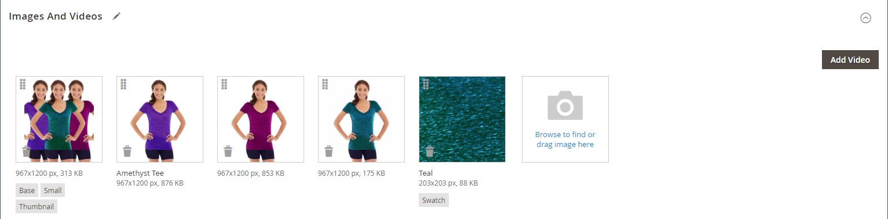

# Afbeeldingen en video&#39;s van producten beheren

Voor elk product kunt u meerdere afbeeldingen en video&#39;s uploaden, de volgorde ervan wijzigen en bepalen hoe elk wordt gebruikt. Als u een groot aantal afbeeldingen wilt beheren, kunt u deze liever als een batch importeren in plaats van ze afzonderlijk te uploaden. Zie voor meer informatie [Afbeeldingen van producten importeren](../systems/data-import-product-images.md).

Als u grote afbeeldingen wilt uploaden voor weergave op de _[!UICONTROL Product Details]_pagina, kunt u overwegen een maximumpixelgrootte (breedte en hoogte) in te stellen en automatisch de grootte van de bestanden bij het uploaden te wijzigen. Er is een optie om het automatisch aanpassen van het formaat van grotere afbeeldingsbestanden tijdens het uploaden in te schakelen. Zie voor meer informatie [Afbeeldingen van product vergroten/verkleinen](product-image-config.md#product-image-resizing).

## De productafbeeldingen bijwerken

1. Open het product in de bewerkingsmodus.

1. Als u met een specifieke winkelweergave wilt werken, stelt u de optie **[!UICONTROL Store View]** kiest u in de linkerbovenhoek naar de toepasselijke weergave.

   >[!NOTE]
   >
   >Nieuwe productafbeeldingen **_altijd_** geüpload en zichtbaar in **_alles_** archiefweergaven, zelfs als de `All Store Views` bereik wordt niet gebruikt voor uploaden.   Als u een productafbeelding wilt verbergen in een specifieke winkelweergave, moet u overschakelen naar die winkelweergave en de optie **[!UICONTROL Hide from Product Page]** selectievakje voor de afbeelding en klik op **[!UICONTROL Save]**.

1. Omlaag schuiven en de _[!UICONTROL Images and Videos]_sectie.

### Een afbeelding uploaden

Voor de beste compatibiliteit wordt aangeraden alle productafbeeldingen te uploaden met de `sRGB` kleurprofiel. Alle andere kleurprofielen worden automatisch omgezet in de `sRGB` kleurprofiel tijdens het uploaden van de productafbeelding, wat kleurinconsistentie in de geüploade afbeelding kan veroorzaken.

De naam van het afbeeldingsbestand mag niet langer zijn dan 90 tekens, inclusief de extensie.

Voer een van de volgende handelingen uit om een afbeelding te uploaden:

- Sleep een afbeelding van het bureaublad en zet deze neer op het tabblad _Camera_ (  ) tegels in de _[!UICONTROL Images And Videos]_doos.

- In de _[!UICONTROL Images And Videos]_klikt u op_ Camera _(  ), selecteert u het afbeeldingsbestand op de computer en klikt u op **[!UICONTROL Open]**.

  {width="600" zoomable="yes"}

### Afbeeldingen opnieuw rangschikken

Als u de volgorde van afbeeldingen in de galerie wilt wijzigen, klikt u op de knop _[!UICONTROL Sort]_(  ) onder aan de tegel van de afbeelding en sleep de afbeelding naar een andere positie in het deelvenster_[!UICONTROL Images And Videos]_ doos.

{width="600" zoomable="yes"}

### Een afbeelding verwijderen

Als u een afbeelding uit de galerie wilt verwijderen, klikt u op de knop **[!UICONTROL Delete]** (  ) in de rechterbovenhoek van de afbeeldingstegel en klik op **[!UICONTROL Save]**.

### Afbeeldingsdetails instellen

Klik op de afbeelding die u in de gedetailleerde weergave wilt openen en voer een van de volgende handelingen uit:

{width="600" zoomable="yes"}

Als u de detailweergave wilt sluiten, klikt u op de knop _Sluiten_ (  ) in de rechterbovenhoek.

Klik op **[!UICONTROL Save]**.

#### Alternatieve tekst invoeren

Schermlezers verwijzen naar Alt-tekst voor afbeeldingen om de webtoegankelijkheid te verbeteren en naar zoekprogramma&#39;s om de site te indexeren. In sommige browsers wordt de Alt-tekst weergegeven bij mouseover. Alt-tekst kan meerdere woorden lang zijn en zorgvuldig geselecteerde trefwoorden bevatten.

In de _[!UICONTROL Alt Text]_Voer een korte beschrijving van de afbeelding in.

#### Rollen toewijzen

Standaard worden alle rollen toegewezen aan de eerste afbeelding die naar het product is geüpload. Ga als volgt te werk om een rol toe te wijzen aan een andere afbeelding:

In de _[!UICONTROL Role]_kiest u de rol die u aan de afbeelding wilt toewijzen.

Wanneer u terugkeert naar de _Afbeeldingen en video&#39;s_ de momenteel toegewezen rollen onder elke afbeelding worden weergegeven.

{width="600" zoomable="yes"}

#### Een afbeelding verbergen

Als u een afbeelding wilt uitsluiten van de miniatuurgalerie, selecteert u de optie **[!UICONTROL Hidden]** selectievakje en klik op **[!UICONTROL Save]**.

{width="600" zoomable="yes"}

## Afbeeldingsrollen

| Rol afbeelding | Beschrijving |
|--- |--- |
| [!UICONTROL Thumbnail] | Miniatuurafbeeldingen worden weergegeven in de miniatuurgalerie, winkelwagentje en in sommige blokken, zoals Verwante items. Voorbeeld: 50 x 50 pixels |
| [!UICONTROL Small Image] | De kleine afbeelding wordt gebruikt voor de productafbeeldingen in rubrieken en zoekresultaten en voor het weergeven van de productafbeeldingen die nodig zijn voor secties zoals Up-sells, Cross-sells en de lijst Nieuwe producten. Voorbeeld: 470 x 470 pixels |
| [!UICONTROL Base Image] | De basisafbeelding is de hoofdafbeelding op de pagina met productdetails. Het zoomen van de afbeelding wordt geactiveerd als u een afbeelding uploadt die groter is dan de afbeeldingscontainer. Afhankelijk van het zoomniveau dat u wilt bereiken, moet de basisafbeelding twee- of driemaal zo groot zijn als de container. Voorbeelden: 470 x 470 pixels (zonder zoomen), 1100 x 1100 pixels (met zoomen) |
| [!UICONTROL Swatch] | A [staal](swatches.md) kunt u gebruiken om de kleur, het patroon of de structuur te illustreren. Voorbeeld: 50 x 50 pixels |

{style="table-layout:auto"}

## Watermerken

Als u ten koste gaat van het maken van uw eigen originele productafbeeldingen, is er niet veel dat u kunt doen om te voorkomen dat gewetenloze concurrenten deze afbeeldingen met een muisklik stelen. U kunt ze echter een minder aantrekkelijk doel maken door een watermerk op elke afbeelding te plaatsen om ze als uw eigenschap te identificeren. Een watermerkbestand kan een JPG- (JPEG), GIF- of PNG-afbeelding zijn. Zowel GIF- als PNG-bestandstypen ondersteunen transparante lagen. Deze kunnen worden gebruikt om het watermerk een transparante achtergrond te geven.

Het watermerk dat voor de _klein_ De afbeelding in het volgende voorbeeld is een zwart logo met een transparante achtergrond en wordt opgeslagen als een PNG-bestand met de volgende instellingen:

- Grootte: 50x50
- Dekking: 5
- Positie: Naast elkaar

{width="700" zoomable="yes"}

### Watermerken toevoegen aan productafbeeldingen

1. Op de _Beheerder_ zijbalk, ga naar **[!UICONTROL Content]** > _[!UICONTROL Design]_>**[!UICONTROL Configuration]**.

   Voor meer informatie over ontwerpconfiguraties, zie [Ontwerpconfiguratie](../content-design/configuration.md).

1. Zoek de archiefmening die u wilt vormen en klikken **[!UICONTROL Edit]** in de _[!UICONTROL Action]_kolom.

1. Onder _[!UICONTROL Other Settings]_, uitbreiden  de **[!UICONTROL Product Image Watermarks]**sectie.

   {width="600" zoomable="yes"}

   De **[!UICONTROL Base]**, **[!UICONTROL Thumbnail]**, **[!UICONTROL Small]**, en **[!UICONTROL Swatch Image]** de afbeeldingsinstellingen zijn gelijk.

1. Gebruik een van de volgende methoden om het element voor een watermerkafbeelding toe te voegen:

   - Klikken **[!UICONTROL Upload]** en kiest u het afbeeldingsbestand op uw systeem dat u wilt uploaden voor gebruik als watermerk.
   - Klikken **[!UICONTROL Select from Gallery]** en selecteer een afbeeldingselement in het menu [Medialerie](../content-design/media-gallery.md).

1. Voltooi de instellingen voor de weergave van het watermerk:

   - Voer de **[!UICONTROL Image Opacity]** als een percentage. Bijvoorbeeld: `40`

   - Voer de **[!UICONTROL Image Size]** in pixels. Bijvoorbeeld: `200 x 200`

   - Set **[!UICONTROL Image Position]** om te bepalen waar het watermerk wordt weergegeven.

1. Klik op **[!UICONTROL Save Config]**.

1. Klik wanneer u wordt gevraagd de cache te vernieuwen op **[!UICONTROL Cache Management]** in het systeembericht en vernieuw de ongeldige cache.

   {width="600" zoomable="yes"}

>[!TIP]
>
>U kunt op **[!UICONTROL Use Default Value]**  om de standaardwaarde te herstellen.

### Een watermerk verwijderen

1. Klik in de linkerbenedenhoek van de afbeelding op de knop **[!UICONTROL Delete]** (  ).

   {width="300"}

1. Klik op **[!UICONTROL Save Config]**.

1. Klik wanneer u wordt gevraagd de cache te vernieuwen op **[!UICONTROL Cache Management]** in het systeembericht en vernieuw de ongeldige cache.

   Als de watermerkafbeelding in de winkel blijft, gaat u terug naar het cachebeheer en klikt u op **[!UICONTROL Flush Magento Cache]**.
