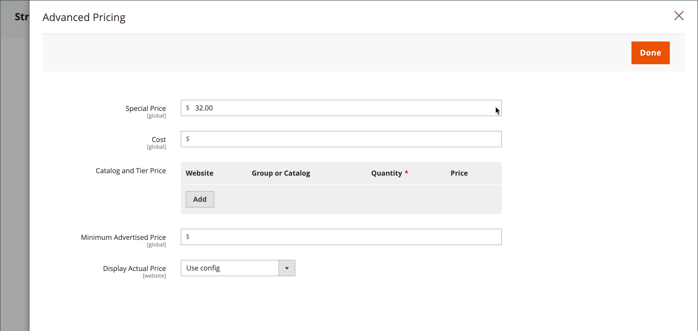

# Groepsprijzen

U kunt de instellingen voor productconfiguratie in de Admin gebruiken om prijzen voor gedisconteerde objecten in te stellen op basis van klantgroepen in uw winkel. Dit strategische prijsmodel wordt _groepsprijsstelling_.

De gedisconteerde prijs van om het even welk product kan aan leden van een specifieke klantengroep worden aangeboden wanneer de verkoopster aan hun rekening wordt het programma geopend. De prijs van de klantengroep wordt samen met de normale prijs op de productpagina weergegeven, zodat een winkelier de prijzen gemakkelijk kan vergelijken en dienovereenkomstig kan handelen. Nadat zij het product aan het winkelwagentje hebben toegevoegd, wordt de normale prijs vervangen door de groepsprijs op basis van hun klantengroep.

Prijzen voor klantengroepen maken deel uit van [gedifferentieerde prijsstelling](product-price-tier.md) en op soortgelijke wijze wordt vastgesteld. Het enige verschil is dat de prijzen van de klantengroep een hoeveelheid van 1 hebben.

{width="600" zoomable="yes"}

## Voordelen van het gebruik van groepsprijzen

- Geschikt voor groothandelaars

- Stimulering voor klanten om hun klantengroep te bevorderen om uit kortingen voordeel te halen

- Gerichte marketingcampagnes

- Vertrouwen en geloofwaardigheid opbouwen door loyale klanten te belonen

## Een groepsprijs instellen

1. Open het product in de bewerkingsmodus.

1. Onder de _[!UICONTROL Price]_veld, klikken **[!UICONTROL Advanced Pricing]**.

1. In de _[!UICONTROL Customer Group Price]_sectie, klikken **[!UICONTROL Add]**.

   Als uw winkel [B2B voor Adobe Commerce](../b2b/introduction.md) en heeft [gedeelde catalogi](../b2b/catalog-shared.md) deze sectie is ingeschakeld, wordt gelabeld _[!UICONTROL Catalog and Tier Price]_.

   {width="600" zoomable="yes"}

1. Configureer de groepsprijs:

   - Kies voor een installatie op meerdere locaties de optie **[!UICONTROL Website]** wanneer de groepsprijs van toepassing is.

   - Kies de optie **[!UICONTROL Customer Group]** dat wil zeggen de korting.

   - Voer een **[!UICONTROL Quantity]** van `1`.

   - Voor **[!UICONTROL Price]** stelt u het type en het bedrag van de prijsstelling in:

      - `Fixed` - Voer de gedisconteerde productprijs in.

      - `Discount` - Vermeld de verlaagde prijs als percentage van de productprijs.

     {width="600" zoomable="yes"}

1. Als u nog een groepsprijs wilt toevoegen, klikt u op **[!UICONTROL Add]** en herhaal de vorige stap.

1. Klik op **[!UICONTROL Done]** en vervolgens **[!UICONTROL Save]**.

>[!NOTE]
>
>De **_final_** de productprijs wordt berekend als **_minimum_** relevante prijs, met gebruikmaking van de volgende formule:  `Final Price=Min(Regular(Base) Price, Group(Tier) Price, Special Price, Catalog Price Rule) + Sum(Min Price per each required custom option)`

>[!NOTE]
>
>**_Vaste prijs_** Aanpasbare opties voor producten zijn _niet_ worden beïnvloed door de regels voor groepsprijs, Tier-prijs, Speciale prijs of Catalogusprijs.
