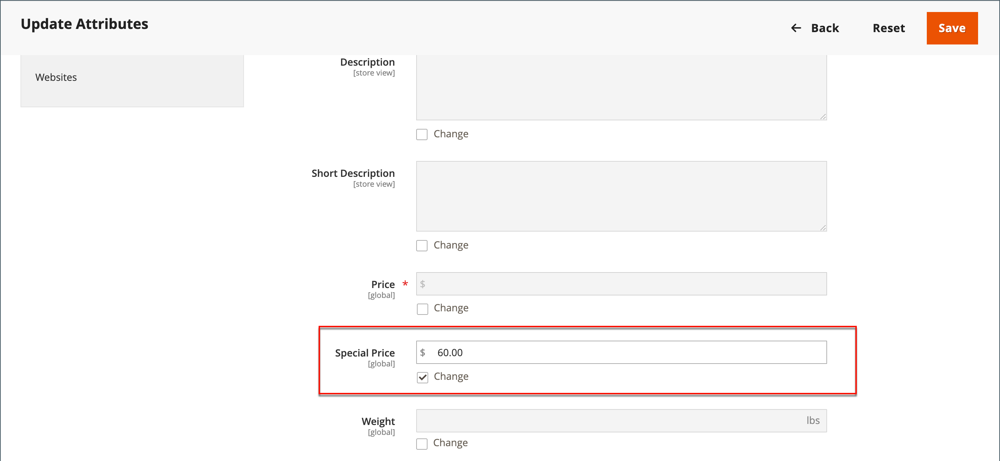

# Speciale prijzen

Voor een bepaalde periode kan een speciale prijs worden aangeboden. Gedurende de opgegeven periode verschijnt de speciale prijs in plaats van de reguliere prijs, gevolgd door een notatie die de reguliere prijs weergeeft.

{width="700" zoomable="yes"}

## Speciale prijs toepassen op een afzonderlijk product

U kunt eenvoudig een speciale prijs instellen voor één product in de catalogus.

### Een geplande update gebruiken

{{ee-feature}}

Adobe Commerce biedt ondersteuning voor [geplande updates](../content-design/content-staging-scheduled-update.md). Gebruik deze promotietools om een speciale prijs toe te passen op een specifiek product gedurende een bepaalde periode.

1. Open het product in de bewerkingsmodus.

1. Klik op **[!UICONTROL Scheduled Update]**.

   {width="600" zoomable="yes"}

1. Voor **Naam bijwerken**, voert u een naam in voor de speciale prijsbevordering.

1. Voer een korte beschrijving in **[!UICONTROL Description]**.

1. Gebruik de _Kalender_ (  ) gebruiken om de **[!UICONTROL Start Date]** en **[!UICONTROL End Date]** voor de speciale prijsbevordering.

   U kunt de **[!UICONTROL Hour]** en **[!UICONTROL Minute]** schuifregelaars om ook de begin- en eindtijd te kiezen. Klikken **[!UICONTROL Close]** wanneer het begin en het einde zijn ingesteld.

   {width="600" zoomable="yes"}

1. Omlaag schuiven naar de _Prijs_ veld, klikken **[!UICONTROL Advanced Pricing]** en voert u het bedrag in van de **[!UICONTROL Special Price]** toe te passen volgens de geplande update.

   {width="600" zoomable="yes"}

1. Klik op **[!UICONTROL Done]** en vervolgens **[!DNL Save]**.

   In de winkel moet de speciale prijs zowel in de cataloguslijst als op de productpagina worden vermeld.

   De _[!UICONTROL Scheduled Change]_boven aan de pagina.

   {width="600" zoomable="yes"}

### Een eenvoudige begin- en einddatum gebruiken

{{ce-feature}}

Magento Open Source bevat eenvoudige begin- en einddatumopties in de geavanceerde prijsopties.

1. Open het product in de bewerkingsmodus.

1. Omlaag schuiven naar de _[!UICONTROL Price]_veld, klikken **[!UICONTROL Advanced Pricing]**en voert u de **[!UICONTROL Special Price]**bedrag.

1. Gebruik de _Kalender_ (  ) gebruiken om de **[!UICONTROL Start Date]** en **[!UICONTROL End Date]** voor de speciale prijsbevordering.

   De speciale prijs gaat in onmiddellijk na middernacht aan het begin van de begindatum (00:01) en loopt door tot net vóór middernacht (23:59) op de dag vóór de einddatum.

   {width="600" zoomable="yes"}

1. Klik op **[!UICONTROL Done]** en vervolgens **[!UICONTROL Save]**.

   In de winkel moet de speciale prijs zowel in de cataloguslijst als op de productpagina worden vermeld.

## Een speciale prijs toepassen op meerdere producten

U kunt ook een speciale prijs toewijzen aan meerdere producten, zoals meerdere variaties van een [configureerbaar product](product-create-configurable.md).

### Een speciale prijs instellen voor geselecteerde producten

{{ee-feature}}

In het volgende voorbeeld ziet u hoe u dezelfde speciale prijs kunt toewijzen aan meerdere productvariaties van een configureerbaar product in Adobe Commerce.

1. Op de _[!UICONTROL Products]_pagina, klikt u **[!UICONTROL Filters]**en voert u de **[!UICONTROL Name]**van het configureerbare product.

1. Set **[!UICONTROL Type]** tot `Configurable Product` en klik op **[!UICONTROL Apply Filters]**.

1. Als u dezelfde speciale prijs aan alle producten wilt toewijzen, stelt u het besturingselement in de koptekst van de eerste kolom in op `Select All`.

   U kunt ook het selectievakje inschakelen voor elk product dat u wilt opnemen.

1. Stel de **[!UICONTROL Actions]** controle op `Update attributes`.

1. Omlaag schuiven naar de _[!UICONTROL Special Price]_en selecteer de **[!UICONTROL Change]**selectievakje onder_[!UICONTROL Special Price]_ en voer de speciale prijs in die je wilt aanbieden.

   {width="600" zoomable="yes"}

1. Klik op **[!UICONTROL Save]**.

De speciale prijs die beschikbaar is in de winkel, wordt weergegeven in catalogusaanbiedingen en op de productpagina. Voor een configureerbaar product wordt de normale prijs ook op de productpagina weergegeven wanneer de opties worden gekozen.

### Een speciale prijs en een bepaald datumbereik instellen voor bepaalde producten

{{ce-feature}}

Het volgende voorbeeld toont hoe te om de zelfde speciale prijs aan veelvoudige productvariaties van een configureerbaar product in Magento Open Source toe te wijzen.

1. Op de _Beheerder_ zijbalk, ga naar **[!UICONTROL Catalog]** > **[!UICONTROL Products]**.

1. Klik op **[!UICONTROL Filters]**.

1. Voer de **[!UICONTROL Name]** van het configureerbare product.

1. Set **[!UICONTROL Type]** tot `Simple Product`.

   {width="600" zoomable="yes"}

1. Klik op **[!UICONTROL Apply Filters]**.

   Het net maakt een lijst van alle eenvoudige producten die als variaties van het configureerbare product worden geassocieerd.

1. Als u dezelfde speciale prijs aan alle producten wilt toewijzen, stelt u het besturingselement in de koptekst van de eerste kolom in op `Select All`.

   U kunt ook het selectievakje inschakelen voor elk product dat u wilt opnemen.

1. Stel de **[!UICONTROL Actions]** controle op `Update attributes`.

   {width="600" zoomable="yes"}

1. Omlaag schuiven naar de _[!UICONTROL Special Price]** en voer de volgende handelingen uit:

   - Selecteer de **[!UICONTROL Change]** selectievakje onder de _[!UICONTROL Special Price]** en voer de speciale prijs in die je wilt aanbieden.

   - Selecteer de **[!UICONTROL Change]** selectievakje onder _Speciale prijs vanaf datum_ veld, klikt u op de knop _Kalender_ (  ) en kiest u de eerste datum van de speciale prijsbevordering.

     De speciale prijs gaat in onmiddellijk na middernacht aan het begin van de begindatum (00:01) en loopt door tot net vóór middernacht (23:59) op de dag vóór de einddatum.

   - Selecteer de **[!UICONTROL Change]** selectievakje onder _Speciale prijs tot op heden_ veld, klikt u op de knop _Kalender_ (  ) en kiest u de laatste datum van de speciale prijsbevordering.

   {width="600" zoomable="yes"}

1. Klik op **[!UICONTROL Save]**.

   Een bericht geeft aan hoeveel records met de speciale prijs zijn bijgewerkt.

   De speciale prijs wordt beschikbaar in de winkel op de opgegeven datum en wordt weergegeven in catalogusaanbiedingen en op de productpagina. Voor een configureerbaar product wordt de normale prijs ook op de productpagina weergegeven wanneer de opties worden gekozen.

   {width="600" zoomable="yes"}

## Testen

Als de speciale prijs niet correct in de winkel op zowel de cataloguslijst als productpagina&#39;s verschijnt, ontruim uw browser geheim voorgeheugen:

1. Op de _Beheerder_ zijbalk, ga naar **[!UICONTROL System]** > **[!UICONTROL Cache Management]**.

1. Klik op **[!UICONTROL Flush Magento Cache]**.

>[!NOTE]
>
>De **_final_** de productprijs wordt berekend als **_minimum_** relevante prijs, met gebruikmaking van de volgende formule:  `Final Price=Min(Regular(Base) Price, Group(Tier) Price, Special Price, Catalog Price Rule) + Sum(Min Price per each required custom option)`

>[!NOTE]
>
>**_Vaste prijs_** Aanpasbare opties voor producten zijn _niet_ worden beïnvloed door de regels voor groepsprijs, Tier-prijs, Speciale prijs of Catalogusprijs.
