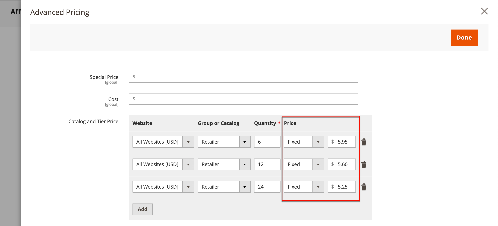

# Tier-prijsstelling

Met de prijzen voor Tier kunt u een korting bieden op de hoeveelheid van een productaanbieding of productpagina in de winkel. De korting kan worden toegepast op een specifieke opslagweergave of een klantgroep of gedeelde catalogus.

Als u veel producten hebt om bij te werken, is het het meest efficiënt om de prijsveranderingen van de lijst in plaats van hen individueel in te voeren. Zie voor meer informatie [Invoerprijzen](../systems/data-import-price-tier.md).

{width="700" zoomable="yes"}

Op de productpagina wordt de kwantumkorting berekend en wordt een bericht weergegeven, zoals:

`Buy 6 for $5.95 each and save 15%`

De prijzen in de winkel hebben voorrang van de hoogste naar de laagste hoeveelheid. Als u een lagere prijs voor de hoeveelheid hebt `5` en één voor `10`en een klant voegt vijf, zes, zeven, acht of negen artikelen aan het winkelwagentje toe, ontvangt de klant de verlaagde prijs voor de hoeveelheid `5` laag. Wanneer de klant het tiende object toevoegt, wordt de voor de hoeveelheid opgegeven prijs met korting berekend `10` laag vervangt het niveau voor een hoeveelheid van `5`, en de verlaagde prijs voor `10` van toepassing.

## Een prijsniveau toevoegen voor een product

1. Open het product in de bewerkingsmodus.

1. Onder de _[!UICONTROL Price]_veld, klikken **[!UICONTROL Advanced Pricing]**.

1. In de _[!UICONTROL Tier Price]_sectie, klikken **[!UICONTROL Add]**.

   Als u een lijst met verschillende prijzen maakt, klikt u op **[!UICONTROL Add]** voor elk extra niveau, zodat kunt u alle lagen tezelfdertijd werken. Elke laag in de groep heeft dezelfde website en dezelfde klantengroep of dezelfde gedeelde catalogustoewijzing, maar een ander aantal en een andere prijs.

## Prijsniveau configureren

1. Als uw winkel meerdere websites heeft, kiest u de optie **[!UICONTROL Website]** waarvoor de tier - verrekenprijzen gelden.

1. Indien nodig de beschikbaarheid van de prijsklasse beperken door de **[!UICONTROL Customer Group]** of **[!UICONTROL Shared Catalog]** ( Beschikbaar met [Adobe Commerce B2B](./b2b/../introduction.md) alleen).

1. Voor **[!UICONTROL Qty]**, voert u de hoeveelheid in die moet worden besteld om de korting te ontvangen.

   - **Methode 1:** Prijs invoeren als vast bedrag

     Set **[!UICONTROL Price]** tot `Fixed` en voert de aangepaste prijs voor één eenheid op dat niveau in.

     {width="600" zoomable="yes"}

   - **Methode 2:** Prijs invoeren als percentage

     Set **[!UICONTROL Price]** tot `Discount` en vermeld de verlaagde prijs als een percentage van de basisprijs van het product.

     Voer bijvoorbeeld voor een korting van 15 procent het getal in `15`. (De prijs wordt opgeslagen met twee decimale posities, zoals `15.00`.)

     >[!NOTE]
     >
     >Om de gedisconteerde prijs te verkrijgen, wordt het gedefinieerde percentage berekend op basis van de waarde die in het _[!UICONTROL Price]_ veld, niet _[!UICONTROL Special Price]_ veld.

     {width="600" zoomable="yes"}

## Voltooi de prijsconfiguratie

1. Herhaal de vorige stappen om nog een reeks prijzen voor een andere website of klantengroep toe te voegen.

1. Klik op **[!UICONTROL Done]** en vervolgens **[!UICONTROL Save]**.

>[!NOTE]
>
>De **_final_** de productprijs wordt berekend als **_minimum_** relevante prijs, met gebruikmaking van de volgende formule:  `Final Price=Min(Regular(Base) Price, Group(Tier) Price, Special Price, Catalog Price Rule) + Sum(Min Price per each required custom option)`

>[!NOTE]
>
>**_Vaste prijs_** Aanpasbare opties voor producten zijn _niet_ worden beïnvloed door de regels voor groepsprijs, Tier-prijs, Speciale prijs of Catalogusprijs.
