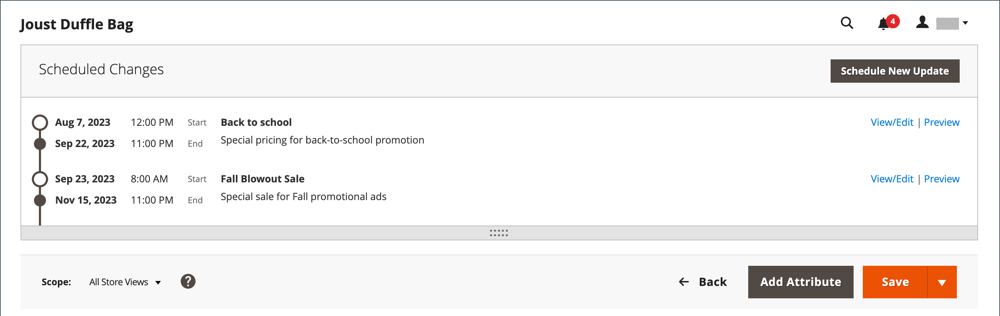
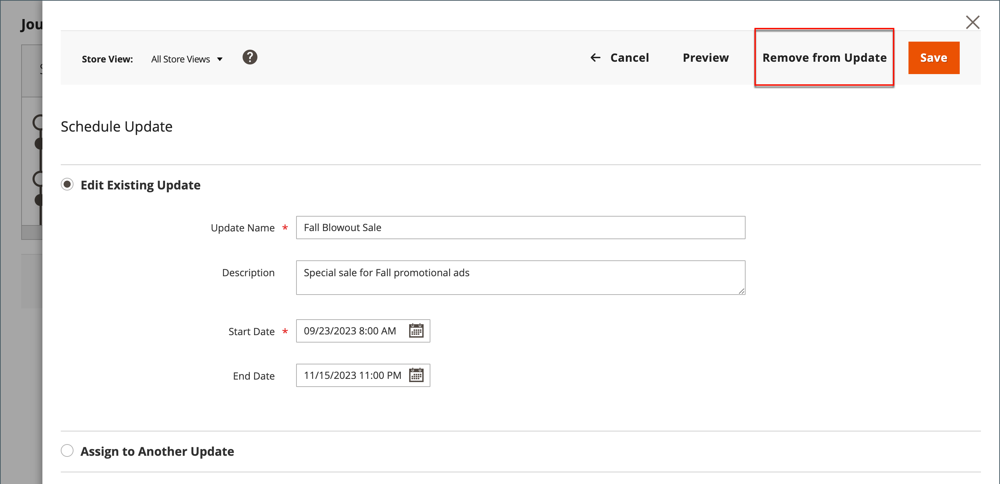

# Productupdates plannen

{{ee-feature}}

Productupdates kunnen volgens schema worden toegepast en met andere inhoudsveranderingen worden gegroepeerd. U kunt [inhoudstaging](../content-design/content-staging.md) om een campagne te creëren die op geplande veranderingen in het product wordt gebaseerd, of de veranderingen op een bestaande campagne toe te passen.

>[!NOTE]
>
>De [!UICONTROL Set Product as New From] en [!UICONTROL To] velden en [!UICONTROL Schedule Design Update] tabblad is verwijderd in  Adobe Commerce en kan niet rechtstreeks op het product worden gewijzigd. U moet een geplande update maken voor deze activeringen.

>[!NOTE]
>
>Alle geplande updates worden opeenvolgend toegepast, wat betekent dat elke entiteit slechts één geplande update tegelijk kan hebben. Elke geplande update wordt toegepast op alle winkelweergaven binnen de opgegeven tijdsperiode. Dientengevolge, kan een entiteit verschillende geplande updates voor verschillende opslagmeningen niet tezelfdertijd hebben. Alle waarden van entiteitattributen binnen alle opslagmeningen, die niet door de huidige geplande update worden beïnvloed, worden genomen van de standaardwaarden, en niet van de vorige geplande update.

>[!NOTE]
>
>Een voorvertoning van een geprogrammeerde update wordt altijd gestart vanaf het tabblad **default** de mening van de opslag, die de ervaring van de klant navigeert door de het opvoeren updatecampagne.

## Een geplande update maken

1. Op de _Beheerder_ zijbalk, ga naar **[!UICONTROL Catalog]** > **[!UICONTROL Products]**.

1. Selecteer een bestaand product en klik op **[!UICONTROL Edit]**.

1. Klik op **[!UICONTROL Schedule New Update]**.

1. Selecteren **[!UICONTROL Save as a New Update]**.

1. Voor **[!UICONTROL Update Name]**, voert u een naam in voor de nieuwe campagne voor het opvoeren van inhoud.

1. Voer een korte beschrijving in **[!UICONTROL Description]** van de actualisering en de wijze waarop deze moet worden gebruikt.

1. De kalender gebruiken () te kiezen. **[!UICONTROL Start Date]** en **[!UICONTROL End Date]** voor de campagne.

   >[!NOTE]
   >
   >Campagne **[!UICONTROL Start Date]** en **[!UICONTROL End Date]** moet worden gedefinieerd met behulp van de **_default_** Tijdzone voor beheer, die wordt omgezet vanuit de lokale tijdzone voor elke website. Als u bijvoorbeeld meerdere websites in verschillende tijdzones hebt waarin u een campagne wilt starten op basis van een Amerikaanse tijdzone, moet u een afzonderlijke update voor elke lokale tijdzone plannen. Set **[!UICONTROL Start Date]** en **[!UICONTROL End Date]** voor elk, en het wordt omgezet van de lokale tijdzone van de websitetijd in standaardtijdzone Admin.

   {width="600" zoomable="yes"}

1. Omlaag schuiven naar _[!UICONTROL Price]_en klik op **[!UICONTROL Advanced Pricing]**.

1. Voer een **[!UICONTROL Special Price]** voor het product tijdens de geplande campagne en klik op **[!UICONTROL Done]**.

1. Klik op **[!UICONTROL Save]**.

## Toewijzen aan bestaande update

1. Op de _Beheerder_ zijbalk, ga naar **[!UICONTROL Catalog]** > **[!UICONTROL Products]**.

1. Selecteer een bestaand product en klik op **[!UICONTROL Edit]**.

1. Klik op **[!UICONTROL Schedule New Update]**.

1. Selecteren **[!UICONTROL Assign to Existing Campaign]**.

1. Selecteer in de lijst de campagne die u wilt wijzigen.

   {width="600" zoomable="yes"}

1. Uitbreiden  **[!UICONTROL Content]**.

1. Klik op **[!UICONTROL Save]**.

## De geplande wijziging weergeven

De geplande wijziging wordt boven aan de productpagina weergegeven met de begin- en einddatum van de campagne.

{width="600" zoomable="yes"}

## De geplande wijziging bewerken

1. In de _[!UICONTROL Scheduled Changes]_klikt u boven aan de pagina op **[!UICONTROL View/Edit]**.

1. Breng de benodigde wijzigingen aan in de geplande update.

1. Klik op **[!UICONTROL Save]**.

## De geplande wijziging verwijderen

1. In de _[!UICONTROL Scheduled Changes]_klikt u boven aan de pagina op **[!UICONTROL View/Edit]**.

1. Klik op de bovenste balk op **[!UICONTROL Remove from Update]**.

   {width="600" zoomable="yes"}

1. Selecteer in het dialoogvenster **[!UICONTROL Delete the Update]** en klik op **[!UICONTROL Done]**.

   >[!NOTE]
   >
   >Het product wordt verwijderd uit de update en alle geplande wijzigingen gaan verloren.

## Een ontwerpupdate plannen

{{ce-feature}}

De _[!UICONTROL Schedule Design Update]_kunt u tijdelijke wijzigingen aanbrengen in de weergave van de productpagina. U kunt ontwerpwijzigingen plannen voor een seizoen, voor speciale acties of alleen om de zaken vers te maken. Ontwerpwijzigingen kunnen vooraf worden gepland, zodat ze van kracht worden, of_ druppel _, volgens uw gedefinieerde schema.

{width="600" zoomable="yes"}

| Veld | Beschrijving |
|--- |--- |
| [!UICONTROL Schedule Update From/To] | Hiermee bepaalt u het datumbereik wanneer een aangepaste indeling wordt toegepast op het product. |
| [!UICONTROL New Theme] | Hiermee past u een aangepast thema toe op het product. |
| [!UICONTROL New Layout] | Hiermee past u een andere indeling op de productpagina toe. Opties:  **[!UICONTROL No layout updates]**- Standaard zijn lay-outupdates niet beschikbaar voor de productpagina. **[!UICONTROL Empty]** - Hiermee kunt u uw eigen lay-out definiëren, zoals een pagina met vier kolommen. (Hiervoor is inzicht in XML vereist.)  **[!UICONTROL 1 column]**- Hiermee past u een indeling met één kolom toe op de productpagina. **[!UICONTROL 2 columns with left bar]** - Hiermee past u een lay-out met twee kolommen en een linkerzijbalk toe op de productpagina.  **[!UICONTROL 2 columns with right bar]**- Hiermee past u een lay-out met twee kolommen en een rechterzijbalk toe op de productpagina. **[!UICONTROL 3 columns]** - Hiermee past u een indeling met drie kolommen toe op de productpagina. |

{style="table-layout:auto"}
