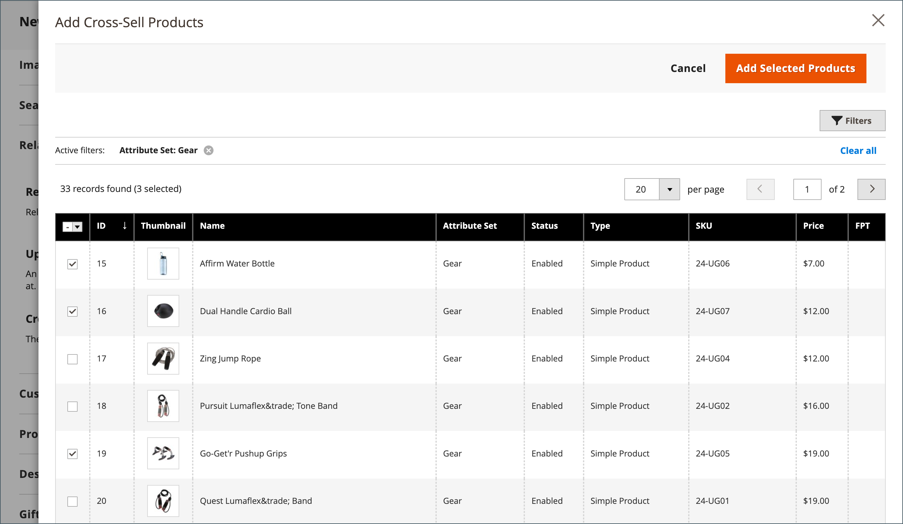

# Productinstellingen - [!UICONTROL Related Products, Up-Sells, and Cross-Sells]

Gebruik de _[!UICONTROL Related Products, Up-Sells, and Cross-Sells]_aan opstellingseenvoudige promotieblokken die een selectie van extra producten voorstellen die van belang voor de klant zouden kunnen zijn. Zie voor meer informatie [Productrelaties](../merchandising-promotions/product-relationships.md).

{width="600" zoomable="yes"}

Elk blok bestaat uit een lijst van producten die tot een specifieke optie behoren.

| Veld | Beschrijving |
|--- |--- |
| [!UICONTROL ID] | Een unieke numerieke id die aan de productentiteit is toegewezen. |
| [!UICONTROL Thumbnail] | Afbeelding met productminiaturen. |
| [!UICONTROL Name] | De naam van het product. |
| [!UICONTROL Status] | Geeft de productstatus aan. Opties: `Enabled` / `Disabled`. Uitgeschakelde producten worden niet weergegeven in de blokken aan de voorzijde. |
| [!UICONTROL Attribute Set] | De naam van de kenmerkenreeks die als malplaatje voor het product wordt gebruikt. |
| [!UICONTROL SKU] | De unieke Stock Keeping Unit die aan het product wordt toegewezen. |
| [!UICONTROL Price] | De eenheidsprijs van het product. |
| [!UICONTROL Action] | Opties: `Remove`. Hiermee verwijdert u een product uit het blok. |

{style="table-layout:auto"}

>[!TIP]
>
> (alleen Adobe Commerce) **Product Recommendations met Adobe Sensei** vereenvoudigt het proces voor het definiëren van productrelaties door gebruik te maken van kunstmatige intelligentie en computerleeralgoritmen voor het uitvoeren van een diepgaande analyse van geaggregeerde bezoekersgegevens. Deze gegevens, in combinatie met uw Adobe Commerce-catalogus, resulteren in zeer boeiende, relevante en persoonlijke ervaringen voor de klant.
> 
>Voor meer informatie over het gebruiken van deze Adobe-ontwikkelde uitbreiding als alternatief aan manueel gevormde productaanbevelingen en omhoog-verkoopt, zie _[Recommendations-gids voor producten](https://experienceleague.adobe.com/docs/commerce-merchant-services/product-recommendations/guide-overview.html)_.

## Verwante producten

Verwante producten zijn bedoeld om te worden aangeschaft naast het object dat de klant bekijkt. De klant kan het item in het winkelwagentje plaatsen door gewoon op het selectievakje te klikken. De plaatsing van de _Verwante producten_ het blok varieert afhankelijk van het gedefinieerde thema en de pagina-indeling. In het onderstaande voorbeeld wordt _Verwante producten_ wordt onder aan het blok weergegeven _Productweergave_ pagina. Met een lay-out van twee kolommen, _Verwante producten_ wordt vaak in de rechterzijbalk weergegeven.

{width="600" zoomable="yes"}

Verwante producten instellen:

1. Open het product in de bewerkingsmodus.

1. Omlaag schuiven en uitbreiden  de **[!UICONTROL Related Products, Up-Sells, and Cross-Sells]** sectie.

1. Klik op **[!UICONTROL Add Related Products]**.

1. Gebruik de [filterbesturingselementen](../getting-started/admin-grid-controls.md) om de gewenste producten te zoeken.

1. Selecteer in de lijst het selectievakje van een product dat u als verwant product wilt gebruiken.

   {width="600" zoomable="yes"}

1. Klik op **[!UICONTROL Add Selected Products]**.

## Up-sells

Up-sell-producten zijn objecten die uw klant wellicht liever gebruikt dan het product dat momenteel wordt overwogen. Een object dat wordt aangeboden als een up-verkoop kan van hogere kwaliteit zijn, populairder zijn of een betere winstmarge hebben. Up-sell-producten worden op de productpagina weergegeven onder een kop, zoals _Mogelijk bent u ook geïnteresseerd in de volgende producten_.

{width="600" zoomable="yes"}

Je kunt als volgt producten selecteren:

1. Open het product in de bewerkingsmodus.

1. Omlaag schuiven en uitbreiden  de **[!UICONTROL Related Products, Up-Sells, and Cross-Sells]** sectie.

1. Klik op **[!UICONTROL Add Up-Sell Products]**.

1. Gebruik de [filterbesturingselementen](../getting-started/admin-grid-controls.md) om de gewenste producten te zoeken.

1. Schakel in de lijst het selectievakje in van elk product dat u wilt gebruiken als een up-sell-product.

   {width="600" zoomable="yes"}

1. Klik op **[!UICONTROL Add Selected Products]**.

## Cross-sells

Cross-sell-items zijn vergelijkbaar met impulsaankopen die naast het kasregister op de afrekenlijn worden geplaatst. Producten die worden aangeboden als een cross-sell, worden weergegeven op de winkelwagentje, vlak voordat de klant het afrekenproces start.

>[!NOTE]
>
>Als je objecten per winkel wilt weergeven of verbergen, raadpleegt u de [Afhandeling > Winkelwagentje](../configuration-reference/sales/checkout.md) optie aangeroepen _[!UICONTROL Show Cross-sell Items]_in het winkelwagentje. U kunt cross-sells tijdens specifieke verkoop of voor het testen A/B in een archiefmening willen verbergen.

{width="600" zoomable="yes"}

**_Voor het selecteren van producten voor meerdere verkopen:_**

1. Open het product in de bewerkingsmodus.

1. Omlaag schuiven en uitbreiden  de **[!UICONTROL Related Products, Up-Sells, and Cross-Sells]** sectie.

1. Klik op **[!UICONTROL Add Cross-Sell Products]**.

1. Gebruik de [filterbesturingselementen](../getting-started/admin-grid-controls.md) om de gewenste producten te zoeken.

1. Schakel in de lijst het selectievakje in van elk product dat u als een cross-selproduct wilt gebruiken.

   {width="600" zoomable="yes"}

1. Klik op **[!UICONTROL Add Selected Products]**.
