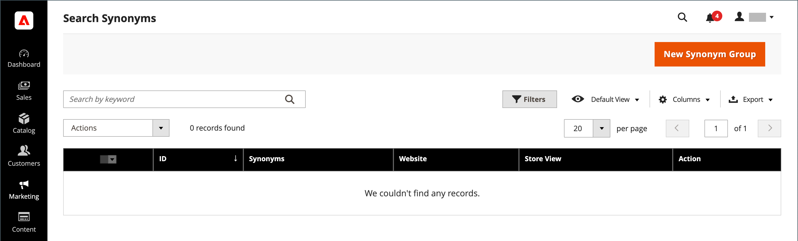

# Zoektermen beheren

De [ landende pagina ](../content-design/pages.md) voor een onderzoekstermijn kan een inhoudspagina, een categoriepagina, een pagina van het productdetail, of zelfs een pagina op een verschillende plaats zijn.

Gebruik zoektermen om veelvoorkomende spelfouten vast te leggen en deze om te leiden naar de juiste pagina. Bijvoorbeeld, als u ruw ijzergeduld meubilair verkoopt, weet u dat vele mensen de termijn als _ruw ijzer_ verkeerd spellen, of zelfs _rotijzer_. U kunt elk verkeerd gespeld woord als onderzoekstermijn ingaan, en hen synoniemen maken voor _droogt ijzer_. Hoewel het woord verkeerd is gespeld, wordt de zoekopdracht naar de pagina gestuurd voor ruw ijzer.

U kunt ook leren wat uw klanten zoeken door de zoektermen te bekijken die zij gebruiken om producten in uw winkel te zoeken. Als er voldoende mensen zijn die op zoek zijn naar een product dat niet in uw catalogus staat, kan dit wijzen op een verkoopmogelijkheid. In plaats van ze leeg te laten, kunt u ze nu doorsturen naar een ander product in uw catalogus.

## Zoektermen toevoegen

Terwijl u nieuwe woorden leert die mensen gebruiken om in uw winkel te zoeken, kunt u deze toevoegen aan de lijst met zoektermen om mensen naar de meest overeenkomende producten in uw catalogus te leiden.

{width="700" zoomable="yes"}

| Kolom | Beschrijving |
|--- |--- |
| [!UICONTROL Search Query] | De query die wordt gebruikt om de zoekopdracht uit te voeren. |
| [!UICONTROL Store] | De winkel waarop de zoekquery is toegepast. |
| [!UICONTROL Results] | Aantal resultaten gevonden door query. |
| [!UICONTROL Uses] | Aantal toepassingen. |
| [!UICONTROL Redirect URL] | URL van de doelpagina waarop de gebruiker na het uitvoeren van de zoekopdracht is omgeleid. |
| [!UICONTROL Suggested Terms] | Bepaalt als het vraagresultaat voorgestelde termijnen toont. |
| [!UICONTROL Actions] | Opent het product in Edit wijze. |

{style="table-layout:auto"}

>[!NOTE]
>
>Het aantal resultaten wordt bijgewerkt telkens wanneer een winkelier een zoekopdracht uitvoert met deze zoekquery. Deze wordt niet bijgewerkt als een van de producten wordt gewijzigd of verwijderd.

### Een zoekterm toevoegen

1. Voor _Admin_ sidebar, ga **[!UICONTROL Marketing]** > _[!UICONTROL SEO & Search]_>**[!UICONTROL Search Terms]**.

1. Klik op **[!UICONTROL Add New Search Term]**.

   {width="600" zoomable="yes"}

1. Voer onder _[!UICONTROL General Information]_in het vak **[!UICONTROL Search Query]**het woord of de woordgroep in die u als een nieuwe zoekterm wilt toevoegen.

1. Als uw winkel in meerdere talen beschikbaar is, kiest u de toepasselijke **[!UICONTROL Store]** -weergave.

1. Als u de zoekresultaten wilt doorsturen naar een andere pagina in uw winkel of naar een andere website, voert u de volledige URL van de doelpagina in het veld **[!UICONTROL Redirect URL]** in.

1. Stel **[!UICONTROL Display in Suggested Terms]** in op `Yes` als u wilt dat deze term beschikbaar is voor gebruik als suggestie wanneer een zoekopdracht geen resultaten oplevert.

1. Klik op **[!UICONTROL Save Search]** als de bewerking is voltooid.

## Een zoekterm bewerken

1. Klik in het _[!UICONTROL Search Terms]_-raster op de rij van elke record om de zoekterm te openen in de bewerkingsmodus.

1. Breng de gewenste wijzigingen aan.

1. Klik op **[!UICONTROL Save Search]** als de bewerking is voltooid.

## Een zoekterm verwijderen

Er zijn twee methoden om een zoekterm te verwijderen: uit het raster en op de bewerkingspagina.

**Methode 1:** in het _[!UICONTROL Search Terms]_net

1. Selecteer in de lijst het selectievakje van de term die u wilt verwijderen.

1. Stel **[!UICONTROL Actions]** in op `Delete` in de linkerbovenhoek van de lijst.

1. Klik op **[!UICONTROL Submit]** als de bewerking is voltooid.

**Methode 2:** op de _[!UICONTROL Edit a Search Term]_pagina

1. Voor _Admin_ sidebar, ga **[!UICONTROL Marketing]** > _[!UICONTROL SEO & Search]_>**[!UICONTROL Search Terms]**.

1. Zoek de zoekterm die u wilt verwijderen en open deze in de bewerkingsmodus.

1. Klik op **[!UICONTROL Delete Search]**.

1. Klik op **[!UICONTROL OK]** om de handeling te bevestigen.

## Populaire zoektermen

De _verbinding van de Termen van het Onderzoek_ in footer van uw opslag toont de onderzoekstermijnen die door bezoekers aan uw opslag worden gebruikt, die door populariteit wordt gerangschikt. De termijnen van het onderzoek verschijnen in het formaat van de a _markeringswolk_, waar de grootte van de tekst op de populariteit van de termijn wijst.

Standaard zijn de algemene zoektermen ingeschakeld als een gereedschap voor optimalisatie van zoekprogramma&#39;s, maar er is geen directe verbinding met het zoekproces van de catalogus. Omdat de pagina Zoekvoorwaarden wordt geïndexeerd door zoekmachines, kunnen termen op de pagina de positie van je zoekmachine en de zichtbaarheid van je winkel verbeteren. De URL van de pagina Populaire zoektermen is: `mystore.com/search/term/popular/`

{width="600" zoomable="yes"}

**_om populaire onderzoekstermijnen te vormen:_**

1. Voor _Admin_ sidebar, ga **[!UICONTROL Stores]** > _[!UICONTROL Settings]_>**[!UICONTROL Configuration]**.

1. Vouw in het linkerdeelvenster **[!UICONTROL Catalog]** uit en kies **[!UICONTROL Catalog]** eronder.

1. Breid  de **[!UICONTROL Search Engine Optimization]** sectie uit.

   {width="600" zoomable="yes"}

   Voor een gedetailleerde lijst van deze opties, zie {de Optimalisering van de Motor van het 0} Onderzoek ](../configuration-reference/catalog/catalog.md#search-engine-optimization) in de _Verwijzing van de Configuratie_.[

1. Stel **[!UICONTROL Popular Search Terms]** naar wens in.

   Schakel indien nodig het selectievakje **[!UICONTROL Use system value]** uit om deze instelling te wijzigen.

1. Klik op **[!UICONTROL Save Config]** als de bewerking is voltooid.

>[!NOTE]
>
>U kunt het caching van populaire [ catalogusonderzoeken ](search-configuration.md) verder vormen.

## Synoniemen zoeken

Één manier om de doeltreffendheid van [ catalogusonderzoek ](search-configuration.md) te verbeteren moet verschillende termijnen omvatten die de mensen kunnen gebruiken om het zelfde punt te beschrijven. U wilt geen verkoop verliezen enkel omdat iemand a _sofa_ zoekt, en uw product is vermeld als a _bank_. U kunt een bredere waaier van onderzoekstermijnen vangen door _sofa_ in te gaan, _davenport_, en _loveseat_ als synoniemen voor _bank_, en hen te leiden aan de zelfde het landen pagina.

Adobe Commerce ondersteunt twee verschillende oplossingen voor synoniem beheer:

- De actieve eigenschap van het Onderzoek [ Synoniemen ](https://experienceleague.adobe.com/docs/commerce-merchant-services/live-search/live-search-admin/synonyms/synonyms.html) is beschikbaar voor de installaties van Adobe Commerce met Levend geïnstalleerd Onderzoek.
- De standaardfunctie Synonyms zoeken (die in deze pagina wordt beschreven) is beschikbaar in alle Adobe Commerce-installaties.

>[!NOTE]
>
>De standaardeigenschap van de Synoniemen van het Onderzoek buiten-de-doos steunt `name` en `sku` productattributen **_slechts_**.

>[!IMPORTANT]
>
>De zoeksynoniemenfunctie gebruikt alleen een zoekmethode met volledige tekst die overeenkomt.

{width="700" zoomable="yes"}

### Een synoniem maken

1. Voor _Admin_ sidebar, ga **[!UICONTROL Marketing]** > _[!UICONTROL SEO & Search]_>**[!UICONTROL Search Synonyms]**.

   Het _[!UICONTROL Search Synonyms]_-raster wordt weergegeven. Als het de eerste keer is dat u zoeksynoniemen hebt gebruikt, is het raster leeg.

   {width="700" zoomable="yes"}

1. Klik op **[!UICONTROL New Synonym Group]**.

   {width="700" zoomable="yes"}

1. Stel **[!UICONTROL Scope]** in op de winkelweergaven waarop de synoniemen van toepassing zijn.

1. Voer elk synoniem in de groep in, gescheiden door komma&#39;s. Kies woorden die mensen kunnen gebruiken als zoekcriteria. Bijvoorbeeld:

   - `sweatshirt, sweat shirt, hoodie, fleece`
   - `cell phone, mobile phone, smart phone`
   - `couch, sofa, davenport`
   - `wrought iron, rot iron, rod iron`

1. Schakel het selectievakje **[!UICONTROL Merge existing synonyms]** in als u deze synoniemen wilt samenvoegen in een groep met andere synoniemen met hetzelfde bereik.

1. Klik op **[!UICONTROL Save Synonym Group]** als de bewerking is voltooid.

### Een synoniem-groep bewerken

1. Klik in het _[!UICONTROL Search Synonyms]_-raster op de rij van elke record om de synoniem groep te openen in de bewerkingsmodus.

1. Breng de gewenste wijzigingen aan.

1. Klik op **[!UICONTROL Save Synonym Group]** als de bewerking is voltooid.

### Een synoniem-groep verwijderen

Er zijn twee methoden voor het verwijderen van een synoniemengroep: uit het raster en op de bewerkingspagina.

**Methode 1:** in het net van Synoniemen van het Onderzoek

1. Selecteer in het _[!UICONTROL Search Synonyms]_-raster het selectievakje van de groep die u wilt verwijderen.

1. Stel **[!UICONTROL Actions]** in op `Delete` in de linkerbovenhoek van de lijst.

1. Klik op **[!UICONTROL Submit]** als de bewerking is voltooid.

**Methode 2:** op Edit een pagina van de SynonymGroep

1. Klik in het raster Synoniemen zoeken op de rij met alle records om de synoniem groep te openen in de bewerkingsmodus.

1. Klik op **[!UICONTROL Delete Synonym Group]**.

1. Bevestig desgevraagd of de groep is verwijderd.

## Rapport met zoektermen

Het rapport Zoektermen toont het aantal resultaten voor elke term en het aantal keren dat de term is gebruikt. De rapportgegevens kunnen op termijn, opslag, resultaten, en klusjes worden gefiltreerd, en voor verdere analyse worden uitgevoerd.

### Het rapport weergeven

1. Voor _Admin_ sidebar, ga **[!UICONTROL Reports]** > _[!UICONTROL Marketing]_>**[!UICONTROL Search Terms]**.

1. Gebruik de besturingselementen om het rapport naar wens te filteren.

   {width="700" zoomable="yes"}

## Het rapport exporteren

1. Kies bij **[!UICONTROL Export to]** een exportindeling:

   - `CSV` - Een bestand met komma&#39;s als scheidingsteken dat normale tekstgegevens bevat
   - `Excel XML` - Een op XML gebaseerde indeling voor spreadsheetgegevens

1. Klik op **[!UICONTROL Export]**.

   Het gegenereerde bestand wordt automatisch voor downloads opgeslagen in de door u aangewezen map.

### Kolommen rapporteren

| Kolom | Beschrijving |
|--- |--- |
| [!UICONTROL ID] | Unieke, numerieke id gegenereerd voor het zoekterm-item |
| [!UICONTROL Search Query] | De query die wordt gebruikt om de zoekopdracht uit te voeren |
| [!UICONTROL Store] | De winkel waar de zoekquery is toegepast |
| [!UICONTROL Results] | Aantal resultaten |
| [!UICONTROL Hits] | Aantal toepassingen |

{style="table-layout:auto"}
