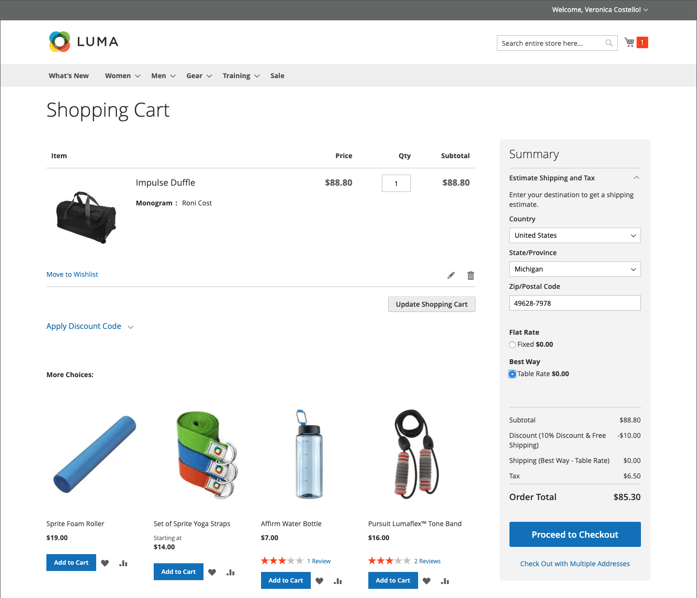

# Productinstellingen - [!UICONTROL Customizable Options]

Het toevoegen van aanpasbare opties aan een product is een gemakkelijke manier om een selectie van opties met tekst, selectie, en types van datuminput aan te bieden. Aanpasbare opties zijn een goede oplossing als uw inventarisbehoeften eenvoudig zijn. Omdat zij echter gebaseerd zijn op variaties van één SKU, kunnen zij niet worden gebruikt om voorraden te beheren of als basis voor prijsregelingsvoorwaarden. Als u meerdere producten met dezelfde opties hebt, kunt u één product instellen en de opties naar de andere producten importeren.

Wanneer een klant een product aanschaft met een aanpasbare optie, wordt onder de beschrijving van het product een beschrijving van elke geselecteerde optie weergegeven en wordt eventuele bijbehorende prijsopmaakcodes (of markeringen) automatisch toegepast op de prijs van het object.

{width="700" zoomable="yes"}

Als de aankoop een regel voor de winkelprijs instelt, geldt de initiële berekening eerst voor de productprijs en vervolgens voor de prijs van het lijnartikel, met eventuele aanpassingen voor de toepasselijke aanpasbare opties. In het volgende voorbeeld koopt de klant een duffelzak voor $74.00, plus een aanpasbare optie voor een monogram. Een prijsverhoging van $14.80 wordt toegepast op de basisproductprijs, en de aangepaste prijs wordt getoond als $88.80. In dit geval leidt de aankoop van de duffelzak tot een op de SKU van het product gebaseerde regel van de cartprijs en past een korting toe op de aankoop, plus gratis verzending. Hoewel de regel van de kartprijs niet door de klantgerichte optie wordt teweeggebracht, past het de korting op de wortelinhoud toe, die de prijsverhoging voor de klantgerichte optie omvat.

{width="700" zoomable="yes"}

>[!NOTE]
>
>Een korting op de catalogusprijsregel wordt niet toegepast op de aanpasbare opties voor vaste prijzen.

## Aanpasbare opties maken

1. Open het product in de bewerkingsmodus.

1. De rol neer en breidt  uit de _[!UICONTROL Customizable Options]_sectie.

1. Klik op **[!UICONTROL Add Option]**.

   {width="600" zoomable="yes"}

1. Vul de nieuwe opties in:

   - Voer bij **[!UICONTROL Option Title]** een naam voor de optie in.

   - Stel de **[!UICONTROL Option Type]** in voor het type gegevensinvoer.

   - Schakel het selectievakje **[!UICONTROL Required]** uit als u het product niet wilt aanschaffen.

1. Vul de velden in volgens het gegevenstype DataEntry:

   - Voer bij **[!UICONTROL Title]** een naam in voor deze optie.

   - (Optioneel) Voer bij **[!UICONTROL Price]** een eventuele prijsverhoging of prijsverlaging in ten opzichte van de basisproductprijs die op deze optie van toepassing is.

   - Stel **[!UICONTROL Price Type]** in op een van de volgende opties:

      - `Fixed` - De prijs van de variatie verschilt van de prijs van het basisproduct met een vast geldbedrag, zoals $1.
      - `Percentage` - De prijs van de variatie verschilt met een percentage van de prijs van het basisproduct, bijvoorbeeld 10%.

   - (Optioneel) Voer een **[!UICONTROL SKU]** in voor de optie. De optie SKU is een achtervoegsel dat aan product SKU wordt toegevoegd.

   - Als de waarde _[!UICONTROL Option Type]_`File` is, stelt u de parameters voor het bestand in. Voer bij **[!UICONTROL Compatible File Extensions]**de geldige extensies in als door komma&#39;s gescheiden waarden (zoals `png, jpg, gif` ). Voer bij **[!UICONTROL Maximum Image Size]**de maximale afbeeldingsgrootte in pixels in. Als het een tekstitem is, voert u de maximumwaarde voor **[!UICONTROL Maximum Characters]**in.

   {width="600" zoomable="yes"} toe

1. (Optioneel) Klik op **[!UICONTROL Add Option]** als u nog een aanpasbare optie wilt toevoegen.

   - Voltooi de instellingen zoals eerder.

   - Om de orde van de opties te veranderen, klik het _[!UICONTROL Order]_ en sleep de optie aan een nieuwe positie in de lijst.

   Herhaal deze stap voor elke optie die moet worden toegevoegd.

1. Klik op **[!UICONTROL Save]** als de bewerking is voltooid.

## Aanpasbare opties importeren

1. In de _Aanpasbare sectie van Opties_, klik **[!UICONTROL Import Options]**.

1. Alle producten met aanpasbare opties worden in het raster weergegeven.

1. Selecteer in de lijst het selectievakje van het product met de opties die u wilt importeren.

1. Klik op **[!UICONTROL Import]**.

1. Als u klaar bent, kunt u meer aangepaste opties toevoegen of op **[!UICONTROL Save and Close]** klikken.

## Invoertypen

| Type | Beschrijving |
|---------------------|---------------|
| [!UICONTROL Text] | Een invoerregel of tekstvak waarin de klant de vereiste informatie kan invoeren. Opties: **[!UICONTROL Field]**- een single-line inputgebied voor tekst. **[!UICONTROL Area]** - Een invoerveld met meerdere regels. Dit type ondersteunt geen geavanceerde opmaak zoals HTML. Gebruik Max. tekens om de lengte van tekst te beperken die kan worden ingevoerd en om een juiste weergave van de ingevoerde tekst in de Admin te garanderen. |
| [!UICONTROL File] | Hiermee kan de klant een bestand uploaden. |
| [!UICONTROL Select] | Hiermee kan de klant één optie of meerdere opties selecteren, afhankelijk van het gebruikte invoertype. Opties: **[!UICONTROL Drop-down]**- een drop-down lijst van opties die slechts één selectie toestaat. **[!UICONTROL Radio Buttons]** - Een set opties waarbij slechts één selectie is toegestaan. **[!UICONTROL Checkbox]**- Een selectievakje is een variant van een optie ja/nee. Als het product meer dan één selectievakje heeft, kunnen meerdere selecties worden gemaakt. **[!UICONTROL Multiple Select]** - Een vervolgkeuzelijst met opties die meerdere selecties accepteert. Als u meerdere opties wilt kiezen, houdt u Ctrl (PC) of Command (Mac) ingedrukt en klikt u op elke optie. |
| [!UICONTROL Date] | Staat de klant toe om een datum of een tijd in te gaan of de waarde van een kalender te kiezen. Opties:  **[!UICONTROL Date]**- Een invoerveld voor een datumwaarde. De datum kan rechtstreeks in het veld worden getypt of uit een lijst of kalender worden geselecteerd. De inputmethode en het formaat worden bepaald door de [ datum en tijdopties ](attributes-input-types.md#date-and-time-options) configuratie. **[!UICONTROL Date & Time]** - Een invoerveld voor een datum- en tijdwaarde. **[!UICONTROL Time]**- Een invoerveld voor een tijdwaarde. |

{style="table-layout:auto"}
