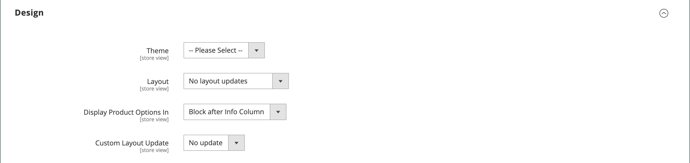

# Productinstellingen - [!UICONTROL Design]

De _[!UICONTROL Design]_Met de instellingen kunt u een ander thema op de productpagina toepassen, de kolomlay-out wijzigen, bepalen waar de productopties worden weergegeven en aangepaste XML-code invoeren.

{width="600" zoomable="yes"}

>[!NOTE]
>
>Als hetzelfde product wordt toegewezen aan verschillende categorieën met verschillende ontwerpinstellingen voor elke categorie, wordt het aanbevolen **[!UICONTROL Use Categories Path for Product URLs]** = `Yes` in de [Configuratieopties voor optimalisatie zoekmachine](../configuration-reference/catalog/catalog.md#search-engine-optimization). Ga voor toegang tot deze instelling naar  **[!UICONTROL Stores]** > _[!UICONTROL Settings]_>**[!UICONTROL Configuration]**, uitbreiden **[!UICONTROL Catalog]**en kiest u **[!UICONTROL Catalog]**onder in het linkerdeelvenster en vouw vervolgens het **[!UICONTROL Search Engine Optimization]**op de pagina.

| Veld | [Toepassingsgebied](../getting-started/websites-stores-views.md#scope-settings) | Beschrijving |
|---|---|----|
| [!UICONTROL Theme] | Winkelweergave |  (Alleen Adobe Commerce) Hiermee kunt u een ander thema op het product toepassen. Opties: (alle beschikbare thema&#39;s) |
| [!UICONTROL Layout] | Winkelweergave | Biedt u de mogelijkheid om een andere toepassing toe te passen [layout](../content-design/page-layout.md) op de productpagina. Opties:  **[!UICONTROL No layout updates]**- Standaard zijn lay-outupdates niet beschikbaar voor de productpagina. **[!UICONTROL Empty]** - Hiermee kunt u uw eigen lay-out definiëren, zoals een pagina met vier kolommen. (Hiervoor is inzicht in XML vereist.)  **[!UICONTROL 1 column]**- Hiermee past u een indeling met één kolom toe op de productpagina. **[!UICONTROL 2 columns with left bar]** - Hiermee past u een lay-out met twee kolommen en een linkerzijbalk toe op de productpagina.  **[!UICONTROL 2 columns with right bar]**- Hiermee past u een lay-out met twee kolommen en een rechterzijbalk toe op de productpagina. **[!UICONTROL 3 columns]** - Hiermee past u een indeling met drie kolommen toe op de productpagina.  **[!UICONTROL Page -- Full Width]**- (Vereist [[!DNL Page Builder]](../page-builder/introduction.md)) Hiermee past u de volledige-breedte-indeling voor CMS-pagina&#39;s toe op de productpagina. **[!UICONTROL Category -- Full Width]** - (Vereist [!DNL Page Builder]) Hiermee past u de volledige-breedtelay-out voor categoriepagina&#39;s toe op de productpagina.  **[!UICONTROL Product -- Full Width]**- (Vereist [!UICONTROL Page Builder]) Hiermee past u de volledige-breedte-indeling voor productpagina&#39;s toe op de productpagina. |
| [!UICONTROL Display Product Options In] | Winkelweergave | Hiermee bepaalt u waar de productopties op de productpagina worden weergegeven. Opties: `Product Info Column` / `Block after Info Column` |
| [!UICONTROL Custom Layout Update] | Winkelweergave | Wordt gebruikt om opties weer te geven voor het bijwerken van een aangepaste indeling op de productpagina. |

{style="table-layout:auto"}
