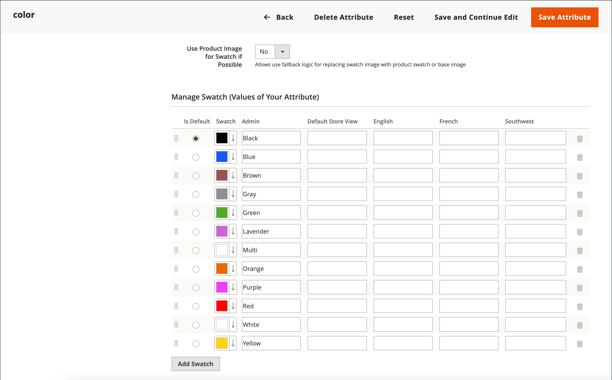
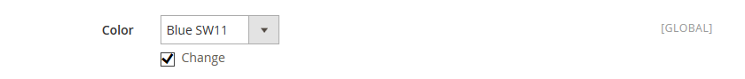

# Productstalen

Klanten hebben hoge verwachtingen bij het kiezen van een kleur en het is van cruciaal belang dat productbeschrijvingen elke beschikbare kleur, patroon of structuur nauwkeurig weergeven. De broek in het volgende voorbeeld is bijvoorbeeld niet beschikbaar in rood, groen en blauw. Ze zijn alleen beschikbaar in bepaalde soorten rood, groen en blauw, die waarschijnlijk uniek zijn voor dit product.

{width="700" zoomable="yes"}

Voor [ configureerbare producten ](product-create-configurable.md), kan de kleur door een visueel monster, een tekstmonster, of een inputcontrole worden aangewezen. De monsters kunnen op de productpagina, in productlijsten, en in [ gelaagde navigatie ](navigation-layered.md) worden gebruikt. Op de productpagina worden stalen gesynchroniseerd om de bijbehorende productafbeelding weer te geven wanneer het staal wordt geselecteerd. Wanneer de klant het staal selecteert, wordt de corresponderende waarde weergegeven in het invoerveld en wordt het staal omgeven door de huidige selectie.

>[!NOTE]
>
>Staalkenmerken kunnen worden geconfigureerd om geen overeenkomende eenvoudige productafbeeldingen weer te geven wanneer het staal wordt geselecteerd door de optiewaarde _[!UICONTROL Update Product Preview Image]_in te stellen op `No` op de pagina [!UICONTROL Attribute Edit] in Admin.

## Op tekst gebaseerde stalen

Als een afbeelding niet beschikbaar is voor een staal, wordt de kenmerkwaarde weergegeven als tekst. Een op tekst gebaseerd staal is vergelijkbaar met een knop met een tekstlabel en gedraagt zich op dezelfde manier als een staal met een afbeelding. Als op tekst gebaseerde stalen worden gebruikt om de beschikbare formaten weer te geven, wordt de grootte die niet beschikbaar is, doorgehaald.

{width="700" zoomable="yes"}

## Stalen in gelaagde navigatie

Stalen kunnen ook worden gebruikt in gelaagde navigatie als de eigenschap _[!UICONTROL Use in Layered Navigation]_van het kenmerk color is ingesteld op `Yes` . In het volgende voorbeeld ziet u zowel tekststalen als kleurafbeeldingsstalen in gelaagde navigatie.

{width="700" zoomable="yes"}

## Stalen maken voor producten

De monsters kunnen als component van het `color` attribuut of opstelling plaatselijk voor een specifiek product worden bepaald en als [ productbeelden ](product-image.md#upload-an-image) worden geupload.

In de vorige voorbeelden zijn de ans &quot;Sylvia Capri&quot; beschikbaar in specifieke waarden `red`, `green` en `blue` . Omdat de stalen uit de afbeelding van het product zijn genomen, is elk een werkelijke weergave van de kleur. Het attribuut `color` wordt gebruikt om de informatie voor alle productkleuren en monsters te beheren.

### Stap 1: De stalen maken

Gebruik een van de volgende methoden om stalen voor uw producten te maken.

#### Methode 1: Een kleurstaal toevoegen

1. Als u de ware kleur van een product wilt vastleggen, opent u de afbeelding in een foto-editor en gebruikt u het pipet om de exacte kleur te bepalen en noteert u de equivalente hexadecimale waarde.

   {width="400"}

1. Voor _Admin_ sidebar, ga **[!UICONTROL Stores]** > _[!UICONTROL Attributes]_>**[!UICONTROL Product]**.

1. In het net, open het _kleur_ attribuut op geef wijze uit.

1. Controleer of **[!UICONTROL Catalog Input Type for Store Owner]** is ingesteld op `Visual Swatch` .

1. Stel **[!UICONTROL Update Product Preview Image]** in op `No` als u liever geen overeenkomende eenvoudige productafbeeldingen wilt weergeven wanneer het staal op de productweergavepagina is geselecteerd.

1. Klik onder _[!UICONTROL Manage Swatch (Values of Your Attribute)]_op **[!UICONTROL Add Swatch]**en voer de volgende handelingen uit:

   {width="600" zoomable="yes"}

   - In de _kolom van het Monster_, klik het nieuwe monster en selecteer **[!UICONTROL Choose a color]** van het menu.

     {width="500" zoomable="yes"}

   - Plaats de cursor in de kleurkiezer in het veld **#** , verwijder de huidige waarde en voer de hexadecimale waarde in van zes tekens voor de nieuwe kleur.

     {width="500" zoomable="yes"} in

   - Om het monster te bewaren, klik het _Wiel van de Kleur_ ( ) pictogram in de laag-juiste hoek van de kleurenplukker.

   - In de _Admin_ kolom, ga een etiket in om de kleur aan de opslagbeheerder te beschrijven.

     Indien van toepassing kunt u ook de vertaling van de kleur voor elke ondersteunde taal invoeren. In het volgende voorbeeld, is SKU inbegrepen voor verwijzing in het _Admin_ etiket omdat de kleuren slechts voor een specifiek product worden gebruikt. U kunt wel een spatie of onderstrepingsteken in het label opnemen, maar geen afbreekstreepje.

   - In _is Standaard_ kolom, selecteer het monster dat de standaardoptie moet zijn.

   - Om de orde van de kleurenmonsters te veranderen, klik het _[!UICONTROL Order]_ en sleep het punt aan een nieuwe positie in de lijst.

     {width="400"}

1. Klik op **[!UICONTROL Save Attribute]** als de bewerking is voltooid en vernieuw de cache wanneer u daarom wordt gevraagd.

1. Open elk product op geef wijze uit en werk het **attribuut van de Kleur** met het correcte monster bij.

   Volg onderstaande stappen om meerdere producten tegelijk bij te werken.

#### Methode 2: Een staalafbeelding uploaden

1. Als u een afbeelding voor een staal wilt vastleggen, opent u de productafbeelding in een fotoeditor en slaat u een vierkant gebied van de afbeelding op waarin de kleur, het patroon of de structuur worden weergegeven.

   Indien nodig, kunt u deze actie voor elke variatie van het product herhalen.

   De grootte en afmetingen van het staal worden bepaald door het thema. In het algemeen kunt u de hoogte-breedteverhouding van een patroon behouden door een afbeelding op te slaan als een vierkant.

   {width="400"}

1. Voor _Admin_ sidebar, ga **[!UICONTROL Stores]** > _[!UICONTROL Attributes]_>**[!UICONTROL Product]**.

1. Open in het raster het kenmerk **[!UICONTROL color]** in de bewerkingsmodus.

1. Controleer of **[!UICONTROL Catalog Input Type for Store Owner]** is ingesteld op `Visual Swatch` .

1. Stel **[!UICONTROL Update Product Preview Image]** in op `No` als u liever geen overeenkomende eenvoudige productafbeeldingen wilt weergeven wanneer het staal op de productweergavepagina is geselecteerd.

1. Klik onder _[!UICONTROL Manage Swatch]_(waarden van het kenmerk) op **[!UICONTROL Add Swatch]**en voer de volgende handelingen uit:

   - Klik in de kolom _[!UICONTROL Swatch]_op het nieuwe staal om het menu weer te geven en kies **[!UICONTROL Upload a file]**.

   - Navigeer naar het staalbestand dat u hebt voorbereid en kies het bestand dat u wilt uploaden.

   - Herhaal deze stappen voor elke staalafbeelding.

   - Voer de labels in voor de Beheer en de winkel.

     In dit voorbeeld is de SKU ter referentie opgenomen in het label Admin, omdat deze kleuren alleen voor een specifiek product worden gebruikt. U kunt een spatie of onderstrepingsteken in het label opnemen, maar u kunt geen afbreekstreepje opnemen.

     {width="500" zoomable="yes"} in

1. Klik op **[!UICONTROL Save Attribute]** als de bewerking is voltooid en vernieuw de cache wanneer u daarom wordt gevraagd.

1. Open elk product in bewerkingsmodus en werk het kenmerk **[!UICONTROL Color]** bij met het juiste staal.

   Volg onderstaande stappen om meerdere producten tegelijk bij te werken.

### Stap 2: De producten bijwerken

1. Voor _Admin_ sidebar, ga **[!UICONTROL Catalog]** > **[!UICONTROL Products]**.

1. Gebruik **[!UICONTROL Filter]** om de lijst op Naam of SKU te tonen en slechts de toepasselijke producten te omvatten.

1. Schakel in het raster het selectievakje in van elk product waarop het staal van toepassing is.

1. Stel **[!UICONTROL Actions]** in op `Update Attributes` .

   In dit voorbeeld worden alle blauwe configuraties van de broek geselecteerd.

   {width="600" zoomable="yes"}

1. Blader omlaag naar het kenmerk **[!UICONTROL Color]** en schakel het selectievakje **[!UICONTROL Change]** in.

   {width="400"}

1. Kies het staal dat van toepassing is op de geselecteerde producten en klik op **[!UICONTROL Save]** .

1. Vernieuw de cache wanneer daarom wordt gevraagd.

   {width="200"}

## Stalen toevoegen aan een eenvoudig product

1. Voor _Admin_ sidebar, ga **[!UICONTROL Catalog]** > **[!UICONTROL Products]**.

1. Open een product in bewerkingsmodus, controleer de productstatus (moet zijn ingeschakeld).

1. Klik op **[!UICONTROL Create Configurations]** (onder de tab `Configurations` ).

1. Kies in het pop-upvenster het kenmerk Kleur en **[!UICONTROL Next]** .

1. Selecteer kleurstalen in het kenmerk dat u in dit product wilt opnemen.

1. Klik op **[!UICONTROL Next]** in de voortgangsbalk.

1. [ vorm de beelden, de prijs, en de hoeveelheid ](product-create-configurable.md#step-3-configure-the-images-price-and-quantity).

   Voor deze stap, plaats de beelden, de tarifering, en de hoeveelheid van elke configuratie. De beschikbare opties zijn voor elke optie gelijk en u kunt slechts één optie kiezen. U kunt het zelfde plaatsen op alle SKUs toepassen, een uniek plaatsen op elke SKU toepassen, of de montages voor nu overslaan.

1. Wanneer de configuratie voor afbeeldingen, prijs en aantal is voltooid, klikt u op **[!UICONTROL Next]** in de rechterbovenhoek.

   De huidige productvariaties verschijnen bij de bodem van de sectie van de Configuratie. Klik op **[!UICONTROL Generate Products]** als u tevreden bent met de configuraties.
