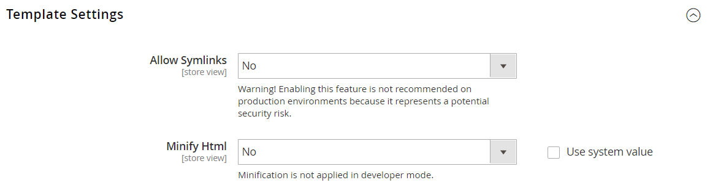

# [!UICONTROL Advanced] > [!UICONTROL Developer]

{{config}}

>[!NOTE]
>
>Deze configuratiemontages zijn beschikbaar op [ ontwikkelaarwijze ](../../systems/developer-tools.md#operation-modes) slechts.

## [!UICONTROL Frontend Development Workflow]

<!-- zoom -->

Voor meer informatie over het veranderen van deze montages, zie [ de ontwikkelingswerkschema van het Front ](../../systems/developer-tools.md#frontend-development-workflow) in de _Gids van Systemen Admin_.

| Veld | [ Reikwijdte ](../../getting-started/websites-stores-views.md#scope-settings) | Beschrijving |
|--- |--- |--- |
| [!UICONTROL Workflow Type] | Algemeen | Hiermee bepaalt u of er tijdens de ontwikkeling minder compilatie plaatsvindt op de client of de server. Opties:  **`Client side less compilation`**- compilatie vindt plaats in de browser met behulp van de native bibliotheek less.js. **`Server side less compilation`** - Compilatie vindt plaats op de server met behulp van de Minder PHP-bibliotheek. Dit is de standaardmodus voor productie. |

{style="table-layout:auto"}

## [!UICONTROL Developer Client Restrictions]

<!-- zoom -->

Voor meer informatie over het veranderen van dit het plaatsen, zie &lbrace;de beperkingen van de Cliënt [&#128279;](../../systems/developer-tools.md#client-restrictions) in de _Gids van Systemen Admin_.

| Veld | [ Reikwijdte ](../../getting-started/websites-stores-views.md#scope-settings) | Beschrijving |
|--- |--- |--- |
| [!UICONTROL Allow IPs (comma separated)] | Winkelweergave | Creeert een lijst van gewenste personen van IP adressen die ontwikkelaarshulpmiddelen op een levende plaats kunnen gebruiken, zonder klanten in de opslag te interfereren. Om het even welke veranderingen in de plaats wanneer het gebruiken van een ontwikkelaarshulpmiddel zoals _Inline Vertaling_, zijn zichtbaar slechts van de IP adressen op de lijst van gewenste personen. |

{style="table-layout:auto"}

## [!UICONTROL Template Settings]

<!-- zoom -->

Voor meer informatie over het veranderen van deze montages, zie [ Optimaliserend middeldossiers ](../../systems/developer-tools.md#optimizing-resource-files) in de _Gids van Systemen Admin_.

| Veld | [ Reikwijdte ](../../getting-started/websites-stores-views.md#scope-settings) | Beschrijving |
|--- |--- |--- |
| [!UICONTROL Allow Symlinks] | Winkelweergave | Het toelaten van [ symbolische verbindingen ](https://en.wikipedia.org/wiki/Symbolic_link) kan uw plaats aan veiligheidsrisico&#39;s blootstellen en niet geadviseerd voor een productieopslag. |
| [!UICONTROL Minify Html] | Winkelweergave | Hiermee bepaalt u of de HTML voor opslagsjablonen wordt geminimaliseerd. Opties: `Yes` / `No` |

{style="table-layout:auto"}

## [!UICONTROL Debug]

<!-- zoom -->

Voor meer informatie over het veranderen van deze montages, zie [ de wegwenken van het Malplaatje ](../../systems/developer-tools.md#template-path-hints) in de _Gids van Systemen Admin_.

| Veld | [ Reikwijdte ](../../getting-started/websites-stores-views.md#scope-settings) | Beschrijving |
|--- |--- |--- |
| [!UICONTROL Enable Template Path Hints for Storefront] | Winkelweergave | Hiermee voegt u notatie toe aan de winkel die het pad aangeeft naar elke sjabloon die op de pagina wordt gebruikt. Opties: `Yes` / `No` |
| [!UICONTROL Enable Template Path Hints for Admin] | Algemeen | Voegt notatie toe aan de beheerder die het pad aangeeft naar elke sjabloon die op de pagina wordt gebruikt. Opties: `Yes` / `No` |
| [!UICONTROL Add Block Class Type to Hints] | Winkelweergave | Neemt de namen van blokken op in de padhints voor sjablonen. Opties: `Yes` / `No` |

{style="table-layout:auto"}

## [!UICONTROL Translate Inline]

<!-- zoom -->

Voor meer informatie over het veranderen van deze montages, zie [ inline vertalen ](../../systems/developer-tools.md#translate-inline) in de _Gids van Systemen Admin_.

| Veld | [ Reikwijdte ](../../getting-started/websites-stores-views.md#scope-settings) | Beschrijving |
|--- |--- |--- |
| [!UICONTROL Enable for Storefront] | Winkelweergave | Hiermee activeert u de Inline-vertaler voor de winkel. De interfacetekst kan voor elke archiefmening worden uitgegeven. Om de Inline Vertaler te gebruiken zonder zich met de levende opslag te bemoeien, voeg uw IP adres aan de lijst van gewenste personen van de Beperkingen van de Cliënt van de Ontwikkelaar toe. |
| [!UICONTROL Enable for Admin] | Algemeen | Hiermee activeert u de inlinevertaler voor de beheerder. In tegenstelling tot de winkel, kan Admin niet in veelvoudige talen worden vertaald. De veldlabels en andere tekst in de interface kunnen echter worden gewijzigd. |

{style="table-layout:auto"}

## [!UICONTROL JavaScript Settings]

<!-- zoom -->

Voor meer informatie over het veranderen van deze montages, zie [ Optimaliserend middeldossiers ](../../systems/developer-tools.md#optimizing-resource-files) in de _Gids van Systemen Admin_.

| Veld | [ Reikwijdte ](../../getting-started/websites-stores-views.md#scope-settings) | Beschrijving |
|--- |--- |--- |
| [!UICONTROL Merge JavaScript Files] | Winkelweergave | Hiermee voegt u meerdere JavaScript-bestanden samen tot één bestand om de laadtijd van de pagina te verbeteren. |
| [!UICONTROL Enable JavaScript Bundling] | Winkelweergave | Hiermee wordt bepaald of meerdere JavaScript-bestanden in één bestand kunnen worden gebundeld. Opties: `Yes` / `No` |
| [!UICONTROL Minify JavaScript Files] | Winkelweergave | Hiermee verwijdert u overbodige tekens, spaties en inspringing om de code te verkleinen. |
| [!UICONTROL Move JS code to the bottom of the page] | Algemeen | Als deze optie is ingeschakeld, wordt de JS-code onder aan de pagina geplaatst. Opties: `Yes` / `No` |
| [!UICONTROL Translation Strategy] | Algemeen | Bepaalt de vertaalmethodologie die door het systeem wordt gebruikt. Opties:  **`Dictionary`**- Vertaling aan de voorzijde van de winkel. **`Embedded`** - Vertaling aan de beheerzijde. |
| [!UICONTROL Log JS Errors to Session Storage] | Algemeen | Indien ingeschakeld, kan dit door middel van functionele tests voor rapportage worden gebruikt. Opties: `Yes` / `No` |
| [!UICONTROL Log JS Errors to Session Storage Key] | Algemeen | Identificeert de sleutel die wordt gebruikt om verzamelde JS fouten terug te winnen. |

{style="table-layout:auto"}

## [!UICONTROL CSS Settings]

<!-- zoom -->

Voor meer informatie over het veranderen van deze montages, zie [ Optimaliserend middeldossiers ](../../systems/developer-tools.md#optimizing-resource-files) in de _Gids van Systemen Admin_.

| Veld | [ Reikwijdte ](../../getting-started/websites-stores-views.md#scope-settings) | Beschrijving |
|--- |--- |--- |
| [!UICONTROL Merge CSS Files] | Winkelweergave | Hiermee voegt u meerdere CSS-bestanden samen tot één bestand om de laadtijd van de pagina te verbeteren. Opties: `Yes` / `No` |
| [!UICONTROL Minify CSS Files] | Winkelweergave | Hiermee verwijdert u overbodige tekens, spaties en inspringing om de code te verkleinen. Opties: `Yes` / `No` |
| [!UICONTROL Use CSS critical path] | Algemeen | De _CSS kritieke weg_ levert geminificeerde kritieke CSS inline in `<head>` en bepaalt alle niet-kritieke stijlen die asynchroon worden geladen. Opties: `Yes` / `No` |

{style="table-layout:auto"}

## [!UICONTROL Image Processing Settings]

<!-- zoom -->

| Veld | [ Reikwijdte ](../../getting-started/websites-stores-views.md#scope-settings) | Beschrijving |
|--- |--- |--- |
| [!UICONTROL Image Adapter] | Algemeen | Hiermee geeft u de adapter op die wordt gebruikt om afbeeldingen te renderen. Nadat u de adapterinstelling hebt gewijzigd, verwijdert u de cache van catalogusafbeeldingen. Opties: `PHP GD2` / `ImageMagick`   **_Nota:_**&#x200B;het IO- dossiertype wordt gesteund slechts door de adapter ImageMagik. |

{style="table-layout:auto"}

## [!UICONTROL Caching Settings]

<!-- zoom -->

| Veld | [ Reikwijdte ](../../getting-started/websites-stores-views.md#scope-settings) | Beschrijving |
|--- |--- |--- |
| [!UICONTROL Cache User Defined Attributes] | Algemeen | Wanneer toegelaten, geheime voorgeheugens user-defined en attributen van de Waarde van het Attribuut van de Systeementiteit (EAV). Deze optie kan de prestaties verhogen maar vereist ook extra ruimte voor caching. Opties: `Yes` / `No` |

{style="table-layout:auto"}

## [!UICONTROL Static Files Settings]

<!-- zoom -->

| Veld | [ Reikwijdte ](../../getting-started/websites-stores-views.md#scope-settings) | Beschrijving |
|--- |--- |--- |
| [!UICONTROL Sign Static Files] | Algemeen | Als deze optie is ingeschakeld, wordt een digitale handtekening toegevoegd aan de URL van statische bestanden, zodat browsers kunnen detecteren wanneer een nieuwere versie van het bestand beschikbaar is. Als de handtekening van een bestand afwijkt van die in de cache van de browser, wordt de nieuwere versie van het bestand gebruikt. Statische bestanden die kunnen worden ondertekend, zijn JavaScript, CSS, afbeeldingen en lettertypen. Opties: `Yes` / `No` |

{style="table-layout:auto"}

## [!UICONTROL Grid Settings]

<!-- zoom -->

| Veld | [ Reikwijdte ](../../getting-started/websites-stores-views.md#scope-settings) | Beschrijving |
|--- |--- |--- |
| [!UICONTROL Asynchronous Indexing|Global] | Hiermee bepaalt u wanneer entiteiten van het bestelverwerkingssysteem, zoals bestellingen, facturen, verzendingen en creditnota&#39;s, aan het raster worden toegevoegd en opnieuw worden gedexeerd. Met asynchrone indexering kunt u vergrendelingen van gegevens tijdens opslagbewerkingen voorkomen en de verwerkingstijd verkorten. Opties:  **`Disable`**- (Standaard) Aan volgorde gerelateerde entiteiten worden op verschillende momenten aan het raster toegevoegd. worden opgeslagen. **`Enable`** - Aan bestellingen gerelateerde entiteiten worden alleen tijdens een geplande snijtaak aan het raster toegevoegd. Het uitsnijden zou moeten worden gevormd om eens per minuut in werking te stellen. |

{style="table-layout:auto"}
