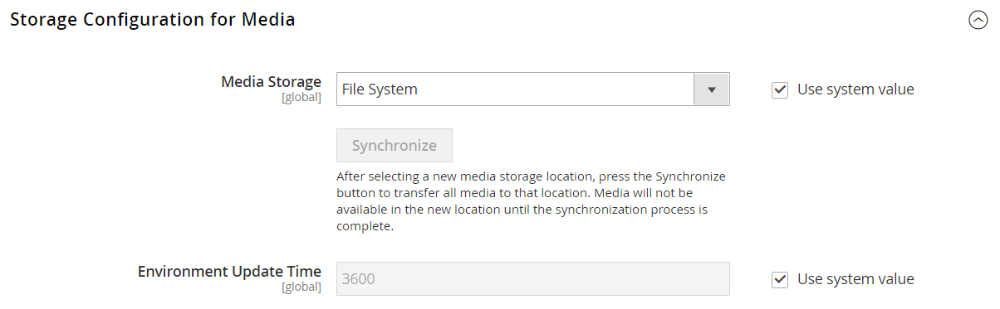
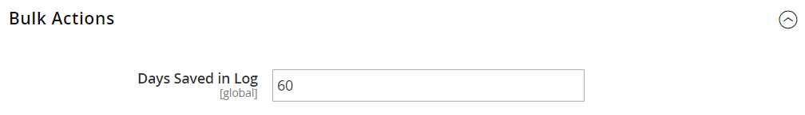

# [!UICONTROL Advanced] > [!UICONTROL System]

{{config}}

## [!UICONTROL Cron (Scheduled Tasks)]

<!-- zoom -->

Voor meer informatie over het veranderen van deze configuratiemontages, zie [ Gewas (geplande taken) ](../../systems/cron.md).

### [!UICONTROL index]

<!-- zoom -->

| Veld | [ Reikwijdte ](../../getting-started/websites-stores-views.md#scope-settings) | Beschrijving |
|--- |--- |--- |
| [!UICONTROL Generate Schedules Every] | Algemeen | Hiermee bepaalt u de frequentie in minuten, waarna planningen worden gegenereerd. |
| [!UICONTROL Schedule Ahead for] | Algemeen | Hiermee bepaalt u het aantal minuten voordat planningen worden gegenereerd. |
| [!UICONTROL Missed if Not Run Within] | Algemeen | Hiermee wordt het aantal minuten bepaald voordat een uitsnijdtaak die nog niet is uitgevoerd, wordt gemarkeerd als gemist. |
| [!UICONTROL History Cleanup Every] | Algemeen | Hiermee bepaalt u het aantal minuten dat passeert voordat de kroongeschiedenis wordt gereinigd. |
| [!UICONTROL Success History Lifetime] | Algemeen | Hiermee bepaalt u het aantal minuten dat de record van voltooide snijtaken in de database wordt opgeslagen. |
| [!UICONTROL Failure History Lifetime] | Algemeen | Hiermee bepaalt u het aantal minuten dat de record van mislukte snijtaken in de database wordt opgeslagen. |
| [!UICONTROL Use Separate Process] | Algemeen | Hiermee wordt bepaald of snijtaken parallel worden uitgevoerd als afzonderlijke processen. Opties: `Yes` / `No` |

{style="table-layout:auto"}

### [!UICONTROL default]

<!-- zoom -->

| Veld | [ Reikwijdte ](../../getting-started/websites-stores-views.md#scope-settings) | Beschrijving |
|--- |--- |--- |
| [!UICONTROL Generate Schedules Every] | Algemeen | Hiermee bepaalt u de frequentie in minuten, waarna planningen worden gegenereerd. |
| [!UICONTROL Schedule Ahead for] | Algemeen | Hiermee bepaalt u het aantal minuten voordat planningen worden gegenereerd. |
| [!UICONTROL Missed if Not Run Within] | Algemeen | Hiermee wordt het aantal minuten bepaald voordat een uitsnijdtaak die nog niet is uitgevoerd, wordt gemarkeerd als gemist. |
| [!UICONTROL History Cleanup Every] | Algemeen | Hiermee bepaalt u het aantal minuten dat passeert voordat de kroongeschiedenis wordt gereinigd. |
| [!UICONTROL Success History Lifetime] | Algemeen | Hiermee bepaalt u het aantal minuten dat de record van voltooide snijtaken in de database wordt opgeslagen. |
| [!UICONTROL Failure History Lifetime] | Algemeen | Hiermee bepaalt u het aantal minuten dat de record van mislukte snijtaken in de database wordt opgeslagen. |
| [!UICONTROL Use Separate Process] | Algemeen | Hiermee wordt bepaald of snijtaken parallel worden uitgevoerd als afzonderlijke processen. Opties: `Yes` / `No` |

{style="table-layout:auto"}

## [!UICONTROL MySQL Message Queue Cleanup]

{{ee-feature}}

<!-- zoom -->

| Veld | [ Reikwijdte ](../../getting-started/websites-stores-views.md#scope-settings) | Beschrijving |
|--- |--- |--- |
| [!UICONTROL Successful Messages Lifetime] | Algemeen | Bepaalt het leven van succesvolle berichten in notulen. Voer nul in om de opschoonbewerking over te slaan. Standaard: `10080` (7 dagen) |
| [!UICONTROL New Messages Lifetime] | Algemeen | Bepaalt het leven van nieuwe berichten in notulen. Voer nul in om de opschoonbewerking over te slaan. Standaard: `10080` (7 dagen) |
| [!UICONTROL Failed Messages Lifetime] | Algemeen | Bepaalt de levensduur van mislukte berichten in minuten. Voer nul in om de opschoonbewerking over te slaan. Standaard: `10080` (7 dagen) |
| [!UICONTROL Retry Messages in Progress After] | Algemeen | Hiermee bepaalt u hoe lang het systeem wacht op een bericht dat wordt weergegeven voordat het opnieuw wordt geprobeerd. Standaard: `1440` (24 uur) |

{style="table-layout:auto"}

## [!UICONTROL Mail Sending Settings]

<!-- zoom --> verzendt

Voor meer informatie over het veranderen van deze montages, zie [ e-mailmededelingen ](../../systems/email-communications.md) in de _Gids van Systemen Admin_ vormen.

>[!IMPORTANT]
>
>**Bericht van de Veiligheid** wij adviseren dat alle verkopers onmiddellijk hun post plaatsen die configuratie verzenden tegen onlangs geïdentificeerde potentiële verre codeuitvoering te beschermen uitbuiten. Zolang dit probleem niet is opgelost, wordt u aangeraden [!DNL Sendmail] niet te gebruiken voor e-mailcommunicatie. Controleer in het [!UICONTROL Mail Sending Settings] of [!UICONTROL Set Return Path] is ingesteld op `No` .

| Veld | [ Reikwijdte ](../../getting-started/websites-stores-views.md#scope-settings) | Beschrijving |
|--- |--- |--- |
| [!UICONTROL Disable Email Communications] | Winkelweergave | Hiermee bepaalt u of e-mailcommunicatie voor de winkel wordt geactiveerd. Opties: `Yes` / `No` |
| [!UICONTROL Transport] | Winkelweergave | Bepaalt het vervoertype voor e-mailmededelingen van de opslag. Opties: `Sendmail` / `SMTP` |
| [!UICONTROL Host] | Winkelweergave | (Alleen voor SMTP- en Windows-servers) Hiermee bepaalt u de naam die wordt gebruikt om naar de host te verwijzen. Standaardwaarde: `localhost` |
| [!UICONTROL Port (25)] | Winkelweergave | (Alleen voor SMTP- en Windows-servers) Identificeert de poort die wordt gebruikt voor e-mailcommunicatie. Standaardwaarde: `25` |
| [!UICONTROL Set Return-Path] | Winkelweergave | Bepaalt als een verpletterend adres voor teruggekeerde e-mail wordt gebruikt. Opties: `No` / `Yes` / `Specified` |

{style="table-layout:auto"}

### SMTP-opties

Wanneer u SMTP bij het vervoerstype selecteert, zijn de extra opties beschikbaar om de SMTP serververbinding te vormen.

<!-- zoom -->

| Veld | [ Reikwijdte ](../../getting-started/websites-stores-views.md#scope-settings) | Beschrijving |
|--- |--- |--- |
| [!UICONTROL Username] | Winkelweergave | Login gebruikersnaam voor de server SMTP. |
| [!UICONTROL Password] | Winkelweergave | Wachtwoord voor de SMTP-serveraanmelding. |
| [!UICONTROL Auth] | Winkelweergave | Bepaalt het authentificatietype voor de SMTP serververbinding. Opties: `NONE` / `PLAIN` / `LOGIN` |
| [!UICONTROL SSL] | Winkelweergave | Bepaalt het verificatietype voor het hostbeveiligingscertificaat. Opties: `SSL` / `TLS` |

{style="table-layout:auto"}

## [!UICONTROL Currency]

<!-- zoom -->

Voor meer informatie over het veranderen van dit het plaatsen, zie [ configuratie van de Valuta ](../../stores-purchase/currency-configuration.md) in de _Gids van de Opslag en van de Ervaring van de Aankoop_.

| Veld | [ Reikwijdte ](../../getting-started/websites-stores-views.md#scope-settings) | Beschrijving |
|--- |--- |--- |
| [!UICONTROL Installed Currencies] | Algemeen | Geeft de valuta&#39;s aan die momenteel beschikbaar zijn voor de Commerce-installatie. De opties omvatten alle beschikbare valuta&#39;s, met geïnstalleerde valuta&#39;s geselecteerd. |

{style="table-layout:auto"}

## [!UICONTROL Security]

<!-- zoom -->

Voor meer informatie over het veranderen van deze montages, zie [ beheer van de Zitting ](../../systems/security-session-management.md) in de _Gids van Systemen Admin_.

| Veld | [ Reikwijdte ](../../getting-started/websites-stores-views.md#scope-settings) | Beschrijving |
|--- |--- |--- |
| [!UICONTROL Max Session Size in Admin] | Algemeen | Beperk de maximale sessiegrootte in bytes. Gebruik `0` om uit te schakelen. |
| [!UICONTROL Max Session Size in Storefront] | Algemeen | Beperk de maximale sessiegrootte in bytes. Gebruik `0` om uit te schakelen. |

{style="table-layout:auto"}

## [!UICONTROL Notifications]

<!-- zoom -->

Voor meer informatie over het veranderen van deze montages, zie {de berichten van het 0} Systeem [&#128279;](../../systems/notifications.md) in de _Gids van Systemen Admin_.

| Veld | [ Reikwijdte ](../../getting-started/websites-stores-views.md#scope-settings) | Beschrijving |
|--- |--- |--- |
| [!UICONTROL Use HTTPS to Get Feed] | Algemeen | Hiermee bepaalt u of Admin-meldingen via een beveiligd kanaal worden verzonden. Opties: `Yes` / `No` |
| Frequentie bijwerken | Algemeen | Bepaalt de frequentie van Admin berichtupdates. Opties: `1 Hour` / `2 Hours` / `6 Hours` / `12 Hours` / `24 Hours` |
| [!UICONTROL Last Update] | Algemeen | Geeft de datum en tijd aan van de laatste berichtupdate. |

{style="table-layout:auto"}

## [!UICONTROL Backup Settings]

<!-- zoom -->

{{$include /help/_includes/backups-note.md}}

Voor meer informatie over het veranderen van deze montages, zie [ steunen van het Systeem ](../../systems/backups.md) in de _Gids van Systemen Admin_.

| Veld | [ Reikwijdte ](../../getting-started/websites-stores-views.md#scope-settings) | Beschrijving |
|--- |--- |--- |
| [!UICONTROL Enable Backup] | Algemeen | Hiermee wordt bepaald of het Commerce-exemplaar back-ups toestaat. Opties: `Yes` / `No` |
| [!UICONTROL Enable Scheduled Backup] | Algemeen | (Weergegeven wanneer _[!UICONTROL Enable Backup]_&#x200B;is ingesteld op `Yes` .) Hiermee wordt bepaald of er regelmatig automatisch een back-up wordt gemaakt van de Commerce-instantie. Opties: `Yes` / `No` |
| [!UICONTROL Scheduled Backup Type] | Algemeen | (Weergegeven wanneer _[!UICONTROL Enable Scheduled Backup]_&#x200B;is ingesteld op `Yes` .) Hiermee bepaalt u de elementen van de Commerce-instantie die in de back-up zijn opgenomen. Opties: `Database` / `Database and Media` / `System` / `System (excluding Media)` |
| [!UICONTROL Start Time] | Algemeen | (Weergegeven wanneer [!UICONTROL Enable Scheduled Backup] is ingesteld op `Yes` .) Hier geeft u het uur, de minuut en de seconde op waarin de geplande back-up begint. |
| [!UICONTROL Frequency] | Algemeen | (Weergegeven wanneer [!UICONTROL Enable Scheduled Backup] is ingesteld op `Yes` .) Hiermee bepaalt u hoe vaak de geplande back-up plaatsvindt. Opties: `Daily` / `Weekly` / `Monthly` |
| [!UICONTROL Maintenance Mode] | Algemeen | (Weergegeven wanneer [!UICONTROL Enable Scheduled Backup] is ingesteld op `Yes` .) Hiermee wordt bepaald of de opslag in de onderhoudsmodus wordt geplaatst tijdens de geplande back-up. Opties: `Yes` / `No` |

{style="table-layout:auto"}

## [!UICONTROL Admin Actions Log Archiving]

{{ee-feature}}

<!-- zoom -->

Voor meer informatie over het veranderen van deze montages, zie {het archiveren van het 0} logboek van de Actie [&#128279;](../../systems/action-log-archive.md) in de _Gids van Systemen Admin_.

| Veld | [ Reikwijdte ](../../getting-started/websites-stores-views.md#scope-settings) | Beschrijving |
|--- |--- |--- |
| [!UICONTROL Log Entry Lifetime, Days] | Winkelweergave | Hiermee bepaalt u het aantal dagen dat beheerhandelingen worden bewaard in het archief met beheeracties. Standaard: `60` |
| [!UICONTROL Log Archiving Frequency] | Winkelweergave | Hiermee bepaalt u hoe vaak de logbestanden met beheeracties worden gearchiveerd. Opties: `Daily` / `Weekly` / `Monthly` |

{style="table-layout:auto"}

## [!UICONTROL Full Page Cache]

<!-- zoom -->

Voor meer informatie over het veranderen van deze montages, zie [ Volledige pagina caching ](../../systems/cache-management.md#full-page-caching) in de _Gids van Systemen Admin_.

<!-- zoom -->

| Veld | [ Reikwijdte ](../../getting-started/websites-stores-views.md#scope-settings) | Beschrijving |
|--- |--- |--- |
| [!UICONTROL Caching Application] | Algemeen | Bepaalt de toepassing die wordt gebruikt om het full-page geheime voorgeheugen te beheren. Opties:  **`Built-in Application`**- Niet aanbevolen voor de productieomgeving. **`Varnish Caching`** - aanbevolen voor de productieomgeving. |
| [!UICONTROL TTL for public content] | Algemeen | Bepaalt het leven van het openbare inhoudsgeheime voorgeheugen in seconden. Standaardwaarde: `120` |
| [!UICONTROL Handles param size] | globaal | Specificeert het maximumaantal [ lay-outhandvatten ](https://developer.adobe.com/commerce/frontend-core/guide/layouts/#layout-handles) om op het [`{BASE-URL}/page_cache/block/esi` ](https://experienceleague.adobe.com/docs/commerce-operations/configuration-guide/cache/use-varnish-esi.html?lang=nl-NL) eindpunt van HTTP te verwerken. Het beperken van de grootte kan de veiligheid en de prestaties verbeteren. Standaardwaarde: `100` |
| **[!UICONTROL Varnish Configuration]** |  |  |
| [!UICONTROL Access list] | Algemeen | Specificeert de IP adressen die de configuratie van Varnish kunnen zuiveren om een config dossier te produceren. Scheid meerdere items met een komma. Standaardwaarde: `localhost` |
| [!UICONTROL Backend host] | Algemeen | Specificeert de backendgastheer die config dossiers produceert. Standaardwaarde: `localhost` |
| [!UICONTROL Backend port] | Algemeen | Specificeert de achterste haven die wordt gebruikt om configuratiedossiers te produceren. Standaardwaarde: `8080` |
| [!UICONTROL Grace period] | Algemeen | Hiermee bepaalt u hoe lang Varnish schaalinhoud dient als de backend niet reageert. Standaardwaarde: `300` |
| **[!UICONTROL Export Configuration]** |  |  |
| [!UICONTROL Export VCL for Varnish 4] | Algemeen | Exporteert het `varnish.vcl` -bestand voor versie 4. |
| [!UICONTROL Export VCL for Varnish 5] | Algemeen | Exporteert het `varnish.vcl` -bestand voor versie 5. |
| [!UICONTROL Export VCL for Varnish 6] | Algemeen | Exporteert het `varnish.vcl` -bestand voor versie 6. |

{style="table-layout:auto"}

## [!UICONTROL Storage Configuration for Media]

<!-- zoom -->

Voor meer informatie over het veranderen van deze montages, zie [ Gebruik een Gegevensbestand van Media ](../../content-design/media-storage-database.md) in de _Gids van de Inhoud en van het Ontwerp_.

| Veld | [ Reikwijdte ](../../getting-started/websites-stores-views.md#scope-settings) | Beschrijving |
|--- |--- |--- |
| [!UICONTROL Media Storage] | Algemeen | Bepaalt de methode die wordt gebruikt om mediabestanden op te slaan. Standaardinstelling: `File System` |
| [!UICONTROL Environment Update Time] | Algemeen | Hiermee bepaalt u de frequentie waarmee de omgeving van het mediabestand in seconden wordt bijgewerkt. Standaardwaarde: `3600` |

{style="table-layout:auto"}

<!-- zoom -->

>[!IMPORTANT]
>
>De opslagmethode voor databasemedia wordt vanaf Adobe Commerce en Magento Open Source 2.4.3 afgekeurd.

| Veld | [ Reikwijdte ](../../getting-started/websites-stores-views.md#scope-settings) | Beschrijving |
|--- |--- |--- |
| [!UICONTROL Media Storage] | Algemeen | Database wordt opgegeven als de methode voor het opslaan van mediabestanden. |
| [!UICONTROL Select Media Database] | Algemeen | Identificeert de naam van het gegevensbestand dat voor media opslag wordt gebruikt. Standaardinstelling: `default_setup` |
| [!UICONTROL Synchronize] |  | Synchroniseert de overdracht van alle media aan de gespecificeerde gegevensbestandplaats. |
| Update-tijd omgeving | Algemeen | Hiermee bepaalt u de frequentie waarmee de omgeving van het mediabestand in seconden wordt bijgewerkt. Standaardwaarde: `3600` |

{style="table-layout:auto"}

## [!UICONTROL Bulk Actions]

{{ee-feature}}

<!-- zoom -->

Voor meer informatie over het veranderen van deze montages, zie [ Bulkacties ](../../systems/action-log-bulk-actions.md) in de _Gids van Systemen Admin_.

| Veld | [ Reikwijdte ](../../getting-started/websites-stores-views.md#scope-settings) | Beschrijving |
|--- |--- |--- |
| [!UICONTROL Days Saved in Log] | Algemeen | Bepaalt het aantal dagen dat de bulkacties in het _archief van het Logboek van de Acties van 0&rbrace; Bulk &lbrace;worden gehouden._ Standaard: `60` |

{style="table-layout:auto"}

## [!UICONTROL Scheduled Import/Export File History Cleaning]

{{ee-feature}}

<!-- zoom -->

Voor meer informatie over het veranderen van deze montages, zie [ Geplande invoer en uitvoer ](../../systems/data-scheduled-import-export.md) in de _Gids van Systemen Admin_.

| Veld | [ Reikwijdte ](../../getting-started/websites-stores-views.md#scope-settings) | Beschrijving |
|--- |--- |--- |
| [!UICONTROL Save File, Days] | Algemeen | Hiermee bepaalt u het aantal dagen dat bestanden met de import-/exportgeschiedenis worden opgeslagen. |
| [!UICONTROL Enable Scheduled File History Cleaning] | Algemeen | Hiermee wordt het geplande bestand opgeschoond met import-/exportbestanden. Opties: `Yes` / `No` |
| [!UICONTROL Clean Now] |  | Hiermee overschrijft u de geplande opschoning en wist u onmiddellijk de bestanden met de import-/exportgeschiedenis. |
| [!UICONTROL Start Time] | Algemeen | Hiermee geeft u het uur, de minuut en de seconde op voor het opschonen van het bestand met de import-/exportgeschiedenis. |
| [!UICONTROL Frequency] | Algemeen | Hiermee bepaalt u hoe vaak de bestanden met de import-/exportgeschiedenis worden schoongemaakt. Opties: `Daily` / `Weekly` / `Monthly` |
| [!UICONTROL Error Email Recipient] | Algemeen | Het e-mailadres van de persoon die een melding moet ontvangen als er een fout optreedt terwijl de historie van het import-/exportbestand is opgeschoond. Scheid meerdere adressen met een komma. |
| [!UICONTROL Error Email Sender] | Algemeen | Identificeert het opslagcontact dat als afzender van het bericht verschijnt. Standaardafzender: `General Contact` |
| [!UICONTROL Error Email Template] | Algemeen | Identificeert het e-mailmalplaatje dat voor de invoer/de uitvoer dossier schoonmaakfout- bericht wordt gebruikt. Standaardsjabloon: `File History Clean Failed` |

{style="table-layout:auto"}

## [!UICONTROL Image Upload Configuration]

<!-- zoom -->

<!-- [Image Upload Configuration](https://experienceleague.adobe.com/nl/docs/commerce-admin/systems/action-logs/action-log-bulk-actions) -->

| Veld | [ Reikwijdte ](../../getting-started/websites-stores-views.md#scope-settings) | Beschrijving |
|--- |--- |--- |
| [!UICONTROL Quality] | Algemeen | Hiermee bepaalt u de JPG-kwaliteit voor de vergrote of verkleinde afbeelding. Bij een lagere kwaliteit wordt het bestand kleiner. Gebruik 80-90% om bestanden met hoge kwaliteit te verkleinen. Standaard: `80` |
| [!UICONTROL Enable Frontend Resize] | Algemeen | Laat dit het plaatsen toe om Commerce toe te staan om grote, overmaatse beelden resize u voor de _pagina van de Details van het Product_ kunt uploaden. Commerce wijzigt de grootte van de afbeeldingsbestanden met JavaScript voordat het bestand wordt geüpload. Als de grootte van de afbeelding wordt gewijzigd, blijft de afbeelding exact even groot en wordt de grootste breedte bij Maximumbreedte of Maximumhoogte niet overschreden. Standaard: `Yes` |
| [!UICONTROL Maximum Width] | Algemeen | Hiermee bepaalt u de maximale pixelbreedte voor de afbeelding. Wanneer het formaat van de afbeelding wordt gewijzigd, wordt deze breedte niet overschreden. Standaard: `1920` |
| [!UICONTROL Maximum Height] | Algemeen | Hiermee bepaalt u de maximale pixelhoogte voor de afbeelding. Wanneer het formaat van de afbeelding wordt gewijzigd, wordt deze hoogte niet overschreden. Standaard: `1200` |

{style="table-layout:auto"}

## [!UICONTROL Media Gallery]

<!-- zoom -->

| Veld | [ Reikwijdte ](../../getting-started/websites-stores-views.md#scope-settings) | Beschrijving |
|--- |--- |--- |
| [!UICONTROL Enable Old Media Gallery] | Algemeen | Schakelt de oude medialerie in of uit. |

{style="table-layout:auto"}

## [!UICONTROL Media Gallery Image Optimization]

<!-- zoom -->

| Veld | [ Reikwijdte ](../../getting-started/websites-stores-views.md#scope-settings) | Beschrijving |
|--- |--- |--- |
| [!UICONTROL Enable Image Optimization] | Algemeen | Hiermee bepaalt u of de grootte van de afbeeldingen wordt gewijzigd om de bestandsgrootte te verkleinen van de afbeeldingen die worden ingevoegd in de inhoud. Oorspronkelijke afbeeldingen blijven behouden in de medialerie. |
| [!UICONTROL Maximum Width] | Algemeen | De maximumbreedte (in pixels) voor afbeeldingen die vanuit de medialerie in de inhoud zijn ingevoegd. |
| [!UICONTROL Maximum Height] | Algemeen | De maximumhoogte (in pixels) voor afbeeldingen die vanuit de medialerie in de inhoud zijn ingevoegd. |

{style="table-layout:auto"}

## [!UICONTROL Adobe Stock Integration]

<!-- zoom -->

Voor meer informatie over het vormen van deze montages, zie [ Integratie van Adobe Stock ](../../content-design/adobe-stock.md) in de _Gids van de Inhoud en van het Ontwerp_.

| Veld | [ Reikwijdte ](../../getting-started/websites-stores-views.md#scope-settings) | Beschrijving |
|--- |--- |--- |
| [!UICONTROL Enabled Adobe Stock] | Algemeen | Hiermee schakelt u de Adobe Stock-integratie in of uit. |
| [!UICONTROL API Key (Client ID)] | Algemeen | Een API-sleutel is vereist om uw winkel te verbinden met de Adobe Stock-service. |
| [!UICONTROL Client Secret] | Algemeen | Het clientgeheim voor uw Adobe Stock-integratie is vereist. |
| [!UICONTROL Test Connection] |  | Hiermee wordt een test uitgevoerd om te controleren of de API-sleutel geldig is voor gebruik met de Adobe Stock-service. |

{style="table-layout:auto"}
