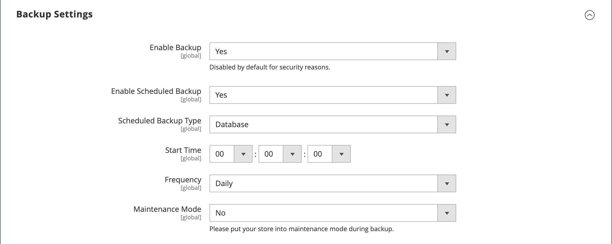

# [!UICONTROL Advanced] > [!UICONTROL System]

{{config}}

## [!UICONTROL Cron (Scheduled Tasks)]

<!-- zoom -->

Voor meer informatie over het veranderen van deze configuratiemontages, zie [Uitsnijden (geplande taken)](../../systems/cron.md).

### [!UICONTROL index]

<!-- zoom -->

| Veld | [Toepassingsgebied](../../getting-started/websites-stores-views.md#scope-settings) | Beschrijving |
|--- |--- |--- |
| [!UICONTROL Generate Schedules Every] | Algemeen | Hiermee bepaalt u de frequentie in minuten, waarna planningen worden gegenereerd. |
| [!UICONTROL Schedule Ahead for] | Algemeen | Hiermee bepaalt u het aantal minuten voordat planningen worden gegenereerd. |
| [!UICONTROL Missed if Not Run Within] | Algemeen | Hiermee wordt het aantal minuten bepaald voordat een uitsnijdtaak die nog niet is uitgevoerd, wordt gemarkeerd als gemist. |
| [!UICONTROL History Cleanup Every] | Algemeen | Hiermee bepaalt u het aantal minuten dat passeert voordat de kroongeschiedenis wordt gereinigd. |
| [!UICONTROL Success History Lifetime] | Algemeen | Hiermee bepaalt u het aantal minuten dat de record van voltooide snijtaken in de database wordt opgeslagen. |
| [!UICONTROL Failure History Lifetime] | Algemeen | Hiermee bepaalt u het aantal minuten dat de record van mislukte snijtaken in de database wordt opgeslagen. |
| [!UICONTROL Use Separate Process] | Algemeen | Hiermee wordt bepaald of snijtaken parallel worden uitgevoerd als afzonderlijke processen. Opties: `Yes` / `No` |

{style="table-layout:auto"}

### [!UICONTROL default]

<!-- zoom -->

| Veld | [Toepassingsgebied](../../getting-started/websites-stores-views.md#scope-settings) | Beschrijving |
|--- |--- |--- |
| [!UICONTROL Generate Schedules Every] | Algemeen | Hiermee bepaalt u de frequentie in minuten, waarna planningen worden gegenereerd. |
| [!UICONTROL Schedule Ahead for] | Algemeen | Hiermee bepaalt u het aantal minuten voordat planningen worden gegenereerd. |
| [!UICONTROL Missed if Not Run Within] | Algemeen | Hiermee wordt het aantal minuten bepaald voordat een uitsnijdtaak die nog niet is uitgevoerd, wordt gemarkeerd als gemist. |
| [!UICONTROL History Cleanup Every] | Algemeen | Hiermee bepaalt u het aantal minuten dat passeert voordat de kroongeschiedenis wordt gereinigd. |
| [!UICONTROL Success History Lifetime] | Algemeen | Hiermee bepaalt u het aantal minuten dat de record van voltooide snijtaken in de database wordt opgeslagen. |
| [!UICONTROL Failure History Lifetime] | Algemeen | Hiermee bepaalt u het aantal minuten dat de record van mislukte snijtaken in de database wordt opgeslagen. |
| [!UICONTROL Use Separate Process] | Algemeen | Hiermee wordt bepaald of snijtaken parallel worden uitgevoerd als afzonderlijke processen. Opties: `Yes` / `No` |

{style="table-layout:auto"}

## [!UICONTROL MySQL Message Queue Cleanup]

{{ee-feature}}

<!-- zoom -->

| Veld | [Toepassingsgebied](../../getting-started/websites-stores-views.md#scope-settings) | Beschrijving |
|--- |--- |--- |
| [!UICONTROL Successful Messages Lifetime] | Algemeen | Bepaalt het leven van succesvolle berichten in notulen. Voer nul in om de opschoonbewerking over te slaan. Standaard: `10080` (7 dagen) |
| [!UICONTROL New Messages Lifetime] | Algemeen | Bepaalt het leven van nieuwe berichten in notulen. Voer nul in om de opschoonbewerking over te slaan. Standaard: `10080` (7 dagen) |
| [!UICONTROL Failed Messages Lifetime] | Algemeen | Bepaalt de levensduur van mislukte berichten in minuten. Voer nul in om de opschoonbewerking over te slaan. Standaard: `10080` (7 dagen) |
| [!UICONTROL Retry Messages in Progress After] | Algemeen | Hiermee bepaalt u hoe lang het systeem wacht op een bericht dat wordt weergegeven voordat het opnieuw wordt geprobeerd. Standaard: `1440` (24 uur) |

{style="table-layout:auto"}

## [!UICONTROL Mail Sending Settings]

<!-- zoom -->

Zie voor meer informatie over het wijzigen van deze instellingen [E-mailcommunicatie configureren](../../systems/email-communications.md) in de _Admin Systems Guide_.

>[!IMPORTANT]
>
>**Beveiligingskennisgeving** Wij adviseren dat alle verkopers onmiddellijk hun post het verzenden configuratie plaatsen tegen onlangs geïdentificeerd potentiële verre codeuitvoering te beschermen uitbuiten. Tot dit probleem is opgelost, wordt u ten zeerste aangeraden het gebruik van [!DNL Sendmail] voor e-mailcommunicatie. In de [!UICONTROL Mail Sending Settings]ervoor zorgen dat [!UICONTROL Set Return Path] is ingesteld op `No`.

| Veld | [Toepassingsgebied](../../getting-started/websites-stores-views.md#scope-settings) | Beschrijving |
|--- |--- |--- |
| [!UICONTROL Disable Email Communications] | Winkelweergave | Hiermee bepaalt u of e-mailcommunicatie voor de winkel wordt geactiveerd. Opties: `Yes` / `No` |
| [!UICONTROL Transport] | Winkelweergave | Bepaalt het vervoertype voor e-mailmededelingen van de opslag. Opties: `Sendmail` / `SMTP` |
| [!UICONTROL Host] | Winkelweergave | (Alleen voor SMTP- en Windows-servers) Hiermee bepaalt u de naam die wordt gebruikt om naar de host te verwijzen. Standaardwaarde: `localhost` |
| [!UICONTROL Port (25)] | Winkelweergave | (Alleen voor SMTP- en Windows-servers) Identificeert de poort die wordt gebruikt voor e-mailcommunicatie. Standaardwaarde: `25` |
| [!UICONTROL Set Return-Path] | Winkelweergave | Bepaalt als een verpletterend adres voor teruggekeerde e-mail wordt gebruikt. Opties: `No` / `Yes` / `Specified` |

{style="table-layout:auto"}

### SMTP-opties

Wanneer u SMTP bij het vervoerstype selecteert, zijn de extra opties beschikbaar om de SMTP serververbinding te vormen.

<!-- zoom -->

| Veld | [Toepassingsgebied](../../getting-started/websites-stores-views.md#scope-settings) | Beschrijving |
|--- |--- |--- |
| [!UICONTROL Username] | Winkelweergave | Login gebruikersnaam voor de server SMTP. |
| [!UICONTROL Password] | Winkelweergave | Wachtwoord voor de SMTP-serveraanmelding. |
| [!UICONTROL Auth] | Winkelweergave | Bepaalt het authentificatietype voor de SMTP serververbinding. Opties: `NONE` / `PLAIN` / `LOGIN` |
| [!UICONTROL SSL] | Winkelweergave | Bepaalt het verificatietype voor het hostbeveiligingscertificaat. Opties: `SSL` / `TLS` |

{style="table-layout:auto"}

## [!UICONTROL Currency]

<!-- zoom -->

Zie voor meer informatie over het wijzigen van deze instelling [Valutaconfiguratie](../../stores-purchase/currency-configuration.md) in de _Handleiding voor winkels en aanschaf_.

| Veld | [Toepassingsgebied](../../getting-started/websites-stores-views.md#scope-settings) | Beschrijving |
|--- |--- |--- |
| [!UICONTROL Installed Currencies] | Algemeen | Geeft de valuta&#39;s aan die momenteel beschikbaar zijn voor de installatie van de Handel. De opties omvatten alle beschikbare valuta&#39;s, met geïnstalleerde valuta&#39;s geselecteerd. |

{style="table-layout:auto"}

## [!UICONTROL Security]

<!-- zoom -->

Zie voor meer informatie over het wijzigen van deze instellingen [Sessiebeheer](../../systems/security-session-management.md) in de _Admin Systems Guide_.

| Veld | [Toepassingsgebied](../../getting-started/websites-stores-views.md#scope-settings) | Beschrijving |
|--- |--- |--- |
| [!UICONTROL Max Session Size in Admin] | Algemeen | Beperk de maximale sessiegrootte in bytes. Gebruiken `0` om uit te schakelen. |
| [!UICONTROL Max Session Size in Storefront] | Algemeen | Beperk de maximale sessiegrootte in bytes. Gebruiken `0` om uit te schakelen. |

{style="table-layout:auto"}

## [!UICONTROL Notifications]

<!-- zoom -->

Zie voor meer informatie over het wijzigen van deze instellingen [Systeemmeldingen](../../systems/notifications.md) in de _Admin Systems Guide_.

| Veld | [Toepassingsgebied](../../getting-started/websites-stores-views.md#scope-settings) | Beschrijving |
|--- |--- |--- |
| [!UICONTROL Use HTTPS to Get Feed] | Algemeen | Hiermee bepaalt u of Admin-meldingen via een beveiligd kanaal worden verzonden. Opties: `Yes` / `No` |
| Frequentie bijwerken | Algemeen | Bepaalt de frequentie van Admin berichtupdates. Opties: `1 Hour` / `2 Hours` / `6 Hours` / `12 Hours` / `24 Hours` |
| [!UICONTROL Last Update] | Algemeen | Geeft de datum en tijd aan van de laatste berichtupdate. |

{style="table-layout:auto"}

## [!UICONTROL Backup Settings]

<!-- zoom -->

{{$include /help/_includes/backups-note.md}}

Zie voor meer informatie over het wijzigen van deze instellingen [Systeemback-ups](../../systems/backups.md) in de _Admin Systems Guide_.

| Veld | [Toepassingsgebied](../../getting-started/websites-stores-views.md#scope-settings) | Beschrijving |
|--- |--- |--- |
| [!UICONTROL Enable Backup] | Algemeen | Bepaalt als de instantie van de Handel steunen toestaat. Opties: `Yes` / `No` |
| [!UICONTROL Enable Scheduled Backup] | Algemeen | (Weergegeven wanneer _[!UICONTROL Enable Backup]_is ingesteld op `Yes`.) Hiermee wordt bepaald of er automatisch een back-up wordt gemaakt van de instantie Commerce. Opties: `Yes` / `No` |
| [!UICONTROL Scheduled Backup Type] | Algemeen | (Weergegeven wanneer _[!UICONTROL Enable Scheduled Backup]_is ingesteld op `Yes`.) Bepaalt de elementen van de instantie van de Handel die in de steun inbegrepen zijn. Opties: `Database` / `Database and Media` / `System` / `System (excluding Media)` |
| [!UICONTROL Start Time] | Algemeen | (Weergegeven wanneer [!UICONTROL Enable Scheduled Backup] is ingesteld op `Yes`.) Hiermee geeft u het uur, de minuut en de seconde op waarop de geplande back-up begint. |
| [!UICONTROL Frequency] | Algemeen | (Weergegeven wanneer [!UICONTROL Enable Scheduled Backup] is ingesteld op `Yes`.) Hiermee bepaalt u hoe vaak de geplande back-up plaatsvindt. Opties: `Daily` / `Weekly` / `Monthly` |
| [!UICONTROL Maintenance Mode] | Algemeen | (Weergegeven wanneer [!UICONTROL Enable Scheduled Backup] is ingesteld op `Yes`.) Hiermee bepaalt u of de opslagruimte tijdens de geplande back-up in de onderhoudsmodus wordt geplaatst. Opties: `Yes` / `No` |

{style="table-layout:auto"}

## [!UICONTROL Admin Actions Log Archiving]

{{ee-feature}}

<!-- zoom -->

Zie voor meer informatie over het wijzigen van deze instellingen [Archief van handelingenlogboek](../../systems/action-log-archive.md) in de _Admin Systems Guide_.

| Veld | [Toepassingsgebied](../../getting-started/websites-stores-views.md#scope-settings) | Beschrijving |
|--- |--- |--- |
| [!UICONTROL Log Entry Lifetime, Days] | Winkelweergave | Hiermee bepaalt u het aantal dagen dat beheerhandelingen worden bewaard in het archief met beheeracties. Standaard: `60` |
| [!UICONTROL Log Archiving Frequency] | Winkelweergave | Hiermee bepaalt u hoe vaak de logbestanden met beheeracties worden gearchiveerd. Opties: `Daily` / `Weekly` / `Monthly` |

{style="table-layout:auto"}

## [!UICONTROL Full Page Cache]

{{beta2-patches-updates}}

<!-- zoom -->

Zie voor meer informatie over het wijzigen van deze instellingen [In cache plaatsen van volledige pagina&#39;s](../../systems/cache-management.md#full-page-caching) in de _Admin Systems Guide_.

<!-- zoom -->

| Veld | [Toepassingsgebied](../../getting-started/websites-stores-views.md#scope-settings) | Beschrijving |
|--- |--- |--- |
| [!UICONTROL Caching Application] | Algemeen | Bepaalt de toepassing die wordt gebruikt om het full-page geheime voorgeheugen te beheren. Opties:  **`Built-in Application`**- Niet aanbevolen voor de productieomgeving. **`Varnish Caching`** - aanbevolen voor de productieomgeving. |
| [!UICONTROL TTL for public content] | Algemeen | Bepaalt het leven van het openbare inhoudsgeheime voorgeheugen in seconden. Standaardwaarde: `120` |
| **[!UICONTROL Varnish Configuration]** |  |  |
| [!UICONTROL Access list] | Algemeen | Specificeert de IP adressen die de configuratie van Varnish kunnen zuiveren om een config dossier te produceren. Scheid meerdere items met een komma. Standaardwaarde: `localhost` |
| [!UICONTROL Backend host] | Algemeen | Specificeert de backendgastheer die config dossiers produceert. Standaardwaarde: `localhost` |
| [!UICONTROL Backend port] | Algemeen | Specificeert de achterste haven die wordt gebruikt om configuratiedossiers te produceren. Standaardwaarde: `8080` |
| [!UICONTROL Grace period] | Algemeen | Geeft de respijtperiode in seconden op voor het genereren van een configuratiebestand. Standaardwaarde: `300` |
| **[!UICONTROL Export Configuration]** |  |  |
| [!UICONTROL Export VCL for Varnish 4] | Algemeen | Hiermee exporteert u de `varnish.vcl` bestand voor versie 4. |
| [!UICONTROL Export VCL for Varnish 5] | Algemeen | Hiermee exporteert u de `varnish.vcl` bestand voor versie 5. |
| [!UICONTROL Export VCL for Varnish 6] | Algemeen | Hiermee exporteert u de `varnish.vcl` bestand voor versie 6. |

{style="table-layout:auto"}

## [!UICONTROL Storage Configuration for Media]

<!-- zoom -->

Zie voor meer informatie over het wijzigen van deze instellingen [Een mediabase gebruiken](../../content-design/media-storage-database.md) in de _Inhoud- en ontwerphandleiding_.

| Veld | [Toepassingsgebied](../../getting-started/websites-stores-views.md#scope-settings) | Beschrijving |
|--- |--- |--- |
| [!UICONTROL Media Storage] | Algemeen | Bepaalt de methode die wordt gebruikt om mediabestanden op te slaan. Standaardinstelling: `File System` |
| [!UICONTROL Environment Update Time] | Algemeen | Hiermee bepaalt u de frequentie waarmee de omgeving van het mediabestand in seconden wordt bijgewerkt. Standaardwaarde: `3600` |

{style="table-layout:auto"}

<!-- zoom -->

>[!IMPORTANT]
>
>De opslagmethode voor databasemedia wordt vanaf Adobe Commerce en Magento Open Source 2.4.3 afgekeurd.

| Veld | [Toepassingsgebied](../../getting-started/websites-stores-views.md#scope-settings) | Beschrijving |
|--- |--- |--- |
| [!UICONTROL Media Storage] | Algemeen | Database wordt opgegeven als de methode voor het opslaan van mediabestanden. |
| [!UICONTROL Select Media Database] | Algemeen | Identificeert de naam van het gegevensbestand dat voor media opslag wordt gebruikt. Standaardinstelling: `default_setup` |
| [!UICONTROL Synchronize] |  | Synchroniseert de overdracht van alle media aan de gespecificeerde gegevensbestandplaats. |
| Update-tijd omgeving | Algemeen | Hiermee bepaalt u de frequentie waarmee de omgeving van het mediabestand in seconden wordt bijgewerkt. Standaardwaarde: `3600` |

{style="table-layout:auto"}

## [!UICONTROL Bulk Actions]

{{ee-feature}}

<!-- zoom -->

Zie voor meer informatie over het wijzigen van deze instellingen [Bulkacties](../../systems/action-log-bulk-actions.md) in de _Admin Systems Guide_.

| Veld | [Toepassingsgebied](../../getting-started/websites-stores-views.md#scope-settings) | Beschrijving |
|--- |--- |--- |
| [!UICONTROL Days Saved in Log] | Algemeen | Hiermee bepaalt u het aantal dagen dat bulkhandelingen worden opgeslagen in het dialoogvenster _Logbestand met bulkhandelingen_ archief. Standaard: `60` |

{style="table-layout:auto"}

## [!UICONTROL Scheduled Import/Export File History Cleaning]

{{ee-feature}}

<!-- zoom -->

Zie voor meer informatie over het wijzigen van deze instellingen [Geplande import en export](../../systems/data-scheduled-import-export.md) in de _Admin Systems Guide_.

| Veld | [Toepassingsgebied](../../getting-started/websites-stores-views.md#scope-settings) | Beschrijving |
|--- |--- |--- |
| [!UICONTROL Save File, Days] | Algemeen | Hiermee bepaalt u het aantal dagen dat bestanden met de import-/exportgeschiedenis worden opgeslagen. |
| [!UICONTROL Enable Scheduled File History Cleaning] | Algemeen | Hiermee wordt het geplande bestand opgeschoond met import-/exportbestanden. Opties: `Yes` / `No` |
| [!UICONTROL Clean Now] |  | Hiermee overschrijft u de geplande opschoning en wist u onmiddellijk de bestanden met de import-/exportgeschiedenis. |
| [!UICONTROL Start Time] | Algemeen | Hiermee geeft u het uur, de minuut en de seconde op voor het opschonen van het bestand met de import-/exportgeschiedenis. |
| [!UICONTROL Frequency] | Algemeen | Hiermee bepaalt u hoe vaak de bestanden met de import-/exportgeschiedenis worden schoongemaakt. Opties: `Daily` / `Weekly` / `Monthly` |
| [!UICONTROL Error Email Recipient] | Algemeen | Het e-mailadres van de persoon die een melding moet ontvangen als er een fout optreedt terwijl de historie van het import-/exportbestand is opgeschoond. Scheid meerdere adressen met een komma. |
| [!UICONTROL Error Email Sender] | Algemeen | Identificeert het opslagcontact dat als afzender van het bericht verschijnt. Standaardafzender: `General Contact` |
| [!UICONTROL Error Email Template] | Algemeen | Identificeert het e-mailmalplaatje dat voor de invoer/de uitvoer dossier schoonmaakfout- bericht wordt gebruikt. Standaardsjabloon: `File History Clean Failed` |

{style="table-layout:auto"}

## [!UICONTROL Image Upload Configuration]

<!-- zoom -->

<!-- [Image Upload Configuration](https://docs.magento.com/user-guide/system/action-log-bulk-actions.html) -->

| Veld | [Toepassingsgebied](../../getting-started/websites-stores-views.md#scope-settings) | Beschrijving |
|--- |--- |--- |
| [!UICONTROL Quality] | Algemeen | Hiermee bepaalt u de kwaliteit van de JPG voor de gewijzigde afbeelding. Bij een lagere kwaliteit wordt het bestand kleiner. Gebruik 80-90% om bestanden met hoge kwaliteit te verkleinen. Standaard: `80` |
| [!UICONTROL Enable Frontend Resize] | Algemeen | Schakel deze instelling in als u wilt toestaan dat Commerce de grootte wijzigt van grote, te grote afbeeldingen die u voor de _Productgegevens_ pagina. De handel resizes de beelddossiers gebruikend JavaScript alvorens het dossier te uploaden. Als de grootte van de afbeelding wordt gewijzigd, blijft de afbeelding exact even groot en wordt de grootste breedte bij Maximumbreedte of Maximumhoogte niet overschreden. Standaard: `Yes` |
| [!UICONTROL Maximum Width] | Algemeen | Hiermee bepaalt u de maximale pixelbreedte voor de afbeelding. Wanneer het formaat van de afbeelding wordt gewijzigd, wordt deze breedte niet overschreden. Standaard: `1920` |
| [!UICONTROL Maximum Height] | Algemeen | Hiermee bepaalt u de maximale pixelhoogte voor de afbeelding. Wanneer het formaat van de afbeelding wordt gewijzigd, wordt deze hoogte niet overschreden. Standaard: `1200` |

{style="table-layout:auto"}

## [!UICONTROL Media Gallery]

<!-- zoom -->

| Veld | [Toepassingsgebied](../../getting-started/websites-stores-views.md#scope-settings) | Beschrijving |
|--- |--- |--- |
| [!UICONTROL Enable Old Media Gallery] | Algemeen | Schakelt de oude medialerie in of uit. |

{style="table-layout:auto"}

## [!UICONTROL Media Gallery Image Optimization]

<!-- zoom -->

| Veld | [Toepassingsgebied](../../getting-started/websites-stores-views.md#scope-settings) | Beschrijving |
|--- |--- |--- |
| [!UICONTROL Enable Image Optimization] | Algemeen | Hiermee bepaalt u of de grootte van de afbeeldingen wordt gewijzigd om de bestandsgrootte te verkleinen van de afbeeldingen die worden ingevoegd in de inhoud. Oorspronkelijke afbeeldingen blijven behouden in de medialerie. |
| [!UICONTROL Maximum Width] | Algemeen | De maximumbreedte (in pixels) voor afbeeldingen die vanuit de medialerie in de inhoud zijn ingevoegd. |
| [!UICONTROL Maximum Height] | Algemeen | De maximumhoogte (in pixels) voor afbeeldingen die vanuit de medialerie in de inhoud zijn ingevoegd. |

{style="table-layout:auto"}

## [!UICONTROL Adobe Stock Integration]

<!-- zoom -->

Voor meer informatie over het vormen van deze montages, zie [Adobe Stock-integratie](../../content-design/adobe-stock.md) in de _Inhoud- en ontwerphandleiding_.

| Veld | [Toepassingsgebied](../../getting-started/websites-stores-views.md#scope-settings) | Beschrijving |
|--- |--- |--- |
| [!UICONTROL Enabled Adobe Stock] | Algemeen | Hiermee schakelt u de Adobe Stock-integratie in of uit. |
| [!UICONTROL API Key (Client ID)] | Algemeen | Een API-sleutel is vereist om uw winkel te verbinden met de Adobe Stock-service. |
| [!UICONTROL Client Secret] | Algemeen | Het clientgeheim voor uw Adobe Stock-integratie is vereist. |
| [!UICONTROL Test Connection] |  | Hiermee wordt een test uitgevoerd om te controleren of de API-sleutel geldig is voor gebruik met de Adobe Stock-service. |

{style="table-layout:auto"}
