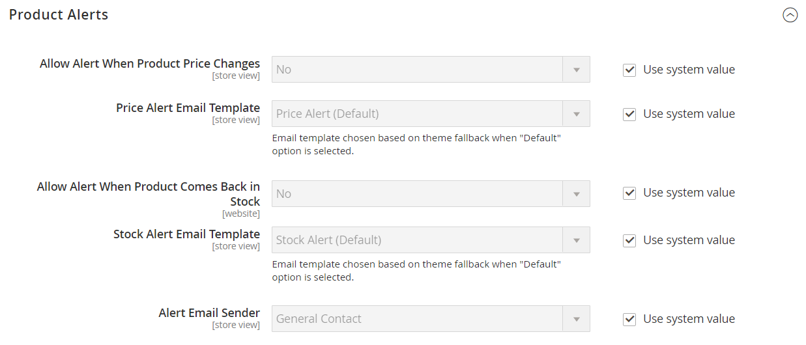

# [!UICONTROL Catalog] > [!UICONTROL Catalog]

{{config}}

## [!UICONTROL Product Fields Auto-Generation]

<!-- zoom -->

<!-- [Product Fields Auto-Generation](https://experienceleague.adobe.com/en/docs/commerce-admin/catalog/products/product-workspace#default-field-values) -->

| Veld | [ Reikwijdte ](../../getting-started/websites-stores-views.md#scope-settings) | Beschrijving |
|--- |--- |--- |
| [!UICONTROL Mask for SKU] | Algemeen | Hiermee bepaalt u de standaardwaarde van het SKU-veld op basis van plaatsaanduidingswaarden uit andere velden en eventuele extra tekst die wordt ingevoerd. Standaard tijdelijke aanduiding:   Productnaam - `{{name}}` |
| [!UICONTROL Mask for Meta Title] | Algemeen | Hiermee bepaalt u de standaardwaarde van het veld Metatitel op basis van plaatsaanduidingswaarden uit andere velden en eventuele extra tekst die wordt ingevoerd. Standaard tijdelijke aanduiding:   Productnaam - `{{name}}` |
| [!UICONTROL Mask for Meta Keywords] | Algemeen | Bepaalt de standaardwaarde van het _gebied van Trefwoorden van 0} Meta {dat op placeholder waarden van andere gebieden en om het even welke extra tekst wordt gebaseerd die is ingegaan._ Standaard tijdelijke aanduiding:   Productnaam - `{{name}}` |
| [!UICONTROL Mask for Meta Description] | Algemeen | Hiermee bepaalt u de standaardwaarde van het veld Metabeschrijving op basis van de plaatsaanduidingswaarden van andere velden en eventuele extra tekst die wordt ingevoerd. Standaardplaatsaanduiding:   Productnaam - `{{name}}`   Beschrijving - `{{description}}` |

{style="table-layout:auto"}

## [!UICONTROL Product Reviews]

<!-- zoom -->

<!-- [Product Reviews](https://experienceleague.adobe.com/en/docs/commerce-admin/marketing/merchandising/product-reviews/product-reviews) -->

| Veld | [ Reikwijdte ](../../getting-started/websites-stores-views.md#scope-settings) | Beschrijving |
|--- |--- |--- |
| [!UICONTROL Enabled] | Winkelweergave | Hiermee kunt u productbeoordelingen inschakelen. Opties: `Yes` / `No` |
| [!UICONTROL Allow Guests to Write Reviews] | Website | Hiermee bepaalt u of klanten een account bij uw winkel moeten openen om productrevisies te kunnen schrijven. |

{style="table-layout:auto"}

## [!UICONTROL Storefront]

<!-- zoom -->

<!-- [Storefront](https://experienceleague.adobe.com/en/docs/commerce-admin/catalog/catalog/navigation/navigation-product-listings) -->

| Veld | [ Reikwijdte ](../../getting-started/websites-stores-views.md#scope-settings) | Beschrijving |
|--- |--- |--- |
| [!UICONTROL List Mode] | Winkelweergave | Bepaalt de indeling van de lijst met zoekresultaten. Opties:  **`Grid Only`**- maakt de lijst op als een raster van rijen en kolommen. Elk product wordt weergegeven in één cel van het raster. **`List Only`** - Hiermee maakt u de lijst op met elk product op een aparte rij.  **`Grid (default / List)`**- Standaard worden producten weergegeven in de rasterweergave en kunnen ze worden geschakeld naar de lijstweergave. **`List (default / Grid)`** - Standaard worden producten weergegeven in de lijstweergave en kunnen ze worden geschakeld naar de rasterweergave. |
| [!UICONTROL Products per Page on Grid Allowed Values] | Winkelweergave | Hiermee bepaalt u het aantal producten dat wordt weergegeven in de rasterweergave. Als u opties wilt selecteren, voert u meerdere waarden in, gescheiden door komma&#39;s. |
| [!UICONTROL Products per Page on Grid Default Value] | Winkelweergave | Hiermee bepaalt u het aantal producten dat standaard per pagina wordt weergegeven in de rasterweergave. |
| [!UICONTROL Products per Page on List Allowed Values] | Winkelweergave | Bepaalt het aantal producten die in de Mening van de Lijst worden getoond. Als u opties wilt selecteren, voert u meerdere waarden in, gescheiden door komma&#39;s. |
| [!UICONTROL Products per Page on List Default Value] | Winkelweergave | Hiermee bepaalt u het aantal producten dat standaard per pagina wordt weergegeven in de lijstweergave. |
| Aanbieding sorteren op | Winkelweergave | Hiermee bepaalt u de sorteervolgorde van de lijst met zoekresultaten. De selectie van opties wordt bepaald door de weergave-instellingen van de categorie en de beschikbare kenmerken die zijn ingesteld op `Used for Sorting in Product Listing` . De standaardwaarde is ingesteld op `Use All Available Attributes` en bevat doorgaans de waarde Beste, Naam, Prijs. Dit het plaatsen is niet van toepassing op [!DNL Live Search] [ Van de Lijst van het Product de Widget van de Pagina ](https://experienceleague.adobe.com/en/docs/commerce-merchant-services/live-search/live-search-storefront/plp-styling). |
| [!UICONTROL Allow All Products per Page] | Winkelweergave | Indien ingesteld op `Yes` , neemt u de optie `ALL` op in het besturingselement &#39;Tonen per pagina&#39;. |
| [!UICONTROL Remember Category Pagination] | Algemeen | Als reeks aan `Yes`, worden de huidige waarden van de categoriepage bewaard aangezien de klanten van één categorie aan een andere in [ productlijsten ](../../catalog/navigation-product-listings.md) doorbladeren. Bij het opslaan van de waarde wordt meer cache-opslag gebruikt en kan dit van invloed zijn op de manier waarop pagina&#39;s door zoekmachines worden geïndexeerd. Opties: `Yes` / `No` (standaardwaarde) |
| [!UICONTROL Use Flat Catalog Category] | Algemeen | Laat de [ vlakke categoriestructuur ](../../catalog/catalog-flat.md) toe (geadviseerd niet). Opties: `Yes` / `No` |
| [!UICONTROL Use Flat Catalog Product] | Algemeen | Hiermee wordt de vlakke productstructuur ingeschakeld. (niet aanbevolen) Opties: `Yes` / `No` |
| [!UICONTROL Swatches per Product] | Winkelweergave | Hiermee bepaalt u het aantal stalen dat beschikbaar is voor elk product. Standaard: `16` |
| [!UICONTROL Show Swatches in Product List] | Winkelweergave | Hiermee bepaalt u of de stalen worden weergegeven in de lijst met producten. Opties: `Yes` / `No` |
| [!UICONTROL Show Swatch Tooltip] | Winkelweergave | Hiermee bepaalt u of de staalknopinfo wordt weergegeven. Opties: `Yes` / `No` |

{style="table-layout:auto"}

## [!UICONTROL Product Alerts]

<!-- zoom -->

<!-- [Product Alerts](https://experienceleague.adobe.com/en/docs/commerce-admin/inventory/configuration/product-alerts/alert-setup) -->

| Veld | [ Reikwijdte ](../../getting-started/websites-stores-views.md#scope-settings) | Beschrijving |
|--- |--- |--- |
| [!UICONTROL Allow Alerts When Product Price Changes] | Winkelweergave | Hiermee bepaalt u of er e-mailberichten beschikbaar zijn voor prijswijzigingen van producten. Opties: `Yes` / `No` |
| [!UICONTROL Price Alert Email Template] | Winkelweergave | Hiermee wordt de sjabloon aangegeven die wordt gebruikt voor e-mailwaarschuwingen over productprijswijziging. Standaardsjabloon: `Product price alert` |
| [!UICONTROL Allow Alert When Product Comes Back in Stock] | Website | Hiermee bepaalt u of klanten een waarschuwing kunnen ontvangen wanneer het product weer in voorraad wordt genomen. Opties: `Yes` / `No` |
| [!UICONTROL Stock Alert Email Template] | Winkelweergave | Hiermee wordt de sjabloon aangegeven die wordt gebruikt voor e-mailberichten met voorraadwaarschuwingen. Standaardsjabloon: `Product stock alert` |
| [!UICONTROL Alert Email Sender] | Winkelweergave | Hiermee bepaalt u de contactpersoon van de winkel die wordt weergegeven als de afzender van het e-mailbericht met productwaarschuwing. Opties: `General Contact` / `Sales Representative` / `Customer Support` / `Custom Email` |

{style="table-layout:auto"}

## [!UICONTROL Product Alerts Run Settings]

<!-- zoom --> in werking

<!-- [Product Alerts Run Settings](https://experienceleague.adobe.com/en/docs/commerce-admin/inventory/configuration/product-alerts/alert-setup) -->

| Veld | [ Reikwijdte ](../../getting-started/websites-stores-views.md#scope-settings) | Beschrijving |
|--- |--- |--- |
| [!UICONTROL Frequency] | Algemeen | Kies hoe vaak productwaarschuwingen worden verzonden. Opties: `Daily` / `Weekly` / `Monthly` |
| [!UICONTROL Start Time] | Algemeen | Kies op welk tijdstip het waarschuwingsproces voor het product begint. Deze tijd moet zijn nadat een prijs- of voorraadupdate is uitgevoerd. |
| [!UICONTROL Error Email Recipient] | Algemeen | Identificeer het e-mailadres van de persoon (normaal een opslagbeheerder) die een e-mailbericht zou moeten ontvangen wanneer er een fout in het proces van de productwaarschuwing is. |
| [!UICONTROL Error Email Sender] | Algemeen | Selecteer de rol die de e-mail heeft `from` . |
| [!UICONTROL Error Email Template] | Algemeen | Selecteer de e-mailsjabloon die u wilt gebruiken voor foutmeldingen met betrekking tot productwaarschuwingen. |

{style="table-layout:auto"}

## [!UICONTROL Product Image Placeholders]

<!-- zoom -->

<!-- [Product Image Placeholders](https://experienceleague.adobe.com/en/docs/commerce-admin/catalog/products/digital-assets/product-image-config#image-placeholders) -->

| Veld | [ Reikwijdte ](../../getting-started/websites-stores-views.md#scope-settings) | Beschrijving |
|--- |--- |--- |
| [!UICONTROL Base Image] | Winkelweergave | Hiermee wordt het plaatsaanduidingsbestand aangegeven dat is gekozen voor de basisafbeelding. |
| [!UICONTROL Small Image] | Winkelweergave | Hiermee wordt het plaatsaanduidingsbestand aangegeven dat is gekozen voor de kleine afbeelding. |
| [!UICONTROL Swatch] | Winkelweergave | Hiermee geeft u het plaatsaanduidingsbestand aan dat voor het staal is gekozen. |
| [!UICONTROL Thumbnail] | Winkelweergave | Hiermee wordt het plaatsaanduidingsbestand aangegeven dat voor de miniatuur is gekozen. |
| [!UICONTROL Choose File] |  | Navigeert naar het bestand en uploadt het als plaatsaanduidingsafbeelding voor de tekst. |

{style="table-layout:auto"}

## [!UICONTROL Recently Viewed/Compared Products]

<!-- zoom -->

<!-- Recently Viewed/Compared Products](https://experienceleague.adobe.com/en/docs/commerce-admin/stores-sales/shopper-tools/products-viewed-compared) -->

| Veld | [ Reikwijdte ](../../getting-started/websites-stores-views.md#scope-settings) | Beschrijving |
|--- |--- |--- |
| [!UICONTROL Synchronize widget products with backend storage] | Algemeen | Bepaalt de synchronisatie van de productwidgetgegevens, zoals product-id, met de database. Dit staat het hergebruik van informatie op andere apparaten toe. |
| [!UICONTROL Show for Current] | Website | Hiermee beperkt u de weergegeven producten tot de huidige website. Opties: `Website` / `Store` / `Store View` |
| [!UICONTROL Default Recently Viewed Products Count] | Winkelweergave | Hiermee bepaalt u het maximum aantal onlangs weergegeven producten dat in de lijst wordt weergegeven. |
| [!UICONTROL Default Recently Compared Products Count] | Winkelweergave | Hiermee bepaalt u het maximumaantal onlangs vergeleken producten dat in de lijst wordt weergegeven. |
| [!UICONTROL Lifetime of products in Recently Viewed Widget] | Algemeen | Hiermee bepaalt u hoe lang, in seconden, de weergegeven producten worden weergegeven in de lijst die onlangs is weergegeven. |
| [!UICONTROL Lifetime of products in Recently Compared Widget] | Algemeen | Bepaalt hoe lang, in seconden, de vergeleken producten in onlangs vergeleken lijst worden getoond. |

{style="table-layout:auto"}

## [!UICONTROL Product Video]

<!-- zoom -->

<!-- [Product Videos](https://experienceleague.adobe.com/en/docs/commerce-admin/catalog/products/digital-assets/product-video) -->

| Veld | [ Reikwijdte ](../../getting-started/websites-stores-views.md#scope-settings) | Beschrijving |
|--- |--- |--- |
| [!UICONTROL YouTube API key] | Winkelweergave | Hier geeft u de API-sleutel op die nodig is om verbinding te maken met de YouTube-server. |
| [!UICONTROL Autostart base video] | Winkelweergave | Als u de video automatisch wilt starten nadat de pagina is geladen, stelt u deze in op `Yes` . |
| [!UICONTROL Show related video] | Winkelweergave | Als u verwante video&#39;s wilt weergeven, stelt u deze in op `Yes` . |
| [!UICONTROL Auto restart video] | Winkelweergave | Als u automatisch opnieuw afspelen van video wilt inschakelen, stelt u deze in op `Yes` . |

{style="table-layout:auto"}

## [!UICONTROL Price]

<!-- zoom -->

<!--Price](https://experienceleague.adobe.com/en/docs/commerce-admin/catalog/products/pricing/catalog-price-scope) -->

| Veld | [ Reikwijdte ](../../getting-started/websites-stores-views.md#scope-settings) | Beschrijving |
|--- |--- |--- |
| [!UICONTROL Catalog Price Scope] | Algemeen | Hiermee bepaalt u het bereik van de basisvaluta. Opties: `Global` / `Website` |
| [!UICONTROL Default Product Price] | Algemeen |  (Adobe Commerce slechts) bepaalt de standaardproductprijs, als toepasselijk. |

{style="table-layout:auto"}

## [!UICONTROL Layered Navigation]

>[!NOTE]
>
>De standaardonderzoeksconfiguratie die in deze sectie wordt beschreven verschilt voor [ Levend Onderzoek ](https://experienceleague.adobe.com/docs/commerce-merchant-services/live-search/overview.html).

<!-- [Layered Navigation - Automatic (equalize price ranges)](https://experienceleague.adobe.com/en/docs/commerce-admin/catalog/catalog/navigation/navigation-layered#configure-layered-navigation) -->

<!-- zoom -->

<!-- zoom -->

<!-- zoom -->

| Veld | [ Reikwijdte ](../../getting-started/websites-stores-views.md#scope-settings) | Beschrijving |
|--- |--- |--- |
| [!UICONTROL Display Product Count] | Winkelweergave | Hiermee bepaalt u of het aantal producten na elk kenmerk, prijsbereik en elke categorie wordt weergegeven. Opties: `Yes` / `No` |
| [!UICONTROL Price Navigation Step Calculation] | Winkelweergave | Bepaalt de methode wordt gebruikt om de [ stap van de prijsnavigatie ](../../catalog/navigation-layered.md#configure-price-navigation) te bepalen die. Opties:  `Automatic (equalize price ranges)` - De berekening wordt gebaseerd op het prijsbereik van producten in de groep.  `Automatic (equalize product counts)` - De berekening wordt gebaseerd op het aantal producten in de groep. Er wordt een drempel vastgesteld voor het minimumaantal producten in de groep, om te voorkomen dat deze in kleinere groepen worden verdeeld.  `Manual` - Gebruikt de scheidingslimiet die u invoert voor prijsintervallen. |
| [!UICONTROL Default Price Navigation Step] | Winkelweergave | Hiermee bepaalt u het aantal producten dat in elke stap wordt opgenomen. |
| [!UICONTROL Maximum Number of Price Intervals] | Winkelweergave | Hiermee stelt u een limiet in voor het aantal prijsintervallen dat wordt weergegeven in gelaagde navigatie. |

{style="table-layout:auto"}

## [!UICONTROL Category Permissions]

{{ee-feature}}

<!-- zoom -->

<!-- [Category Permissions](https://experienceleague.adobe.com/en/docs/commerce-admin/catalog/categories/category-permissions) -->

| Veld | [ Reikwijdte ](../../getting-started/websites-stores-views.md#scope-settings) | Beschrijving |
|--- |--- |--- |
| [!UICONTROL Enable] | Algemeen | Hiermee activeert u rubriekbeperkingen. Met deze functie worden standaard alle categorieën beperkt. Opties: `Yes` / `No` |
| [!UICONTROL Allow Browsing Category] | Website | Hiermee bepaalt u wie categorieën mag doorbladeren. Opties:  `Yes, for Everyone` - Hiermee kunnen alle bezoekers en klanten door de categorie bladeren.  `Yes, for Specified Customer Groups` - Hiermee kunnen alleen leden van geselecteerde klantgroepen door de categorie bladeren.  `No, Redirect to Landing Page` - Weigert toegang tot de categorie en leidt naar de geselecteerde pagina. |
| [!UICONTROL Display Product Prices] | Website | Hiermee bepaalt u de weergave van de productprijzen voor de categorie. Opties:  `Yes, for Everyone` - Hiermee kan iedereen de prijs van producten in de categorie zien.  `Yes, for Specified Customer Groups` - Hiermee kunnen alleen leden van geselecteerde klantgroepen de prijs van producten in de categorie zien.  `No` - Hiermee schakelt u de weergave van de productprijzen voor de categorie uit. |
| [!UICONTROL Allow Adding to Cart] | Website | Hiermee bepaalt u wie producten van de categorie kan kopen. Opties:  `Yes, for Everyone` - Hiermee kan iedereen producten uit de categorie in zijn winkelwagentjes plaatsen.  `Yes, for Specified Customer Groups` - Hiermee kunnen alleen leden van geselecteerde klantgroepen producten uit de categorie in hun winkelwagentjes plaatsen.  `No` - Het staat niemand toe om producten van de categorie in hun winkelwagentjes te plaatsen. |
| [!UICONTROL Disallow Catalog Search by] | Website | Identificeert de klantengroepen die niet naar producten in de categorie mogen zoeken. |

{style="table-layout:auto"}

## [!UICONTROL Search Engine Optimization]

<!-- zoom -->

<!-- [Search Engine Optimization](https://experienceleague.adobe.com/en/docs/commerce-admin/catalog/products/settings/product-search-engine-optimization) -->

| Veld | [ Reikwijdte ](../../getting-started/websites-stores-views.md#scope-settings) | Beschrijving |
|--- |--- |----------------------------------------------------------------------------------------------------------------------------------------------------------------------------------------------------------------------------------------------------------------------------------------------------------------------------------------------------------------------------------------------------------|
| [!UICONTROL Popular Search Terms] | Winkelweergave | Bepaalt als _de Populaire Termen van het Onderzoek_ in de opslag wordt uitgevoerd. Dit het plaatsen is niet op opslag van toepassing die [ Levende Onderzoek ](https://experienceleague.adobe.com/docs/commerce-merchant-services/live-search/overview.html) gebruiken. Opties: `Enable` / `Disable` |
| [!UICONTROL Product URL Suffix] | Winkelweergave | Hiermee wordt bepaald of een achtervoegsel, zoals html of htm, wordt toegepast op product-URL&#39;s. Indien gebruikt, neem dan geen punt vóór het achtervoegsel op omdat deze automatisch wordt toegepast. |
| [!UICONTROL Category URL Suffix] | Winkelweergave | Hiermee wordt bepaald of een achtervoegsel, zoals html of htm, wordt toegepast op categorie-URL&#39;s. Indien gebruikt, neem dan geen punt vóór het achtervoegsel op omdat deze automatisch wordt toegepast. |
| [!UICONTROL Use Categories Path for Product URLs] | Winkelweergave | Hiermee wordt bepaald of categoriepaden worden opgenomen in product-URL&#39;s. Dit kan ertoe leiden dat meerdere URL&#39;s naar dezelfde pagina verwijzen, wat van invloed kan zijn op de zoekpositie. Meer leren, zie [ Canonical meta markering ](../../merchandising-promotions/meta-data.md#canonical-meta-tag). |
| [!UICONTROL Create Permanent Redirect for URLs if URL Key Changed] | Winkelweergave | Hiermee wordt bepaald of er automatisch een permanente omleiding wordt gemaakt wanneer een URL-sleutel verandert. Als u deze optie hebt geïmplementeerd, is het selectievakje Aangepaste omleiding voor oude URL maken onder het veld URL-sleutel van product standaard ingeschakeld. Opties: `Yes` / `No` |
| [!UICONTROL Generate "category/product" URL Rewrites] | Algemeen | Hiermee wordt bepaald of Adobe Commerce gegevens genereert en opslaat in herschrijftabellen wanneer een gebruiker een categorie opslaat die veel toegewezen producten bevat. Opties: `Yes` / `No`   **_Belangrijk:_**het bewaren van dit geproduceerde gegeven in een URL herschrijft lijst kan prestaties degraderen. Zie [ Automatische Omleiding van het Product ](../../merchandising-promotions/url-redirect-product-automatic.md) voor meer informatie. |
| [!UICONTROL Apply transliteration for product URL] | Winkelweergave | Hiermee wordt bepaald of transliteratie wordt toegepast bij het maken of bijwerken van product-URL&#39;s. Opties: `Yes` / `No` . De standaardwaarde is ingesteld op `Yes` .    voor bepaalde gebruiksgevallen, zou u transliteratie moeten onbruikbaar maken. Als u bijvoorbeeld een onlinewinkel in het Chinees exploiteert, wordt u door SEO aanbevolen dat product-URL&#39;s overeenkomen met de productnaam. Als u de optie instelt op `No` , kunnen Chinese tekens worden gebruikt in product-URL&#39;s in plaats van een ASCII-equivalent. |
| [!UICONTROL Page Title Separator] | Winkelweergave | Hiermee wordt het teken aangegeven dat fungeert als scheiding tussen de categorienaam en de subcategorie in de titelbalk van de browser. |
| [!UICONTROL Use Canonical Link Meta Tag for Categories] | Winkelweergave | Als er meerdere URL&#39;s zijn die naar dezelfde categoriepagina verwijzen, gebruikt deze optie een canonieke metatag om de categorie-URL te identificeren die zoekprogramma&#39;s moeten indexeren. De URL bevat een volledige naam voor de categorie met behulp van de metatag. Hierdoor wordt dubbele inhoud verkleind en SEO verbeterd. Opties: `Yes` / `No` |
| [!UICONTROL Use Canonical Link Meta Tag for Products] | Winkelweergave | Als er meerdere URL&#39;s zijn die naar dezelfde productpagina verwijzen, gebruikt deze optie een canonieke metatag om de product-URL te identificeren die zoekprogramma&#39;s moeten indexeren. De URL bevat een volledige naam voor het product met de metatag. Hierdoor wordt dubbele inhoud verkleind en SEO verbeterd. Opties: `Yes` / `No` |

{style="table-layout:auto"}

## [!UICONTROL Category Top Navigation]

](./assets/catalog-category-top-navigation.png)<!-- zoom --> de Top Navigatie van de Categorie 0} { -->

| Veld | [ Reikwijdte ](../../getting-started/websites-stores-views.md#scope-settings) | Beschrijving |
|--- |--- |--- |
| [!UICONTROL Maximal Depth] | Algemeen | Bepaalt het aantal subcategorieniveaus in de bovenste navigatie. Bij de standaardwaarde van `0` wordt geen limiet ingesteld voor het aantal niveaus. |

{style="table-layout:auto"}

## [!UICONTROL Catalog Search]

U kunt CatalogSearch vormen gebruikend [[!DNL Live Search] ](https://experienceleague.adobe.com/docs/commerce-merchant-services/live-search/overview.html) of derdezoekmachine de diensten die Adobe Commerce steunt. Volg de instructies voor uw installatie.

### Adobe Commerce met [!DNL Live Search]

Wanneer Live zoeken is geïnstalleerd, bevat Catalog Search de volgende configuratie-instellingen:

<!-- zoom -->

<!-- [Catalog Search for Live Search](https://experienceleague.adobe.com/en/docs/commerce-admin/catalog/catalog/search/search-configuration) -->

| Veld | [ Reikwijdte ](../../getting-started/websites-stores-views.md#scope-settings) | Beschrijving |
|--- |--- |--- |
| [!UICONTROL Minimal Query Length] | Winkelweergave | Het minimale aantal tekens dat is toegestaan in een cataloguszoekopdracht. De waarde die voor deze optie wordt ingesteld, moet compatibel zijn met het corresponderende bereik dat is ingesteld in de configuraties van de zoekmachine voor Elasticsearch. Als u deze waarde bijvoorbeeld instelt op `2` in Adobe Commerce, werkt u de waarde in uw zoekmachine bij. |
| [!UICONTROL Maximum Query Length] | Winkelweergave | Het maximum aantal tekens dat is toegestaan in een cataloguszoekopdracht. De waarde die voor deze optie wordt ingesteld, moet compatibel zijn met het corresponderende bereik dat is ingesteld in de configuraties van de zoekmachine voor Elasticsearch. Als u deze waarde bijvoorbeeld instelt op 300 in Adobe Commerce, werkt u de waarde in uw zoekmachine bij. |
| [!UICONTROL Number of top search results to cache] | Winkelweergave | Het aantal populaire zoektermen en resultaten dat in cache moet worden geplaatst voor snellere reacties. Als u de waarde `0` invoert, worden alle zoektermen en resultaten in cache opgeslagen wanneer u de tweede keer invoert. Standaardwaarde: `100` |
| [!UICONTROL Autocomplete Limit] | Winkelweergave | Bepaalt het maximumaantal lijnen beschikbaar in de [ opslag popover ] pagina. De standaardwaarde kan worden gewijzigd wanneer Live zoeken is geïnstalleerd en later worden bijgewerkt door deze configuratie-instelling te wijzigen. Standaardwaarde: `8` |

{style="table-layout:auto"}

### Zoekprogramma&#39;s van derden

Adobe Commerce biedt ondersteuning voor OpenSearch en Elasticsearch. Adobe Commerce-versies 2.3.7-p3, 2.4.3-p2 en 2.4.4 en hoger ondersteunen de OpenSearch-service. Elasticsearch 7.11 en hoger wordt niet ondersteund door Adobe Commerce voor projecten met cloudinfrastructuur. Elasticsearch wordt nog steeds ondersteund voor installaties op locatie.

>[!IMPORTANT]
>
>- Gezien de Elasticsearch 7 eindesteunaankondiging voor Augustus 2023, adviseert de Adobe dat alle klanten van Adobe Commerce aan OpenSearch 2.x onderzoeksmotor migreren. Voor informatie over het migreren van uw onderzoeksmotor tijdens een verbetering, zie [ Migrerend aan OpenSearch ](https://experienceleague.adobe.com/docs/commerce-operations/upgrade-guide/prepare/opensearch-migration.html) in de _Gids van de Verbetering_.
>- In versies 2.4.4 en 2.4.3-p2 zijn alle velden met het label Elasticsearch ook van toepassing op OpenSearch. Toen de steun voor Elasticsearch 8.x in versie 2.4.6 werd geïntroduceerd, werden de nieuwe etiketten gecreeerd om tussen Elasticsearch en configuraties te onderscheiden OpenSearch. De configuratieopties voor beide zijn echter gelijk.

{zoomable="yes"}

| Veld | [ Reikwijdte ](../../getting-started/websites-stores-views.md#scope-settings) | Beschrijving |
|--- |--- |--- |
| [!UICONTROL Minimal Query Length] | Winkelweergave | Het minimale aantal tekens dat is toegestaan in een cataloguszoekopdracht. De waarde die voor deze optie wordt ingesteld, moet compatibel zijn met het corresponderende bereik dat is ingesteld in uw OpenSearch- of Elasticsearch-configuratie. Als u deze waarde bijvoorbeeld instelt op `2` in Adobe Commerce, moet u de waarde ook bijwerken in de configuratie van de zoekmachine. Standaardwaarde: `3` |
| [!UICONTROL Maximum Query Length] | Winkelweergave | Het maximum aantal tekens dat is toegestaan in een cataloguszoekopdracht. De waarde die voor deze optie wordt ingesteld, moet compatibel zijn met het corresponderende bereik dat is ingesteld in uw OpenSearch- of Elasticsearch-configuratie. Als u deze waarde bijvoorbeeld instelt op `300` in Adobe Commerce, moet u de waarde bijwerken in de configuratie van de zoekmachine. Standaardwaarde: `128` |
| [!UICONTROL Number of top search results to cache] | Winkelweergave | Het aantal populaire zoektermen en resultaten dat in cache moet worden geplaatst voor snellere reacties. Als u de waarde `0` invoert, worden alle zoektermen en resultaten in cache opgeslagen wanneer u de tweede keer invoert. Standaardwaarde: `100` |
| [!UICONTROL Enable EAV Indexer] | Algemeen | Hiermee bepaalt u of de EAV-indexeerfunctie van het product moet worden in- of uitgeschakeld. Deze functie verbetert de indexatiesnelheid en beperkt het gebruik van indexen door extensies van derden. Standaardoptie: `Yes` voor ingeschakeld |
| [!UICONTROL Autocomplete Limit] | Winkelweergave | Het maximum aantal zoekopdrachten dat onder het zoekveld wordt weergegeven voor automatisch aanvullen van de zoekopdracht. Als u deze hoeveelheid beperkt, worden de zoekresultaten beter en wordt de lijst kleiner. Standaardwaarde: `8` |
| Zoekmachine | Algemeen | Hiermee wordt het zoekprogramma aangegeven dat is vereist voor het verwerken van aanvragen voor catalogusgegevens. De configuratieopties van de zoekmachine zijn hetzelfde voor zowel OpenSearch als Elasticsearch. Opties: `OpenSearch` of `Elasticsearch` |
| [!UICONTROL OpenSearch Server Hostname] | Algemeen | Hier geeft u de naam op van de OpenSearch- of Elasticsearch-hostserver. |
| [!UICONTROL OpenSearch Server Port] | Algemeen | Hier geeft u het nummer op van de serverpoort die door OpenSearch of Elasticsearch wordt gebruikt. Standaardwaarde: `9200` |
| [!UICONTROL OpenSearch Index Prefix] | Algemeen | Wijst een voorvoegsel toe om de index van OpenSearch of van de Elasticsearch te identificeren. Standaardwaarde: `magento2` |
| [!UICONTROL Enable OpenSearch HTTP Auth] | Algemeen | Indien ingeschakeld, gebruikt u HTTP-verificatie om een gebruikersnaam en wachtwoord op te vragen voordat u de OpenSearch- of Elasticsearch-server opent. Opties: `Yes` / `No` |
| [!UICONTROL OpenSearch HTTP Username] | Algemeen | Wanneer _de Auteur van HTTP van de Elasticsearch_ aan `Yes` wordt geplaatst, specificeert de gebruikersbenaming voor OpenSearch of de authentificatie van HTTP van de Elasticsearch. |
| [!UICONTROL OpenSearch HTTP Password] | Algemeen | Wanneer _de Auteur van HTTP van de Elasticsearch_ aan `Yes` wordt geplaatst, specificeert het wachtwoord voor de authentificatie van OpenSearch of van HTTP van de Elasticsearch. |
| [!UICONTROL OpenSearch Server Timeout] | Algemeen | Hiermee bepaalt u het aantal seconden voordat een aanvraag naar de OpenSearch- of Elasticsearch-server wordt verzonden. Standaardwaarde: `15` |
| [!UICONTROL Test Connection] |  | Valideert de OpenSearch- of Elasticsearch-verbinding. |
| [!UICONTROL Enable Search Recommendations] | Winkelweergave | Hiermee bepaalt u of zoekaanbevelingen worden aangeboden wanneer een zoekopdracht geen resultaten oplevert en onder de sectie `Related search terms` op de pagina met zoekresultaten wordt weergegeven. Opties: `Yes` / `No`   Als deze optie is ingesteld op Ja, worden extra opties weergegeven voor _[!UICONTROL Search Recommendations Count]_en_[!UICONTROL Shows Results Count for Each Recommendation]_ . |
| [!UICONTROL Search Recommendations Count] | Winkelweergave | Hier geeft u het aantal zoektermen op dat als aanbevelingen wordt aangeboden. Standaard worden er maximaal vijf weergegeven. |
| [!UICONTROL Show Results Count for Each Recommendation] | Winkelweergave | Wanneer ingesteld op `Yes` , wordt het aantal producten dat wordt gevonden voor de voorgestelde zoekaanbeveling tussen haakjes weergegeven. Opties: `Yes` / `No` |
| [!UICONTROL Enable Search Suggestions] | Winkelweergave | Hiermee bepaalt u of zoeksuggesties worden weergegeven voor veelvoorkomende spelfouten. Wanneer toegelaten, worden de onderzoekssuggesties aangeboden voor om het even welk verzoek dat geen resultaten terugkeert en onder de `Did you mean` sectie op de **2} pagina van de Resultaten van het Onderzoek {verschijnt.** Zoeksuggesties kunnen van invloed zijn op de zoekprestaties. Als deze optie is ingesteld op `Yes`, worden extra opties weergegeven voor Zoeken in Recommendations en de bijbehorende velden. Opties: `Yes` / `No` |
| [!UICONTROL Search Suggestions Count] | Winkelweergave | Hiermee bepaalt u het aantal aangeboden zoeksuggesties. Bijvoorbeeld: `2` |
| [!UICONTROL Show Results Count for Each Suggestion] | Winkelweergave | Hiermee bepaalt u of het aantal zoekresultaten voor elke suggestie wordt weergegeven. Afhankelijk van thema, verschijnt het aantal gewoonlijk tussen haakjes na de suggestie. Opties: `Yes` / `No` |
| [!UICONTROL Minimum Terms to Match] | Winkelweergave | Hiermee geeft u een waarde op die overeenkomt met het aantal termen in uw query dat de zoekresultaten moeten overeenkomen om te worden geretourneerd. Dit zorgt voor optimale resultaten die relevant zijn voor kopers. Percentagewaarden correleren aan een getal en worden, indien nodig, naar beneden afgerond en gebruikt als het minimale aantal termen dat in de query moet worden gebruikt. De waarde kan een negatief of positief geheel, negatief of positief percentage, een combinatie van twee, of veelvoudige combinaties zijn. Meer leren, zie [ minimum_should_match parameter ](https://opensearch.org/docs/latest/query-dsl/minimum-should-match/) in de documentatie OpenSearch. |

## [!UICONTROL Downloadable Product Options]

<!-- zoom -->

<!-- [Downloadable Product Options](https://experienceleague.adobe.com/en/docs/commerce-admin/catalog/products/types/product-create-downloadable#configure-the-download-options) -->

| Veld | [ Reikwijdte ](../../getting-started/websites-stores-views.md#scope-settings) | Beschrijving |
|--- |--- |--- |
| [!UICONTROL Order Item Status to Enable Downloads] | Website | Hiermee bepaalt u de status die een bestelling moet hebben voordat downloads beschikbaar worden. Opties: `Pending` / `Invoiced` |
| [!UICONTROL Default Maximum Number of Downloads] | Website | Bepaalt het standaardaantal downloads beschikbaar aan een klant. |
| [!UICONTROL Shareable] | Website | Hiermee bepaalt u of klanten zich moeten aanmelden bij hun accounts om toegang te krijgen tot de downloadkoppeling. Opties:  **ja** - staat de verbinding toe om door e-mail worden verzonden, die dan met anderen kan worden gedeeld.  **Nr** - vereist klanten om aan hun rekeningen aan toegang tot de downloadverbinding aan te melden. |
| [!UICONTROL Default Sample Title] | Winkelweergave | De standaardtitel voor alle voorbeeldbestanden. |
| [!UICONTROL Default Link Title] | Winkelweergave | De standaardkoppeling voor alle downloadbare titels. |
| [!UICONTROL Opens Links in New Window] | Website | Hiermee bepaalt u of de downloadkoppeling wordt geopend in een nieuw browservenster. Opties: `Yes` / `No` |
| [!UICONTROL Use Content Disposition] | Winkelweergave | Hiermee bepaalt u hoe de koppeling naar de downloadbare inhoud wordt geleverd als e-mailbijlage of als inline-koppeling in een browservenster. Opties:  **`Attachment`**- De downloadkoppeling wordt als e-mailbijlage geleverd. **`Inline`** - De downloadkoppeling wordt als een inline-koppeling op een webpagina geleverd. |
| [!UICONTROL Disable Guest Checkout if Cart Contains Downloadable Items] | Website | Hiermee bepaalt u of gasten die downloadbare producten aanschaffen zich moeten registreren voor een account en zich moeten aanmelden om het afhandelingsproces te voltooien. Opties:  **`Yes`**- Als het winkelwagentje downloadbare producten bevat, moet de gast zich registreren voor een account of zich aanmelden bij een bestaande account om de aankoop te voltooien. **`No`** - De downloadkoppeling wordt als een inline-koppeling in de tekst van het e-mailbericht geleverd.    _**Nota:**_ de controle van de Gast is slechts beschikbaar voor downloadproducten als Sharable aan `Yes` wordt geplaatst. |

{style="table-layout:auto"}

## [!UICONTROL Date & Time Custom Options]

<!-- zoom -->

<!-- Date & Time Custom Options](https://experienceleague.adobe.com/en/docs/commerce-admin/catalog/product-attributes/attributes-input-types#date-and-time-options) -->

| Veld | [ Reikwijdte ](../../getting-started/websites-stores-views.md#scope-settings) | Beschrijving |
|--- |--- |--- |
| [!UICONTROL Use JavaScript Calendar] | Winkelweergave | Hiermee wordt bepaald of de JavaScript-kalender wordt gebruikt als een invoerbesturingselement voor datumvelden. Opties: `Yes` / `No`   Als ingesteld op `No` , wordt een aparte vervolgkeuzelijst weergegeven voor elk deel van het datumveld. |
| [!UICONTROL Date Fields Order] | Winkelweergave | Hiermee bepaalt u de volgorde van de drie datumvelden. Opties: `Day` / `Month` / `Year` |
| [!UICONTROL Time Format] | Winkelweergave | Stelt de tijdnotatie in op een klok van 12 of 24 uur. Opties: `12h AM/PM` / `24h` |
| [!UICONTROL Year Range] | Winkelweergave | Bepaalt de begin en beëindigende waaier van jaren die op het _1} gebied van het Jaar {verschijnen._ De waarde moet worden ingevoerd in de notatie JJJJ. |

{style="table-layout:auto"}

## [!UICONTROL Catalog Events]

{{ee-feature}}

<!-- zoom -->

<!-- [Catalog Events](https://experienceleague.adobe.com/en/docs/commerce-admin/marketing/promotions/events/events-private-sales) -->

| Veld | [ Reikwijdte ](../../getting-started/websites-stores-views.md#scope-settings) | Beschrijving |
|--- |--- |--- |
| [!UICONTROL Enable Catalog Events Functionality] | Website | Hiermee wordt bepaald of de module Gebeurtenissen is ingeschakeld. |
| [!UICONTROL Enable Catalog Event Widget on Frontend] | Winkelweergave | Hiermee wordt bepaald of de widget Gebeurtenis beschikbaar is in de winkel. Dit is een statisch blok met informatie over gebeurtenissen in uw site. |
| [!UICONTROL Number of Events to be Displayed in the Event Slider Widget] | Winkelweergave | Hiermee bepaalt u het aantal gebeurtenissen dat in de gebeurtenisschuifregelaar-widget op de categoriepagina&#39;s wordt weergegeven. Gebruik de variabele `limit="x"` om deze te overschrijven. |
| [!UICONTROL Events to Scroll per Click in Event Slider Widget] | Winkelweergave | Hiermee bepaalt u het aantal gebeurtenissen dat wordt weergegeven in de gebeurtenisschuifregelaar-widget op CMS-pagina&#39;s, zoals de startpagina. Gebruik de variabele `scroll="x"` om deze te overschrijven. |

{style="table-layout:auto"}

## [!UICONTROL Rule-Based Product Relations]

{{ee-feature}}

<!-- zoom -->

<!-- [Rule-Based Product Relations](https://experienceleague.adobe.com/en/docs/commerce-admin/marketing/promotions/product-relationships/product-related-rules) -->

| Veld | [ Reikwijdte ](../../getting-started/websites-stores-views.md#scope-settings) | Beschrijving |
|--- |--- |--- |
| [!UICONTROL Maximum Number of Products in Related Products List] | Algemeen | Bepaalt het maximumaantal producten dat in de _Verwante Producten_ lijst kan verschijnen. |
| [!UICONTROL Show Related Products] | Algemeen | Hiermee bepaalt u welke lijst met verwante producten wordt weergegeven in de winkel. Het kan of de lijst zijn die manueel in de Informatie van het Product, de lijst wordt geselecteerd die in antwoord op een regel van de productverhouding, of een combinatie van twee wordt geproduceerd. Opties: `Both Selected and Rule-Based` / `Selected Only` / `Rule-Based Only` |
| [!UICONTROL Rotation Mode for Products in Related Products List] | Algemeen | Bepaalt de orde waarin de producten in de _Verwante Producten_ lijst verschijnen. Opties: `Do not rotate` / `Shuffle` |
| [!UICONTROL Maximum Number of Products in Cross-Sell Product List] | Algemeen | Hiermee bepaalt u het maximumaantal producten dat in de lijst voor meerdere verkopen kan worden weergegeven. |
| [!UICONTROL Show Cross-Sell Products] | Algemeen | Hiermee bepaalt u welke lijst met cross-sellproducten wordt weergegeven in de winkel. Het kan of de lijst zijn die manueel in de Informatie van het Product, de lijst wordt geselecteerd die in antwoord op een regel van de productverhouding, of een combinatie van twee wordt geproduceerd. Opties: `Both Selected and Rule-Based` / `Selected Only` / `Rule-Based Only` |
| [!UICONTROL Rotation Mode for Products in Cross-Sell Products List] | Algemeen | Hiermee bepaalt u de volgorde waarin de producten in de lijst Producten voor meerdere verkopen worden weergegeven. Opties: Niet roteren/Willekeurig |
| [!UICONTROL Maximum Number of Products in Upsell Product List] | Algemeen | Bepaalt het maximumaantal producten dat in de _omhoog-verkoopt lijst van Producten_ kan verschijnen. |
| [!UICONTROL Show Upsell Products] | Algemeen | Hiermee bepaalt u welke lijst met up-sell-producten wordt weergegeven in de winkel. Het kan of de lijst zijn die manueel in de Informatie van het Product, de lijst wordt geselecteerd die in antwoord op een regel van de productverhouding, of een combinatie van twee wordt geproduceerd. Opties: `Both Selected and Rule-Based` / `Selected Only` / `Rule-Based Only` |
| [!UICONTROL Rotation Mode for Products in Upsell Product List] | Algemeen | Hiermee bepaalt u de volgorde waarin de producten in de lijst Upsell-producten worden weergegeven. Opties: `Do not rotate` / `Shuffle` |

{style="table-layout:auto"}
