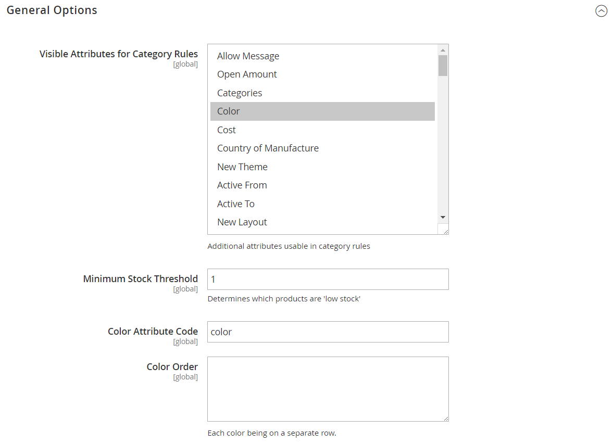

# [!UICONTROL Catalog] > [!UICONTROL Visual Merchandiser]

{{ee-feature}}

{{config}}

## [!UICONTROL General Options]

<!-- zoom -->

<!-- [General Options](https://docs.magento.com/user-guide/marketing/visual-merchandiser-configuration.html) -->

| Veld | [Toepassingsgebied](../../getting-started/websites-stores-views.md#scope-settings) | Beschrijving |
|--- |--- |--- |
| [!UICONTROL Visible Attributes for Category Rules] | Algemeen | Identificeert extra attributen die met categorieregels kunnen worden gebruikt. Gebruik meerdere selecties (Ctrl of Command) om alle kenmerken te selecteren die u beschikbaar wilt maken. |
| [!UICONTROL Minimum Stock Threshold] | Algemeen | Hiermee wordt de minimumvoorraaddrempel bepaald voor producten die op voorraadniveau worden gesorteerd. Standaardwaarde: `1` |
| [!UICONTROL Color Attribute Code] | Algemeen | Geeft het kenmerk aan dat wordt gebruikt om producten op kleur te sorteren. Standaardwaarde: `color` |
| [!UICONTROL Color Order] | Algemeen | Hiermee bepaalt u de sorteervolgorde wanneer producten op kleur worden gesorteerd. Voer elke kleur in een aparte rij in. |

{style="table-layout:auto"}
