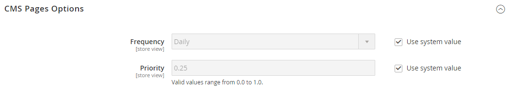

# [!UICONTROL Catalog] > [!UICONTROL XML Sitemap]

{{config}}

## [!UICONTROL Categories Options]

<!-- zoom -->

<!-- [Categories Options](https://experienceleague.adobe.com/en/docs/commerce-admin/marketing/seo/sitemap-xml) -->

| Veld | [&#x200B; Reikwijdte &#x200B;](../../getting-started/websites-stores-views.md#scope-settings) | Beschrijving |
|--- |--- |--- |
| [!UICONTROL Frequency] | Winkelweergave | Bepaalt hoe vaak sitemapcategorieën worden bijgewerkt. Opties: `Always` / `Hourly` / `Daily` / `Weekly` / `Monthly` / `Yearly` / `Never` |
| [!UICONTROL Priority] | Winkelweergave | Een waarde tussen `0.0` en `1.0` die de prioriteit van sitemap-updates voor categorieën ten opzichte van andere inhoud bepaalt. Nul (`0.0`) heeft de laagste prioriteit. |

{style="table-layout:auto"}

## [!UICONTROL Products Options]

<!-- zoom -->

<!-- [Products Options](https://experienceleague.adobe.com/en/docs/commerce-admin/marketing/seo/sitemap-xml) -->

| Veld | [&#x200B; Reikwijdte &#x200B;](../../getting-started/websites-stores-views.md#scope-settings) | Beschrijving |
|--- |--- |--- |
| [!UICONTROL Frequency] | Winkelweergave | Hiermee bepaalt u hoe vaak sitemapproducten worden bijgewerkt. Opties: `Always` / `Hourly` / `Daily` / `Weekly` / `Monthly` / `Yearly` / `Never` |
| [!UICONTROL Priority] | Winkelweergave | Een waarde tussen `0.0` en `1.0` die de prioriteit van sitemap-updates voor producten ten opzichte van andere inhoud bepaalt. Nul (`0.0`) heeft de laagste prioriteit. |
| [!UICONTROL Add Images into Sitemap] | Winkelweergave | Hiermee bepaalt u in welke mate afbeeldingen in de sitemap worden opgenomen. Opties: `None` / `Base Only` / `All` |

{style="table-layout:auto"}

## [!UICONTROL CMS Pages Options]

<!-- zoom -->

<!-- [CMS Pages Options](https://experienceleague.adobe.com/en/docs/commerce-admin/marketing/seo/sitemap-xml) -->

| Veld | [&#x200B; Reikwijdte &#x200B;](../../getting-started/websites-stores-views.md#scope-settings) | Beschrijving |
|--- |--- |--- |
| [!UICONTROL Frequency] | Winkelweergave | Hiermee bepaalt u hoe vaak CMS-sitemap-pagina&#39;s worden bijgewerkt. Opties: `Always` / `Hourly` / `Daily` / `Weekly` / `Monthly` / `Yearly` / `Never` |
| [!UICONTROL Priority] | Winkelweergave | Een waarde tussen `0.0` en `1.0` die de prioriteit bepaalt van CMS-pagina-sitemap-updates ten opzichte van andere inhoud. Nul (`0.0`) heeft de laagste prioriteit. |

{style="table-layout:auto"}

## [!UICONTROL Store Url Options]

| Veld | [&#x200B; Reikwijdte &#x200B;](../../getting-started/websites-stores-views.md#scope-settings) | Beschrijving |
|--- |--- |--- |
| [!UICONTROL Frequency] | Winkelweergave | Hiermee bepaalt u hoe vaak URL&#39;s worden bijgewerkt. Opties: `Always` / `Hourly` / `Daily` / `Weekly` / `Monthly` / `Yearly` / `Never` |
| [!UICONTROL Priority] | Winkelweergave | Een waarde tussen `0.0` en `1.0` die de prioriteit van opslag URL updates met betrekking tot andere inhoud bepaalt. Nul (`0.0`) heeft de laagste prioriteit. |

{style="table-layout:auto"}

## [!UICONTROL Generation Settings]

<!-- zoom -->

<!-- [Generation Settings](https://experienceleague.adobe.com/en/docs/commerce-admin/marketing/seo/sitemap-xml) -->

| Veld | [&#x200B; Reikwijdte &#x200B;](../../getting-started/websites-stores-views.md#scope-settings) | Beschrijving |
|--- |--- |--- |
| [!UICONTROL Enabled] | Winkelweergave | Hiermee wordt bepaald of een XML-sitemap beschikbaar is voor de winkel. Opties: `Yes` / `No` |
| [!UICONTROL Generation Method] | Winkelweergave | Hiermee wordt bepaald hoe de XML-sitemap wordt gegenereerd. `Standard` gebruikt het traditionele synchrone generatieproces en verwerkt alle gegevens in het geheugen, terwijl `Batch` voor meer flexibiliteit en schaalbaarheid een asynchrone, voor het geheugen geoptimaliseerde batchmodus gebruikt. Deze optie is beschikbaar vanaf de release 2.4.9. Opties: `Standard` / `Batch` |
| [!UICONTROL Start Time] | Winkelweergave | Geeft het uur, de minuut en de seconde aan van de dag waarop de sitemap wordt bijgewerkt. |
| [!UICONTROL Frequency] | Winkelweergave | Bepaalt hoe vaak de sitemap wordt bijgewerkt. Opties: `Daily` / `Weekly` / `Monthly` |
| [!UICONTROL Error Email Recipient] | Winkelweergave | Het e-mailadres van de persoon die een melding ontvangt als er een fout optreedt tijdens het updateproces van de sitemap. Voor veelvoudige adressen, scheidt elk met een komma. |
| [!UICONTROL Error Email Sender] | Website | Identificeert het opslagcontact dat als afzender van het foutenbericht verschijnt. Opties: `General Contact` / `Sales Representative` / `Customer Support` / `Custom Email 1` / `Custom Email 2` |
| [!UICONTROL Error Email Template] | Website | Identificeert het e-mailmalplaatje dat voor het foutenmelding wordt gebruikt. Standaardsjabloon: `Sitemap generate Warnings` |

{style="table-layout:auto"}

## [!UICONTROL Sitemap File Limits]

<!-- zoom -->

<!-- [Sitemap File Limits](https://experienceleague.adobe.com/en/docs/commerce-admin/marketing/seo/sitemap-xml) -->

| Veld | [&#x200B; Reikwijdte &#x200B;](../../getting-started/websites-stores-views.md#scope-settings) | Beschrijving |
|--- |--- |--- |
| [!UICONTROL Maximum No of URLs Per File] | Winkelweergave | Hiermee wordt het maximum aantal URL&#39;s bepaald dat in één sitemap kan worden opgenomen. |
| [!UICONTROL Maximum File Size] | Winkelweergave | Bepaalt de maximumgrootte van de gegenereerde sitemap in bytes. |

{style="table-layout:auto"}

## [!UICONTROL Search Engine Submission Settings]

<!-- zoom -->

<!-- [Search Engine Submission Settings](https://experienceleague.adobe.com/en/docs/commerce-admin/marketing/seo/sitemap-xml) -->

| Veld | [&#x200B; Reikwijdte &#x200B;](../../getting-started/websites-stores-views.md#scope-settings) | Beschrijving |
|--- |--- |--- |
| [!UICONTROL Enable Submission to Robots.txt] | Winkelweergave | Hiermee kunt u instructies voor het bestand robots.txt indienen. Opties: `Yes` / `No` |

{style="table-layout:auto"}
