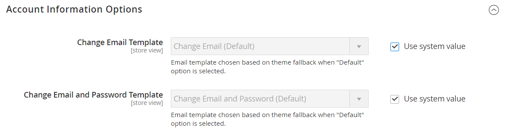

# [!UICONTROL Customers]  > [!UICONTROL Customer Configuration]

{{config}}

## [!UICONTROL Account Sharing Options]

<!-- zoom -->

<!-- [Account Sharing Options](https://docs.magento.com/user-guide/customers/account-scope.html) -->

| Veld | [Toepassingsgebied](../../getting-started/websites-stores-views.md#scope-settings) | Beschrijving |
|--- |--- |--- |
| [!UICONTROL Share Customer Accounts] | Algemeen | Bepaalt het werkingsgebied van klantenrekeningen in de opslaghiërarchie. Opties:  **`Global`**- De gegevens van de klantenrekening worden met elke website gedeeld en in de installatie van de Handel opgeslagen. **`Per Website`** - De accountgegevens van de klant zijn beperkt tot de website waarop het account is gemaakt. |

{style="table-layout:auto"}

## [!UICONTROL Online Customers Options]

<!-- zoom -->

<!-- [Online Customers Options](https://docs.magento.com/user-guide/customers/now-online.html) -->

| Veld | [Toepassingsgebied](../../getting-started/websites-stores-views.md#scope-settings) | Beschrijving |
|--- |--- |--- |
| [!UICONTROL Online Minutes Interval] | Algemeen | Hiermee bepaalt u de tijdsduur dat de online activiteiten van een klant toegankelijk zijn via de beheerder. Laat het standaardinterval van 15 minuten leeg. |
| [!UICONTROL Customer Data Lifetime] | Algemeen | Hiermee bepaalt u het aantal minuten voordat niet-opgeslagen gegevens die de klant heeft ingevoerd, verlopen. Niet-opgeslagen gegevens verlopen standaard na 60 minuten. |

{style="table-layout:auto"}

## [!UICONTROL Create New Account Options]

{{beta-updates}}

<!-- zoom -->

<!-- zoom -->

<!-- [Create New Account Options (VAT Fields)](https://docs.magento.com/user-guide/customers/customer-account-configuration.html) -->

| Veld | [Toepassingsgebied](../../getting-started/websites-stores-views.md#scope-settings) | Beschrijving |
|--- |--- |--- |
| [!UICONTROL Enable Automatic Assignment to Customer Group] | Winkelweergave | Hiermee bepaalt u of klanten automatisch worden toegewezen aan de standaardklantengroep. Als je het BTW-nummer in de winkel wilt weergeven, stel je BTW-nummer tonen in de winkel in door `Yes`. Opties:  **`Yes`**- Het systeem valideert niet automatisch BTW-ID&#39;s van klanten en wijzigt ook geen klantgroepen. **`No`** - Het systeemgedrag is zoals gewoonlijk en de standaardklantengroep kan worden ingesteld in het veld Standaardgroep. |
| [!UICONTROL Default Group] | Winkelweergave | Identificeert de aanvankelijke klantengroep die wordt toegewezen wanneer een rekening wordt gecreeerd. |
| [!UICONTROL Default Value for Disable Automatic Group Changes Based on VAT ID] | Algemeen | (Alleen beschikbaar als het huidige configuratiebereik is ingesteld op `Default Group`.) Geef op of de automatische wijziging van de klantengroep op basis van het BTW-identificatienummer standaard is ingeschakeld of uitgeschakeld. De instelling kan op productniveau worden overschreven. De instelling beïnvloedt het systeemgedrag in de volgende situaties:   - Het BTW-identificatienummer van het standaardadres van de klant of het volledige standaardadres wordt gewijzigd.   - De wijziging van de klantengroep werd geëmuleerd tijdens het afrekenen voor een geregistreerde klant die geen eerder opgeslagen adres had of voor een klant die zich tijdens het afrekenen registreerde.  Als de automatische groepsverandering wordt toegelaten, dan in het eerste geval verandert de klantengroep automatisch, en in het tweede geval wordt de tijdelijk geëmuleerde klantengroep toegewezen aan klant. Als de automatische groepsverandering gehandicapt is, verandert de klantengroep die wordt toegewezen nooit, tenzij een beheerder het manueel verandert. |
| [!UICONTROL Show VAT Number on Storefront] | Website | Hiermee bepaalt u of het BTW-nummer zichtbaar is voor klanten in de winkel. Opties: `Yes` / `No`   Heeft alleen invloed op reguliere niet-B2B-klantenaccounts. De rekeningen van het bedrijf hebben hun eigen afzonderlijke gebied van het BTW Aantal. |
| [!UICONTROL Default Email Domain] | Winkelweergave | Identificeert het standaard e-maildomein voor de opslag. Bijvoorbeeld: `mystore.com` |
| [!UICONTROL Default Welcome Email] | Winkelweergave | Identificeert de e-mailsjabloon die voor de standaard wordt gebruikt _Welkom_ e-mail. |
| [!UICONTROL Default Welcome Email Without Password] | Winkelweergave | Een afwisselend die e-mailmalplaatje van het Onthaal dat voor nieuwe klantenrekeningen wordt gebruikt door de Beheerder worden gecreeerd die nog geen toegewezen wachtwoord hebben. |
| [!UICONTROL Email Sender] | Winkelweergave | Hiermee wordt de contactpersoon van de winkel aangegeven die wordt weergegeven als de afzender van het welkomstbericht. |
| [!UICONTROL Require Emails Confirmation] | Website | Hiermee wordt bepaald of een verzoek om een account te maken bevestiging van de klant vereist. Opties: `Yes` / `No` |
| [!UICONTROL Confirmation Link Email] | Winkelweergave | Hiermee wordt de e-mailsjabloon aangegeven die wordt gebruikt voor de bevestigingsmail. Standaardsjabloon: `New account confirmation key` |
| [!UICONTROL Welcome Email] | Winkelweergave | Identificeert het e-mailmalplaatje dat voor het Welkome bericht wordt gebruikt dat wordt verzonden nadat de rekening wordt bevestigd. |
| [!UICONTROL Generate Human-Friendly Customer ID] | Algemeen | Hiermee bepaalt u of het veld waarin het BTW-identificatienummer wordt ingevoerd en opgeslagen, zichtbaar is vanuit de winkel. Opties: `Yes` / `No` |

{style="table-layout:auto"}

## [!UICONTROL Password Options]

<!-- zoom -->

<!-- [Password Options](https://docs.magento.com/user-guide/customers/password-options.html) -->

| Veld | [Toepassingsgebied](../../getting-started/websites-stores-views.md#scope-settings) | Beschrijving |
|--- |--- |--- |
| [!UICONTROL Password Reset Protection Type] | Winkelweergave | Bepaalt de methode die wordt gebruikt om een wachtwoord van de klantenrekening terug te stellen. Opties:  **`By IP and Email`**- Het wachtwoord kan online opnieuw worden ingesteld nadat een reactie is ontvangen van een herstelmelding die is verzonden naar het e-mailadres dat is gekoppeld aan de beheerdersaccount. **`By IP`** - U kunt het wachtwoord online opnieuw instellen.  **`By Email`**- U kunt het wachtwoord opnieuw instellen door te reageren op een e-mailmelding die wordt verzonden naar het e-mailadres dat is gekoppeld aan de beheerdersaccount. **`None`** - Het wachtwoord kan alleen door de beheerder van de opslagruimte opnieuw worden ingesteld. |
| [!UICONTROL Max Number of Password Reset Requests] | Winkelweergave | Beperkt het aantal verzoeken om het opnieuw instellen van het wachtwoord per uur. Voer nul (0) in voor onbeperkte verzoeken. |
| [!UICONTROL Min Time Between Password Reset Requests] | Winkelweergave | Hiermee bepaalt u het aantal minuten tussen aanvragen voor het opnieuw instellen van wachtwoorden. Voor geen vertraging tussen verzoeken, ga nul (0) in. |
| [!UICONTROL Forgot Email Template] | Winkelweergave | Identificeert het e-mailmalplaatje dat wordt gebruikt wanneer de klanten hun wachtwoorden vergeten. Standaardsjabloon: `Forgot Password` |
| [!UICONTROL Remind Email Template] | Winkelweergave | Identificeert het e-mailmalplaatje dat wordt gebruikt wanneer de klanten een wachtwoordherinnering, of wenk ontvangen. Standaardsjabloon: `Remind Password` |
| [!UICONTROL Reset Password Template] | Winkelweergave | Bepaalt het e-mailmalplaatje dat wordt gebruikt wanneer de klanten hun wachtwoorden terugstellen. |
| [!UICONTROL Password Template Email Sender] | Winkelweergave | Hiermee bepaalt u de contactpersoon van de winkel die wordt weergegeven als de afzender van aan een wachtwoord gerelateerde e-mails. |
| [!UICONTROL Recovery Link Expiration Period (hours)] | Algemeen | Hiermee geeft u het aantal uren op voordat een koppeling voor wachtwoordherstel verloopt. |
| [!UICONTROL Enable Autocomplete on login/forgot password forms] | Website | Hiermee wordt bepaald of Automatisch aanvullen is ingeschakeld op formulieren met aanmeldingswachtwoord/wachtwoord vergeten. Opties: `Yes` / `No` |
| [!UICONTROL Number of Required Character Classes] | Algemeen | Hiermee bepaalt u het aantal verschillende tekenklassen (kleine letters, hoofdletters, numerieke en speciale tekens) dat in een wachtwoord moet worden opgenomen. |
| [!UICONTROL Maximum Login Failures to Lockout Account] | Algemeen | Bepaalt het aantal mislukte aanmeldingspogingen totdat de klantenaccount is vergrendeld. Voer voor onbeperkte pogingen nul in (`0`). |
| [!UICONTROL Minimum Password Length] | Algemeen | Hiermee bepaalt u het minimale aantal tekens dat een wachtwoord mag bevatten. Het getal moet groter zijn dan nul (`0`). |
| [!UICONTROL Lockout Time (minutes)] | Algemeen | Hiermee bepaalt u het aantal minuten dat een klantenaccount is vergrendeld nadat te veel mislukte aanmeldingspogingen zijn uitgevoerd. |

{style="table-layout:auto"}

## [!UICONTROL Account Information Options]

<!-- zoom -->

| Veld | [Toepassingsgebied](../../getting-started/websites-stores-views.md#scope-settings) | Beschrijving |
|--- |--- |--- |
| [!UICONTROL Change Email Template] | Winkelweergave | Identificeert het standaard e-mailmalplaatje dat wordt gebruikt wanneer een klant hun e-mailadres verandert. |
| [!UICONTROL Change Email and Password Template] | Winkelweergave | Identificeert het standaard e-mailmalplaatje dat wordt gebruikt wanneer een klant hun e-mailadres en wachtwoord verandert. |

{style="table-layout:auto"}

## [!UICONTROL Name and Address Options]

### Magento Open Source-opties

{{ce-feature}}

<!-- zoom -->

<!-- [Name and Address Options - Open Source](https://docs.magento.com/user-guide/customers/name-address-options.html) -->

| Veld | [Toepassingsgebied](../../getting-started/websites-stores-views.md#scope-settings) | Beschrijving |
|--- |--- |--- |
| [!UICONTROL Number of Lines in a Street Address] | Website | Bepaalt het aantal regels in het adres van de straat. Het adres van de straat bestaat uit `1` tot `4` lijnen. Als het veld leeg is, is het standaardadres van de straat drie (`3`) worden gebruikt. |
| [!UICONTROL Show Prefix] | Website | Hiermee wordt bepaald of de naam van de klant een voorvoegsel aan het begin bevat, zoals Opties voor Mr en Mw.: `No` / `Optional` / `Required` |
| [!UICONTROL Prefix Dropdown Options] | Website | Definieert de lijst met voorvoegselopties. Scheid waarden met een puntkomma. Plaats een puntkomma voor de eerste waarde om een lege waarde boven aan de lijst weer te geven. |
| [!UICONTROL Show Middle Name (initial)] | Website | Hiermee bepaalt u of de middelste startpagina wordt opgenomen als onderdeel van de naam van de klant. Indien gebruikt is de middelste beginwaarde een optioneel veld. Opties: `Yes` / `No` |
| [!UICONTROL Show Suffix] | Website | Hiermee wordt bepaald of de naam van de klant een achtervoegsel aan het einde bevat, zoals Jr., Sr. en III. Opties: `No` / `Optional` / `Required` |
| [!UICONTROL Suffix Dropdown Options] | Website | Hiermee definieert u de lijst met achtervoegselopties. Scheid waarden met een puntkomma. Plaats een puntkomma voor de eerste waarde om een lege waarde boven aan de lijst weer te geven. |
| [!UICONTROL Show Date of Birth] | Website | Hiermee bepaalt u of de geboortedatum van de klant is opgenomen in het naam- en adresformulier. Opties: `No` / `Optional` / `Required`    **_Belangrijk:_**In overeenstemming met de huidige beste praktijken op het gebied van beveiliging en privacy, dient u zich bewust te zijn van mogelijke juridische en veiligheidsrisico&#39;s die verbonden zijn aan de opslag van de volledige geboortedatum van de klant (maand, dag, jaar) met andere persoonlijke identificatoren. U wordt aangeraden de opslag van de volledige geboortedatum van de klant te beperken en u aan te raden het geboortejaar van de klant als alternatief te gebruiken. |
| [!UICONTROL Show Tax/VAT Number] | Website | Hiermee wordt bepaald of de belasting [BTW-nummer](../../stores-purchase/vat.md) is opgenomen in het naam- en adresformulier. Opties: `No` / `Optional` / `Required` |
| [!UICONTROL Show Gender] | Website | Hiermee wordt bepaald of het geslacht is opgenomen in het naam- en adresformulier. Opties: `No` / `Optional` / `Required` |
| [!UICONTROL Show Telephone] | Website | Hiermee bepaalt u of het telefoonnummer van de klant is opgenomen in het naam- en adresformulier. Opties: `No` / `Optional` / `Required` |
| [!UICONTROL Show Company] | Website | Hiermee bepaalt u of het bedrijf van de klant is opgenomen in het naam- en adresformulier. Opties: `No` / `Optional` / `Required` |
| [!UICONTROL Show Fax] | Website | Hiermee bepaalt u of het faxnummer van de klant in het naam- en adresformulier is opgenomen. Opties: `No` / `Optional` / `Required` |

{style="table-layout:auto"}

### Adobe Commerce-opties

{{ee-feature}}

<!-- zoom -->

<!-- [Name and Address Options - Commerce](https://docs.magento.com/user-guide/customers/name-address-options.html) -->

| Veld | [Toepassingsgebied](../../getting-started/websites-stores-views.md#scope-settings) | Beschrijving |
|--- |--- |--- |
| [!UICONTROL Prefix Dropdown Options] | Website | Definieert de lijst met voorvoegselopties. Scheid waarden met een puntkomma. Plaats een puntkomma voor de eerste waarde om een lege waarde boven aan de lijst weer te geven. |
| [!UICONTROL Suffix Dropdown Options] | Website | Hiermee definieert u de lijst met achtervoegselopties. Scheid waarden met een puntkomma. Plaats een puntkomma voor de eerste waarde om een lege waarde boven aan de lijst weer te geven. |
| [!UICONTROL Show Telephone] | Website | Hiermee bepaalt u of het telefoonnummer van de klant is opgenomen in het naam- en adresformulier. Opties: `No` / `Optional` / `Required` |
| [!UICONTROL Show Company] | Website | Hiermee bepaalt u of het bedrijf van de klant is opgenomen in het naam- en adresformulier. Opties: `No` / `Optional` / `Required` |
| [!UICONTROL Show Fax] | Website | Hiermee bepaalt u of het faxnummer van de klant in het naam- en adresformulier is opgenomen. Opties: `No` / `Optional` / `Required` |

{style="table-layout:auto"}

## [!UICONTROL Store Credit Options]

{{ee-feature}}

<!-- zoom -->

<!-- [Store Credit Options](https://docs.magento.com/user-guide/customers/credit-configure.html) -->

| Veld | [Toepassingsgebied](../../getting-started/websites-stores-views.md#scope-settings) | Beschrijving |
|--- |--- |--- |
| [!UICONTROL Enable Store Credit Functionality] | Algemeen | Hiermee wordt bepaald of Creditering van winkel is ingeschakeld. Als u deze optie uitschakelt, wordt Winkelkrediet verwijderd van de klantenaccounts en van de pagina Beheerders van klanten. Opties: `Yes` / `No`. |
| [!UICONTROL Show Store Credit History to Customers] | Website | Hiermee bepaalt u of de balansgeschiedenis zichtbaar is in de klantenaccounts. Opties: `Yes` / `No`. |
| [!UICONTROL Refund Store Credit Automatically] | Algemeen | Hiermee bepaalt u of de restitutie automatisch wordt betaald. Opties: `Yes` / `No` |
| [!UICONTROL Store Credit Update Email Sender] | Winkelweergave | Hiermee bepaalt u de opslagidentiteit die wordt weergegeven als de afzender van bijgewerkte crediteringsberichten die naar klanten worden verzonden. |
| [!UICONTROL Store Credit Update Email Template] | Winkelweergave | Bepaalt de e-mailtemplate die wordt gebruikt voor creditupdates. |

{style="table-layout:auto"}

## [!UICONTROL Login Options]

<!-- zoom -->

<!-- [Login Options](https://docs.magento.com/user-guide/customers/login-landing-page.html) -->

| Veld | [Toepassingsgebied](../../getting-started/websites-stores-views.md#scope-settings) | Beschrijving |
|--- |--- |--- |
| [!UICONTROL Redirect Customer to Account Dashboard after Logging in] | Website | Bepaalt wat gebeurt nadat de klanten zich aan hun rekeningen aanmelden. Als u klanten wilt omleiden naar hun accountdashboard, selecteert u `Yes`. Opties:  **`Yes`**- Het accountdashboard wordt weergegeven wanneer klanten zich aanmelden bij hun accounts. **`No`** - Klanten kunnen blijven winkelen nadat ze zich hebben aangemeld bij hun accounts. |

{style="table-layout:auto"}

## [!UICONTROL Address Templates]

<!-- zoom -->

<!-- [Address Templates](https://docs.magento.com/user-guide/customers/address-templates.html) -->

| Sjabloon | [Toepassingsgebied](../../getting-started/websites-stores-views.md#scope-settings) | Beschrijving |
|--- |--- |--- |
| [!UICONTROL Text] | Winkelweergave | De sjabloon wordt gebruikt voor alle adressen die worden afgedrukt. |
| [!UICONTROL Text One Line] | Winkelweergave | Deze sjabloon definieert de volgorde van adresentiteiten in de adresboeklijst van het winkelwagentje van de klant. Voortgang tijdens afrekenen. |
| [!UICONTROL HTML] | Winkelweergave | Deze sjabloon definieert de volgorde van adresvelden onder de _Adressen van klant_ in het deelvenster Beheer ([!UICONTROL Customers] > [!UICONTROL Manage Customers]). Dit geldt ook voor degenen die _Nieuw adres toevoegen_ pagina wanneer een klant een factuuradres of verzendadres op zijn of haar accountpagina maakt. |
| [!UICONTROL PDF] | Winkelweergave | De sjabloon definieert de weergave van facturerings- en verzendadressen in de gedrukte facturen, verzendingen en creditnota&#39;s. |

{style="table-layout:auto"}

## [!UICONTROL Customer Segments]

{{ee-feature}}

<!-- zoom -->

<!-- [Customer Segments](https://docs.magento.com/user-guide/marketing/customer-segments.html) -->

| Sjabloon | [Toepassingsgebied](../../getting-started/websites-stores-views.md#scope-settings) | Beschrijving |
|--- |--- |--- |
| [!UICONTROL Enable Customer Segment Functionality] | Algemeen | Bepaalt of de klantensegmenten kunnen worden gebruikt om gerichte bevorderingen tot stand te brengen. Opties: `Yes` / `No` |
| [!UICONTROL Real-time Check if Customer is Matched by Segment] | Algemeen | Hiermee bepaalt u of klantsegmenten in real-time worden gevalideerd. Opties:  **[!UICONTROL Yes]**- Klantsegmenten worden in real-time gevalideerd (standaardwaarde). **[!UICONTROL No]** - Klantsegmenten worden gevalideerd door één SQL-query met gecombineerde voorwaarde. Dit verbetert prestaties van segmentbevestiging als er vele klantensegmenten in het systeem zijn. De validatie werkt echter niet met een gesplitste database of wanneer er geen geregistreerde klanten zijn. |

{style="table-layout:auto"}

## [!UICONTROL CAPTCHA]

<!-- zoom -->

<!-- [CAPTCHA](https://docs.magento.com/user-guide/stores/security-captcha.html) -->

| Veld | [Toepassingsgebied](../../getting-started/websites-stores-views.md#scope-settings) | Beschrijving |
|--- |--- |--- |
| [!UICONTROL Enable CAPTCHA on Storefront] | Website | Laat CAPTCHA in de winkels toe verbonden aan de website van de Handel. Opties: `Yes` / `No` |
| [!UICONTROL Font] | Website | Bepaalt het lettertype dat wordt gebruikt om de CAPTCHA weer te geven. Om uw eigen doopvont toe te voegen, zet het doopvontdossier in de zelfde folder zoals uw installatie van de Handel en voeg de verklaring aan toe `config.xml` bestand bij `app/code/Magento/Captcha/etc`. |
| [!UICONTROL Forms] | Website | Hiermee bepaalt u de formulieren waarin CAPTCHA wordt gebruikt. Opties:  `Applying Coupon Code`  `Checkout/Placing Order` `Create user`  `Login`  `Forgot password`  `Contact Us`  `Change password`  `Share Wishlist Form`  `Send to Friend Form`  `Payflow Pro` (zie [beveiligingspatroon](https://experienceleague.adobe.com/docs/commerce-knowledge-base/kb/troubleshooting/payments/paypal-payflow-pro-active-carding-activity.html))  `Add Gift Card Code`    `Create company`     _**Opmerking:**_ De formulieren Gebruiker maken, Wachtwoord vergeten en Payflow Pro worden altijd ingeschakeld wanneer deze zijn geselecteerd. |
| [!UICONTROL Displaying Mode] | Website | Hiermee bepaalt u wanneer de CAPTCHA wordt weergegeven. Opties:  **`Always`**- CAPTCHA is altijd vereist voor aanmelden. **`After number of attempts to login`** - Deze optie is alleen van toepassing op het aanmeldingsformulier voor de beheerder. Als deze optie is geselecteerd, wordt _[!UICONTROL Number of Unsuccessful Attempts to Login]_wordt weergegeven. Voer het aantal aanmeldpogingen in dat u wilt toestaan. Een waarde van `0` (nul) is vergelijkbaar met instellen [!UICONTROL Displaying Mode] tot `Always`. _**Opmerking:**_Om het aantal mislukte aanmeldingspogingen bij te houden, wordt elke poging tot aanmelding onder één e-mailadres en van één IP-adres geteld. Het maximumaantal login pogingen die van het zelfde IP-adres worden toegestaan is 1.000. Deze beperking is alleen van toepassing wanneer CAPTCHA is ingeschakeld. |
| [!UICONTROL Number of Unsuccessful Attempts to Login] | Website | Hier geeft u op hoe vaak een klant zich kan aanmelden voordat de account is vergrendeld. |
| [!UICONTROL CAPTCHA Timeout (minutes)] | Website | Bepaalt de levensduur van de huidige CAPTCHA. Wanneer de CAPTCHA verloopt, moet de gebruiker de pagina opnieuw laden. |
| [!UICONTROL Number of Symbols] | Website | Hiermee bepaalt u het aantal symbolen dat in de CAPTCHA wordt weergegeven, met een maximum van 8. U kunt ook een bereik opgeven, bijvoorbeeld 5-8. |
| [!UICONTROL Symbols Used in CAPTCHA] | Website | Hiermee bepaalt u de letters (a-z en A-Z) en de getallen (0-9) die in de CAPTCHA worden weergegeven. Symbolen die moeilijk te onderscheiden zijn van andere symbolen, zoals `i`, `l`, of `1`, zijn niet opgenomen in de standaardset met CAPTCHA-symbolen. |
| [!UICONTROL Case Sensitive] | Website | Bepaalt of CAPTCHA-tekens hoofdlettergevoelig zijn. Opties: `Yes` / `No` |

{style="table-layout:auto"}
