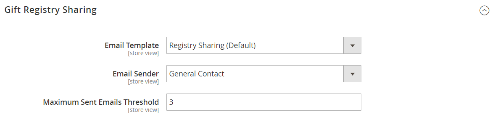

# [!UICONTROL Customers] > [!UICONTROL Gift Registry]

{{ee-feature}}

{{config}}

Voor gedetailleerde informatie over het gebruiken van deze montages om giftenregisters voor uw opslagklanten toe te laten, zie [&#x200B; schenkingsregisters &#x200B;](../../merchandising-promotions/gift-registry-configure.md) vormen. Voor informatie over het omvatten van het onderzoek van de cadeauregistratie op de storefront, zie [&#x200B; de onderzoek van de cadeauregistratie &#x200B;](../../merchandising-promotions/gift-registry-search.md) toevoegen.

## [!UICONTROL General Options]

<!-- zoom -->

<!-- [General Options](https://experienceleague.adobe.com/nl/docs/commerce-admin/marketing/merchandising/gift-registry/gift-registry-configure) -->

| Veld | [&#x200B; Reikwijdte &#x200B;](../../getting-started/websites-stores-views.md#scope-settings) | Beschrijving |
|--- |--- |--- |
| [!UICONTROL Enable Gift Registry] | Winkelweergave | Hiermee wordt bepaald of cadeauregisters beschikbaar zijn. Opties:  **`Yes`**- Schakelt cadeauregisters in voor de geselecteerde winkelweergave. Het tabblad Cadeauregister wordt weergegeven in het dashboard van de account van geregistreerde klanten. **`No`** - Cadeauregisters zijn niet beschikbaar voor de winkelweergave. |
| [!UICONTROL Maximum Registrants] | Winkelweergave | Hiermee stelt u het aantal personen in dat een klant kan toevoegen aan een cadeauregister. De klant deelt het cadeauregister met elke registrant. In de storefront, _voeg Registrant_ knoop toe is beschikbaar aan klanten tot het maximumaantal wordt bereikt. |

{style="table-layout:auto"}

## [!UICONTROL Owner Notification]

<!-- zoom -->

<!-- [Owner Notification](https://experienceleague.adobe.com/nl/docs/commerce-admin/marketing/merchandising/gift-registry/gift-registry-configure) -->

| Veld | [&#x200B; Reikwijdte &#x200B;](../../getting-started/websites-stores-views.md#scope-settings) | Beschrijving |
|--- |--- |--- |
| [!UICONTROL Email Template] | Winkelweergave | Bepaalt het malplaatje voor de e-mail van het Bericht van de Eigenaar wordt gebruikt die wordt verzonden wanneer een geschenkregister wordt gecreeerd. Standaardsjabloon: bericht eigenaar van cadeauregister |
| [!UICONTROL Email Sender] | Winkelweergave | Identificeert het [&#x200B; opslagcontact &#x200B;](../../getting-started/store-details.md#store-email-addresses) dat als afzender van de e-mail van het Bericht van de Eigenaar van de Registratie van het Cadeautje verschijnt. Standaardwaarde: `General Contact` |

{style="table-layout:auto"}

## Cadeauregister delen

<!-- zoom -->

<!-- Gift Registry Sharing](https://experienceleague.adobe.com/nl/docs/commerce-admin/marketing/merchandising/gift-registry/gift-registry-configure) -->

| Veld | [&#x200B; Reikwijdte &#x200B;](../../getting-started/websites-stores-views.md#scope-settings) | Beschrijving |
|--- |--- |--- |
| [!UICONTROL Email Template] | Winkelweergave | Bepaalt het malplaatje voor het Gedeelde e-mail van het Registratie van het Cadeautje wordt gebruikt dat wordt verzonden wanneer een geschenkregister wordt gecreeerd. Wanneer de eigenaar _de Registratie van het Cadeautje van het Aandeel_ klikt, wordt e-mail verzonden naar elke ontvanger. Standaardsjabloon: `Gift Registry Sharing` |
| [!UICONTROL Email Sender] | Winkelweergave | Identificeert het [&#x200B; opslagcontact &#x200B;](../../getting-started/store-details.md#store-email-addresses) dat als afzender van het Gedeelde e-mail van de Registratie van het Cadeautje verschijnt. Standaardwaarde: `General Contact` |
| [!UICONTROL Maximum Sent Emails Threshold] | Winkelweergave | Het maximumaantal berichten dat via e-mailberichten kan worden verzonden bij het delen van een cadeauregister. |

{style="table-layout:auto"}

## [!UICONTROL Gift Registry Update]

<!-- zoom -->

<!-- [Gift Registry Update](https://experienceleague.adobe.com/nl/docs/commerce-admin/marketing/merchandising/gift-registry/gift-registry-configure) -->

| Veld | [&#x200B; Reikwijdte &#x200B;](../../getting-started/websites-stores-views.md#scope-settings) | Beschrijving |
|--- |--- |--- |
| [!UICONTROL Email Template] | Winkelweergave | Bepaalt het malplaatje voor de e-mail van de Update van de Registratie van het Cadeautje wordt gebruikt die wordt verzonden naar de eigenaar van het cadeauregister wanneer een aankoop van het cadeauregister wordt gemaakt dat. De update bevat informatie over het aangeschafte item en het aangeschafte aantal, maar bevat niet de naam van de persoon die de order heeft geplaatst. Standaardsjabloon: `Gift Registry Update` |
| [!UICONTROL Email Sender] | Winkelweergave | Identificeert het [&#x200B; opslagcontact &#x200B;](../../getting-started/store-details.md#store-email-addresses) dat als afzender van e-mail van de Update van de Registratie van het Cadeautje verschijnt. Standaardwaarde: `General Contact` |

{style="table-layout:auto"}
