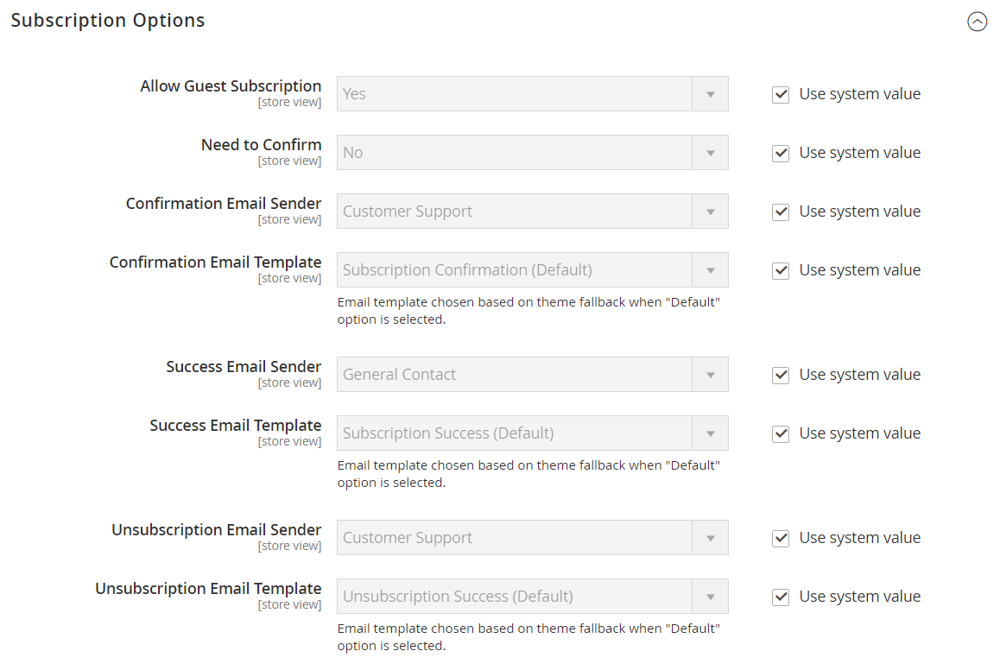

# [!UICONTROL Customers] > [!UICONTROL Newsletter]

{{config}}

>[!NOTE]
>
>De nieuwsbrief maakt deel uit van marketinginstrumenten waarmee nieuws, kortingen en andere marketinge-mails naar klanten kunnen worden verzonden. Geregistreerde klanten kunnen hun abonnement beheren vanuit hun [accountdashboard](../../customers/account-dashboard-my-account.md).

## [!UICONTROL General Options]

<!-- zoom -->

| Veld | [Toepassingsgebied](../../getting-started/websites-stores-views.md#scope-settings) | Beschrijving |
|--- |--- |--- |
| [!UICONTROL Enabled] | Winkelweergave | Bepaalt als nieuwsbrieven voor het werkingsgebied van de archiefmening worden toegelaten. Opties: `Yes` / `No` |

{style="table-layout:auto"}

## [!UICONTROL Subscription Options]

<!-- zoom -->

<!-- [Subscription Options](https://docs.magento.com/user-guide/marketing/newsletter-configuration.html) -->

| Veld | [Toepassingsgebied](../../getting-started/websites-stores-views.md#scope-settings) | Beschrijving |
|--- |--- |--- |
| [!UICONTROL Allow Guest Subscription] | Winkelweergave | Hiermee bepaalt u of niet-geregistreerde gasten zich op een nieuwsbrief kunnen abonneren. Opties: `Yes` / `No` |
| [!UICONTROL Need to Confirm] | Winkelweergave | Hiermee bepaalt u of abonnementsaanvragen moeten worden bevestigd. Deze dubbele-opt-in methode is een bevestigingsmaatregel die mensen verhindert te worden ingetekend zonder hun toestemming. Opties: `Yes` / `No` |
| [!UICONTROL Confirmation Email Sender] | Winkelweergave | Identificeert de opslagcontactpersoon die wordt weergegeven als de afzender van een e-mail die is verzonden ter bevestiging van een abonnementsaanvraag. |
| [!UICONTROL Confirmation Email Template] | Winkelweergave | Determines the email template used for the notification sent to confirm a request to subscribe to a nieuwsbrief. Standaardsjabloon: `Newsletter subscription confirmation` |
| E-mailafzender succesvol | Winkelweergave | Hiermee wordt het contactpersoon van de winkel aangegeven die wordt weergegeven als de afzender van een e-mailbericht dat is verzonden naar diegenen die zich met succes hebben geabonneerd op een nieuwsbrief. |
| [!UICONTROL Success Email Template] | Winkelweergave | Bepaalt het e-mailmalplaatje wordt gebruikt voor het bericht dat wordt verzonden naar degenen die met succes aan een nieuwsbrief intekenen. Standaardsjabloon: `Newsletter subscription success` |
| [!UICONTROL Unsubscription Email Sender] | Winkelweergave | Hiermee wordt het contactpersoon van de winkel aangegeven die wordt weergegeven als de afzender van een e-mail die wordt verzonden naar diegenen die vragen hun abonnement op de nieuwsbrief te beëindigen. |
| [!UICONTROL Unsubscription Email Template] | Winkelweergave | Bepaalt de e-mailsjabloon die wordt gebruikt voor het bericht dat wordt verzonden naar diegenen die een verzoek indienen om hun nieuwsbrief te beëindigen. Standaardsjabloon: `Newsletter unsubscription success` |

{style="table-layout:auto"}
