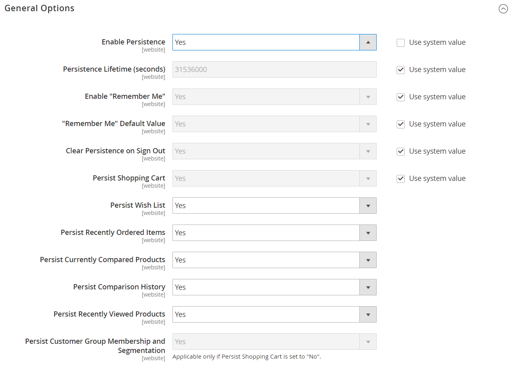

# [!UICONTROL Customers] > [!UICONTROL Persistent Shopping Cart]

{{config}}

>[!NOTE]
>
>A [Blijvende winkelwagentje](../../stores-purchase/cart-persistent.md) toestaat behoud van niet-gekochte voorwerpen die in het karretje worden verlaten en bewaart hen voor een periode die binnen wordt gevormd _Levensduur van persistentie_. Cookies moeten in de browser van de klant worden toegestaan om een hardnekkig winkelwagentje te gebruiken.

## [!UICONTROL General Options]

<!-- zoom -->

<!-- [General Options](https://docs.magento.com/user-guide/sales/cart-persistent-configuration.html) -->

| Veld | [Toepassingsgebied](../../getting-started/websites-stores-views.md#scope-settings) | Beschrijving |
|--- |--- |--- |
| [!UICONTROL Enable Persistence] | Website | Hiermee wordt bepaald of de persistentie is ingeschakeld. |
| [!UICONTROL Persistence Lifetime (seconds)] | Website | Definieert de levensduur van de permanente cookie in seconden. De maximaal toegestane waarde is 3153600000 seconden (100 jaar). |
| [!UICONTROL Enable "Remember Me"] | Website | Hiermee wordt gedefinieerd of de _Mijn gegevens onthouden_ Schakel het selectievakje in op de aanmeldings- en registratiepagina&#39;s van de winkel. Opties:  **`Yes`**- Geeft de _Mijn gegevens onthouden_ selectievakje. **`No`** - Geeft de _Mijn gegevens onthouden_ en de permanente cookie wordt alleen gebruikt voor klanten die deze al hebben. |
| [!UICONTROL "Remember Me" Default Value] | Website | Definieert de standaardstatus voor de _Mijn gegevens onthouden_ selectievakje. |
| [!UICONTROL Clear Persistence on Log Out] | Website | Bepaalt of het blijvende koekje wordt geschrapt wanneer een winkelklant zich uitlogt. Ongeacht hoe dit wordt gevormd, als een klant niet logout, maar het zittingskoekje verloopt, wordt het blijvende koekje nog gebruikt. |
| [!UICONTROL Persist Shopping Cart] | Website | Hiermee bepaalt u of het gebruik van de permanente cookie toegang geeft tot de gegevens van het winkelwagentje van de correspondentaccount. Opties:  **`Yes`**- De inhoud van het winkelwagentje wordt opgeslagen nadat de sessie is beëindigd. **`No`** - De inhoud van het winkelwagentje wordt niet opgeslagen nadat de sessie is beëindigd. |
| [!UICONTROL Persist Wish List] | Website |  (Alleen Adobe Commerce) Hiermee wordt bepaald of de status van de wensenlijsten van de klant behouden blijft wanneer de sessie wordt beëindigd. Opties:  **`Yes`**- De inhoud van de wensenlijst wordt opgeslagen wanneer de sessie wordt beëindigd. **`No`** - De lijst met wensen wordt niet opgeslagen wanneer de sessie wordt beëindigd. |
| [!UICONTROL Persist Recently Ordered Items] | Website |  (Alleen Adobe Commerce) Hiermee wordt bepaald of de status van onlangs geordende items behouden blijft wanneer de sessie wordt beëindigd. Opties:  **`Yes`**- De status van onlangs bestelde items wordt opgeslagen wanneer de sessie wordt beëindigd. **`No`** - De status van onlangs bestelde items wordt niet opgeslagen wanneer de sessie wordt beëindigd. |
| [!UICONTROL Persist Currently Compared Products] | Website |  (Alleen Adobe Commerce) Hiermee wordt bepaald of de status van de momenteel vergeleken producten behouden blijft wanneer de sessie wordt beëindigd. Opties:  **`Yes`**- De status van de momenteel vergeleken producten wordt opgeslagen wanneer de sessie wordt beëindigd. **`No`** - De status van de momenteel vergeleken producten wordt niet opgeslagen wanneer de sessie wordt beëindigd. |
| [!UICONTROL Persist Comparison History] | Website |  (Alleen Adobe Commerce) Hiermee wordt bepaald of de vergelijkingsgeschiedenis wordt bewaard wanneer de sessie wordt beëindigd. Opties:  **`Yes`**- De staat van de vergelijkingsgeschiedenis wordt bewaard wanneer de zitting beëindigt. **`No`** - De staat van de vergelijkingsgeschiedenis wordt niet bewaard wanneer de zitting beëindigt. |
| [!UICONTROL Persist Recently Viewed Products] | Website |  (Alleen Adobe Commerce) Hiermee bepaalt u of de status van onlangs weergegeven producten behouden blijft wanneer de sessie wordt beëindigd. Opties:  **`Yes`**- De status van onlangs bekeken producten wordt opgeslagen wanneer de sessie wordt beëindigd. **`No`** - De status van onlangs bekeken producten wordt niet opgeslagen wanneer de sessie wordt beëindigd. |
| [!UICONTROL Persist Customer Group Membership and Segmentation] | Website |  (Alleen Adobe Commerce) Hiermee wordt bepaald of de status van het groepslidmaatschap en de segmenteringscriteria van de klant behouden blijven wanneer de sessie wordt beëindigd. Opties:  **`Yes`**- De status van het groepslidmaatschap van de klant en de segmentatiegegevens worden opgeslagen wanneer de sessie wordt beëindigd. **`No`** - De status van het groepslidmaatschap van de klant en de segmentatiegegevens worden niet opgeslagen wanneer de sessie wordt beëindigd. |

{style="table-layout:auto"}
