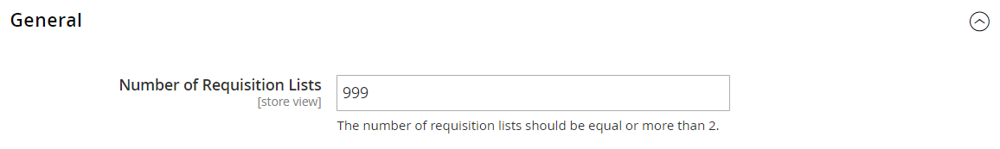

# [!UICONTROL Customers] > [!UICONTROL Requisition Lists]

{{b2b-feature}}

{{config}}

>[!TIP]
>
>Met de installatie en activering van B2B voor Adobe Commerce, kan de koopervaring met bedrijf-specifieke eigenschappen worden gepersonaliseerd. B2B voor Adobe Commerce is een geïntegreerde oplossing die zowel B2B- als B2C-modellen ondersteunt. Voor meer informatie over de B2B-functies raadpleegt u de [_B2B voor Adobe Commerce-gebruikershandleiding_](https://experienceleague.adobe.com/docs/commerce-admin/b2b/introduction.html).

>[!NOTE]
>
>De toegang tot deze configuratieopties voor B2B-functies wordt geregeld door de [rolbronnen](../../systems/permissions-user-roles.md#role-resources). Deze rolmiddelen moeten voor de gebruikersrol worden geplaatst die aan de gebruiker Admin wordt toegewezen.

## [!UICONTROL General]

<!-- zoom -->

<!-- General](https://docs.magento.com/user-guide/stores/b2b-configure-requisition-lists.html) -->

| Veld | [Toepassingsgebied](../../getting-started/websites-stores-views.md#scope-settings) | Beschrijving |
|--- |--- |--- |
| [!UICONTROL Number of Requisition Lists] | Winkelweergave | Bepaalt het maximumaantal verzoeklijsten dat per klantenrekening kan worden gehandhaafd. Het minimumaantal is `2`en is het maximumaantal `999`. |

{:style=&quot;table-layout:auto&quot;}
