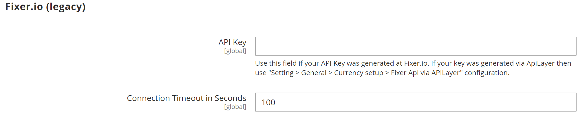

# [!UICONTROL General] > [!UICONTROL Currency Setup]

{{config}}

>[!NOTE]
>
>Zie [Valutaconfiguratie](../../stores-purchase/currency-configuration.md) voor meer informatie over deze configuraties.

## [!UICONTROL Currency Options]

<!-- zoom -->

| Veld | [Toepassingsgebied](../../getting-started/websites-stores-views.md#scope-settings) | Beschrijving |
|--- |--- |--- |
| [!UICONTROL Base Currency] | Website | De primaire valuta die wordt gebruikt voor alle online betalingstransacties. Voor meerdere winkelweergaven moet het bereik van de prijs worden ingesteld in het dialoogvenster [Catalogus](../catalog/catalog.md) configuratie. |
| [!UICONTROL Default Display Currency] | Winkelweergave | De primaire valuta die wordt gebruikt om prijzen weer te geven. |
| [!UICONTROL Allowed Currencies] | Winkelweergave | De valuta&#39;s die je winkel accepteert voor betaling. |

{style="table-layout:auto"}

## [!UICONTROL Fixer.io (legacy)]

>[!IMPORTANT]
>
>Vanaf de release van 2.4.6 kunt u [[!DNL Fixer.io]](https://fixer.io/) service is vervangen door de [[!DNL Fixer API] (APILayer)](https://apilayer.com/marketplace/fixer-api) service. Het wordt ten zeerste aanbevolen om een APILayer-account te gebruiken in plaats van een vervangen account [!DNL Fixer.io] account.

<!-- zoom -->

| Veld | [Toepassingsgebied](../../getting-started/websites-stores-views.md#scope-settings) | Beschrijving |
|--- |--- |--- |
| [!UICONTROL API key] | Algemeen | De sleutel die wordt gebruikt om tot de omzettingsdienst door uw toegang te hebben [!DNL fixer.io] account. Zie voor meer informatie [[!DNL fixer.io]](https://fixer.io/). |
| [!UICONTROL Connection Timeout in Seconds] | Algemeen | Hiermee bepaalt u het aantal seconden dat inactiviteit optreedt voordat een Fixer.io-sessietime-out optreedt. Standaardwaarde: `100` |

{style="table-layout:auto"}

## [!UICONTROL Fixer Api (APILayer)]

<!-- zoom -->

| Veld | [Toepassingsgebied](../../getting-started/websites-stores-views.md#scope-settings) | Beschrijving |
|--- |--- |--- |
| [!UICONTROL API key] | Algemeen | De sleutel die wordt gebruikt om tot de omzettingsdienst door uw toegang te hebben [!DNL APILayer] account. Zie voor meer informatie [[!DNL APILayer]](https://apilayer.com/). |
| [!UICONTROL Connection Timeout in Seconds] | Algemeen | Hiermee wordt het aantal seconden van inactiviteit bepaald voordat een [!DNL APILayer] sessietijden uit. De standaardwaarde is `100`. |

{style="table-layout:auto"}

## [!UICONTROL Currency Converter API]

<!-- zoom -->

| Veld | [Toepassingsgebied](../../getting-started/websites-stores-views.md#scope-settings) | Beschrijving |
|--- |--- |--- |
| [!UICONTROL API key] | Algemeen | De sleutel die wordt gebruikt om tot de omzettingsdienst toegang te hebben. Zie voor meer informatie [[!DNL Currency Convertor] API](https://free.currencyconverterapi.com/). |
| [!UICONTROL Connection Timeout in Seconds] | Algemeen | Hiermee wordt het aantal seconden van inactiviteit bepaald vóór een [!DNL Currency Converter] sessietijden uit. Standaardwaarde:`100` |

{style="table-layout:auto"}

## [!UICONTROL Scheduled Import Settings]

<!-- zoom -->

| Veld | [Toepassingsgebied](../../getting-started/websites-stores-views.md#scope-settings) | Beschrijving |
|--- |--- |--- |
| [!UICONTROL Enabled] | Winkelweergave | Hiermee wordt bepaald of geplande import is ingeschakeld voor valutakoersen. Opties: `Yes` / `No` |
| [!UICONTROL Service] | Winkelweergave | Specificeert de dienst die de gegevens voor de geplande invoer verstrekt. De standaardwaarde is `fixer.io` |
| [!UICONTROL Start Time] | Winkelweergave | Wijst op de begintijd door uur, minuut, en seconde, die op een klok van 24 uur wordt gebaseerd. |
| [!UICONTROL Frequency] | Winkelweergave | Hiermee bepaalt u hoe vaak de geplande import plaatsvindt. Opties: `Daily` / `Weekly` / `Monthly` |
| [!UICONTROL Error Email Recipient] | Winkelweergave | Identificeert het e-mailadres van elke persoon die per e-mail op de hoogte wordt gesteld van geplande importfouten. Voor meerdere ontvangers scheidt u elke vermelding met een komma. |
| [!UICONTROL Error Email Sender] | Website | Hiermee wordt de contactpersoon van de winkel geïdentificeerd die wordt weergegeven als de afzender van het foutbericht in de e-mail. Standaardafzender: `General Contact` |
| [!UICONTROL Error Email Template] | Website | Hier geeft u de sjabloon op die wordt gebruikt als basis voor de e-mailfoutmelding. Standaardsjabloon: `Currency Update Warnings` |

{style="table-layout:auto"}
