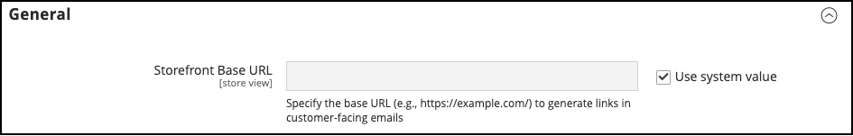
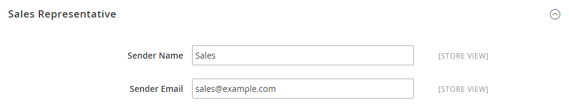

# [!UICONTROL General] > [!UICONTROL Store Email Addresses]

{{config}}

Zie [ e-mailadressen van de Opslag ](../../getting-started/store-details.md#store-email-addresses) voor gedetailleerde informatie over deze configuratiegebieden en opties.

## [!UICONTROL General]

[!BADGE  slechts SaaS ]{type=Positive url="https://experienceleague.adobe.com/en/docs/commerce/user-guides/product-solutions" tooltip="Alleen van toepassing op Adobe Commerce as a Cloud Service-projecten (door Adobe beheerde SaaS-infrastructuur)."}

<!-- zoom -->

| Veld | [ Reikwijdte ](../../getting-started/websites-stores-views.md#scope-settings) | Beschrijving |
|--- |--- |--- |
| [!UICONTROL Storefront Base URL] | Winkelweergave | De basis-URL die wordt gebruikt om koppelingen te maken die in klantgerichte e-mails worden opgenomen. De URL moet eindigen met een slash. Bijvoorbeeld `https://www.example.com/` . |

{style="table-layout:auto"}

## [!UICONTROL General Contact]

<!-- zoom -->

| Veld | [ Reikwijdte ](../../getting-started/websites-stores-views.md#scope-settings) | Beschrijving |
|--- |--- |--- |
| [!UICONTROL Sender Name] | Winkelweergave | De naam die wordt weergegeven als de afzender van een e-mailbericht dat door de `General Contact` -identiteit is verzonden. |
| [!UICONTROL Sender Email] | Winkelweergave | Het e-mailadres dat is gekoppeld aan de `General Contact` -identiteit. |

{style="table-layout:auto"}

## [!UICONTROL Sales Representative]

<!-- zoom -->

| Veld | [ Reikwijdte ](../../getting-started/websites-stores-views.md#scope-settings) | Beschrijving |
|--- |--- |--- |
| [!UICONTROL Sender Name] | Winkelweergave | De naam die wordt weergegeven als de afzender van een e-mailbericht dat door de `Sales Representative` -identiteit is verzonden. |
| [!UICONTROL Sender Email] | Winkelweergave | Het e-mailadres dat is gekoppeld aan de `Sales Representative` -identiteit. |

{style="table-layout:auto"}

## [!UICONTROL Customer Support]

<!-- zoom -->

| Veld | [ Reikwijdte ](../../getting-started/websites-stores-views.md#scope-settings) | Beschrijving |
|--- |--- |--- |
| [!UICONTROL Sender Name] | Winkelweergave | De naam die wordt weergegeven als de afzender van een e-mailbericht dat door de `Customer Support` -identiteit is verzonden. |
| [!UICONTROL Sender Email] | Winkelweergave | Het e-mailadres dat is gekoppeld aan de `Customer Support` -identiteit. |

{style="table-layout:auto"}

## Aangepaste e-mail 1

<!-- zoom -->

| Veld | [ Reikwijdte ](../../getting-started/websites-stores-views.md#scope-settings) | Beschrijving |
|--- |--- |--- |
| [!UICONTROL Sender Name] | Winkelweergave | De naam die wordt weergegeven als de afzender van een e-mailbericht dat door de `Custom 1` -identiteit is verzonden. |
| [!UICONTROL Sender Email] | Winkelweergave | Het e-mailadres dat is gekoppeld aan de `Custom 1` -identiteit. |

{style="table-layout:auto"}

## Aangepaste e-mail 2

<!-- zoom -->

| Veld | [ Reikwijdte ](../../getting-started/websites-stores-views.md#scope-settings) | Beschrijving |
|--- |--- |--- |
| [!UICONTROL Sender Name] | Winkelweergave | De naam die wordt weergegeven als de afzender van een e-mailbericht dat door de `Custom 2` -identiteit is verzonden. |
| [!UICONTROL Sender Email] | Winkelweergave | Het e-mailadres dat is gekoppeld aan de `Custom 2` -identiteit. |

{style="table-layout:auto"}
