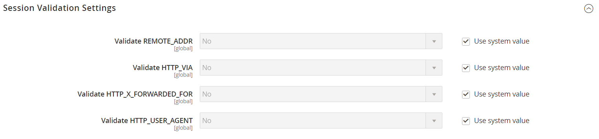

# [!UICONTROL General] > [!UICONTROL Web]

{{config}}

## [!UICONTROL URL Options]

<!-- zoom -->

<!-- [URL Options configuration settings](https://experienceleague.adobe.com/en/docs/commerce-admin/stores-sales/site-store/store-urls) -->

| Veld | Toepassingsgebied | Beschrijving |
|  ---  |  ---  |  ---  |
| [!UICONTROL Add Store Code to URLs] | Algemeen | Als de Server van het Web Herschrijft wordt toegelaten, neemt de Code van de Opslag van de huidige mening in URL op. Opties: `Yes` / `No` .   wanneer dit gebied aan `Yes` wordt geplaatst, moet u opslagcodes in uw browser URLs omvatten om ervoor te zorgen dat URL herschrijft correct in kaart wordt gebracht en alle pagina&#39;s met succes worden geopend. Dit vermijdt _404 Pagina niet gevonden_ fouten. |
| [!UICONTROL Auto-redirect to Base URL] | Winkelweergave | (Voor instellingen in één winkel) Als er een verbroken koppeling op uw site staat, stuurt u het verkeer door naar de basis-URL in plaats van naar een pagina met het bericht &#39;404 Pagina niet gevonden&#39;. Opties:` No` / `Yes (302 Found)` / `Yes (301 Moved Permanently)`  **_Important:_** Gebruik geen automatische omleiding naar basis-URL voor instellingen in meerdere winkels. |
| [!UICONTROL Catalog media URL format] | Algemeen | Bepaalt het [ formaat URL ](../../catalog/catalog-urls.md) dat aan producten en categorieën wordt toegewezen. Opties: unieke hash per afbeeldingsvariant (modus Verouderd) definieert omgezette bestandsnaam als een unieke hash-waarde. De optimalisering van het beeld die op vraagparameters wordt gebaseerd bepaalt [ proces van de optimalisering van het beeld ](../../content-design/media-gallery-image-optimization.md) afhankelijk van vraagparameters. |

{style="table-layout:auto"}

## [!UICONTROL Search Engine Optimization]

<!-- zoom -->

<!-- [Search Engine Optimization configuration settings](https://experienceleague.adobe.com/en/docs/commerce-admin/marketing/seo/url-rewrites/url-rewrite) -->

| Veld | [ Reikwijdte ](../../getting-started/websites-stores-views.md#scope-settings) | Beschrijving |
|--- |--- |--- |
| [!UICONTROL Use Web Server Rewrites] | Winkelweergave | Op PHP gebaseerde systemen bevatten doorgaans een bestand met de naam `index.php` in de hoofdmap. Standaard wordt de bestandsnaam in de URL net na de naam van de hoofdmap weergegeven. Wanneer deze optie is ingeschakeld, gaat het systeem `index.php` weg van de URL. Deze bruikbaarheids beste praktijken maken elke URL beknopter, en hebben geen invloed op prestaties of plaatscijfer. Opties: `Yes` / `No` |

{style="table-layout:auto"}

## [!UICONTROL Base URLs]

<!-- zoom -->

<!-- [Base URLS configuration settings](https://experienceleague.adobe.com/en/docs/commerce-admin/stores-sales/site-store/store-urls) -->

| Veld | [ Reikwijdte ](../../getting-started/websites-stores-views.md#scope-settings) | Beschrijving |
|--- |--- |--- |
| [!UICONTROL Base URL] | Winkelweergave | Het volledige adres van de Commerce-hoofdmap die niet via een gecodeerd (SSL) kanaal wordt uitgevoerd. De URL moet eindigen met een slash. |
| [!UICONTROL Base Link URL] | Winkelweergave | Een opmaakcode die wordt gebruikt als plaatsaanduiding voor de basis-URL. |
| [!UICONTROL Base URL for Static View Files] | Winkelweergave | Een pad dat wijst naar de locatie van statische bestanden die door het thema worden gebruikt, zoals css, fonts, afbeeldingen en JavaScript. Een tijdelijke aanduiding wordt gebruikt om de basis-URL weer te geven. Als uw Commerce-installatie meerdere sites met dezelfde mapstructuur heeft, kunt u voor elke site een andere map gebruiken. Stel het configuratiebereik in op de juiste site voordat u de basis-URL voor statische weergavebestanden invoert. U kunt ook een map buiten de Commerce-installatie opgeven. |
| [!UICONTROL Base URL for User Media Files] | Winkelweergave | Een pad dat wijst naar de locatie van catalogusafbeeldingen en andere mediabestanden. Een tijdelijke aanduiding wordt gebruikt om de basis-URL weer te geven. Als uw Commerce-installatie meerdere sites met dezelfde mapstructuur heeft, kunt u voor elke site een andere mediamap gebruiken. Hierdoor kunt u een back-up maken van elke mediamap en deze afzonderlijk terugdraaien. U kunt ook een mediamap buiten uw Commerce-installatie opgeven. |

{style="table-layout:auto"}

## [!UICONTROL Base URLs (Secure)]

<!-- zoom -->

<!-- [Base URLs (Secure) configuration settings](https://experienceleague.adobe.com/en/docs/commerce-admin/stores-sales/site-store/store-urls) -->

| Veld | [ Reikwijdte ](../../getting-started/websites-stores-views.md#scope-settings) | Beschrijving |
|--- |--- |--- |
| [!UICONTROL Secure Base URL] | Winkelweergave | Het volledige adres van de Commerce-hoofdmap die wordt geleverd met het gecodeerde SSL/TLS-protocol. De URL moet eindigen met een slash. |
| [!UICONTROL Secure Base Link URL] | Winkelweergave | Een opmaakcode die wordt gebruikt als plaatsaanduiding voor de basis-URL die via een beveiligd kanaal wordt uitgevoerd. |
| [!UICONTROL Secure Base URL for Static View Files] | Winkelweergave | Een opmaakcode die verwijst naar de locatie van statische bestanden, zoals CSS, lettertypen, afbeeldingen en JavaScript, die door het thema worden gebruikt. De bestanden kunnen zich op een onbeveiligd of beveiligd kanaal bevinden. Als uw Commerce-installatie meerdere sites met dezelfde mapstructuur heeft, kunt u voor elke site een andere map gebruiken. Stel het configuratiebereik in op de juiste site voordat u de basis-URL voor statische weergavebestanden invoert. U kunt ook een map buiten de Commerce-installatie opgeven. |
| [!UICONTROL Secure Base URL for User Media Files] | Winkelweergave | Een pad dat wijst naar de locatie van catalogusafbeeldingen en andere mediabestanden. De bestanden kunnen zich op een onbeveiligd of beveiligd kanaal bevinden. Een tijdelijke aanduiding wordt gebruikt om de basis-URL weer te geven. Als uw Commerce-installatie meerdere sites met dezelfde mapstructuur heeft, kunt u voor elke site een andere mediamap gebruiken. Hierdoor kunt u een back-up maken van elke mediamap en deze afzonderlijk terugdraaien. U kunt ook een mediamap buiten uw Commerce-installatie opgeven. |
| [!UICONTROL Use Secure URLs on Storefront] | Winkelweergave | Als uw domein een veiligheidscertificaat heeft, kunt u verkiezen om de storefront, met of zonder SSL encryptie in werking te stellen. Opties: **`Yes`**- Sla URL&#39;s op die beginnen met `https` om aan te geven dat de pagina wordt geleverd met een gecodeerd, beveiligd protocol. **`No`** - Sla URL&#39;s op die beginnen met `http` om aan te geven dat de pagina wordt geleverd zonder beveiligd protocol. |
| [!UICONTROL Use Secure URLs in Admin] | Algemeen | Als uw domein een beveiligingscertificaat heeft, kunt u de opslagbeheerder uitvoeren, met of zonder SSL-codering. Opties:  **`Yes`**- URL&#39;s voor beheerders beginnen met `https` om aan te geven dat de pagina wordt geleverd met een gecodeerd, beveiligd protocol. **`No`** - URL&#39;s voor beheerders beginnen met `http` om aan te geven dat de pagina wordt geleverd zonder beveiligd protocol.  Wanneer beveiligde URL&#39;s zijn ingeschakeld voor zowel de winkel als de beheerder, worden twee extra velden weergegeven om `HSTS` in te schakelen en te configureren. |
| [!UICONTROL Enable HTTP Strict Transport Security (HSTS)] | Winkelweergave | Indien toegelaten, [`HSTS` ](https://cheatsheetseries.owasp.org/cheatsheets/HTTP_Strict_Transport_Security_Cheat_Sheet.html) verstrekt een maatregel van veiligheid tegen &quot;man in de middelste&quot;aanvallen, en verhindert gebruikers het &quot;ongeldige certificaat&quot;bericht met voeten te treden. Opties: `Yes` / `No` |
| [!UICONTROL Upgrade Insecure Requests] | Winkelweergave | Wanneer toegelaten, zet onveilige (`HTTP`) verzoeken om die van browser in het veilige (`HTTPS`) protocol worden ontvangen. Opties: `Yes` / `No` |
| [!UICONTROL Offloader Header] | Algemeen | Geeft de `offloader_header` -waarde in uw serverconfiguratie op om het protocol tussen de client en het taakverdelingsmechanisme te identificeren. De meeste Commerce-installaties gebruiken de standaardwaarde `X-Forwarded-Proto` (XFP) om het protocol als `HTTP` of `HTTPS` aan te duiden. |

{style="table-layout:auto"}

## [!UICONTROL Default Pages]

<!-- zoom -->

<!-- [Default Pages configuration settings](https://experienceleague.adobe.com/en/docs/commerce-admin/content-design/elements/pages/pages#configure-default-pages) -->

| Veld | [ Reikwijdte ](../../getting-started/websites-stores-views.md#scope-settings) | Beschrijving |
|--- |--- |--- |
| [!UICONTROL Default Web URL] | Winkelweergave | Geeft de bestemmingspagina aan die aan de basis-URL is gekoppeld. Deze is standaard ingesteld op &quot;cms&quot; om een pagina aan te geven vanuit het Commerce-inhoudsbeheersysteem (CMS). U kunt ook een ander type bestemmingspagina gebruiken, zoals een blog. Als een blog bijvoorbeeld is geïnstalleerd op de server op `magento/blog` , kunt u de naam van de map &quot;blog&quot; invoeren als een relatief pad naar de selectie van pagina&#39;s. |
| [!UICONTROL CMS Home Page] | Winkelweergave | Als u de homepage voor de winkel wilt kiezen, selecteert u gewoon de CMS-pagina in de lijst. Standaard wordt op de startpagina van CMS de volledige selectie van CMS-pagina&#39;s weergegeven die beschikbaar zijn voor je winkel. |
| [!UICONTROL Default No-route URL] | Winkelweergave | Bevat de URL van de standaardpagina die u wilt weergeven wanneer een fout `404 Page not Found` optreedt. De standaardwaarde is `cms/noroute/index` . |
| [!UICONTROL CMS No Route Page] | Winkelweergave | Hiermee wordt een specifieke CMS-pagina aangegeven die moet worden weergegeven wanneer een fout van 404 pagina niet gevonden optreedt. De standaardpagina is 404 Niet gevonden. |
| [!UICONTROL CMS No Cookies Page] | Winkelweergave | Hiermee wordt een specifieke CMS-pagina aangegeven die wordt weergegeven wanneer cookies niet zijn ingeschakeld voor de browser. Op de pagina wordt uitgelegd waarom cookies worden gebruikt en hoe u deze voor elke browser inschakelt. De standaardpagina is Enable Cookies. |
| [!UICONTROL Show Breadcrumbs for CMS Pages] | Winkelweergave | Hiermee wordt bepaald of een broodkruimelspoor op alle CMS-pagina&#39;s in de catalogus wordt weergegeven. Opties: `Yes` / `No` |

{style="table-layout:auto"}

## [!UICONTROL Default Layouts]

<!-- zoom -->

<!--[Default Layouts](https://experienceleague.adobe.com/en/docs/commerce-admin/content-design/design/layout/page-layout) -->

| Veld | [ Reikwijdte ](../../getting-started/websites-stores-views.md#scope-settings) | Beschrijving |
|--- |--- |--- |
| [!UICONTROL Default Product Layout] | Algemeen | Bepaalt de [ lay-out ](../../content-design/page-layout.md) die door gebrek voor productpagina&#39;s wordt gebruikt. Opties:  **`No layout updates`**- layout-updates zijn standaard niet beschikbaar voor productpagina&#39;s. **`Empty`** - Voor productpagina&#39;s wordt standaard een lege indeling gebruikt.  **`1 column`**- Voor productpagina&#39;s wordt standaard één kolomindeling gebruikt. **`2 columns with left bar`** - Voor productpagina&#39;s wordt standaard een lay-out van twee kolommen gebruikt, waarbij de zijbalk links in het scherm wordt weergegeven.  **`2 columns with right bar`**- Voor productpagina&#39;s wordt standaard een lay-out van twee kolommen gebruikt, met de zijbalk rechts. **`3 columns`** - Voor productpagina&#39;s wordt standaard een lay-out van drie kolommen gebruikt met zijbalken links en rechts. **`Page -- Full Width`**- (Vereist [!DNL Page Builder] ) Standaard wordt de indeling Pagina — Volledige breedte gebruikt voor productpagina&#39;s. **`Category - Full Width`** - (Vereist [!DNL Page Builder] ) Standaard wordt de indeling Categorie - Volledige breedte gebruikt voor productpagina&#39;s.  **`Product - Full Width`**- (Vereist [!DNL Page Builder] ) Standaard wordt de indeling Product - Volledige breedte gebruikt voor productpagina&#39;s. |
| [!UICONTROL Default Category Layout] | Algemeen | Bepaalt de [ lay-out ](../../content-design/page-layout.md) die door gebrek voor categoriepagina&#39;s wordt gebruikt. Opties:  **`No layout updates`**- layout-updates zijn standaard niet beschikbaar voor categoriepagina&#39;s. **`Empty`** - Voor categoriepagina&#39;s wordt standaard een lege indeling gebruikt.  **`1 column`**- Voor categoriepagina&#39;s wordt standaard één kolomindeling gebruikt. **`2 columns with left bar`** - Voor categoriepagina&#39;s gebruikt u standaard een lay-out met twee kolommen en de zijbalk links.  **`2 columns with right bar`**- Voor categoriepagina&#39;s wordt standaard een lay-out met twee kolommen gebruikt, waarbij de zijbalk rechts. **`3 columns`** - Voor categoriepagina&#39;s gebruikt u standaard een lay-out met drie kolommen en zijbalken links en rechts. **`Page - Full Width`**- (Vereist [!DNL Page Builder] ) Standaard wordt de indeling Pagina - volledige breedte gebruikt voor categoriepagina&#39;s. **`Category - Full Width`** - (Vereist [!DNL Page Builder] ) Standaard wordt de indeling Categorie - Volledige breedte gebruikt voor categoriepagina&#39;s.  **`Product - Full Width`**- (Vereist [!DNL Page Builder] ) Standaard wordt de indeling Product - Volledige breedte gebruikt voor categoriepagina&#39;s. |
| Standaardpagina-indeling | Algemeen | Bepaalt de [ lay-out ](../../content-design/page-layout.md) die door gebrek voor de pagina&#39;s van CMS wordt gebruikt. Opties:  **`No layout updates`**- layout-updates zijn standaard niet beschikbaar voor CMS-pagina&#39;s. **`Empty`** - Voor CMS-pagina&#39;s wordt standaard een lege indeling gebruikt.  **`1 column`**- Voor CMS-pagina&#39;s wordt standaard één kolomindeling gebruikt. **`2 columns with left bar`** - Voor CMS-pagina&#39;s wordt standaard een lay-out met twee kolommen gebruikt, waarbij de zijbalk links wordt weergegeven. **`2 columns with right bar`**- Voor CMS-pagina&#39;s wordt standaard een lay-out van twee kolommen gebruikt, met de zijbalk rechts. **`3 columns`** - Voor CMS-pagina&#39;s wordt standaard een lay-out van drie kolommen gebruikt met zijbalken links en rechts. **`Page - Full Width`**- (Vereist [!UICONTROL Page Builder] ) Standaard wordt de lay-out Pagina - volledige breedte gebruikt voor CMS-pagina&#39;s. **`Category - Full Width`** - (Vereist [!UICONTROL Page Builder] ) Standaard wordt de indeling Categorie - Volledige breedte gebruikt voor CMS-pagina&#39;s.  **`Product - Full Width`**- (Vereist [!DNL Page Builder] ) Standaard wordt de indeling Product - Volledige breedte gebruikt voor CMS-pagina&#39;s. |

{style="table-layout:auto"}

## [!UICONTROL Default Cookie Settings]

<!-- zoom -->

<!-- [Default Cookie configuration settings](https://experienceleague.adobe.com/en/docs/commerce-admin/start/compliance/privacy/compliance-cookie-law) -->

| Veld | [ Reikwijdte ](../../getting-started/websites-stores-views.md#scope-settings) | Beschrijving |
|--- |--- |--- |
| [!UICONTROL Cookie Lifetime] | Winkelweergave | Hiermee bepaalt u hoe lang een cookie kan bestaan voordat deze automatisch wordt verwijderd. Standaardwaarde is 3600 seconden (1 uur) |
| [!UICONTROL Cookie Path] | Winkelweergave | Hiermee geeft u de mappen op de server op waarin Commerce-cookies kunnen worden gebruikt. Als u Commerce-cookies overal in de installatie beschikbaar wilt maken, stelt u het Koekjespad in op één slash: `/` . Deze waarde kan slechts de koekjesweg bevatten, en **_kan_** geen andere koekjesparameters bevatten. |
| [!UICONTROL Cookie Domain] | Winkelweergave | Hiermee bepaalt u of Commerce-cookies beschikbaar zijn voor subdomeinen. Bijvoorbeeld, om `mysubdomain` .domain.com te steunen, ga de naam van uw domein met een periode aan het begin in, als `.domain.com`. Deze waarde kan slechts het koekjesdomein bevatten, en **_kan_** geen andere koekjesparameters bevatten. |
| [!UICONTROL Use HTTP Only] | Winkelweergave | Hiermee wordt bepaald of Commerce Cookies alleen kunnen worden gebruikt via een onbeveiligd kanaal (http) of ook kunnen worden gebruikt via een gecodeerd kanaal (https). Opties: `Yes` / `No` |
| [!UICONTROL Cookie Restriction Mode] | Website | Hiermee wordt bepaald of de beperkingsmodus voor cookies is ingeschakeld. Opties: `Yes` / `No` |

{style="table-layout:auto"}

## [!UICONTROL Session Validation Settings]

<!-- zoom -->

<!-- [Session Validation configuration settings](https://experienceleague.adobe.com/en/docs/commerce-admin/systems/security/security-session-management#session-validation) -->

| Veld | [ Reikwijdte ](../../getting-started/websites-stores-views.md#scope-settings) | Beschrijving |
|--- |--- |--- |
| [!UICONTROL Validate REMOTE_ADDR] | Algemeen | Verifieert dat het IP Adres van een verzoek `$_SESSION` gegevens aanpast. De sessie wordt beëindigd als een ander IP-adres wordt gedetecteerd. Opties: `Yes` / `No` |
| [!UICONTROL Validate HTTP_VIA] | Algemeen | Verifieert binnenkomende volmachtsgegevens en controleert dat het volmachtsadres van een verzoek `$_SESSION` gegevens aanpast. De sessie wordt beëindigd als een ander proxyadres wordt gevonden. Opties: `Yes` / `No` |
| [!UICONTROL Validate HTTP_x_FORWARDED_FOR] | Algemeen | Verifieert uitgaande volmachtsgegevens en controleert dat door:sturen-voor adres van een verzoek `$_SESSION` gegevens aanpast. De sessie wordt beëindigd als een ander doorgestuurd adres wordt gedetecteerd. Opties: `Yes` / `No` |
| [!UICONTROL Validate HTTP_USER_AGENT] | Algemeen | `USER_AGENT` verwijst naar de browser of het apparaat dat wordt gebruikt om toegang te krijgen tot de website. Hierbij wordt gecontroleerd of de naam en versie van de browser en het besturingssysteem overeenkomen met `$_SESSION` -gegevens. De sessie wordt beëindigd als een andere gebruikersagent wordt gedetecteerd tussen aanvragen in dezelfde sessie. Opties: `Yes` / `No` |

{style="table-layout:auto"}

## [!UICONTROL Browser Capabilities Detection]

<!-- zoom -->

<!-- [Browser Capabilities Detection configuration settings](https://experienceleague.adobe.com/en/docs/commerce-admin/systems/security/security-browser-capabilities-detection) -->

| Veld | [ Reikwijdte ](../../getting-started/websites-stores-views.md#scope-settings) | Beschrijving |
|--- |--- |--- |
| [!UICONTROL Redirect to CMS-page if Cookies are Disabled] | Winkelweergave | Als cookies door de browser worden uitgeschakeld, worden deze cookies automatisch doorgestuurd naar de CMS No Cookies Page. Opties: `Yes` / `No` |
| [!UICONTROL Show Notice if JavaScript is Disabled] | Winkelweergave | Als JavaScript door de browser is uitgeschakeld, wordt een melding weergegeven waarin de gebruiker wordt gevraagd JavaScript-opties in te schakelen: `Yes` / `No` (Schakelt uit) |
| [!UICONTROL Show Notice if Local Storage is Disabled] | Winkelweergave | Hiermee wordt een bericht weergegeven als de lokale cache is uitgeschakeld. Opties: `Yes` / `No` |

{style="table-layout:auto"}
