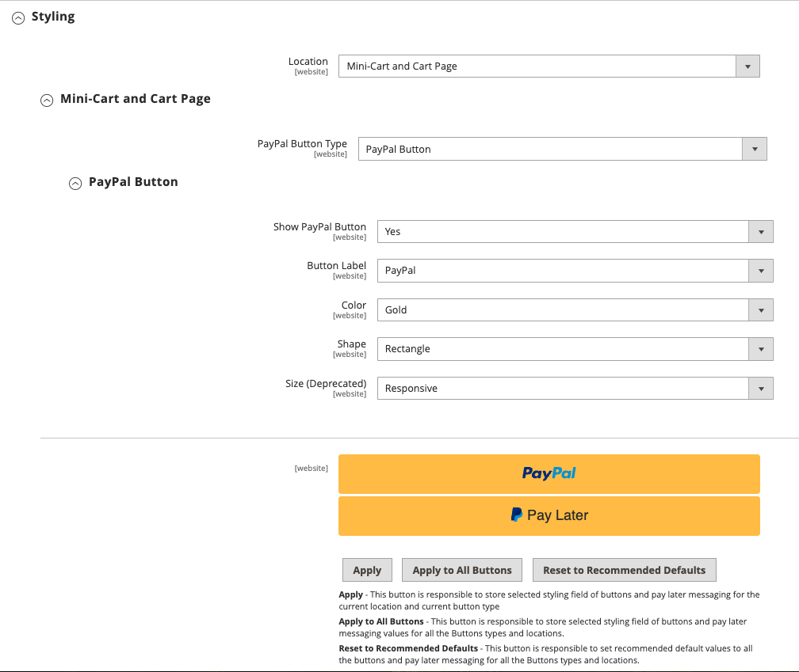

# [!UICONTROL Sales] > [!UICONTROL Payment Methods] > [!UICONTROL Braintree]

>[!IMPORTANT]
>
>**Commerce 2.4 Migratie:** 
>Voor versies van Adobe Commerce en Magento Open Source vroeger dan 2.4.0, werd het geadviseerd dat de handelaren de officiële uitbreiding van de de betaalintegratie van Braintree van [&#x200B; Commerce Marketplace &#x200B;](https://marketplace.magento.com/catalogsearch/result/?q=braintree) installeren en vormen om de kernintegratie te vervangen. Vanaf 2.4.0 is de extensie nu opgenomen in de kernrelease.
>  
>Wanneer handelaars naar Commerce 2.4 migreren, moeten ze de extensie verwijderen die op de Marketplace (`paypal/module-braintree` of `gene/module-braintree` ) wordt gedistribueerd en eventuele codeaanpassingen bijwerken om de naamruimte `PayPal_Braintree` te gebruiken in plaats van `Magento_Braintree` . De configuratie-instellingen van de gebundelde extensie voor Commerce en de extensie die op de Commerce Marketplace wordt gedistribueerd, blijven behouden. Betalingen die met die versies van de extensie worden geplaatst, worden als normaal vastgelegd, geweigerd of terugbetaald.
>  
>Als u een upgrade uitvoert naar Commerce 2.4.0 en de aanbevolen Commerce Marketplace-extensie in uw vorige versie 2.3.x niet gebruikt, werkt de functie voor meerdere adressen niet met de versie 2.4.0 van Braintree. Wanneer een verkoopster _selecteert leveren aan veelvoudige adressen_, verschijnt de de betalingsmethode van Braintree niet. De eerder voor 2.3.x aanbevolen Commerce Marketplace-extensie heeft dit probleem met meerdere adressen.

{{config}}

>[!IMPORTANT]
>
>Als u hulp met onverwachte kosten op uw kaart nodig hebt, bezoek [&#x200B; annuleer abonnement &#x200B;](https://helpx.adobe.com/nl/manage-account/using/cancel-subscription.html) pagina voor hulp.

## [!UICONTROL Basic Braintree Settings]

<!-- zoom -->

| Veld | [&#x200B; Reikwijdte &#x200B;](../../getting-started/websites-stores-views.md#scope-settings) | Beschrijving |
|--- |--- |--- |
| [!UICONTROL Title] | Winkelweergave | Standaardwaarde: `Credit Card` (Braintree) |
| [!UICONTROL Environment] | Winkelweergave | Opties: `Sandbox` / `Production` |
| [!UICONTROL Payment Action] | Winkelweergave | Bepaalt welke actie Braintree onderneemt wanneer een betaling wordt verwerkt. Opties:  **`Authorize`**- Fondsen op de creditcard van de klant zijn geautoriseerd, maar worden niet van de rekening overgedragen. Er wordt een bestelling gemaakt in uw winkelbeheerder. U kunt de uitverkoop later vastleggen en een factuur maken. **`Intent Sale`** (voorheen `Authorize and Capture` in eerdere releases) - Fondsen op de creditcard van de klant worden geautoriseerd en vastgelegd door Braintree en er wordt een bestelling en factuur gemaakt in uw winkel Admin. |
| [!UICONTROL Sandbox Merchant ID] | Winkelweergave | Dit is de unieke id voor uw gehele sandboxgatewayaccount. Ook gekend als _openbare identiteitskaart_ of _productie identiteitskaart_, is uw handelsidentiteitskaart verschillend voor uw productie en zandbakgateways. Dit veld wordt weergegeven wanneer het veld _[!UICONTROL Environment]_&#x200B;is ingesteld op `Sandbox` . |
| [!UICONTROL Sandbox Public Key] | Winkelweergave | Dit is uw gebruiker-specifieke, openbare herkenningsteken dat toegang tot gecodeerde gegevens beperkt. Elke gebruiker die is gekoppeld aan uw Sandbox Braintree-gateway, heeft zijn eigen openbare sandbox-sleutel. Dit veld wordt weergegeven wanneer het veld _[!UICONTROL Environment]_&#x200B;is ingesteld op `Sandbox` . |
| [!UICONTROL Sandbox Private Key] | Winkelweergave | Dit is uw gebruiker-specifieke, privé herkenningsteken dat toegang tot gecodeerde gegevens beperkt. Elke gebruiker die is gekoppeld aan uw Sandbox Braintree-gateway, heeft een eigen persoonlijke sleutel voor de sandbox. Dit veld wordt weergegeven wanneer het veld _[!UICONTROL Environment]_&#x200B;is ingesteld op `Sandbox` . |
| [!UICONTROL Merchant ID] | Winkelweergave | Dit is het unieke herkenningsteken voor uw volledige gatewayrekening, met inbegrip van de veelvoudige handelaarrekeningen die in uw gateway kunnen zijn. Ook gekend als _openbare identiteitskaart_ of _productie identiteitskaart_, is uw handelsidentiteitskaart verschillend voor uw productie en zandbakgateways. Dit veld wordt weergegeven wanneer het veld _[!UICONTROL Environment]_&#x200B;is ingesteld op `Production` . |
| [!UICONTROL Public Key] | Winkelweergave | Dit is uw gebruiker-specifieke, openbare herkenningsteken dat toegang tot gecodeerde gegevens beperkt. Elke gebruiker die aan uw gateway van Braintree wordt gekoppeld heeft zijn eigen openbare sleutel. Dit veld wordt weergegeven wanneer het veld _[!UICONTROL Environment]_&#x200B;is ingesteld op `Production` . |
| [!UICONTROL Private Key] | Winkelweergave | Dit is uw gebruiker-specifieke, privé herkenningsteken dat toegang tot gecodeerde gegevens beperkt. Elke gebruiker die aan uw Braintree-gateway is gekoppeld, heeft zijn eigen persoonlijke sleutel. Dit veld wordt weergegeven wanneer het veld _[!UICONTROL Environment]_&#x200B;is ingesteld op `Production` . |
| [!UICONTROL Enable Card Payments] | Website | Hiermee bepaalt u of de betalingsmethode van de Braintree-creditcard beschikbaar is voor uw klanten als betalingsmethode. Opties: `Yes` / `No` |
| [!UICONTROL Enable Vault for Card Payments] | Website | Als deze optie is ingeschakeld, beschikt u over een veilige opslagruimte voor de betalingsgegevens van de klant, zodat klanten hun creditcardgegevens niet telkens opnieuw hoeven in te voeren. Opties: `Yes` / `No` |
| [!UICONTROL Enable Vault CVV Re-verification] | Website | Als deze optie is ingeschakeld, wordt de validatie uitgevoerd voor de CVV-regels die in uw Braintree-account zijn ingesteld. Opties: `Yes` / `No` |

{style="table-layout:auto"}

## [!UICONTROL Advanced Braintree Settings]

{width="550" zoomable="yes"}

| Veld | [Draagwijdte](../../getting-started/websites-stores-views.md#scope-settings) | Beschrijving |
|--- |--- |--- |
| [!UICONTROL Vault Title] | Website | Een beschrijvende titel voor uw referentie die de vault identificeert waar uw klantenkaartinformatie wordt opgeslagen. |
| [!UICONTROL Merchant Account ID] | Website | De Merchant Account ID die vanaf deze website aan Braintree-transacties moet worden gekoppeld. Als deze optie niet wordt opgegeven, wordt de standaardzakelijke account van uw Braintree-account gebruikt. |
| [!UICONTROL Enable Checkout Express Payments] | Website | Biedt een snellere afhandeling met Express Payment Options aan het begin van het afhandelingsproces, zoals PayPal, PayPal, Apple Pay en Google Pay. Opties: `Yes` / `No` |
| [!UICONTROL Skip Fraud Checks on Admin Orders] | Website | Hiermee wordt voorkomen dat de transactie ter evaluatie wordt verzonden als onderdeel van [!DNL Advanced Fraud Tools] -controles, op orders die alleen via de beheerder worden geplaatst als deze is ingesteld op `Yes` .  Opties: `Yes` / `No` |
| [!UICONTROL Bypass Fraud Protection Threshold] | Website | `Advanced Fraud Protection` -controles worden overgeslagen wanneer de drempelwaarde wordt bereikt of overschreden. Als u dit veld leeg laat, wordt deze optie uitgeschakeld. |
| [!UICONTROL Debug] | Website | Hiermee bepaalt u of de communicatie tussen het Braintree-systeem en uw winkel wordt opgenomen in een logbestand. Opties: `Yes` / `No` |
| [!UICONTROL CVV Verification] | Website | Hiermee bepaalt u of klanten de driecijferige beveiligingscode moeten opgeven vanaf de achterzijde van een creditcard. Opties: `Yes` / `No` |
| [!UICONTROL Send Card Line Items] | Website | Verzend de winkelwagentjes voor alle betalingsmethoden. Opties: `Yes` / `No` |
| [!UICONTROL Credit Card Types] | Website | Hiermee geeft u elke creditcard op die je accepteert als betaling via Braintree. Houd `Ctrl` (of `Command` op Mac) ingedrukt om een combinatie van kaarten te selecteren. Opties: `American Express` / `Visa` / `MasterCard` / `Discover` / `JCB` / `Diners` / `Maestro International` |
| [!UICONTROL Sort Order] | Website | Bepaalt de bestelling dat Braintree bij het afrekenen met andere betalingsmethoden wordt aangeboden. |

## [!UICONTROL Braintree Webhooks Settings]

<!-- zoom -->

| Veld | [&#x200B; Reikwijdte &#x200B;](../../getting-started/websites-stores-views.md#scope-settings) | Beschrijving |
|--- |--- |--- |
| [!UICONTROL Enable Webhook] | Website | De webhaakfunctionaliteit voor fraudebescherming, ACH-betalingen, lokale betalingsmethoden en geschillen mogelijk maken. Opties: `Yes` / `No` |
| [!UICONTROL Fraud Protection URL] | Website | Voeg deze URL toe aan uw Braintree-account als de [!UICONTROL Webhook Destination URL] . **Dit URL moet veilig en openbaar toegankelijk zijn.** |
| [!UICONTROL Fraud Protection Approve Order Status] | Website | Wanneer de fraudebescherming door Braintree wordt goedgekeurd, wordt de geselecteerde ordestatus toegewezen aan de Commerce-order. Deze status wordt gebruikt om de status bij te werken van de bestelling waar de ACH-betalingsmethode wordt gebruikt en wanneer deze naar `SETTLED` in Braintree gaat. |
| [!UICONTROL Fraud Protection Reject Order Status] | Website | Wanneer de fraudebescherming door Braintree wordt verworpen, wordt de geselecteerde ordestatus toegewezen aan de Commerce-order. Deze status wordt gebruikt om de status bij te werken van de bestelling waar de ACH-betalingsmethode wordt gebruikt en wanneer `SETTLEMENT` `DECLINED` is in Braintree. |

{style="table-layout:auto"}

## [!UICONTROL Country Specific Settings]

<!-- zoom -->

| Veld | [&#x200B; Reikwijdte &#x200B;](../../getting-started/websites-stores-views.md#scope-settings) | Beschrijving |
|--- |--- |--- |
| [!UICONTROL Payment from Applicable Countries] | Website | Hiermee bepaalt u of je betalingen accepteert die door Braintree zijn verwerkt vanuit alle landen of alleen specifieke landen. Opties: `All Allowed Countries` / `Specific Countries` |
| [!UICONTROL Payment from Specific Countries] | Website | Indien van toepassing, identificeert u de specifieke landen waaruit u door Braintree verwerkte betalingen accepteert. |
| [!UICONTROL Country Specific Credit Card Types] | Website | Identificeert de creditcards die per land worden geaccepteerd voor betalingen die door Braintree worden verwerkt. Voor elk land wordt een record opgeslagen. Opties:  **`Country`**- Kies het land. **`Allowed Card Types`** - Selecteer elke creditcard die in het land als betaling via Braintree wordt geaccepteerd.  **`Add`**- Voeg een regel toe om creditcards toe te staan voor een ander land. **`Action`** - Verwijdert de record met toegestane creditcards voor het land. |

{style="table-layout:auto"}

## [!UICONTROL ACH through Braintree]

<!-- zoom -->

| Veld | [&#x200B; Reikwijdte &#x200B;](../../getting-started/websites-stores-views.md#scope-settings) | Beschrijving |
|--- |--- |--- |
| [!UICONTROL Enabled ACH Direct Debit] | Website | Bepaalt of [!DNL ACH Direct Debit] het wordt opgenomen als betaalmethode via Braintree. Opties: `Yes` / `No` |
| [!UICONTROL Enable Vault for ACH Direct Debit] | Website | Klanten kunnen hun ACH Direct Debit-betaalmethode voor eenmalig gebruik in de kluis opslaan voor toekomstig gebruik. Zodra de betalingsgegevens zijn opgeslagen, kan de klant de ACH Direct Debit-betaalmethode gebruiken zonder gegevens opnieuw in te voeren of zijn betalingsgegevens opnieuw te verifiëren. Opties: `Yes` / `No` |
| [!UICONTROL Sort Order] | Website | Hiermee bepaalt u de volgorde waarin [!DNL ACH Direct Debit] bij andere betalingsmethoden wordt weergegeven tijdens het afrekenen. |

{style="table-layout:auto"}

## [!UICONTROL Apple Pay through Braintree]

<!-- zoom -->

| Veld | [&#x200B; Reikwijdte &#x200B;](../../getting-started/websites-stores-views.md#scope-settings) | Beschrijving |
|--- |--- |--- |
| [!UICONTROL Enable ApplePay through Braintree] | Website | Hiermee wordt bepaald of Apple Pay is opgenomen als betalingsmethode via Braintree. Opties: `Yes` / `No`    Het domein moet [&#x200B; eerst in de Rekening van Braintree &#x200B;](https://developer.paypal.com/braintree/docs/guides/apple-pay/configuration/javascript/v3) worden geverifieerd. |
| [!UICONTROL Enable Vault for ApplePay] | Website | Klanten kunnen hun betalingsmethode Apple Pay voor toekomstig gebruik in- en opslaan. Zodra de betalingsgegevens zijn doorgegeven, kan de klant Apple Pay gebruiken zonder de gegevens opnieuw in te voeren of de betalingsgegevens opnieuw te verifiëren. Opties: `Yes` / `No` |
| [!UICONTROL Payment Action] | Website | Bepaalt welke actie Braintree onderneemt wanneer een betaling wordt verwerkt. Opties:  **`Authorize`**- Fondsen op de kaart van de klant zijn geautoriseerd, maar worden niet van de rekening van de klant overgedragen. Er wordt een bestelling gemaakt in uw winkelbeheerder. U kunt de uitverkoop later vastleggen en een factuur maken. **`Intent Sale`** - Middelen op de kaart van de klant worden geautoriseerd en vastgelegd door Braintree en er wordt een bestelling en factuur gemaakt in uw winkel Admin. **_Nota:_** dit was `Authorize and Capture` in 2.3.x en vroegere versies. |
| [!UICONTROL Merchant Name] | Winkelweergave | Label dat wordt weergegeven aan klanten in de pop-up van ApplePay. |
| [!UICONTROL Sort Order] | Website | Hiermee bepaalt u de bestelling dat Apple Pay bij andere betalingsmethoden wordt aangeboden tijdens het afrekenen. |

{style="table-layout:auto"}

## [!UICONTROL Local Payment Methods]

<!-- zoom -->

| Veld | [&#x200B; Reikwijdte &#x200B;](../../getting-started/websites-stores-views.md#scope-settings) | Beschrijving |
|--- |--- |--- |
| [!UICONTROL Enabled Local Payment Methods] | Website | Hiermee wordt bepaald of Lokale betalingsmethode via Braintree wordt opgenomen als betalingsmethode. Opties: `Yes` / `No` |
| [!UICONTROL Title] | Website | Label dat wordt weergegeven in het gedeelte Betalingsmethode voor afrekenen. Standaardwaarde: `Local Payments` |
| [!UICONTROL Fallback Button Text] | Website | Voer de tekst in die u wilt gebruiken voor de knop die wordt weergegeven op de Braintree-pagina die als fallback fungeert en waarmee klanten terugkeren naar de website. Standaardwaarde: `Complete Checkout` |
| [!UICONTROL Redirect on Fail] | Website | Hier geeft u de URL op waar klanten moeten worden omgeleid wanneer lokale betalingstransacties worden geannuleerd, mislukt of er fouten optreden. Dit moet de betalingspagina voor uitchecken zijn (bijvoorbeeld `https://www.domain.com/checkout#payment` ). |
| [!UICONTROL Allowed Payment Method] | Website | Selecteer de lokale betalingsmethode die moet worden ingeschakeld. Opties: `Bancontact` / `EPS` / `iDeal` / `MyBank` / `P24` / `SEPA/ELV Direct Debit` |
| [!UICONTROL Sort Order] | Website | Hiermee bepaalt u de volgorde waarin Lokale betalingsmethode bij andere betalingsmethoden wordt weergegeven tijdens het afrekenen. |

{style="table-layout:auto"}

>[!NOTE]
>
>De gebundelde uitbreiding van Braintree steunt niet alle lokale betalingsmethodes die in [&#x200B; worden vermeld de ontwikkelaarsdocumentatie van Braintree &#x200B;](https://developer.paypal.com/braintree/docs/guides/local-payment-methods/overview). Andere lokale betalingsmethoden worden momenteel ontwikkeld en zullen in toekomstige versies worden ondersteund.

## [!UICONTROL GooglePay through Braintree]

<!-- zoom -->

| Veld | [&#x200B; Reikwijdte &#x200B;](../../getting-started/websites-stores-views.md#scope-settings) | Beschrijving |
|--- |--- |--- |
| [!UICONTROL Enabled GooglePay through Braintree] | Website | Hiermee wordt bepaald of [!DNL Google Pay] betaling wordt opgenomen als een betalingsmethode via Braintree. Opties: `Yes` / `No` |
| [!UICONTROL Enable Vault for GooglePay] | Website | Klanten kunnen hun betalingsmethode Google Pay voor toekomstig gebruik in- en opslaan. Zodra de betalingsgegevens zijn doorgegeven, kan de klant Google Pay gebruiken zonder de gegevens opnieuw in te voeren of de betalingsgegevens opnieuw te verifiëren. Opties: `Yes` / `No` |
| [!UICONTROL Payment Action] | Website | Bepaalt welke actie Braintree onderneemt wanneer een betaling wordt verwerkt. Opties:  **`Authorize`**- Fondsen op de kaart van de klant zijn geautoriseerd, maar worden niet van de rekening van de klant overgedragen. Er wordt een bestelling gemaakt in uw winkelbeheerder. U kunt de uitverkoop later vastleggen en een factuur maken. **`Intent Sale`** - Middelen op de kaart van de klant worden geautoriseerd en vastgelegd door Braintree en er wordt een bestelling en factuur gemaakt in uw winkel Admin. **_Nota:_** dit was `Authorize and Capture` in 2.3.x en vroegere versies. |
| [!UICONTROL Button Color] | Website | Bepaalt de kleur van de [!DNL Google Pay] knop. Opties: `White` / `Black` |
| [!UICONTROL Merchant ID] | Winkel weergave | De door Google verstrekte ID moet hier worden ingevoerd. |
| [!UICONTROL Accepted Cards] | Website | Selecteer het type kaart dat een klant kan gebruiken om de bestelling te plaatsen met [!DNL Google Pay] . |
| [!UICONTROL Sort Order] | Website | Hiermee bepaalt u de bestelling dat Google Pay bij andere betalingsmethoden wordt aangeboden tijdens het afrekenen. |

{style="table-layout:auto"}

## [!UICONTROL Venmo through Braintree]

<!-- zoom -->

| Veld | [&#x200B; Reikwijdte &#x200B;](../../getting-started/websites-stores-views.md#scope-settings) | Beschrijving |
|--- |--- |--- |
| [!UICONTROL Enable Venmo through Braintree] | Website | Hiermee wordt bepaald of [!DNL Venmo] wordt opgenomen als een betalingsmethode via Braintree. Opties: `Yes` / `No` |
| [!UICONTROL Enable Vault for Venmo] | Website | Klanten kunnen hun betalingsmethode van Venmo voor toekomstig gebruik in kluizen plaatsen of opslaan. Zodra de betalingsgegevens zijn doorgegeven, kan de klant de betalingsmethode van Venmo gebruiken zonder de gegevens opnieuw in te voeren of de betalingsgegevens opnieuw te verifiëren. Opties: `Yes` / `No` |
| [!UICONTROL Payment Action] | Website | Bepaalt welke actie Braintree onderneemt wanneer een betaling wordt verwerkt. Opties:  **`Authorize`**- Fondsen op de kaart van de klant zijn geautoriseerd, maar worden niet van de rekening van de klant overgedragen. Er wordt een bestelling gemaakt in uw winkelbeheerder. U kunt de uitverkoop later vastleggen en een factuur maken. **`Intent Sale`** - Middelen op de kaart van de klant worden geautoriseerd en vastgelegd door Braintree en er wordt een bestelling en factuur gemaakt in uw winkel Admin. **_Nota:_** dit was _machtigt en vangt_ in 2.3.x en vroegere versies. |
| [!UICONTROL Sort Order] | Website | Bepaalt de bestelling dat Venmo bij andere betalingsmethoden wordt vermeld tijdens het afrekenen. |

{style="table-layout:auto"}

## [!UICONTROL PayPal through Braintree]

{width="550" zoomable="yes"}
{width="550" zoomable="yes"}

| Veld | [&#x200B; Reikwijdte &#x200B;](../../getting-started/websites-stores-views.md#scope-settings) | Beschrijving |
|--- |--- |--- |
| [!UICONTROL Enable PayPal through Braintree] | Website | Hiermee wordt bepaald of PayPal is opgenomen als betalingsmethode via Braintree. Opties: `Yes` / `No` |
| [!UICONTROL Enable PayPal Credit through Braintree] | Website | Hiermee wordt bepaald of PayPal-krediet wordt opgenomen als betalingsmethode via Braintree. Opties: `Yes` / `No` . Dit veld wordt zichtbaar wanneer `Enable PayPal through Braintree` is ingesteld op `Yes` |
| [!UICONTROL Enable PayPal PayLater through Braintree] | Website | Hiermee wordt bepaald of PayPal PayPal Later wordt opgenomen als betalingsmethode via Braintree. Opties: `Yes` / `No` . Dit veld wordt zichtbaar wanneer `Enable PayPal through Braintree` is ingesteld op `Yes` |
| [!UICONTROL Title] | Winkelweergave | Het label dat PayPal via Braintree aan klanten identificeert tijdens het afrekenen. Standaardwaarde: `PayPal` |
| [!UICONTROL Vault Enabled] | Website | Als deze optie is ingeschakeld, beschikt u over een veilige opslagruimte voor de betalingsgegevens van de klant, zodat klanten hun PayPal-gegevens niet telkens opnieuw hoeven in te voeren. Opties: `Yes` / `No` |
| [!UICONTROL Send Cart Line Items for PayPal] | Website | Stuur de lijstitems (bestellingsobjecten) samen met creditcards naar PayPal, Gift Wrapping voor objecten, Gift Wrapping voor bestelling, Winkelkrediet, Verzending en Belasting als lijstitems. Opties: `Yes` / `No` |
| [!UICONTROL Sort Order] | Website | Een getal dat de volgorde bepaalt waarin PayPal via Braintree bij andere betalingsmethoden wordt aangeboden tijdens het afrekenen. |
| [!UICONTROL Override Merchant Name] | Winkelweergave | Een alternatieve naam die kan worden gebruikt om de handelaar voor elke archiefmening te identificeren. |
| [!UICONTROL Payment Action] | Website | Hiermee bepaalt u de actie die PayPal via Braintree onderneemt wanneer een betaling wordt verwerkt. Opties:  **`Authorize`**- Fondsen op de kaart van de klant zijn geautoriseerd, maar worden niet van de rekening van de klant overgedragen. Er wordt een bestelling gemaakt in uw winkelbeheerder. U kunt de uitverkoop later vastleggen en een factuur maken. **`Authorize and Capture`** - Fondsen op de kaart van de klant worden geautoriseerd en vastgelegd door PayPal via Braintree, en een bestelling en factuur worden gemaakt in uw winkel Admin. |
| [!UICONTROL Payment from Applicable Countries] | Website | Hiermee bepaalt u of je betalingen accepteert die via Braintree door PayPal zijn verwerkt vanuit alle landen of alleen bepaalde landen. Opties: `All Allowed Countries` / `Specific Countries` |
| [!UICONTROL Payment from Specific Countries] | Website | Indien van toepassing, identificeert u de specifieke landen waaruit u door Braintree verwerkte betalingen accepteert. |
| [!UICONTROL Require Customer's Billing Address] | Website | Hiermee bepaalt u of het factuuradres van de klant vereist is om een bestelling te verzenden. Opties: `Yes` / `No` |
| [!UICONTROL Skip Order Review Step] | Website | Hiermee bepaalt u of klanten naar de overzichtspagina moeten worden omgeleid voordat ze de betaling voltooien. Opties: `Yes` / `No` |
| [!UICONTROL Debug] | Website | Bepaalt of de communicatie tussen het PayPal via het Braintree-systeem en uw winkel wordt vastgelegd in een logbestand. Opties: `Yes` / `No` |
| [!UICONTROL Display on Shopping Cart] | Website | Hiermee bepaalt u of de PayPal-knop wordt weergegeven in de [miniwinkelwagen](../../stores-purchase/cart-configuration.md#mini-cart) en op de pagina van het [winkelwagentje](../../stores-purchase/cart.md) . Opties: `Yes` / `No` |
| [!UICONTROL Send Package Tracking] | Website | Gegevens over het bijhouden van pakketten worden alleen naar PayPal verzonden voor PayPal-transacties/bestellingen. De functie [!UICONTROL Package Tracking] werkt alleen correct als u het configuratieveld [!UICONTROL Send Cart Line Items for PayPal] inschakelt. Opties: `Yes` / `No` |
| [!UICONTROL Use PayPal's "Notify Payer" functionality] | Website | Zodra deze optie is ingesteld op Ja, wordt de koper of de betaler via PayPal op de hoogte gesteld van updates voor het bijhouden van pakketten. Opties: `Yes` / `No` |

{style="table-layout:auto"}

>[!NOTE]
>
>U kunt **[!DNL PayPal Credit]** of **[!DNL PayPal PayLater]** inschakelen. Beide methoden kunnen niet tegelijkertijd worden ingeschakeld.

### [!UICONTROL Styling]

<!-- zoom -->

| Veld | [&#x200B; Reikwijdte &#x200B;](../../getting-started/websites-stores-views.md#scope-settings) | Beschrijving |
|--- |--- |--- |
| [!UICONTROL Location] | Website | Hiermee bepaalt u waar PayPal-knoppen en -berichten worden weergegeven op de winkelserver. Opties: `Mini-Cart and Cart Page` / `Checkout Page` / `Product Page` |

{style="table-layout:auto"}

**[!UICONTROL Mini-Cart and Cart Page]**

De opties en instellingen in deze sectie variëren afhankelijk van de instelling in het veld _[!UICONTROL Location]_.

| Veld | [&#x200B; Reikwijdte &#x200B;](../../getting-started/websites-stores-views.md#scope-settings) | Beschrijving |
|--- |--- |--- |
| [!UICONTROL PayPal Button Type] | Website | Hiermee stelt u de knop in op een van de volgende drie typen: `PayPal Button` / `PayPal Pay Later Button` / `PayPal Credit Button` |

**[!UICONTROL PayPal Button]**

De opties en instellingen in deze sectie variëren afhankelijk van het knoptype dat is geselecteerd in het veld _[!UICONTROL PayPal Button Type]_.

| Veld | [&#x200B; Reikwijdte &#x200B;](../../getting-started/websites-stores-views.md#scope-settings) | Beschrijving |
|--- |--- |--- |
| [!UICONTROL Show PayPal Button] | Website | Hiermee bepaalt u de locatie van de PayPal-knop op de geselecteerde locatie. Opties: `Yes` / `No` |
| [!UICONTROL Button Label] | Website | Bepaalt het label voor de PayPal-knop. Opties: `Paypal` / `Checkout` / `Buy Now` / `Pay` |
| [!UICONTROL Color] | Website | Hiermee bepaalt u de kleur van de PayPal-knop. Opties: `Blue` / `Black` / `Gold` / `Silver` |
| [!UICONTROL Shape] | Website | Hiermee bepaalt u de vorm van de PayPal-knop. Opties: `Pill` / `Rectangle` |
| [!UICONTROL Size(Deprecated)] | Website | Hiermee bepaalt u de grootte van de PayPal-knop. Opties: `Medium` / `Large` / `Responsive` |

{style="table-layout:auto"}

>[!NOTE]
>
>Het configuratieveld **[!DNL Size(Deprecated)]** is afgekeurd en wordt niet gebruikt om de PayPal-knoppen op te maken.

Wanneer deze opties zijn ingesteld, kunt u een voorvertoning van de PayPal-knoppen en PayPal-berichten zien. U kunt de instellingen toepassen of de waarden opnieuw instellen met behulp van de volgende besturingselementen:

| Veld | [&#x200B; Reikwijdte &#x200B;](../../getting-started/websites-stores-views.md#scope-settings) | Beschrijving |
|--- |--- |--- |
| [!UICONTROL Apply] | Website | Hiermee slaat u de geselecteerde opmaakinstellingen voor knoppen en PayLater-berichten op en past u deze toe op de huidige locatie en het huidige knoptype. |
| [!UICONTROL Apply to All Buttons] | Website | Hiermee slaat u de geselecteerde opmaakinstellingen voor knoppen en PayLater-berichtwaarden op en past u deze toe op alle knoptypen en -locaties. |
| [!UICONTROL Reset to Recommended Defaults] | Website | Retourneert de opmaakinstellingen naar de aanbevolen standaardwaarden voor knoppen en PayLater-berichten en past deze toe op alle knoptypen en -locaties. |

{style="table-layout:auto"}

## [!UICONTROL Pay Later Messaging]

**[!UICONTROL Product Page]**

<!-- zoom -->

| Veld | [&#x200B; Reikwijdte &#x200B;](../../getting-started/websites-stores-views.md#scope-settings) | Beschrijving |
|--- |--- |------------------------------------------------------------------------------------------------------------------------------------------------------------------------------------------------------------------------------------------|
| [!UICONTROL Show PayLater Messaging] | Website | Hiermee wordt het PayLater-bericht ingeschakeld op de geselecteerde locatie. Opties: `Yes` / `No` . Geeft Later berichten over betalen weer voor beschikbare voorstellen. Er gelden beperkingen. [&#x200B; klik hier om meer te leren.](https://developer.paypal.com/studio/checkout/pay-later/us) |
| [!UICONTROL Message Layout] | Website | Bepaalt de lay-out van het PayLater-bericht. Opties: `Text` / `Flex` |
| [!UICONTROL Logo] | Website | Bepaalt het logotype dat voor het Later bericht van de Betaling wordt gebruikt. Opties: `Inline` / `Primary` / `Alternative` / `None` |
| [!UICONTROL Logo Position] | Website | Bepaalt de logopositie voor het Later bericht van de Betaling. Opties: `Left` / `Right` / `Top` |
| [!UICONTROL Text Color] | Website | Bepaalt de tekstkleur van het bericht Later betalen. Opties: `Black` / `White` / `Monochrome` / `Grayscale` |

{style="table-layout:auto"}

**[!UICONTROL Cart]**

<!-- zoom -->

| Veld | [&#x200B; Reikwijdte &#x200B;](../../getting-started/websites-stores-views.md#scope-settings) | Beschrijving |
|--- |--- |------------------------------------------------------------------------------------------------------------------------------------------------------------------------------------------------------------------------------------------|
| [!UICONTROL Show PayLater Messaging] | Website | Hiermee wordt het PayLater-bericht ingeschakeld op de geselecteerde locatie. Opties: `Yes` / `No` . Geeft Later berichten over betalen weer voor beschikbare voorstellen. Er gelden beperkingen. [&#x200B; klik hier om meer te leren.](https://developer.paypal.com/studio/checkout/pay-later/us) |
| [!UICONTROL Message Layout] | Website | Bepaalt de lay-out van het PayLater-bericht. Opties: `Text` / `Flex` |
| [!UICONTROL Logo] | Website | Bepaalt het logotype dat voor het Later bericht van de Betaling wordt gebruikt. Opties: `Inline` / `Primary` / `Alternative` / `None` |
| [!UICONTROL Logo Position] | Website | Bepaalt de logopositie voor het Later bericht van de Betaling. Opties: `Left` / `Right` / `Top` |
| [!UICONTROL Text Color] | Website | Bepaalt de tekstkleur van het bericht Later betalen. Opties: `Black` / `White` / `Monochrome` / `Grayscale` |

{style="table-layout:auto"}

**[!UICONTROL Checkout]**

<!-- zoom -->

| Veld | [&#x200B; Reikwijdte &#x200B;](../../getting-started/websites-stores-views.md#scope-settings) | Beschrijving |
|--------------------------------------|--- |-------------------------------------------------------------------------------------------------------------------------------------------------------------------------------------------------------------------------------------------|
| [!UICONTROL Show PayLater Messaging] | Website | Hiermee wordt het PayLater-bericht ingeschakeld op de geselecteerde locatie. Opties: `Yes` / `No` . Geeft Later berichten over betalen weer voor beschikbare voorstellen. Er gelden beperkingen. [&#x200B; klik hier om meer te leren.](https://developer.paypal.com/studio/checkout/pay-later/us) |
| [!UICONTROL Text Align] | Website | Bepaalt de lay-out van het PayLater-bericht. Opties: `Left` / `Center` / `Right` |
| [!UICONTROL Text Color] | Website | Bepaalt de tekstkleur van het bericht Later betalen. Opties: `Black` / `White` |

{style="table-layout:auto"}

## 3d Instellingen voor beveiligde verificatie

<!-- zoom -->

| Veld | [&#x200B; Reikwijdte &#x200B;](../../getting-started/websites-stores-views.md#scope-settings) | Beschrijving |
|--- |--- |--- |
| [!UICONTROL 3D Secure Verification] | Website | Bepaalt als een transactie een extra controleproces moet overgaan wanneer de klant in een programma zoals _wordt ingeschreven die door VISA_ wordt geverifieerd. Opties: `Yes` / `No` |
| [!UICONTROL Always request 3DS] | Website | Uitdaging het 3D Veilige verzoek altijd voor alle transacties. Opties: `Yes` / `No` |
| [!UICONTROL Threshold Amount] | Website | Hiermee bepaalt u het maximale orderbedrag dat is toegestaan voor verwerking op één bestelling. Braintree weigert toestemming als het orderbedrag dit drempelbedrag overschrijdt. |
| [!UICONTROL Verify for Applicable Countries] | Website | Hiermee bepaalt u in welke landen de betaling moet worden geverifieerd. Opties: `All Allowed Countries` / `Specific Countries` |
| [!UICONTROL Verify for Specific Countries] | Website | Vermeld, indien van toepassing, de specifieke landen waaruit de betaling door Braintree moet worden geverifieerd. |

{style="table-layout:auto"}

## [!UICONTROL Dynamic Descriptors]

<!-- zoom -->

| Veld | [&#x200B; Reikwijdte &#x200B;](../../getting-started/websites-stores-views.md#scope-settings) | Beschrijving |
|--- |--- |--- |
| [!UICONTROL Name] | Winkelweergave | De naamdescriptor bestaat uit twee delen, die door een sterretje (*) worden gescheiden. Het eerste deel van de descriptor identificeert het bedrijf of de DBA en het tweede deel identificeert het product. Bijvoorbeeld: `company*myproduct`    De lengte van het Bedrijf en de delen van het Product van de beschrijver kunnen op de volgende manieren, voor een gecombineerde lengte van maximaal 22 karakters worden toegewezen:  **`Option 1`**- Het Bedrijf moet drie karakters zijn / het Product kan tot 18 karakters zijn **`Option 2`** - Het Bedrijf moet zeven karakters zijn / het Product kan tot 14 karakters zijn  **`Option 3`**- het Bedrijf moet 12 karakters zijn / het Product kan tot negen karakters zijn |
| [!UICONTROL Phone] | Winkelweergave | De telefoonbeschrijving moet tien tot 14 tekens lang zijn en mag alleen cijfers, streepjes, ronde haakjes en punten bevatten. Bijvoorbeeld: `9999999999` `(999) 999-9999` `999.999.9999` |
| [!UICONTROL URL] | Winkelweergave | De URL-descriptor vertegenwoordigt uw domeinnaam en kan maximaal 13 tekens lang zijn. Bijvoorbeeld: `company.com` |

{style="table-layout:auto"}
