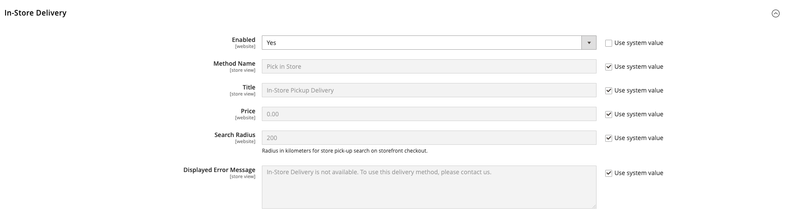
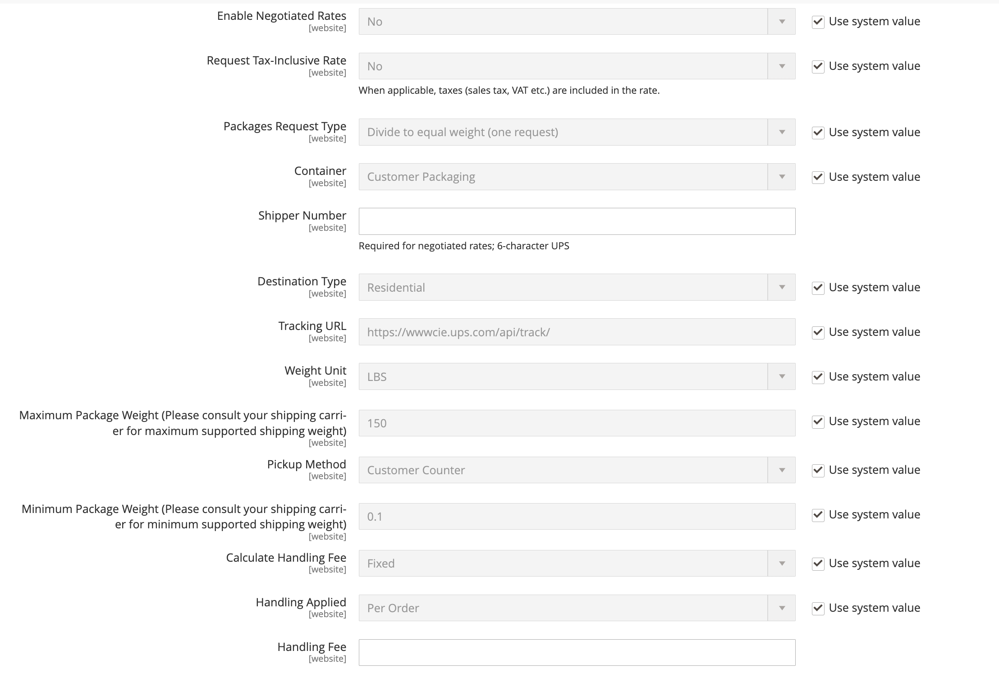
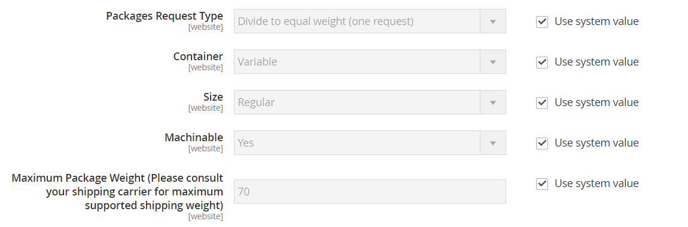
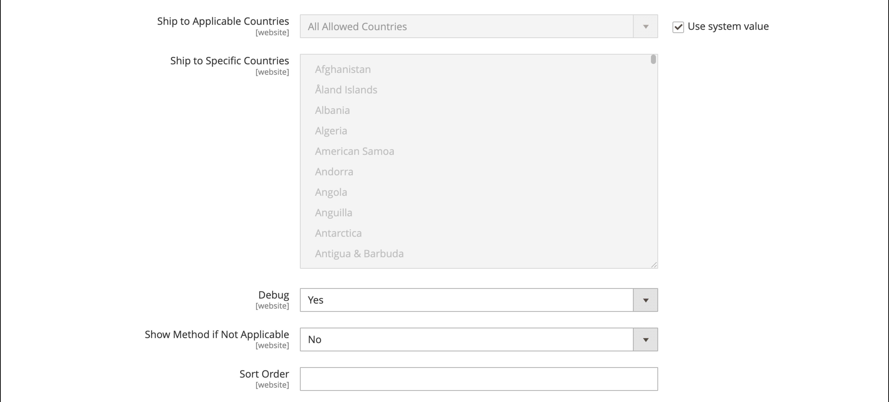

# [!UICONTROL Sales] > [!UICONTROL Delivery Methods]

{{config}}

## [!UICONTROL Basic Delivery Methods]

### [!UICONTROL Flat Rate]

<!-- zoom -->

<!-- [Flat Rate](https://docs.magento.com/user-guide/shipping/shipping-flat-rate.html) -->

| Veld | [Toepassingsgebied](../../getting-started/websites-stores-views.md#scope-settings) | Beschrijving |
|--- |--- |--- |
| [!UICONTROL Enabled] | Website | Als deze optie is ingeschakeld, wordt een Platte snelheid weergegeven als een optie in het dialoogvenster _Verzending en belasting schatten_ het gedeelte van het winkelwagentje en in de _Verzending_ -sectie tijdens het afrekenen. Opties: `Yes` / `No` |
| [!UICONTROL Title] | Winkelweergave | De naam die tijdens het afrekenen voor deze verzendmethode wordt gebruikt. |
| [!UICONTROL Method Name] | Winkelweergave | Een naam die de berekeningsmethode beschrijft die wordt gebruikt om een schatting van de verzendkosten te maken. De naam van de methode staat naast de berekende geschatte snelheid in het winkelwagentje. De standaardwaarde is `Fixed`. |
| [!UICONTROL Type] | Website | Beschrijft het type berekening dat wordt gebruikt om het vaste tarief te bepalen. Opties:  **`None`**- Er wordt geen berekening gebruikt. Hiermee stelt u de vaste snelheid in op nul. Dit is het equivalent van gratis verzending. **`Per Order`** - Hiermee wordt één vast tarief in rekening gebracht voor de gehele bestelling.  **`Per Item`**- brengt voor elk artikel in het winkelwagentje een afzonderlijk forfaitair tarief in rekening. Het tarief wordt vermenigvuldigd met het aantal punten in het karretje, zelfs als de totale hoeveelheid een combinatie van verschillende posten omvat. |
| [!UICONTROL Price] | Website | De prijs die je de klant in rekening brengt voor vaste verzendkosten. |
| [!UICONTROL Calculate Handling Fee] | Website | Bepaalt hoe de behandelingskosten worden berekend, indien inbegrepen. Opties: `Fixed` / `Percent` |
| [!UICONTROL Handling Fee] | Website | Voer het bedrag in dat moet worden aangerekend voor een verpakkingskosten op basis van de methode die u hebt gekozen voor de berekening van het bedrag. Als de vergoeding bijvoorbeeld op een vaste vergoeding is gebaseerd, voert u het bedrag in als een decimaal, bijvoorbeeld 4,90. Als de behandelingskosten echter zijn gebaseerd op een percentage van de bestelling, voert u het bedrag in als een percentage. Als u bijvoorbeeld zes procent van de bestelling in rekening brengt, voert u de waarde in als `.06`. |
| [!UICONTROL Displayed Error Message] | Winkelweergave | Een bericht dat verschijnt als een klant Plat Tarief kiest, maar om één of andere reden is de methode niet beschikbaar. |
| [!UICONTROL Ship to Applicable Countries] | Website | Identificeert de landen waar je vaste verzendkosten aanbiedt. Opties:  **`All Allowed Countries`**- Klanten uit elk land dat in de winkelconfiguratie is opgegeven, kunnen gebruikmaken van vaste verzendkosten. **`Specific Countries`** - Klanten uit alleen bepaalde landen kunnen gebruikmaken van vaste verzendkosten. |
| [!UICONTROL Ship to Specific Countries] | Website | Identificeert elk land waar de klanten de Vaste Verzending van het Tarief kunnen gebruiken. |
| [!UICONTROL Show Method if Not Applicable] | Website | Hiermee wordt bepaald of Platte snelheid tijdens het uitchecken wordt weergegeven als de methode niet van toepassing is op de aankoop. Opties: `Yes` / `No` |
| [!UICONTROL Sort Order] | Website | Een getal dat de volgorde bepaalt waarin Platte snelheid wordt weergegeven wanneer dit tijdens het uitchecken wordt vermeld met andere leveringsmethoden. |

{style="table-layout:auto"}

### [!UICONTROL Free Shipping]

<!-- zoom -->

<!-- [Free Shipping](https://docs.magento.com/user-guide/shipping/shipping-free.html) -->

| Veld | [Toepassingsgebied](../../getting-started/websites-stores-views.md#scope-settings) | Beschrijving |
|--- |--- |--- |
| [!UICONTROL Enabled] | Website | Als deze optie is ingeschakeld, wordt Gratis verzending tijdens het afrekenen weergegeven als een optie in de sectie Verzending. Opties: `Yes` / `No` |
| [!UICONTROL Title] | Winkelweergave | De naam die tijdens het afrekenen voor deze verzendmethode wordt gebruikt. |
| Naam methode | Winkelweergave | Een naam die de berekeningsmethode beschrijft die wordt gebruikt om een schatting van de verzendkosten te maken. De naam van de methode staat naast de berekende geschatte snelheid in het winkelwagentje. De standaardwaarde is `Free`. |
| Minimumbedrag bestelling | Website | De minimale aanschaf die vereist is om Free Shipping toe te passen op een bestelling. |
| Inclusief BTW op bedrag | Website | Hiermee wordt bepaald of de belasting is opgenomen in de berekening van het minimumorderbedrag. Opties:  **Ja** - Belasting wordt in aanmerking genomen bij de berekening van het minimumbedrag voor bestellingen (Subtotaal + Belasting - Korting). **Nee** - Belasting is niet inbegrepen bij de berekening van het minimumbedrag van de bestelling (Subtotaal - Korting). |
| Foutbericht weergeven | Winkelweergave | Een bericht dat wordt weergegeven als een klant Free Shipping kiest, maar om welke reden dan ook is de methode niet beschikbaar. |
| Schip naar landen van toepassing | Website | Identificeert de landen waar je Gratis verzending aanbiedt. Opties:  **Alle toegestane landen** - Klanten uit elk land dat in de winkelconfiguratie is opgegeven, kunnen gebruikmaken van de optie Free Shipping.  **Specifieke landen** - Klanten uit alleen bepaalde landen kunnen gebruikmaken van de optie voor gratis verzending. |
| Schip naar specifieke landen | Website | Identificeert elk land waar klanten de Gratis Verzending kunnen gebruiken. |
| Methode tonen indien niet van toepassing | Website | Hiermee bepaalt u of Gratis verzending tijdens het afrekenen wordt weergegeven als de methode niet van toepassing is op de aankoop. Opties: `Yes` / `No` |
| [!UICONTROL Sort Order] | Website | Een getal dat de volgorde bepaalt waarin Free Shipping wordt weergegeven wanneer deze bij andere leveringsmethoden wordt aangeboden tijdens het afrekenen. |

{style="table-layout:auto"}

### [!UICONTROL Table Rates]

<!-- zoom -->

<!-- [Table Rates](https://docs.magento.com/user-guide/shipping/shipping-table-rate.html) -->

| Veld | [Toepassingsgebied](../../getting-started/websites-stores-views.md#scope-settings) | Beschrijving |
|--- |--- |--- |
| [!UICONTROL Enabled] | Website | Als Tabeltarieven zijn ingeschakeld, wordt deze weergegeven als een optie in de sectie Schatting van verzending en belasting van het winkelwagentje en in de sectie Verzending tijdens het afrekenen. Opties: `Yes` / `No` |
| [!UICONTROL Title] | Winkelweergave | De naam die tijdens het afrekenen voor deze verzendmethode wordt gebruikt. |
| Naam methode | Winkelweergave | Een naam die de berekeningsmethode beschrijft die wordt gebruikt om een schatting van de verzendkosten te maken. De naam van de methode staat naast de berekende geschatte snelheid in het winkelwagentje. De standaardwaarde is `Table Rate`. |
| [!UICONTROL Condition] | Website | Hiermee bepaalt u de voorwaarde waarop de berekening wordt gebaseerd. De indeling van het CSV-bestand dat wordt geüpload, is specifiek voor elke voorwaarde. Opties: `Weight vs. Destination` / `Price vs. Destination` / `# of Items vs. Destination` |
| [!UICONTROL Include Virtual Products in Price Calculation] | Website | Hiermee wordt bepaald of virtuele producten, waarvoor geen verzending vereist is, worden opgenomen in de berekening van de tabeltarieven. |
| [!UICONTROL Calculate Handling Fee] | Website | Bepaalt hoe de behandelingskosten worden berekend, indien inbegrepen. Opties: `Fixed` / `Percent` |
| [!UICONTROL Handling Fee] | Website | Het bedrag aan kosten dat aan de verzendkosten wordt toegevoegd om de kosten van de afhandeling van de zending te dekken. Voer de waarde in als decimaal. Als de vergoeding bijvoorbeeld op een percentage is gebaseerd, voert u 0,06 in plaats van 6 % in. Voor een vast bedrag voert u `6.00`. |
| [!UICONTROL Displayed Error Message] | Winkelweergave | Een bericht dat verschijnt als een klant de Tarieven van de Lijst kiest, maar om wat reden is de methode niet beschikbaar. |
| [!UICONTROL Ship to Applicable Countries] | Website | Hiermee geeft u aan in welke landen je verzendkosten voor tabeltarieven aanbiedt. Opties:  **`All Allowed Countries`**- Klanten uit elk land dat in de winkelconfiguratie is opgegeven, kunnen gebruikmaken van de verzending van tabeltarieven. **`Specific Countries`** - Klanten uit alleen bepaalde landen kunnen gebruikmaken van de verzendkosten voor tabeltarieven. |
| [!UICONTROL Ship to Specific Countries] | Website | Identificeert elk land waar de klanten het verschepen van het Tarief van de Lijst kunnen gebruiken. |
| [!UICONTROL Show Method if Not Applicable] | Website | Hiermee wordt bepaald of Tabeltarieven tijdens het afrekenen als optie worden weergegeven als de methode niet van toepassing is op de aankoop. Opties: `Yes` / `No` |
| [!UICONTROL Sort Order] | Website | Een getal dat de volgorde bepaalt waarin Tabeltarieven worden weergegeven wanneer deze bij andere leveringsmethoden worden vermeld tijdens het afrekenen. |

{style="table-layout:auto"}

### [!UICONTROL In-Store Delivery]

<!-- zoom -->

<!-- [In-Store Delivery](https://docs.magento.com/user-guide/shipping/shipping-in-store-delivery.html) -->

| Veld | [Toepassingsgebied](../../getting-started/websites-stores-views.md#scope-settings) | Beschrijving |
|--- |--- |--- |
| [!UICONTROL Enabled] | Website | Indien ingeschakeld kan de levering in de winkel als een optie worden weergegeven in het dialoogvenster _Verzending en belasting schatten_ het gedeelte van het winkelwagentje en in de _Verzending_ -sectie tijdens het afrekenen. Opties: `Yes` / `No` |
| [!UICONTROL Method Name] | Winkelweergave | Een naam die de ophaalfunctie in de winkel identificeert als een verzendmethode. Deze waarde wordt weergegeven als het label van een tab boven aan de pagina Verzendkosten en in de tabel met beschikbare verzendmethoden onder aan dezelfde pagina. De standaardwaarde is `In-store Delivery`. |
| [!UICONTROL Title] | Winkelweergave | De naam die tijdens het afrekenen voor deze verzendmethode wordt gebruikt. |
| [!UICONTROL Price] | Website | De prijs die u de klant aanrekent voor het ophalen in de winkel. |
| [!UICONTROL Search Radius] | Website | De straal in km die moet worden gebruikt bij het zoeken naar ophaallocaties. |
| [!UICONTROL Displayed Error Message] | Winkelweergave | Een bericht dat wordt weergegeven wanneer een klant in-store oppikken selecteert, maar de leveringsmethode niet beschikbaar is. |

{style="table-layout:auto"}

## [!UICONTROL Carriers]

### [!UICONTROL UPS]

{{ups-api}}

{{beta2-updates}}

<!-- zoom -->

<!-- [UPS XML Account Settings](https://docs.magento.com/user-guide/shipping/ups.html) -->

| Veld | [Toepassingsgebied](../../getting-started/websites-stores-views.md#scope-settings) | Beschrijving |
|--- |--- |--- |
| [!UICONTROL Enabled for Checkout] | Website | Hiermee bepaalt u of UPS tijdens het afrekenen beschikbaar is voor klanten als verzendmethode. Opties: `Yes` / `No` |
| [!UICONTROL Enabled for RMA] | Website | Hiermee bepaalt u of UPS beschikbaar is voor klanten als verzendmethode voor een RMA. Opties: `Yes` / `No` |
| [!UICONTROL UPS Type] | Winkelweergave | Geeft de methode aan die wordt gebruikt om verbinding te maken met het UPS-verzendsysteem. Opties:  **`United Parcel Service XML`**- (Standaard) Uw winkel verzendt een XML-bestand met gegevens als een aanvraag naar UPS. **`United Parcel Service`** - Uw winkel stuurt sleutelwaardeparen naar UPS als een aanvraag.   **_Opmerking:_**Het standaardtype van de Dienst van United Parcel is gepland voor afgekeurde in Handel. Voor nieuwe configuraties, zou u moeten gebruiken [!UICONTROL United Parcel Service XML] type. |
| _[!UICONTROL UPS Account Settings]_ |  |  |
| [!UICONTROL Live Account] | Winkelweergave | Geeft aan dat de account United Parcel Service live is. Opties: `Yes` / `No` |
| [!UICONTROL Gateway URL] | Website | De URL die verbinding maakt met het UPS-systeem om dynamische verzendkosten op te halen. UPS stopt de ondersteuning van HTTP. Standaardwaarde: `https://www.ups.com/using/services/rave/qcostcgi.cgi` |
| [!UICONTROL Title] | Winkelweergave | De naam die tijdens het afrekenen voor deze verzendmethode wordt gebruikt. |
| _[!UICONTROL UPS XML Account Settings]_ |  |  |
| [!UICONTROL Access License Number] | Website | Het toegangslicentienummer van uw UPS-verzendaccount. |
| [!UICONTROL Gateway XML URL] | Website | Voor UPS XML-service worden de volgende URL&#39;s weergegeven die vereist zijn om XML-gegevens te verzenden: Gateway XML URL, Tracking XML URL, Shipping Confirm XML URL, Shipping Accept XML URL |
| [!UICONTROL Mode] | Website | Bepaalt de wijze van transmissie die voor gegevens wordt gebruikt die naar het systeem UPS worden verzonden. Opties:  **`Development`**- UPS controleert niet of gegevens die van de Commerce-server zijn ontvangen via SSL worden verzonden. **`Live`** - UPS controleert of gegevens die van de Commerce-server zijn ontvangen, via een Secure Socket Layer (SSL) worden verzonden. |
| Gebruikersnaam | Website | Gebruikersnaam van je UPS-verzendaccount. |
| [!UICONTROL Origin of the Shipment] | Website | (Alleen UPS XML) Het land of de regio waar de verzending van het product vandaan komt. |
| [!UICONTROL Password] | Winkelweergave | Wachtwoord voor UPS-verzendaccount. |

{style="table-layout:auto"}

<!-- zoom -->

<!-- [UPS Package Information](https://docs.magento.com/user-guide/shipping/ups.html) -->

| Veld | [Toepassingsgebied](../../getting-started/websites-stores-views.md#scope-settings) | Beschrijving |
|--- |--- |--- |
| _[!UICONTROL UPS Negotiated Rate Settings]_ |  |  |
| [!UICONTROL Enable Negotiated Rates] | Website | (Alleen UPS XML) Hiermee schakelt u speciale tarieven in of uit, afhankelijk van uw overeenkomst met UPS. Opties: `Yes` / `No` |
| [!UICONTROL Packages Request Type] | Website | Hiermee bepaalt u hoe gewicht wordt berekend voor overbrengingen met meerdere pakketten. Opties: `Divide to equal weight (one request)` / `Use origin weight (multiple requests)` |
| [!UICONTROL Shipper Number] | Website | (Alleen UPS-XML) Het uit zes tekens bestaande UPS-verzendnummer is vereist als referentie voor het gebruik van overeengekomen tarieven. |
| [!UICONTROL Container] | Website | Hiermee stelt u het containertype in dat wordt gebruikt voor het verzenden van pakketorders. Opties: `Customer Packaging` / `UPS Letter Envelope` / `Customer Packaging` / `UPS Letter Envelope` / `UPS Tube` / `UPS Express Box` / `UPS Worldwide 25 kilo` / `UPS Worldwide 10 kilo` |
| [!UICONTROL Weight Unit] | Website | Hiermee stelt u de standaardmaateenheid voor productgewicht in uw winkel in. Zie [Afmetingen](../../stores-purchase/carriers.md#dimensional-weight) voor aanvullende informatie. |
| [!UICONTROL Tracking XML URL] | Website | (Alleen UPS XML) De URL van UPS die wordt gebruikt om pakketten bij te houden. |
| [!UICONTROL Destination Type] | Website | Hiermee stelt u het standaardtype van de verzendbestemming in. Opties: `Business` / `Residential` |
| [!UICONTROL Maximum Package Weight] | Website | Hiermee stelt u het maximumgewicht in dat een pakket kan krijgen zoals opgegeven door UPS. Als de bestelde producten het maximale pakketgewicht overschrijden, is deze verzendoptie niet beschikbaar. Volgens [UPS.com](https://www.ups.com/us/en/global.page), pakketten mogen niet meer dan 70 lbs (150 kg) zijn. Vraag uw verzendende provider om het maximumgewicht te controleren. |
| [!UICONTROL Pickup Method] | Website | Hiermee stelt u de ophaalmethode voor UPS in. Opties: `Regular Daily Pickup` / `On Call Air` / `One Time Pickup` / `Letter Center` / `Customer Counter` |
| [!UICONTROL Minimum Package Weight] | Website | Hiermee stelt u het minimumgewicht in dat een pakket kan hebben zoals opgegeven door UPS. Als de bestelde producten minder wegen dan het minimumpakketgewicht, is deze verzendoptie niet beschikbaar. Neem contact op met de vervoerder om het minimumgewicht te controleren. |
| [!UICONTROL Calculate Handling Fee] | Website | Hiermee stelt u de berekeningsmethode voor de behandelingskosten in voor het verzenden van tabeltarieven. Opties:  **`Fixed`**- Verhandelingskosten zijn een vast tarief. **`Percent`** - De verwerkingskosten worden berekend als een percentage van het orderbedrag. |
| [!UICONTROL Handling Applied] | Website | Geeft aan of behandelingskosten worden toegepast op elke bestelling of op elk pakket binnen een bestelling. |
| [!UICONTROL Handling Fee] | Website | Hiermee stelt u de afhandeling in die bij de verzendprijs wordt inbegrepen. De verwerkingskosten kunnen worden vastgesteld als een vast bedrag of als een percentage.   **_Opmerking:_**Gebruik de decimale notatie als u een percentage typt `0.25` voor 25%. |

{style="table-layout:auto"}

<!-- zoom -->

<!-- [UPS Allowed Methods](https://docs.magento.com/user-guide/shipping/ups.html) -->

| Veld | [Toepassingsgebied](../../getting-started/websites-stores-views.md#scope-settings) | Beschrijving |
|--- |--- |--- |
| _[!UICONTROL UPS allowed methods]_ |  |  |
| [!UICONTROL Allowed Methods] | Website | Geeft de toegestane verzendmethoden voor UPS aan die aan klanten worden aangeboden. De verzendkosten worden berekend op basis van de geselecteerde verzendmethode. |
| [!UICONTROL Free Method] | Website | Geeft aan welke methode wordt gebruikt voor de methode voor gratis verzending via UPS. Kies Geen als u de optie voor gratis verzending wilt uitschakelen.   **_Opmerking:_**Deze methode is vergelijkbaar met de basismethode [Gratis verzending](../../stores-purchase/shipping-free.md), maar wordt weergegeven als een UPS-verzendoptie tijdens het afrekenen. |
| [!UICONTROL Free Shipping Amount Threshold] | Website | Hiermee bepaalt u of gratis verzending wordt toegepast wanneer het orderbedrag de drempel voor gratis verzending overschrijdt. Opties: `Enable` / `Disable` |
| [!UICONTROL Free Shipping Amount Threshold] | Website | Hiermee stelt u het minimale totale bedrag in dat een bestelling moet bereiken om in aanmerking te komen voor gratis verzending. |
| [!UICONTROL Displayed Error Message] | Winkelweergave | Het foutbericht dat wordt weergegeven wanneer deze verzendmethode om welke reden dan ook niet beschikbaar is. |

{style="table-layout:auto"}

<!-- zoom -->

<!-- [UPS Applicable Countries and Other Settings](https://docs.magento.com/user-guide/shipping/ups.html) -->

| Veld | [Toepassingsgebied](../../getting-started/websites-stores-views.md#scope-settings) | Beschrijving |
|--- |--- |--- |
| _[!UICONTROL UPS Applicable countries and other Settings]_ |  |  |
| [!UICONTROL Ship to Applicable Countries] | Website | Geeft aan welk land klanten deze verzendmethode mogen gebruiken. Opties:  **`All Allowed Countries`**- Klanten van iedereen [landen](../../getting-started/store-details.md#country-options) Deze verzendmethode kan worden gebruikt. **`Specific Countries`** - Nadat u deze optie hebt gekozen, [!UICONTROL Ship to Specific Countries] wordt weergegeven. Selecteer elk land in de lijst waar deze verzendmethode kan worden gebruikt. |
| [!UICONTROL Show Method if Not Applicable] | Website | Hiermee bepaalt u of UPS altijd wordt weergegeven als een verzendoptie tijdens het afrekenen. Opties:  **`Yes`**- UPS wordt altijd weergegeven als een verzendoptie tijdens het afrekenen, zelfs als dit niet van toepassing is op de bestelling. **`No`** - UPS wordt alleen weergegeven als een verzendoptie tijdens het afrekenen als dit van toepassing is op de bestelling. (Bijvoorbeeld, als het ordegewicht de maximumgewichtshoeveelheid overschrijdt.) |
| [!UICONTROL Debug] | Website | Specificeert als de gegevenstransmissies tussen uw opslag en UPS het systeem voor het zuiveren worden geregistreerd. Tenzij er een kwestie is die moet worden gevolgd en worden geregistreerd, zou deze optie moeten worden geplaatst aan `No`. |
| [!UICONTROL Sort Order] | Website | Een getal dat de volgorde bepaalt waarin UPS wordt weergegeven wanneer UPS tijdens het uitchecken wordt vermeld met andere leveringsmethoden. Enter `0` boven aan de lijst. |

{style="table-layout:auto"}

### [!UICONTROL USPS]

{{beta2-updates}}

| Veld | [Toepassingsgebied](../../getting-started/websites-stores-views.md#scope-settings) | Beschrijving |
|--- |--- |--- |
| Ingeschakeld voor Afhandeling | Website | Hiermee bepaalt u of USPS tijdens het afrekenen beschikbaar is voor klanten als verzendmethode. Opties: `Yes` / `No` |
| _[!UICONTROL USPS Account Settings]_ |  |  |
| [!UICONTROL Gateway URL] | Website | De URL die wordt gebruikt om verbinding te maken met het USPS-systeem om de verzendkosten dynamisch op te halen. |
| [!UICONTROL Secure Gateway URL] | Website | De veilige URL die wordt gebruikt om via SSL (Secure Socket Layer) verbinding te maken met het USPS-systeem om de verzendsnelheden dynamisch op te halen. |
| [!UICONTROL Title] | Winkelweergave | De titel van deze verzendoptie zoals deze wordt weergegeven in het winkelwagentje. |
| [!UICONTROL User ID] | Website | Je gebruikersnaam van de Verzendaccount van USPS. |
| [!UICONTROL Password] | Website | Wachtwoord voor verzendaccount van USPS. |
| [!UICONTROL Mode] | Website | Bepaalt de wijze van transmissie die voor gegevens wordt gebruikt die naar het systeem USPS worden verzonden. U kunt onder andere de volgende opties kiezen:  **`Development`**- USPS controleert niet of gegevens die van de Commerce-server zijn ontvangen via SSL worden verzonden. **`Live`** - USPS controleert of gegevens die van de Commerce-server zijn ontvangen, via een Secure Socket Layer (SSL) worden verzonden. |

{style="table-layout:auto"}

<!-- zoom -->

<!-- [USPS Packaging Settings](https://docs.magento.com/user-guide/shipping/usps.html) -->

| Veld | [Toepassingsgebied](../../getting-started/websites-stores-views.md#scope-settings) | Beschrijving |
|--- |--- |--- |
| _[!UICONTROL USPS packaging Settings]_ |  |  |
| [!UICONTROL Packages Request Type] | Website | Hiermee bepaalt u hoe gewicht wordt berekend voor overbrengingen met meerdere pakketten. Opties: `Divide to equal weight (one request)` / `Use origin weight (multiple requests)` |
| [!UICONTROL Container] | Website | Hiermee stelt u het containertype in dat wordt gebruikt voor het verzenden van pakketorders. Opties: `Variable` / `Flat Rate Box` / `Flat Rate Envelope` / `Rectangular` / Niet-rechthoekig |
| [!UICONTROL Size] | Website | Hiermee stelt u de optie Grootte in op de standaardgrootte van het verzendpakket. Deze optie is van invloed op de berekening van de verzendkosten. Opties: `Regular` / `Large` / `Oversize` |
| [!UICONTROL Machinable] | Website | Geeft aan of het pakket door de computer kan worden verwerkt. Deze optie is van invloed op de berekening van de verzendkosten. |
| [!UICONTROL Maximum Package Weight] | Website | Hiermee stelt u het maximumgewicht in dat een pakket kan krijgen, zoals opgegeven door USPS. Als de bestelde producten het maximale pakketgewicht overschrijden, is deze verzendoptie niet beschikbaar. |

{style="table-layout:auto"}

<!-- zoom -->

<!-- [USPS Handling Fee Settings](https://docs.magento.com/user-guide/shipping/usps.html) -->

| Veld | [Toepassingsgebied](../../getting-started/websites-stores-views.md#scope-settings) | Beschrijving |
|--- |--- |--- |
| _[!UICONTROL USPS Handling Fee settings]_ |  |  |
| [!UICONTROL Calculate Handling Fee] | Website | Hiermee stelt u de berekeningsmethode voor de behandelingskosten in voor het verzenden van tabeltarieven. Opties:  **`Fixed`**- Verhandelingskosten zijn een vast tarief. **`Percent`** - De verwerkingskosten worden berekend als een percentage van het orderbedrag. |
| [!UICONTROL Handling Applied] | Website | Geeft aan of behandelingskosten worden toegepast op elke bestelling of op elk pakket binnen een bestelling. |
| [!UICONTROL Handling Fee] | Website | Hiermee stelt u de afhandeling in die bij de verzendprijs wordt inbegrepen. De verwerkingskosten kunnen worden vastgesteld als een vast bedrag of als een percentage.   **_Opmerking:_**Gebruik bij het typen van een percentage de decimale notatie `0.25` voor 25%. |

{style="table-layout:auto"}

<!-- zoom -->

<!-- [USPS Allowed Methods](https://docs.magento.com/user-guide/shipping/usps.html) -->

| Veld | [Toepassingsgebied](../../getting-started/websites-stores-views.md#scope-settings) | Beschrijving |
|--- |--- |--- |
| _[!UICONTROL USPS Allowed Methods]_ |  |  |
| [!UICONTROL Allowed Methods] | Website | Geeft de toegestane verzendmethoden van USPS aan die aan klanten worden aangeboden. De verzendkosten worden berekend op basis van de geselecteerde verzendmethode. |
| [!UICONTROL Free Method] | Website | Stelt de methode voor gratis verzending in via USPS, of kan worden uitgeschakeld door `None`.   **_Opmerking:_**Deze verzendmethode is vergelijkbaar met de methode voor gratis verzending van je winkel. Deze wordt echter wel aangeboden als een verzendoptie voor USPS en geïdentificeerd als verzending voor USPS. |
| [!UICONTROL Minimum Order Amount for Free Shipping] | Website | Hiermee stelt u het minimale orderbedrag in dat moet worden behaald om in aanmerking te komen voor gratis verzending. |
| [!UICONTROL Displayed Error Message] | Winkelweergave | Het foutbericht dat wordt weergegeven wanneer USPS om welke reden dan ook niet beschikbaar is. |

{style="table-layout:auto"}

<!-- zoom -->

<!-- [USPS Applicable Countries](https://docs.magento.com/user-guide/shipping/usps.html) -->

| Veld | [Toepassingsgebied](../../getting-started/websites-stores-views.md#scope-settings) | Beschrijving |
|--- |--- |--- |
| _[!UICONTROL USPS Applicable Countries]_ |  |  |
| [!UICONTROL Ship to Applicable Countries] | Website | Hiermee geeft u aan in welke landen bestellingen kunnen worden verzonden. Opties:  **`All Allowed Countries`**- Klanten van iedereen [landen](../../getting-started/store-details.md#country-options) Deze verzendmethode kan worden gebruikt. **`Specific Countries`** - Nadat u deze optie hebt gekozen, [!UICONTROL Ship to Specific Countries] wordt weergegeven. Selecteer elk land in de lijst waar deze verzendmethode kan worden gebruikt. |
| [!UICONTROL Show Method if Not Applicable] | Website | Hiermee regelt u de weergave van verzendingen door USPS tijdens het afrekenen. Opties:  **`Yes`**- USPS wordt altijd weergegeven als een verzendoptie tijdens het afrekenen, zelfs als dit niet van toepassing is op de bestelling. **`No`** - USPS wordt alleen weergegeven als een verzendoptie tijdens het afrekenen als dit van toepassing is op de bestelling (het gewicht van de bestelling is dus hoger dan het maximumgewicht). |
| [!UICONTROL Debug] | Website | Hiermee wordt bepaald of het systeem voor foutopsporing een logboek met gegevensverzendingen tussen uw opslag en USPS bijhoudt. Tenzij er een kwestie is die moet worden gevolgd en worden geregistreerd, zou deze optie moeten worden geplaatst aan `No`. |
| [!UICONTROL Sort Order] | Website | Een getal dat de volgorde bepaalt waarin USPS wordt weergegeven wanneer het tijdens het uitchecken wordt weergegeven bij andere leveringsmethoden. Enter `0` boven aan de lijst. |

{style="table-layout:auto"}

### [!UICONTROL FedEx]

{{beta2-updates}}

<!-- zoom -->

<!-- [FedEx Account Settings](https://docs.magento.com/user-guide/shipping/fedex.html) -->

| Veld | [Toepassingsgebied](../../getting-started/websites-stores-views.md#scope-settings) | Beschrijving |
|--- |--- |--- |
| _[!UICONTROL FedEx Account Settings]_ |  |  |
| [!UICONTROL Enabled for Checkout] | Website | Hiermee wordt bepaald of FedEx beschikbaar is voor klanten als verzendmethode tijdens het afrekenen. Opties: `Yes` / `No` |
| [!UICONTROL Title] | Winkelweergave | De titel van deze verzendoptie zoals deze wordt weergegeven in het winkelwagentje. |
| [!UICONTROL Account ID] | Website | Je FedEx-account-id. |
| [!UICONTROL Meter Number] | Website | Uw FedEx-meternummer. |
| [!UICONTROL Key] | Website | De sleutel van uw FedEx-account. |
| [!UICONTROL Password] | Website | Wachtwoord voor uw FedEx-account. |
| [!UICONTROL Sandbox Mode] | Website | Als u FedEx-transacties wilt uitvoeren in een testomgeving, stelt u Sandboxmodus in op `Yes`. Opties: `Yes` / `No`. |
| [!UICONTROL Web-Services URL] | Website | De vereiste URL is afhankelijk van de instelling voor de sandboxmodus. Opties:  **`Production`**- De URL voor toegang tot FedEx-webservices wanneer de winkel live is. **`Sandbox`** - De URL voor toegang tot de testomgeving voor FedEx-webservices. |

{style="table-layout:auto"}

<!-- zoom -->

<!-- [FedEx Packaging](https://docs.magento.com/user-guide/shipping/fedex.html) -->

| Veld | [Toepassingsgebied](../../getting-started/websites-stores-views.md#scope-settings) | Beschrijving |
|--- |--- |--- |
| _[!UICONTROL FedEx Packaging Settings]_ |  |  |
| [!UICONTROL Packages Request Type] | Website | Hiermee bepaalt u hoe gewicht wordt berekend voor overbrengingen met meerdere pakketten. Opties: `Divide to equal weight (one request)` / `Use origin weight (multiple requests)` |
| [!UICONTROL Packaging] | Website | Selecteer in de lijst het containertype dat u doorgaans gebruikt voor het verpakken van producten die in de winkel worden besteld. |
| [!UICONTROL Dropoff] | Website | Selecteer in de lijst de ophaalmethode:  **`Regular Pickup`**- (Standaardinstelling) Als u een groot aantal overbrengingen hebt, kan het rendabel zijn om regelmatig ophalingen te organiseren. **`Request Courier`** - Je moet een FedEx-koerier bellen en vragen om verzendingen op te halen.  **`Drop Box`**- U moet de verzendingen bij uw lokale FedEx-drop box neerzetten. **`Business Service Center`** - U moet de verzendingen bij uw lokale FedEx-servicecentrum neerzetten.  **`Station`**- U moet verzendingen bij uw lokale FedEx-station neerzetten. |
| [!UICONTROL Maximum Package Weight] | Website | De standaardwaarde voor FedEx is 150 pond. Raadpleeg uw verzendende provider voor maximaal ondersteund gewicht. Het gebruik van de standaardwaarde wordt aanbevolen, tenzij u speciale regelingen met FedEx hebt. |

{style="table-layout:auto"}

<!-- zoom -->

<!-- [FedEx Handling Fee](https://docs.magento.com/user-guide/shipping/fedex.html) -->

| Veld | [Toepassingsgebied](../../getting-started/websites-stores-views.md#scope-settings) | Beschrijving |
|--- |--- |--- |
| _[!UICONTROL FedEx Handling Fee Settings]_ |  |  |
| [!UICONTROL Calculate Handling Fee] | Website | Bepaalt de methode die wordt gebruikt om de behandelingskosten te berekenen. Opties: `Fixed Fee` / `Percentage`   **_Opmerking:_**De verpakkingskosten zijn optioneel en worden weergegeven als extra kosten die worden toegevoegd aan de verzendkosten van FedEx. |
| [!UICONTROL Handling Applied] | Website | Hiermee bepaalt u hoe behandelingskosten worden toegepast. Opties: `Per Order` / `Per Package` |
| [!UICONTROL Handling Fee] | Website | Geeft het bedrag aan dat in rekening wordt gebracht als een behandelingsvergoeding, op basis van de methode die wordt gebruikt om het bedrag te berekenen. Als de vergoeding op een vaste vergoeding is gebaseerd, voert u het bedrag in als een decimaal, bijvoorbeeld `4.90`. Als de behandelingskosten gebaseerd zijn op een percentage van de bestelling, voert u het bedrag in als een percentage. Als u bijvoorbeeld zes procent van de volgorde wilt opladen, voert u de waarde in als `.06`. |

{style="table-layout:auto"}

<!-- zoom -->

<!-- [FedEx Delivery Methods](https://docs.magento.com/user-guide/shipping/fedex.html) -->

| Veld | [Toepassingsgebied](../../getting-started/websites-stores-views.md#scope-settings) | Beschrijving |
|--- |--- |--- |
| _[!UICONTROL FedEx delivery methods]_ |  |  |
| [!UICONTROL Residential Delivery] | Website | Stel dit in op een van de volgende opties, afhankelijk van het feit of u Business-to-Consumer (B2C) of Business-to-Business (B2B) verkoopt:  **`Yes`**- voor B2C-leveringen **`No`** - voor B2B-leveringen |
| [!UICONTROL Allowed Methods] | Website | Selecteer in de lijst de verzendmethoden die u ondersteunt. De methoden zijn afhankelijk van uw FedEx-account, de frequentie en de grootte van uw verzendingen en of u internationale verzendingen toestaat. Als verkoper kun je besluiten alleen verzending op de grond aan te bieden. |
| [!UICONTROL Hub ID] | Website | Een id die wordt geleverd door FedEx en die wordt gebruikt met de [!DNL Smart Post] methode. |
| [!UICONTROL Free Method] | Website | Selecteer in de lijst de verzendmethode die je wilt gebruiken voor voorstellen voor gratis verzending.   **_Opmerking:_**Deze verzendmethode is vergelijkbaar met de normale methode voor gratis verzending, maar wordt vermeld in de verzendopties van FedEx en geïdentificeerd als FedEx-verzendmethode. |
| [!UICONTROL Free Shipping Amount Threshold] | Website | Hiermee bepaalt u of een minimumbestelling vereist is voor gratis verzending. Opties:  **`Enable`**- Maakt gratis verzending via FedEx mogelijk voor bestellingen die aan het minimumbedrag voldoen. **`Disable`** - Schakelt gratis verzending via FedEx met minimale bestelling uit. |
| [!UICONTROL Free Shipping Amount Threshold] | Website | Hiermee geeft u het minimale orderbedrag op dat vereist is voor gratis verzending. |
| [!UICONTROL Displayed Error Message] | Winkelweergave | Het bericht dat wordt weergegeven wanneer FedEx om welke reden dan ook niet beschikbaar is. U kunt het standaardbericht gebruiken of een ander ingaan. |

{style="table-layout:auto"}

<!-- zoom -->

<!-- [FedEx Applicable Countries](https://docs.magento.com/user-guide/shipping/fedex.html) -->

| Veld | [Toepassingsgebied](../../getting-started/websites-stores-views.md#scope-settings) | Beschrijving |
|--- |--- |--- |
| _[!UICONTROL FedEx Applicable Countries]_ |  |  |
| [!UICONTROL Ship to Applicable Countries] | Website | Geeft de landen aan waar uw klanten kunnen verzenden via FedEx. Opties:  **`All Allowed Countries`**- Klanten van iedereen [landen](../../getting-started/store-details.md#country-options) Deze verzendmethode kan worden gebruikt. **`Specific Countries`** - Nadat u deze optie hebt gekozen, [!UICONTROL Ship to Specific Countries] wordt weergegeven. Selecteer elk land in de lijst waar deze verzendmethode kan worden gebruikt. |
| [!UICONTROL Ship to Specific Countries] | Website | Geeft de specifieke landen aan waar uw klanten kunnen verzenden via FedEx. |
| [!UICONTROL Debug] | Website | Bepaalt als een logboek van gegevenstransmissies tussen uw opslag en FedEx door het systeem voor het zuiveren wordt gehandhaafd. Tenzij er een kwestie is die moet worden gevolgd en worden geregistreerd, zou deze optie moeten worden geplaatst aan `No`. |
| [!UICONTROL Show Method if Not Applicable] | Website | Hiermee bepaalt u wanneer FedEx wordt weergegeven als een verzendmethode tijdens het afrekenen. Opties:  **`Yes`**- De verzendoptie FedEx wordt weergegeven in de lijst met leveringsmethoden, ongeacht of de bestelling in aanmerking komt om deze te gebruiken. **`No`** - De verzendoptie FedEx wordt niet weergegeven in de lijst met leveringsmethoden als deze niet van toepassing is op de bestelling (bijvoorbeeld als het gewicht van de bestelling groter is dan het maximumgewicht). |
| [!UICONTROL Sort Order] | Website | Een getal dat de volgorde bepaalt waarin FedEx wordt weergegeven bij andere leveringsmethoden tijdens het afrekenen. Enter `0` boven aan de lijst. |

{style="table-layout:auto"}

### [!UICONTROL DHL]

<!-- zoom -->

<!-- [DHL Account Settings](https://docs.magento.com/user-guide/shipping/dhl.html) -->

| Veld | [Toepassingsgebied](../../getting-started/websites-stores-views.md#scope-settings) | Beschrijving |
|--- |--- |--- |
| _[!UICONTROL DHL Account Settings]_ |  |  |
| [!UICONTROL Enabled for Checkout] | Website | Hiermee wordt bepaald of DHL tijdens de afhandeling als verzendmethode voor klanten beschikbaar is. Opties: `Yes` / `No` |
| [!UICONTROL Title] | Winkelweergave | De titel van deze verzendmethode zoals deze wordt weergegeven tijdens het afrekenen. |
| [!UICONTROL Gateway URL] | Website | Gewoonlijk, kunt u de standaardGateway URL goedkeuren. Als DHL u echter een alternatieve URL heeft gegeven, voert u de waarde in dit veld in. |
| [!UICONTROL Access ID] | Website | Toegang-id voor uw DHL-verzendaccount. |
| [!UICONTROL Password] | Website | Wachtwoord voor uw DHL-verzendaccount. |
| [!UICONTROL Account Number] | Website | Uw DHL-verzendrekeningnummer. |

{style="table-layout:auto"}

<!-- zoom -->

<!-- [DHL Package Settings](https://docs.magento.com/user-guide/shipping/dhl.html) -->

| Veld | [Toepassingsgebied](../../getting-started/websites-stores-views.md#scope-settings) | Beschrijving |
|--- |--- |--- |
| _[!UICONTROL DHL Package Settings]_ |  |  |
| [!UICONTROL Calculate Handling Fee] | Website | De afhandelingskosten zijn optioneel en worden als extra kosten aan de DHL-verzendkosten toegevoegd. Selecteer in de lijst de methode die u wilt gebruiken voor het berekenen van afhandelingskosten. Opties: vaste kosten / percentage. |
| [!UICONTROL Handling Applied] | Website | Selecteer in de lijst hoe u de verwerkingskosten wilt toepassen. Opties: `Per Order` / `Per Package` |
| Verhandelingskosten | Website | Voer het bedrag in dat moet worden aangerekend voor een verpakkingskosten op basis van de methode die u hebt gekozen voor de berekening van het bedrag. Als de vergoeding bijvoorbeeld is gebaseerd op een vaste vergoeding, voert u het bedrag in als een decimaal, zoals `4.90`. Als de behandelingskosten echter zijn gebaseerd op een percentage van de bestelling, voert u het bedrag in als een percentage. Als u bijvoorbeeld zes procent van de bestelling in rekening brengt, voert u de waarde in als `.06`. |
| [!UICONTROL Divide Order Weight] | Winkelweergave | Hiermee wordt bepaald of het gewicht van een bestelling van meer dan 70 kg in kleinere eenheden kan worden verdeeld om een nauwkeurige verzendkosten te garanderen. Opties: `Yes` / `No` |
| [!UICONTROL Weight Unit] | Winkelweergave | Bepaalt de maateenheid voor gewicht die wordt gebruikt bij verzendberekeningen. Opties: `Pounds` / `Kilograms` |
| [!UICONTROL Size] | Winkelweergave | Bepaalt de grootte van het pakket. Opties:  **`Regular`**- de geleverde verpakkingen voldoen aan de normen van DHL. In de [!UICONTROL Allowed Methods] selecteert u elke verpakkingsmethode die wordt gebruikt om producten uit uw winkel te verzenden. **`Specific`** - Als de verzonden pakketten aangepaste afmetingen hebben, voert u het volgende in: [!UICONTROL Height (cm)] / [!UICONTROL Depth (cm)] / [!UICONTROL Width (cm)] |

{style="table-layout:auto"}

<!-- zoom -->

<!-- DHL Allowed Methods](https://docs.magento.com/user-guide/shipping/dhl.html) -->

| Veld | [Toepassingsgebied](../../getting-started/websites-stores-views.md#scope-settings) | Beschrijving |
|--- |--- |--- |
| _[!UICONTROL DHL allowed methods]_ |  |  |
| [!UICONTROL Allowed Methods] | Website | Selecteer in de lijst elke verzendmethode die u ondersteunt. |
| [!UICONTROL Ready Time] | Website | Hiermee geeft u aan wanneer het pakket gereed is voor ophalen, in uren, nadat een bestelling is verzonden. |
| [!UICONTROL Displayed Error Message] | Winkelweergave | Dit bericht wordt weergegeven wanneer DHL om welke reden dan ook niet beschikbaar is. U kunt het standaardbericht gebruiken of een eigen bericht ingaan. |
| [!UICONTROL Free Method] |  | Deze verzendmethode is vergelijkbaar met de gewone Vrij Verladen-methode, maar wordt vermeld in de DHL-scheepvaartopties en aangeduid als DHL-scheepvaart. Selecteer in de lijst de verzendmethode die je wilt gebruiken voor voorstellen voor gratis verzending. |
| [!UICONTROL Free Shipping with Minimum Order Amount] | Website | Stel een van de volgende opties in:  **`Enable`**- DHL gratis te laten verzenden voor bestellingen die aan het minimumbedrag voldoen. **`Disable`** - om geen gratis DHL-verzending met minimumbestelling aan te bieden. |
| [!UICONTROL Minimum Order Amount for Free Shipping] | Website | Als u [!UICONTROL Free Shipping with Minimum Order]Voer in het veld de minimale waarde voor het orderbedrag in. |

{style="table-layout:auto"}

<!-- zoom -->

<!-- [DHL Applicable Countries](https://docs.magento.com/user-guide/shipping/dhl.html) -->

| Veld | [Toepassingsgebied](../../getting-started/websites-stores-views.md#scope-settings) | Beschrijving |
|--- |--- |--- |
| _[!UICONTROL DHL applicable countries]_ |  |  |
| [!UICONTROL Ship to Applicable Countries] | Website | Geeft aan welk land klanten deze verzendmethode mogen gebruiken. Opties:  **Alle toegestane landen** - Alle toegestane landen kunnen gebruikmaken van de methode voor gratis verzending. De toegestane landen worden gespecificeerd in de [!UICONTROL General] configuratiepagina  **Specifieke landen** - Beperkt deze verzendoptie tot de landen die zijn opgegeven in de lijst met specifieke landen. |
| [!UICONTROL Ship to Specific Countries] | Website | Geeft aan in welke landen DHL-verzendingen kunnen worden verzonden. Deze lijst met geselecteerde landen wordt gebruikt als `Specific Countries` is geselecteerd in het dialoogvenster [!UICONTROL Ship to Applicable Countries] -optie. |
| [!UICONTROL Show Method if Not Applicable] | Website | Hiermee bepaalt u wanneer DHL tijdens het afrekenen als een verzendmethode wordt weergegeven. Opties:  **`Yes`**- DHL wordt bij de afhandeling altijd als een scheepvaartoptie weergegeven, ook al is dit niet van toepassing op de bestelling. **`No`** - DHL wordt tijdens de afhandeling alleen als een optie voor de scheepvaart weergegeven als het bestelling wordt uitgevoerd (dat wil zeggen dat het bestelgewicht het maximumgewicht overschrijdt). |
| [!UICONTROL Debug] | Website | Hiermee maakt u een logbestand met foutgegevens. |
| [!UICONTROL Sort Order] | Website | Een getal dat de volgorde bepaalt waarin DHL wordt weergegeven wanneer dit bij andere leveringsmethoden tijdens het afrekenen wordt vermeld. Als u deze boven aan de lijst wilt plaatsen, voert u `0`. |

{style="table-layout:auto"}
