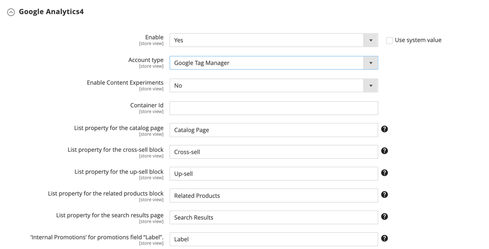

# [!UICONTROL Sales] > [!UICONTROL Google API]

{{config}}

## [!UICONTROL Google Analytics]

<!-- zoom -->

<!-- [Google Analytics](https://docs.magento.com/user-guide/marketing/google-universal-analytics.html) -->

| Veld | [Toepassingsgebied](../../getting-started/websites-stores-views.md#scope-settings) | Beschrijving |
| ----- | ------------------------------------------ | ----------- |
| [!UICONTROL Enable] | Winkelweergave | Inschakelen [!DNL Google Analytics] voor uw winkel. Opties: `Yes` / `No` |
| [!UICONTROL Account Type] | Winkelweergave |  (Alleen Adobe Commerce) Hiermee bepaalt u de configuratieopties op basis van het accounttype van uw Googles Analytics. Opties: Universal Analytics (standaard) / Google Tag Manager |
| [!UICONTROL Account Number] | Winkelweergave | Het accountnummer of de trackingcode die u hebt toegewezen bij het maken van uw [!DNL Google Analytics] account. |
| [!UICONTROL Anonymize IP] | Winkelweergave | Bepaalt als het identificeren van informatie uit IP adressen wordt verwijderd die binnen verschijnen [!DNL Google Analytics] resultaten. |
| [!UICONTROL Enable Content Experiments] | Winkelweergave | Activeren [Google-contentexperimenten](https://support.google.com/analytics/answer/9366791?hl=en&amp;ref_topic=1745207), die kan worden gebruikt om maximaal tien verschillende versies van dezelfde pagina te testen. Opties: `Yes` / `No` |

{:style=&quot;table-layout:auto&quot;}

## [!UICONTROL Google Analytics - Google Tag Manager]

{{ee-feature}}

<!-- zoom -->

Wanneer **[!UICONTROL Account Type]** is ingesteld op `Google Tag Manager`Er worden dan extra velden weergegeven.

| Veld | [Toepassingsgebied](../../getting-started/websites-stores-views.md#scope-settings) | Beschrijving |
| ----- | ------------------------------------------ | ----------- |
| [!UICONTROL Container ID] | Winkelweergave | De unieke id voor de [!DNL Google Tag Manager] container. Deze waarde begint gewoonlijk met `GTM-`. Deze id staat in uw [!DNL Google Tag Manager] account. Indien [!DNL Google Tag Manager] is al geïnstalleerd en geconfigureerd voor uw winkel, wordt de container-id automatisch in dit veld weergegeven. |
| [!UICONTROL List property for the catalog page] | Winkelweergave | Identificeert de [!DNL Google Tag Manager] aan de cataloguspagina gekoppelde eigenschap. Standaardwaarde: `Catalog Page` |
| [!UICONTROL List property for the cross-sell block] | Winkelweergave | Identificeert de [!DNL Google Tag Manager] eigenschap die aan het cross-sell-blok is gekoppeld. Standaardwaarde: `Cross-sell` |
| [!UICONTROL List property for the up-sell block] | Winkelweergave | Identificeert de [!DNL Google Tag Manager] eigenschap die is gekoppeld aan het blok Up-sell. Standaardwaarde: `Up-sell` |
| [!UICONTROL List property for the related products block] | Winkelweergave | Identificeert de [!DNL Google Tag Manager] eigenschap die is gekoppeld aan het verwante productblok. Standaardwaarde: `Related Products` |
| [!UICONTROL List property for the search results page] | Winkelweergave | Identificeert de [!DNL Google Tag Manager] eigenschap die aan de pagina met zoekresultaten is gekoppeld. Standaardwaarde: `Search Results` |
| [!UICONTROL 'Internal Promotions' for promotions field "Label"] | Winkelweergave | Identificeert de [!DNL Google Tag Manager] eigenschap die is gekoppeld aan de labels voor interne promoties. Standaardwaarde: `Label` |

{:style=&quot;table-layout:auto&quot;}

## [!UICONTROL Google AdWords]

<!-- zoom -->

<!-- [Google AdWords](https://docs.magento.com/user-guide/marketing/google-adwords.html) -->

| Veld | [Toepassingsgebied](../../getting-started/websites-stores-views.md#scope-settings) | Beschrijving |
| ----- | ------------------------------------------ | ----------- |
| [!UICONTROL Enable] | Winkelweergave | Hiermee schakelt u Google AdWords in voor de winkel. Opties: `Yes` / `No` |
| [!UICONTROL Conversion ID] | Winkelweergave | De id van je Google AdWords-account. |
| [!UICONTROL Conversion Language] | Winkelweergave | De taal die voor omzettingen AdWords wordt gebruikt. Opties: `All available languages` |
| [!UICONTROL Conversion Format] | Winkelweergave | Hiermee bepaalt u de indeling van het dialoogvenster [!DNL Google Site Stats] een melding die wordt weergegeven op de conversiepagina. De melding is gekoppeld aan een pagina waarop bezoekers worden geïnformeerd over de cookies die worden gebruikt om hun bezoeken bij te houden. Deze numerieke waarde wordt toegewezen aan de `google_conversion_format` in uw AdWords-script. Zie voor meer informatie [Info over Conversie bijhouden](https://support.google.com/google-ads/answer/1722022?hl=en) op de Google-website. Opties:  **`1`**- Geeft een melding van één regel weer. **`2`** - (Standaard) Hiermee wordt een melding van twee regels weergegeven.  **`3`**- Geeft geen klantmelding weer. |
| [!UICONTROL Conversion Color] | Winkelweergave | Bepaalt de kleur van het conversielabel. Een [kleurkiezer](https://www.w3schools.com/colors/colors_picker.asp) om de hexadecimale waarde te kiezen. Deze hexadecimale waarde wordt toegewezen aan de `google_conversion_color` in uw AdWords-script. Bijvoorbeeld: ffffff  `var google_conversion_color = "ffffff";` |
| [!UICONTROL Conversion Label] | Winkelweergave | Een tekstlabel dat wordt weergegeven bij het dialoogvenster [!DNL Google Site Stats] kennisgeving. Deze tekstreeks wordt toegewezen aan de `~` in uw AdWords-script. Bijvoorbeeld: &quot;Bedankt voor het winkelen!&quot; |
| [!UICONTROL Conversion Value Type] | Winkelweergave | Hiermee geeft u het type waarde op dat wordt gebruikt om te bepalen wanneer een conversie plaatsvindt. Opties:  **`Dynamic`**- Hiermee wordt bepaald dat er een conversie heeft plaatsgevonden op basis van het dynamische orderbedrag. **`Constant`** - Hiermee wordt bepaald dat er een conversie heeft plaatsgevonden op basis van de ingevoerde waarde. |
| [!UICONTROL Conversion Value] | Winkelweergave | Hiermee wordt de waarde opgegeven die wordt gebruikt voor een _[!UICONTROL Constant]_conversiewaardetype. |
| [!UICONTROL Send Order Currency] | Winkelweergave | Hiermee worden transactiespecifieke valutawisselwaarden ingeschakeld in AdWords (voor websites met verschillende basisvaluta&#39;s). |

{:style=&quot;table-layout:auto&quot;}

## [!UICONTROL Google GTag]

{{gtag-api-note}}

### [!UICONTROL Google Analytics4]

<!-- zoom -->

<!-- [Google Analytics4](https://docs.magento.com/user-guide/marketing/google-universal-analytics.html) -->

| Veld | [Toepassingsgebied](../../getting-started/websites-stores-views.md#scope-settings) | Beschrijving |
| ----- | ------------------------------------------ | ----------- |
| [!UICONTROL Enable] | Winkelweergave | Laat Google Analytics 4 voor uw opslag toe. Opties: `Yes` / `No` |
| [!UICONTROL Account Type] | Winkelweergave |  (Alleen Adobe Commerce) Hiermee bepaalt u de configuratieopties op basis van het accounttype van uw Googles Analytics. Opties: `Google Analytics4` (standaardwaarde) / `Google Tag Manager` |
| [!UICONTROL Measurement ID] | Winkelweergave | Het accountnummer of trackingcode die u hebt toegewezen bij het maken van uw account voor Googles Analytics. |
| [!UICONTROL Anonymize IP] | Winkelweergave | Bepaalt als het identificeren van informatie uit IP adressen wordt verwijderd die in Googles Analytics resultaten verschijnen. |
| [!UICONTROL Enable Content Experiments] | Winkelweergave | Activeren [Google-contentexperimenten](https://support.google.com/analytics/answer/9366791?hl=en&amp;ref_topic=1745207), die kan worden gebruikt om maximaal tien verschillende versies van dezelfde pagina te testen. Opties: `Yes` / `No` |

{:style=&quot;table-layout:auto&quot;}

### [!UICONTROL Google Analytics4 - Google Tag Manager]

{{ee-feature}}

<!-- zoom -->

Wanneer **[!UICONTROL Account Type]** is ingesteld op `Google Tag Manager`Er worden dan extra velden weergegeven.

| Veld | [Toepassingsgebied](../../getting-started/websites-stores-views.md#scope-settings) | Beschrijving |
| ----- | ------------------------------------------ | ----------- |
| [!UICONTROL Container Id] | Winkelweergave | De unieke id voor de [!DNL Google Tag Manager] container. Deze waarde begint gewoonlijk met `GTM-`. Deze id staat in uw Google Tab Manager-account. Indien [!DNL Google Tag Manager] is al geïnstalleerd en geconfigureerd voor uw winkel, wordt de container-id automatisch in dit veld weergegeven. |
| [!UICONTROL List property for the catalog page] | Winkelweergave | Identificeert de [!DNL Google Tag Manager] aan de cataloguspagina gekoppelde eigenschap. Standaardwaarde: `Catalog Page` |
| [!UICONTROL List property for the cross-sell block] | Winkelweergave | Identificeert de [!DNL Google Tag Manager] eigenschap die aan het cross-sell-blok is gekoppeld. Standaardwaarde: `Cross-sell` |
| [!UICONTROL List property for the up-sell block] | Winkelweergave | Identificeert de [!DNL Google Tag Manager] eigenschap die is gekoppeld aan het blok Up-sell. Standaardwaarde: `Up-sell` |
| [!UICONTROL List property for the related products block] | Winkelweergave | Identificeert de [!DNL Google Tag Manager] eigenschap die is gekoppeld aan het verwante productblok. Standaardwaarde: `Related Products` |
| [!UICONTROL List property for the search results page] | Winkelweergave | Identificeert de [!DNL Google Tag Manager] eigenschap die aan de pagina met zoekresultaten is gekoppeld. Standaardwaarde: `Search Results` |
| [!UICONTROL 'Internal Promotions' for promotions field "Label"] | Winkelweergave | Identificeert de [!DNL Google Tag Manager] eigenschap die is gekoppeld aan de labels voor interne promoties. Standaardwaarde: `Label` |

{:style=&quot;table-layout:auto&quot;}

### [!UICONTROL Google AdWords]

<!-- zoom -->

<!-- -- Google AdWords](https://docs.magento.com/user-guide/marketing/google-adwords.html) -->

| Veld | [Toepassingsgebied](../../getting-started/websites-stores-views.md#scope-settings) | Beschrijving |
| ----- | ------------------------------------------ | ----------- |
| [!UICONTROL Enable] | Winkelweergave | Hiermee schakelt u Google AdWords in voor de winkel. Opties: `Yes` / `No` |
| [!UICONTROL Conversion ID] | Winkelweergave | De id van je Google AdWords-account. |
| [!UICONTROL Conversion Language] | Winkelweergave | De taal die voor omzettingen AdWords wordt gebruikt. Opties: alle beschikbare talen |
| [!UICONTROL Conversion Format] | Winkelweergave | Hiermee bepaalt u de indeling van het bericht voor Google-sitestatussen dat op de conversiepagina wordt weergegeven. De melding is gekoppeld aan een pagina waarop bezoekers worden geïnformeerd over de cookies die worden gebruikt om hun bezoeken bij te houden. Deze numerieke waarde wordt toegewezen aan de `google_conversion_format` in uw AdWords-script. Zie voor meer informatie [Info over Conversie bijhouden](https://support.google.com/google-ads/answer/1722022?hl=en) op de Google-website. Opties:  **`1`**- Geeft een melding van één regel weer. **`2`** - (Standaard) Hiermee wordt een melding van twee regels weergegeven.  **`3`**- Geeft geen klantmelding weer. |
| [!UICONTROL Conversion Color] | Winkelweergave | Bepaalt de kleur van het conversielabel. Een [kleurkiezer](https://www.w3schools.com/colors/colors_picker.asp) om de hexadecimale waarde te kiezen. Deze hexadecimale waarde wordt toegewezen aan de `google_conversion_color` in uw AdWords-script. Bijvoorbeeld: ffffff  `var google_conversion_color = "ffffff";` |
| [!UICONTROL Conversion Label] | Winkelweergave | Een tekstlabel dat wordt weergegeven bij de melding Google Site Stats. Deze tekstreeks wordt toegewezen aan de `~` in uw AdWords-script. Bijvoorbeeld: &quot;Bedankt voor het winkelen!&quot; |
| [!UICONTROL Conversion Value Type] | Winkelweergave | Hiermee geeft u het type waarde op dat wordt gebruikt om te bepalen wanneer een conversie plaatsvindt. Opties:  **`Dynamic`**- Hiermee wordt bepaald dat er een conversie heeft plaatsgevonden op basis van het dynamische orderbedrag. **`Constant`** - Hiermee wordt bepaald dat er een conversie heeft plaatsgevonden op basis van de ingevoerde waarde. |
| [!UICONTROL Conversion Value] | Winkelweergave | Hiermee wordt de waarde opgegeven die wordt gebruikt voor een _[!UICONTROL Constant]_conversiewaardetype. |
| [!UICONTROL Send Order Currency] | Winkelweergave | Hiermee worden transactiespecifieke valutawisselwaarden ingeschakeld in AdWords (voor websites met verschillende basisvaluta&#39;s). |

{:style=&quot;table-layout:auto&quot;}
