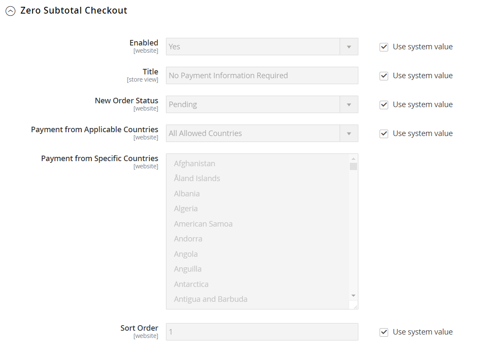

# [!UICONTROL Sales] > [!UICONTROL Payment Methods]

>[!TIP]
>
>Betalingsservices voor Adobe Commerce en Magento Open Source bieden een kant-en-klare oplossing voor zelfbediening, inclusief het testen van sandboxen en een eenvoudige configuratie, voor een robuuste en veilige betalingsverwerking. Als u meer wilt weten over deze krachtige gereedschapsset en over de manier waarop u het inzicht en de controle krijgt dat u nodig hebt om de beste ervaring voor kopers te creëren, raadpleegt u de [_Gebruikershandleiding voor betalingsservices_](https://experienceleague.adobe.com/docs/commerce-merchant-services/payment-services/guide-overview.html).

{{config}}

## [!UICONTROL Merchant Location]

<!-- zoom -->

<!-- [Merchant Location](https://docs.magento.com/user-guide/payment/merchant-location.html) -->

| Veld | [Toepassingsgebied](../../getting-started/websites-stores-views.md#scope-settings) | Beschrijving |
|--- |--- |--- |
| [!UICONTROL Merchant Country] | Website | Identificeert het land waar de handelaar geregistreerd is om zaken te doen. |

{style="table-layout:auto"}

## Aanbevolen oplossingen

De volgende betalingsoplossingen worden aanbevolen als een gemakkelijke manier voor verkopers die net beginnen met het accepteren van online betalingen via PayPal-rekening of creditcard. Naarmate uw bedrijf groeit, kunt u deze combineren met extra PayPal-betalingsoplossingen.

- [PayPal Express-afhandeling](paypal-express-checkout.md)
- [Braintree](braintree.md)
- [Betalingsdiensten](payment-services.md)

>[!NOTE]
>
>Sommige integratie van betalingen en gebundelde extensies zijn verwijderd uit 2.4.x-releases en verplaatst naar de Commerce Marketplace. U kunt de nieuwste extensies voor officiële integratie voor betalingen vinden in [Commerce Marketplace](https://marketplace.magento.com/extensions/payments-security.html){:target=&quot;_blank&quot;}.
> 
>**Amazon Pay** en **Klarna**: Adobe Commerce en Magento Open Source versie 2.4.0 tot en met 2.4.3 bevatten deze door leveranciers ontwikkelde extensies. Vanaf de release 2.4.4 worden deze extensies niet meer gebundeld met de kernrelease en moeten ze vanaf de Commerce Marketplace worden geïnstalleerd en bijgewerkt. De Marketplace biedt ook toegang tot de huidige documentatie die wordt geleverd door de ontwikkelaar van de extensie.
> 
>Als een van deze gebundelde extensies is ingeschakeld en geconfigureerd, moet u de `composer.json` als onderdeel van het upgradeproces van 2.4.4 en voor het beheer van extensies die worden bijgewerkt. Zie [Upgrademodules](https://experienceleague.adobe.com/docs/commerce-operations/upgrade-guide/modules/upgrade.html) in de _Upgradehandleiding_ voor meer informatie . 
> 
>**Worldpay**, **Eway**, **CyberSource**, en **Authorize.Net**: Zie voor meer informatie over het maken van een veilige overgang van deze integratie van betalingen de [DevBlog](https://community.magento.com/t5/Magento-DevBlog/Deprecation-of-Magento-core-payment-integrations/ba-p/426445){:target=&quot;_blank&quot;}.

## Andere PayPal-methoden

PayPal biedt verschillende betalingsoplossingen die voldoen aan de behoeften van bedrijven van elke omvang en die wereldwijd actief zijn in het zakenleven. Met PayPal kun je betalingen accepteren van alle grote incasso- en creditcards. PayPal biedt extra gemak zonder extra moeite, omdat zelfs klanten die geen PayPal-rekening hebben voor hun aankopen kunnen betalen met PayPal.

### PayPal all-in-one methoden

- [PayPal-betaling geavanceerd](paypal-payments-advanced.md)
- [PayPal Payments Pro](paypal-payments-pro.md)
- [PayPal Payments Standard](paypal-payments-standard.md)

### PayPal-betalingsgateways

- [PayPal Payflow Pro](paypal-payflow-pro.md) (Inclusief Express Checkout)
- [PayPal Payflow Link](paypal-payflow-link.md) (Inclusief Express Checkout)

## Basisbetalingsmethoden

De volgende betalingsmethoden zijn ingebouwd in de handel en gebruiken geen betalingsaanbieder van derden om de transactie te verwerken. Veel van de basisbetalingsmethoden worden offline in plaats van online beheerd.

### [!UICONTROL Check / Money Order]

<!-- zoom -->

<!-- [Check / Money Order](https://docs.magento.com/user-guide/payment/check-money-order.html) -->

| Veld | [Toepassingsgebied](../../getting-started/websites-stores-views.md#scope-settings) | Beschrijving |
|--- |--- |--- |
| [!UICONTROL Enabled] | Website | Hiermee bepaalt u of klanten per cheque of postwissel kunnen betalen. Opties: `Yes` / `No` |
| [!UICONTROL Title] | Winkelweergave | De naam voor deze betalingsmethode die tijdens het afrekenen aan klanten wordt weergegeven. |
| [!UICONTROL New Order Status] | Website | Hiermee bepaalt u de beginwaarde [orderstatus](../../stores-purchase/order-status.md) worden toegewezen aan via een cheque of postwissel betaalde opdrachten. Standaardwaarde: `Pending` |
| [!UICONTROL Payment from Applicable Countries] | Website | Hiermee bepaalt u uit welke landen je betaling per cheque of postwissel accepteert. Opties: `All Allowed Countries` / `Specific Countries` |
| [!UICONTROL Payment from Specific Countries] | Website | Identificeert de specifieke landen waarvan u betaling per cheque of postwissel accepteert. |
| [!UICONTROL Make Check Payable to] | Winkelweergave | De naam van de entiteit aan wie cheques en postwissels moeten worden betaald. |
| [!UICONTROL Send Check to] | Winkelweergave | Het adres of postbus waar cheques en postwissels moeten worden verzonden. |
| [!UICONTROL Minimum Order Total] | Website | Het kleinste orderbedrag dat per cheque of postwissel kan worden betaald. |
| [!UICONTROL Maximum Order Total] | Website | Het hoogste orderbedrag dat per cheque of postwissel kan worden betaald.   **_Opmerking:_**Een orde komt in aanmerking als het totaal tussen, of gelijken, het minimum of maximumordertotaal is. |
| [!UICONTROL Sort Order] | Website | Een getal dat de bestelling bepaalt die wordt betaald via cheque of postwissel wanneer deze bij andere betalingsmethoden tijdens het afrekenen wordt weergegeven. Enter `0` om deze boven aan de lijst te plaatsen. |

{style="table-layout:auto"}

### [!UICONTROL Bank Transfer Payment]

<!-- zoom -->

<!-- [Bank Transfer Payment](https://docs.magento.com/user-guide/payment/bank-transfer.html) -->

| Veld | [Toepassingsgebied](../../getting-started/websites-stores-views.md#scope-settings) | Beschrijving |
|--- |--- |--- |
| [!UICONTROL Enabled] | Website | Hiermee bepaalt u of klanten kunnen betalen door de betaling rechtstreeks van hun bank naar uw zakelijke rekening over te maken. Opties: `Yes` / `No` |
| [!UICONTROL Title] | Winkelweergave | De naam voor deze betalingsmethode die tijdens het afrekenen aan klanten wordt weergegeven. |
| [!UICONTROL New Order Status] | Website | Hiermee bepaalt u de initiële orderstatus die wordt toegewezen aan via een bankoverschrijving betaalde orders. Standaardwaarde: `Pending` |
| [!UICONTROL Payment from Applicable Countries] | Website | Hiermee bepaalt u van welke landen je betaling via overschrijving accepteert. Opties: `All Allowed Countries` / `Specific Countries` |
| [!UICONTROL Payment from Specific Countries] | Website | Hiermee worden de specifieke landen aangegeven waaruit je betaling via overschrijving accepteert. |
| [!UICONTROL Minimum Order Total] | Website | Het kleinste orderbedrag dat per bankoverschrijving kan worden betaald. |
| [!UICONTROL Maximum Order Total] | Website | Het hoogste orderbedrag dat per bankoverschrijving kan worden betaald.   **_Opmerking:_**Een orde komt in aanmerking als het totaal tussen, of gelijken, het minimum of maximumordertotaal is. |
| [!UICONTROL Sort Order] | Website | Een getal dat de bestelling bepaalt die bij het afrekenen bij een andere betalingsmethode wordt weergegeven als de betaling via een overschrijving wordt uitgevoerd. Enter `0` om deze boven aan de lijst te plaatsen. |

{style="table-layout:auto"}

### [!UICONTROL Payment on Account]

{{b2b-feature}}

<!-- zoom -->

<!-- [Payment on Account](https://docs.magento.com/user-guide/payment/payment-on-account.html) -->

| Veld | [Toepassingsgebied](../../getting-started/websites-stores-views.md#scope-settings) | Beschrijving |
|--- |--- |--- |
| [!UICONTROL Enabled] | Website | Hiermee wordt bepaald of ondernemingen bedrijfskrediet kunnen gebruiken om aankopen te doen. Opties: `Yes` / `No` |
| [!UICONTROL Title] | Winkelweergave | De naam voor deze betalingsmethode die tijdens het afrekenen aan klanten wordt weergegeven. |
| [!UICONTROL New Order Status] | Website | Bepaalt de status van nieuwe orders die op een bedrijfsaccount in rekening worden gebracht. Opties: `Pending (default)` / `Processing` / `Suspected Fraud` |
| [!UICONTROL Payment from Applicable Countries] | Website | Hiermee bepaalt u in welke landen bedrijven aankopen op hun rekening mogen afschrijven. Opties: `All Allowed Countries` / `Specific Countries` |
| [!UICONTROL Payment from Specific Countries] | Website | Identificeert de specifieke landen waar bedrijven aankopen op hun rekeningen kunnen aanrekenen. |
| [!UICONTROL Minimum Order Total] | Website | Hiermee geeft u het kleinste orderbedrag op dat in rekening kan worden gebracht op een bedrijfsaccount. |
| [!UICONTROL Maximum Order Total] | Website | Het hoogste orderbedrag dat op een bedrijfsaccount in rekening kan worden gebracht.   **_Opmerking:_**Een orde komt in aanmerking als het totaal tussen, of gelijken, het minimum of maximumordertotaal is. |
| [!UICONTROL Sort Order] | Website | Een getal dat de volgorde bepaalt waarin de betaling op rekening wordt weergegeven wanneer deze bij andere betalingsmethoden wordt aangeboden tijdens het afrekenen. Enter `0` om deze boven aan de lijst te plaatsen. |

{style="table-layout:auto"}

>[!NOTE]
>
>Betaling op account wordt niet ondersteund voor bestellingen met [meerdere verzendadressen](../../stores-purchase/shipping-settings.md#multiple-addresses) en niet als een van de betalingsopties wordt weergegeven.

### [!UICONTROL Cash On Delivery Payment]

<!-- zoom -->

<!-- [Cash On Delivery Payment](../../stores-purchase/cash-on-delivery.html) -->

| Veld | [Toepassingsgebied](../../getting-started/websites-stores-views.md#scope-settings) | Beschrijving |
|--- |--- |--- |
| [!UICONTROL Enabled] | Website | Hiermee bepaalt u of klanten kunnen betalen door de betaling rechtstreeks van hun bank naar uw zakelijke rekening over te maken. Opties: `Yes` / `No` |
| [!UICONTROL Title] | Winkelweergave | De naam voor deze betalingsmethode die tijdens het afrekenen aan klanten wordt weergegeven. |
| [!UICONTROL New Order Status] | Website | Hiermee bepaalt u de initiële orderstatus die wordt toegewezen aan via een bankoverschrijving betaalde orders. Standaardwaarde: `Pending` |
| [!UICONTROL Payment from Applicable Countries] | Website | Hiermee bepaalt u van welke landen je betaling via overschrijving accepteert. Opties: `All Allowed Countries` / `Specific Countries` |
| [!UICONTROL Payment from Specific Countries] | Website | Hiermee worden de specifieke landen aangegeven waaruit je betaling via overschrijving accepteert. |
| [!UICONTROL Minimum Order Total] | Website | Geeft het kleinste orderbedrag aan dat per overschrijving kan worden betaald. |
| [!UICONTROL Maximum Order Total] | Website | Het hoogste orderbedrag dat per bankoverschrijving kan worden betaald.   **_Opmerking:_**Een orde komt in aanmerking als het totaal tussen, of gelijken, het minimum of maximumordertotaal is. |
| [!UICONTROL Sort Order] | Website | Een getal dat de bestelling bepaalt die bij het afrekenen bij een andere betalingsmethode wordt weergegeven als de betaling via een overschrijving wordt uitgevoerd. Enter `0` om deze boven aan de lijst te plaatsen. |

{style="table-layout:auto"}

### [!UICONTROL Zero Subtotal Checkout]

<!-- zoom -->

<!-- [Zero Subtotal Checkout](../../stores-purchase/zero-subtotal-checkout.html) -->

| Veld | [Toepassingsgebied](../../getting-started/websites-stores-views.md#scope-settings) | Beschrijving |
|--- |--- |--- |
| [!UICONTROL Title] | Winkelweergave | De naam die tijdens het afrekenen voor deze betalingsmethode wordt gebruikt. Standaardwaarde: geen betalingsinformatie vereist |
| [!UICONTROL Enabled] | Website | Hiermee wordt bepaald of de Afhandeling Nul subtotaal beschikbaar is voor de opslagbeheerder om orders te beheren met een subtotaal van nul, zoals een order die is belast, maar met een korting is het bedrag tot nul teruggebracht. Opties: `Yes` / `No` |
| [!UICONTROL New Order Status] | Website | Hiermee bepaalt u de initiële orderstatus die is toegewezen aan bestellingen die zijn verwerkt als Nul subtotaal uitchecken. Standaardwaarde: `Pending` |
| [!UICONTROL Payment from Applicable Countries] | Website | Hiermee bepaalt u uit welke landen de subtotaal-afhandeling nul kan worden toegepast. Opties: `All Allowed Countries` / `Specific Countries` |
| [!UICONTROL Payment from Specific Countries] | Website | Hiermee worden de specifieke landen aangegeven waarvoor een subtotaal bedrag van nul kan worden afgeboekt. |
| [!UICONTROL Sort Order] | Website | Een getal dat de volgorde bepaalt waarin de titel wordt weergegeven, zoals &quot;Geen betalingsgegevens vereist&quot;, wanneer deze bij andere betalingsmethoden wordt aangeboden tijdens het afrekenen. Enter `0` om deze boven aan de lijst te plaatsen. |

{style="table-layout:auto"}

## [!UICONTROL Payment actions]

Betalingsacties zijn geconfigureerd _per betalingsmethode_. De betalingsactie bepaalt wanneer de fondsen worden vastgelegd en wanneer facturen voor uw verkooporders worden gemaakt.

Zie de Basis montagessectie van elk individueel onderwerp van de betalingsmethode voor een uitvoerige lijst van individuele configuratieopties.

| Betalingsactie | Beschrijving |
|--- |---|
| [!UICONTROL Authorization] | Hiermee geeft u de aankoop goed, maar houdt u de middelen vast. De hoeveelheid wordt pas opgevangen nadat de handelaar deze hoeveelheid heeft opgevangen. |
| [!UICONTROL Authorize] | Hiermee wordt de rekening van de koper voor het totaalbedrag van de opdracht geautoriseerd, maar wordt de betaling niet vastgelegd. Leg de betaling vast door een factuur te maken. Geautoriseerde opdrachten kunnen worden geannuleerd of ingetrokken. |
| [!UICONTROL Authorize and Capture] | Hiermee wordt de rekening van de koper voor het ordertotaal goedgekeurd en wordt de betaling vastgelegd. Er wordt automatisch een factuur gemaakt. Je kunt vastgelegde fondsen terugbetalen via creditnota. U kunt een bestelling niet annuleren zodra de betaling is vastgelegd. |
| [!UICONTROL Charge on shipment] | Amazon ontvangt een aanvraag voor het vastleggen van gegevens en brengt de klant in rekening wanneer een factuur in de handel wordt gemaakt. |
| [!UICONTROL Charge on order] | Amazon maakt de factuur en berekent de klant wanneer de bestelling wordt geplaatst. |
| [!UICONTROL Not Capture] | Wanneer de factuur wordt ingediend, wordt de betaling niet in het systeem opgenomen. Verondersteld wordt dat u de betaling later via Handel opneemt. De ingevulde factuur bevat een knop Vastleggen. Voordat u gaat vastleggen, kunt u de factuur annuleren. Na het vastleggen kunt u een creditmemo maken en de factuur annuleren. |
| [!UICONTROL Order] | Vertegenwoordigt een overeenkomst met PayPal die de handelaar toestaat om één of meerdere bedragen tot het ordertotaal van de kopersrekening van de klant te vangen, binnen een bepaalde periode (tot 29 dagen). |
| [!UICONTROL Sale] | Bedrag van de aankoop is geautoriseerd en onmiddellijk van de rekening van de klant verwijderd. |

{style="table-layout:auto"}

>[!NOTE]
>
>Selecteer de optie _[!UICONTROL Not Capture]_, tenzij u zeker weet dat u de betaling later via Handel gaat vastleggen. U kunt pas een creditmemo maken nadat de betaling is vastgelegd met de knop Vastleggen.

## [!UICONTROL Purchase Order]

<!-- zoom -->

<!-- [Purchase Order](../../stores-purchase/purchase-order.html) -->

| Veld | [Toepassingsgebied](../../getting-started/websites-stores-views.md#scope-settings) | Beschrijving |
|--- |--- |--- |
| [!UICONTROL Enabled] | Website | Hiermee bepaalt u of klanten via inkooporder (inkooporder) kunnen betalen. Opties: `Yes` / `No` |
| [!UICONTROL Title] | Winkelweergave | De naam van deze betalingsmethode die tijdens het afrekenen aan klanten wordt weergegeven. |
| [!UICONTROL New Order Status] | Website | Hiermee bepaalt u de beginwaarde [orderstatus](../../stores-purchase/order-status.md) toegewezen aan door PO betaalde orders. Standaardwaarde: in behandeling |
| [!UICONTROL Payment from Applicable Countries] | Website | Bepaalt de landen waarvan u betaling door PO goedkeurt. Opties: `All Allowed Countries` / `Specific Countries` |
| [!UICONTROL Payment from Specific Countries] | Website | Identificeert de specifieke landen waarvan u betaling door PO goedkeurt. |
| [!UICONTROL Minimum Order Total] | Website | Het kleinste orderbedrag dat door PO kan worden betaald. |
| [!UICONTROL Maximum Order Total] | Website | Het grootste orderbedrag dat door PO kan worden betaald.   **_Opmerking:_**Een orde komt in aanmerking als het totaal tussen, of gelijken, het minimum of maximumordertotaal is. |
| [!UICONTROL Sort Order] | Website | Een getal dat de bestelling bepaalt die de betaling per inkooporder weergeeft wanneer deze bij andere betalingsmethoden wordt aangeboden tijdens het afrekenen. Enter `0` om deze boven aan de lijst te plaatsen. |

{style="table-layout:auto"}
