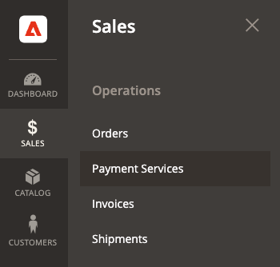
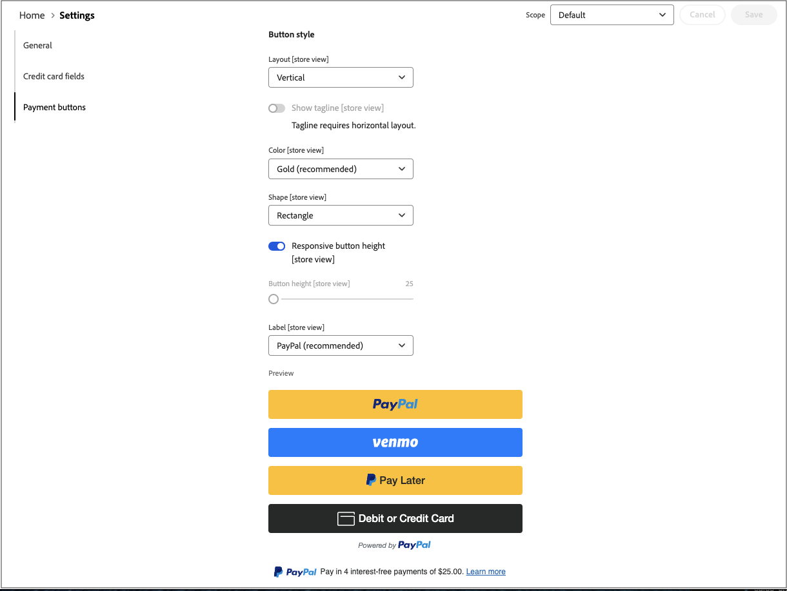

# [!UICONTROL Sales] > [!UICONTROL Payment Methods] > [!UICONTROL Payment Services]

De Diensten van de betaling verstrekt een kant-en-klare oplossing, met inbegrip van zandbak het testen en een eenvoudige opstelling, voor het verstrekken van robuuste en veilige betalingsverwerking. Meer leren, zie de [_Gids van de Gebruiker van de Diensten van de Betaling_ ](https://experienceleague.adobe.com/docs/commerce/payment-services/guide-overview.html).

Om tot de configuratiemontages voor de Diensten van de Betaling toegang te hebben, op _Admin_ sidebar gaat **[!UICONTROL Sales]** > **[!UICONTROL Payment Services]** en klik **[!UICONTROL Settings]**.

{width="400"}

>[!NOTE]
>
>Om de configuratie van de Oudheid in plaats van [ Montages ](https://experienceleague.adobe.com/docs/commerce/payment-services/configure/settings.html) te gebruiken, zie [ Verouderde configuratie ](https://experienceleague.adobe.com/docs/commerce/payment-services/configure/configure-admin.html).

## [!UICONTROL General]

{width="600" zoomable="yes"}

| Veld | [ Reikwijdte ](../../getting-started/websites-stores-views.md#scope-settings) | Beschrijving |
|---|---|---|
| [!UICONTROL Enable] | website | Schakel [!DNL Payment Services] voor uw website in of uit. Opties: [!UICONTROL Yes] / [!UICONTROL No] |
| [!UICONTROL Payment mode] | winkelweergave | Plaats de methode, of het milieu, voor uw opslag. Opties: [!UICONTROL Sandbox] / [!UICONTROL Production] |
| [!UICONTROL Sandbox Merchant ID] | winkelweergave | De bedrijfs-id van de sandbox, die automatisch wordt gegenereerd tijdens het aan boord nemen van de sandbox. |
| [!UICONTROL Production Merchant ID] | winkelweergave | Uw bedrijfs-id voor productie, die automatisch wordt gegenereerd tijdens het aan boord nemen van sandboxen. |
| [!UICONTROL Soft Descriptor] | website- of winkelweergave | Voeg een elektronische beschrijver aan uw websites toe en opslagmeningen die informatie voor klantentransacties verstrekt en merken, opslag, of productlijnen afbakent. Met de schakeloptie [!UICONTROL Use website] past u elke schermdescriptor toe die op websiteniveau is toegevoegd. Met de schakeloptie [!UICONTROL Use default] past u elke schermdescriptor toe die als standaard is toegevoegd. |

{style="table-layout:auto"}

## [!UICONTROL Credit card fields]

{width="600" zoomable="yes"}

| Veld | [ Reikwijdte ](../../getting-started/websites-stores-views.md#scope-settings) | Beschrijving |
|---|---|---|
| [!UICONTROL Title] | winkelweergave | Voeg de tekst die tijdens het afrekenen wordt weergegeven als titel voor deze betalingsoptie toe aan de weergave Betalingsmethode. |
| [!UICONTROL Payment Action] | website | De [ betalingsactie ](payment-methods.md#payment-actions) voor de gespecificeerde betalingsmethode. Opties: [!UICONTROL Authorize] / [!UICONTROL Authorize and Capture] |
| [!UICONTROL 3DS Secure authentication] | website | Laat of maak [ 3DS Veilige authentificatie ](https://experienceleague.adobe.com/docs/commerce/payment-services/security-compliance/security.html#3ds) toe onbruikbaar. Opties: [!UICONTROL Always] / [!UICONTROL When Required] / [!UICONTROL Off] |
| [!UICONTROL Show on checkout page] | website | In- of uitschakelen van creditcardvelden voor weergave op de afhandelingspagina. Opties: [!UICONTROL Yes] / [!UICONTROL No] |
| [!UICONTROL Vault enabled] | winkelweergave | Laat toe of maak [ creditcard het vaulteren ](https://experienceleague.adobe.com/docs/commerce/payment-services/payments-checkout/vaulting.html) onbruikbaar. Opties: [!UICONTROL Yes] / [!UICONTROL No] |
| [!UICONTROL Show vaulted payment methods in Admin] | winkelweergave | Laat of maak de capaciteit toe onbruikbaar om orden voor klanten in Admin [ te voltooien gebruikend een in kaart gebrachte betalingsmethode ](https://experienceleague.adobe.com/docs/commerce/payment-services/payments-checkout/vaulting.html). Opties: [!UICONTROL Yes] / [!UICONTROL No] |
| [!UICONTROL Debug Mode] | website | De foutopsporingsmodus in- of uitschakelen. Opties: [!UICONTROL Yes] / [!UICONTROL No] |

{style="table-layout:auto"}

## [!UICONTROL Payment buttons]

{width="600" zoomable="yes"}

| Veld | [ Reikwijdte ](../../getting-started/websites-stores-views.md#scope-settings) | Beschrijving |
|---|---|---|
| [!UICONTROL Title] | winkelweergave | Voeg tijdens het afrekenen de tekst toe die als titel voor deze betalingsoptie moet worden weergegeven in de weergave Betalingsmethode. |
| [!UICONTROL Payment Action] | website | De [ betalingsactie ](payment-methods.md#payment-actions){target="_blank"} voor de gespecificeerde betalingsmethode. Opties: [!UICONTROL Authorize] / [!UICONTROL Authorize and Capture] |
| [!UICONTROL Show PayPal buttons on checkout page] | winkelweergave | Schakel [!DNL PayPal Smart Buttons] in of uit op de uitcheckpagina. Opties: [!UICONTROL  Yes] / [!UICONTROL No] |
| [!UICONTROL Show PayPal buttons on product detail page] | winkelweergave | Schakel [!DNL PayPal Smart Buttons] in of uit op de pagina met productdetails. Opties: [!UICONTROL  Yes] / [!UICONTROL No] |
| [!UICONTROL Show PayPal buttons in mini-cart preview] | winkelweergave | Schakel [!DNL PayPal Smart Buttons] in of uit in de voorvertoning van de miniwinkelwagentje. Opties: [!UICONTROL Yes] / [!UICONTROL No] |
| [!UICONTROL Show PayPal buttons on cart page] | winkelweergave | Schakel [!DNL PayPal Smart Buttons] in of uit op de tekstpagina. Opties: [!UICONTROL Yes] / [!UICONTROL No] |
| [!UICONTROL Show PayPal Pay Later button] | winkelweergave | De weergave van betalingsopties voor latere betalingen in- of uitschakelen wanneer betalingsknoppen worden weergegeven. Opties: [!UICONTROL Yes] / [!UICONTROL No] |
| [!UICONTROL Show PayPal Pay Later Message] | website | Schakel het bericht Later betalen in of uit in het winkelwagentje, de productpagina, de miniwinkelwagentje en tijdens de afrekenstroom. Opties: [!UICONTROL Yes] / [!UICONTROL No] |
| [!UICONTROL Show Venmo button] | winkelweergave | Schakel de betalingsoptie van Venmo in of uit waar betalingsknoppen worden weergegeven. Opties: [!UICONTROL Yes] / [!UICONTROL No] |
| [!UICONTROL Show Apple Pay button] | winkelweergave | Schakel de betalingsoptie Apple Pay in of uit waar de betalingsknoppen worden weergegeven. Opties: [!UICONTROL Yes] / [!UICONTROL No] |
| [!UICONTROL Show PayPal Credit and Debit card button] | winkelweergave | Schakel de betalingsoptie Creditcard en Creditcard in of uit wanneer betalingsknoppen worden weergegeven. Opties: [!UICONTROL Yes] / [!UICONTROL No] |
| [!UICONTROL Debug Mode] | website | De foutopsporingsmodus in- of uitschakelen. Opties: [!UICONTROL Yes] / [!UICONTROL No] |

{style="table-layout:auto"}

## [!UICONTROL PayPal Smart Button Styling]

{width="600" zoomable="yes"}

| Veld | [ Reikwijdte ](../../getting-started/websites-stores-views.md#scope-settings) | Beschrijving |
|--- |--- |--- |
| [!UICONTROL Layout] | Winkelweergave | Definieer de lay-outstijl voor de betaalknoppen. Opties: [!UICONTROL Vertical] / [!UICONTROL Horizontal] |
| [!UICONTROL Tagline] | Winkelweergave | Taglijn in-/uitschakelen. Opties: [!UICONTROL Yes] / [!UICONTROL No] |
| [!UICONTROL Color] | Winkelweergave | Geef de kleur van de betaalknoppen op. Opties: [!UICONTROL Blue] / [!UICONTROL Gold] / [!UICONTROL Silver] / [!UICONTROL White] / [!UICONTROL Black] |
| [!UICONTROL Shape] | Winkelweergave | Vorm van de betaalknoppen definiëren. Opties: [!UICONTROL Rectangular] / [!UICONTROL Pill] |
| [!UICONTROL Responsive Button Height] | Winkelweergave | Definieert of voor de betalingsknoppen een standaardhoogte wordt gebruikt. Opties: [!UICONTROL Yes] / [!UICONTROL No] |
| [!UICONTROL Height] | Winkelweergave | Geef de hoogte van de betaalknoppen op. Standaardwaarde: geen |
| [!UICONTROL Label] | Winkelweergave | Definieer het label dat in de betaalknoppen wordt weergegeven. Opties: [!UICONTROL PayPal] / [!UICONTROL Checkout] / [!UICONTROL Buynow] / [!UICONTROL Pay] / [!UICONTROL Installment] |

{style="table-layout:auto"}
