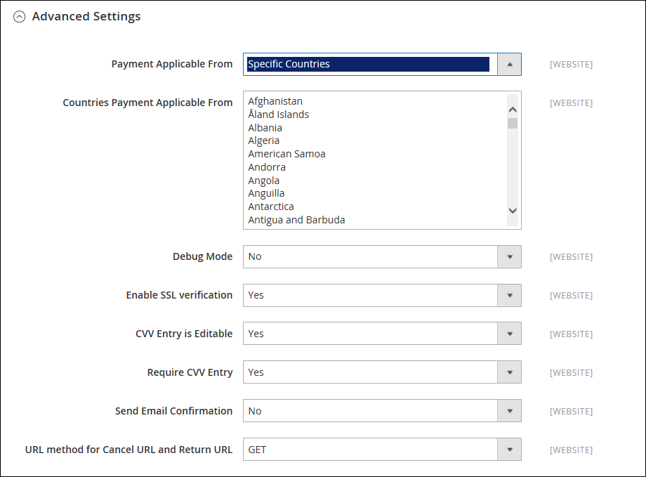

# [!UICONTROL Sales] > [!UICONTROL Payment Methods] > [!UICONTROL PayPal Payments Advanced]

>[!IMPORTANT]
>
>**PSD2 Vereisten:**  
>Vanaf 14 september 2019, zouden de Europese banken betalingen kunnen verminderen die niet [ PSD2 ](../../getting-started/compliance-payment-services-directive.md) vereisten voldoen. [!DNL PayPal Payments Advanced] moet zijn geïntegreerd met [!DNL Cardinal Commerce] om te voldoen aan PSD2. Meer leren, zie [ 3-D Veilig voor Payflow ](https://developer.paypal.com/api/nvp-soap/payflow/3d-secure-overview/).

{{config}}

## [!UICONTROL Required Settings]

<!-- zoom -->

| Veld | [ Reikwijdte ](../../getting-started/websites-stores-views.md#scope-settings) | Beschrijving |
|--- |--- |--- |
| [!UICONTROL Email Associated with PayPal Merchant Account] | Website | (Optioneel) Alle e-mailadressen die aan uw PayPal-zakelijke account zijn gekoppeld. E-mailadressen zijn hoofdlettergevoelig en moeten exact overeenkomen met de adressen in uw account. |
| [!UICONTROL Partner] | Website | Uw PayPal Partner-id, indien van toepassing. |
| [!UICONTROL Vendor] | Website | De gebruikersnaam van uw PayPal-gebruikersaanmelding. |
| Gebruiker | Website | De id van een andere gebruiker op je PayPal-rekening. |
| [!UICONTROL Password] | Website | Het wachtwoord dat aan uw PayPal-handelsaccount is gekoppeld. |
| [!UICONTROL Test Mode] | Website | Als deze optie is ingeschakeld, worden Paypal Payments Advanced uitgevoerd in een testomgeving. Schakel de testmodus uit als u in de productiemodus &quot;live&quot; wilt gaan. Opties: `Yes` / `No` |
| [!UICONTROL Use Proxy] | Website | Een proxy kan worden gebruikt om verkeer om te leiden wanneer de serverfirewall directe toegang tot de PayPal-server voorkomt. Indien van toepassing, identificeert de proxyserver die wordt gebruikt om verbinding te maken met de PayPal-server. Opties: `Yes` / `No`    Indien ingeschakeld, stelt u de opties in:  **`Proxy Host`**- Het IP-adres van de proxyhost. **`Proxy Port`** - Het nummer van de proxypoort. |
| [!UICONTROL Enable this Solution] | Website | Hiermee bepaalt u of PayPal Payments Advanced beschikbaar is voor uw klanten als betalingsmethode. |
| [!UICONTROL Enable PayPal Credit] | Website | Hiermee wordt bepaald of PayPal-krediet beschikbaar is voor uw klanten als betalingsoptie. |

{style="table-layout:auto"}

## [!UICONTROL Advertise PayPal Credit]

<!-- zoom -->

| Veld | [ Reikwijdte ](../../getting-started/websites-stores-views.md#scope-settings) | Beschrijving |
|--- |--- |--- |
| [!UICONTROL Publisher ID] | Website | De uitgevers-id die aan uw PayPal-creditaccount is gekoppeld. |
| [!UICONTROL Get Publisher ID from PayPal] |  | Hiermee wordt uw uitgevers-id opgehaald uit PayPal. |
| [!UICONTROL Home Page] | Website | Bepaalt de positie en de grootte van de [!DNL PayPal Credit] -banner op de startpagina. Opties:  **`Display`**- bepaalt of een [!DNL PayPal Credit] banner op de homepage van uw opslag wordt getoond. Opties: `Yes` / `No` **`Position`** - Hiermee bepaalt u de positie van de [!DNL PayPal Credit] banner op de startpagina. Opties: Koptekst (midden) / Zijbalk (rechts)  **`Size`**- Hiermee bepaalt u de grootte van de [!DNL PayPal Credit] -banner op de startpagina. Opties: `190 x 100` / `234 x 60` / `300 x 50` / `468 x 60` / `728 x 90` /` 800 x 66` |
| [!UICONTROL Catalog Category Page] | Website | Bepaalt de positie en grootte van de banner [!DNL PayPal Credit] op categoriepagina&#39;s. Opties: (gelijk aan voor [!UICONTROL Home Page]) |
| [!UICONTROL Catalog Product Page] | Website | Bepaalt de positie en de grootte van de [!DNL PayPal Credit] -banner op productpagina&#39;s. Opties: (gelijk aan voor [!UICONTROL Home Page]) |
| [!UICONTROL Checkout Cart Page] | Website | Hiermee bepaalt u de positie en grootte van de [!DNL PayPal Credit] -banner op de winkelwagentpagina. Opties: (gelijk aan voor [!UICONTROL Home Page]) |

{style="table-layout:auto"}

## [!UICONTROL Basic Settings]

<!-- zoom -->

| Veld | [ Reikwijdte ](../../getting-started/websites-stores-views.md#scope-settings) | Beschrijving |
|--- |--- |--- |
| [!UICONTROL Title] | Winkelweergave | Een naam die Paypal Payments Geavanceerd tijdens het afrekenen als betalingsmethode aanduidt. |
| [!UICONTROL Sort Order] | Winkelweergave | Een getal dat de volgorde bepaalt waarin Paypal Payments Advanced wordt weergegeven wanneer deze bij andere betalingsmethoden wordt aangeboden tijdens het afrekenen. |
| [!UICONTROL Payment Action] | Website | Bepaalt welke actie PayPal onderneemt wanneer een bestelling wordt verzonden. Opties:  **`Authorization`**- hiermee gaat u akkoord met de aankoop, maar u houdt de middelen in de wacht. De hoeveelheid wordt pas opgevraagd wanneer deze door de handelaar wordt &quot;gevangen&quot;. **`Sale`** - Het bedrag van de aankoop wordt geautoriseerd en onmiddellijk van de rekening van de klant teruggetrokken. |

{style="table-layout:auto"}

## [!UICONTROL Advanced Settings]

<!-- zoom -->

| Veld | [ Reikwijdte ](../../getting-started/websites-stores-views.md#scope-settings) | Beschrijving |
|--- |--- |--- |
| [!UICONTROL Payment Applicable From] | Website | Hiermee bepaalt u het bereik van de toepasselijke landselectie. Opties: `All Allowed Countries` / `Specific Countries` |
| [!UICONTROL Countries Payment Applicable From] | Website | Identificeert elk land van waaruit betaling wordt geaccepteerd. Alleen klanten met een factuuradres in een geselecteerd land kunnen aankopen doen met deze betalingsmethode. |
| [!UICONTROL Debug Mode] | Website | Registreert berichten die tussen uw winkel en het betalingssysteem worden verzonden in een logbestand. Opties: `Yes` / `No`   **_Nota:_**&#x200B;het logboekdossier wordt opgeslagen op de server en is toegankelijk slechts voor ontwikkelaars. In overeenstemming met de normen van de Veiligheid van Gegevens PCI, wordt de creditcardinformatie niet geregistreerd in het logboekdossier. |
| [!UICONTROL Enable SSL Verification] | Website | Bepaalt als het veilige kanaal op de gastheer wordt geverifieerd alvorens een transactie plaatsvindt. Opties: `Yes` / `No` |
| [!UICONTROL CVV Entry is Editable] | Website | Hiermee wordt bepaald of de klant de CVV kan bewerken nadat deze is ingevoerd. Opties: `Yes` / `No` |
| [!UICONTROL Require CVV Entry] | Website | Hiermee wordt bepaald of klanten de CVV-code vanaf de achterzijde van hun creditcard moeten invoeren. Opties: `Yes` / `No` |
| [!UICONTROL Send Email Confirmation] | Website | Hiermee bepaalt u of de klant een e-mailbevestiging van de betaling ontvangt. Opties: `Yes` / `No` |
| [!UICONTROL URL Method for Cancel URL and Return URL] | Website | Bepaalt de methode die wordt gebruikt om informatie uit te wisselen met de PayPal-server tijdens een transactie. Opties:  **`GET`**- Hiermee wordt informatie opgehaald die het resultaat is van een proces. (Dit is de standaardmethode.) **`POST`** - Verzendt een gegevensblok, zoals gegevens die in een formulier zijn ingevoerd, naar het gegevensverwerkingsproces. |

{style="table-layout:auto"}

## [!UICONTROL Settlement Report Settings]

<!-- zoom -->

| Veld | [ Reikwijdte ](../../getting-started/websites-stores-views.md#scope-settings) | Beschrijving |
|--- |--- |--- |
| **[!UICONTROL SFTP Credentials]** |  |  |
| [!UICONTROL Login] | Website | Uw gebruikersnaam die is vereist om u aan te melden bij de Secure FTP-server van PayPal. |
| [!UICONTROL Password] | Website | Uw wachtwoord dat is vereist om u aan te melden bij de Secure FTP-server van PayPal. |
| [!UICONTROL Sandbox Mode] | Website | Wanneer toegelaten, looppas rapporten in een testmilieu alvorens &quot;levend&quot;in het productiemilieu te gaan. Opties: `Yes` / `No` |
| [!UICONTROL Custom Endpoint Hostname or IP-Address] | Website | De URL waar afwikkelingsrapporten worden beheerd. Standaardwaarde: `reports.paypal.com` |
| [!UICONTROL Custom Path] | Website | Het pad waar afwikkelingsrapporten op uw server worden opgeslagen. Standaardwaarde: `/ppreports/outgoing` |
| **[!UICONTROL Scheduled Fetching]** |  |  |
| [!UICONTROL Enable Automatic Fetching] | Website | Als deze optie is ingeschakeld, worden afwikkelingsrapporten automatisch volgens schema opgehaald. Opties: `Yes` / `No` |
| [!UICONTROL Schedule] | Algemeen | Hiermee bepaalt u hoe vaak afwikkelingsrapporten worden gegenereerd door PayPal. Opties: `Daily` / `Every 3 days` / `Every 7 days` / `Every 10 days` / `Every 14 days` / `Every 30 days` / `Every 40 days` |
| [!UICONTROL Time of Day] | Algemeen | Bepaalt het uur, de minuut en de seconde dat afwikkelingsrapporten worden gegenereerd. |

{style="table-layout:auto"}

## [!UICONTROL Frontend Experience Settings]

<!-- zoom -->

| Veld | [ Reikwijdte ](../../getting-started/websites-stores-views.md#scope-settings) | Beschrijving |
|--- |--- |--- |
| [!UICONTROL PayPal Product Logo] | Winkelweergave | Hiermee bepaalt u het PayPal-logo dat in uw winkel wordt weergegeven. Er zijn vier basisstijlen in twee formaten. Opties: `No Logo` / `We prefer PayPal (150 x 60)` / `We prefer PayPal (150 x 40)` / `Now accepting PayPal (150 x 60)` / `Now accepting PayPal (150 x 40)` / `Payments by PayPal (150 x 60)` / `Payments by PayPal (150 x 40)` / `Shop now using (150 x 60)` / `Shop now using (150 x 40)` |
| **[!UICONTROL PayPal Merchant Pages Style]** |  |  |
| [!UICONTROL Page Style] | Winkelweergave | Hiermee bepaalt u de weergave van de handelspagina van PayPal. Toegestane waarden:  **`paypal`**- Gebruikt de paginastijl van PayPal. **`primary`** - Gebruikt de paginastijl die u hebt geïdentificeerd als de &quot;primaire&quot; stijl in uw accountprofiel.  **`your_custom_value`**- Gebruikt een aangepaste paginastijl voor betalingen, die in uw accountprofiel is opgegeven. |
| [!UICONTROL Header Image URL] | Winkelweergave | De URL van de afbeelding die in de linkerbovenhoek van de uitcheckpagina wordt weergegeven. De maximale grootte is 750 x 90 pixels.   **_Nota:_**&#x200B;PayPal adviseert dat het beeld op een veilige (https) server wordt opgeslagen. Anders kan de browser van de klant waarschuwen dat de pagina zowel beveiligde als niet-beveiligde items bevat. |
| [!UICONTROL Header Image Background Color] | Winkelweergave | De zes karakter [ hexadecimale kleur ](https://en.wikipedia.org/wiki/Web_colors) code voor de achtergrondkleur van de kopbal op de controlepagina. U kunt de code invoeren in hoofdletters en kleine letters. |
| [!UICONTROL Header Image Border Color] | Winkelweergave | De hexadecimale kleurcode van zes tekens voor de rand van twee pixels rond de koptekst. |
| [!UICONTROL Page Background Color] | Winkelweergave | De hexadecimale kleurcode van zes tekens voor de achtergrondkleur van de uitcheckpagina die achter het koptekst- en betalingsformulier wordt weergegeven. |

{style="table-layout:auto"}

## [!UICONTROL Basic Settings - PayPal Express Checkout]

<!-- zoom -->

| Veld | [ Reikwijdte ](../../getting-started/websites-stores-views.md#scope-settings) | Beschrijving |
|--- |--- |--- |
| [!UICONTROL Title] | Winkelweergave | Een naam die de PayPal Express-betalingsmethode voor afhandeling tijdens de afhandeling aangeeft. |
| [!UICONTROL Sort Order] | Winkelweergave | Een getal dat de volgorde bepaalt waarin PayPal Express Checkout wordt weergegeven wanneer dit bij andere betalingsmethoden wordt aangeboden tijdens het afrekenen. Voer `0` in voor de bovenkant van de lijst. |
| [!UICONTROL Payment Action] | Website | Bepaalt welke actie PayPal onderneemt wanneer het een bestelling ontvangt. Opties:  **`Authorization`**- hiermee gaat u akkoord met de aankoop, maar u houdt de middelen in de wacht. De hoeveelheid wordt pas opgevraagd wanneer deze door de handelaar wordt &quot;gevangen&quot;. **`Sale`** - Het bedrag van de aankoop wordt geautoriseerd en onmiddellijk van de rekening van de klant teruggetrokken.  **`Order`**- Vertegenwoordigt een overeenkomst met PayPal die de handelaar toestaat om één of meerdere bedragen tot het geordende totaal van de kopersrekening van de klant, binnen een bepaalde tijdspanne te vangen. Dit kan tot 29 dagen zijn. Een of meer facturen moeten door de Commerce Admin worden gegenereerd om de middelen te kunnen opnemen. |
| [!UICONTROL URL Display on Product Details Page] | Winkelweergave | Hiermee wordt bepaald of de knop Afhandeling met PayPal op productpagina&#39;s wordt weergegeven. Opties: `Yes` / `No` |

{style="table-layout:auto"}

## [!UICONTROL PayPal Express Checkout - Advanced Settings]

<!-- zoom -->

| Veld | [ Reikwijdte ](../../getting-started/websites-stores-views.md#scope-settings) | Beschrijving |
|--- |--- |--- |
| [!UICONTROL Display on Shopping Cart] | Winkelweergave | Hiermee wordt bepaald of PayPal Express Checkout wordt weergegeven als een betalingsoptie in het winkelwagentje. Opties: `Yes` (aanbevolen) / `No` |
| [!UICONTROL Payment Action Applicable From] | Website | Hiermee bepaalt u het bereik van de toepasselijke landselectie. Opties: `All Allowed Countries` / `Specific Countries` |
| [!UICONTROL Countries Payment Applicable From] | Website | Identificeert elk land van waaruit betaling wordt geaccepteerd. Alleen klanten met een factuuradres in een geselecteerd land kunnen aankopen doen met deze betalingsmethode. |
| [!UICONTROL Debug Mode] | Website | Hiermee worden berichten die tussen je winkel en het PayPal-betalingssysteem zijn verzonden, in een logbestand vastgelegd. Opties: `Yes` / `No`   **_Nota:_**&#x200B;het logboekdossier wordt opgeslagen op de server en is toegankelijk slechts voor ontwikkelaars. In overeenstemming met de normen van de Veiligheid van Gegevens PCI, wordt de creditcardinformatie niet geregistreerd in het logboekdossier. |
| [!UICONTROL Enable SSL Verification] | Website | Schakelt verificatie van het beveiligingscertificaat van de host in. Opties: `Yes` / `No` |
| [!UICONTROL Transfer Cart Line Items] | Website | Geeft een volledig overzicht weer van de lijstitems van het winkelwagentje van de klant op de Paypal-site. Opties: `Yes` / `No` |
| [!UICONTROL Skip Order Review Step] | Website | Hiermee bepaalt u of klanten de transactie kunnen voltooien vanaf de PayPal-site of dat ze naar uw winkel moeten terugkeren en de stap Bestelrevisie moeten voltooien voordat ze de bestelling verzenden. Opties: `Yes` / `No` |

{style="table-layout:auto"}
