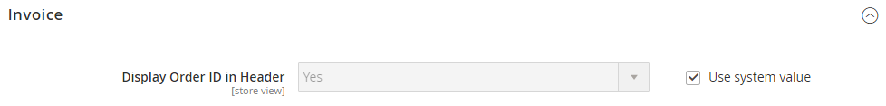
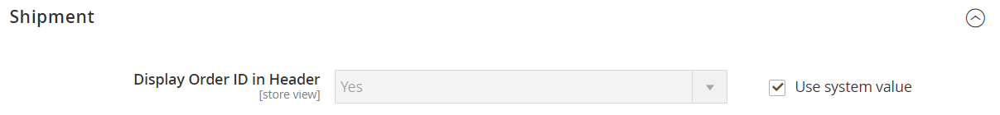

# [!UICONTROL Sales] > [!UICONTROL PDF Print-outs]

{{config}}

<!-- [Invoice](https://experienceleague.adobe.com/nl/docs/commerce-admin/stores-sales/site-store/sales-documents) -->

## [!UICONTROL Invoice]

<!-- zoom -->

| Veld | [ Reikwijdte ](../../getting-started/websites-stores-views.md#scope-settings) | Beschrijving |
|--- |--- |--- |
| [!UICONTROL Display Order ID in Header] | Winkelweergave | Neemt de Order-id op in de koptekst van facturen ter referentie. Opties: `Yes` / `No` |

{style="table-layout:auto"}

## [!UICONTROL Shipment]

<!-- zoom -->

| Veld | [ Reikwijdte ](../../getting-started/websites-stores-views.md#scope-settings) | Beschrijving |
|--- |--- |--- |
| [!UICONTROL Display Order ID in Header] | Winkelweergave | Neemt de Order-id ter referentie op in de koptekst van de schuifregelaars voor het verpakken van de zending. Opties: `Yes` / `No` |

{style="table-layout:auto"}

## [!UICONTROL Credit Memo]

<!-- zoom -->

| Veld | [ Reikwijdte ](../../getting-started/websites-stores-views.md#scope-settings) | Beschrijving |
|--- |--- |--- |
| [!UICONTROL Display Order ID in Header] | Winkelweergave | Neemt de Order-id op in de koptekst van creditnota&#39;s ter referentie. Opties: `Yes` / `No` |

{style="table-layout:auto"}
