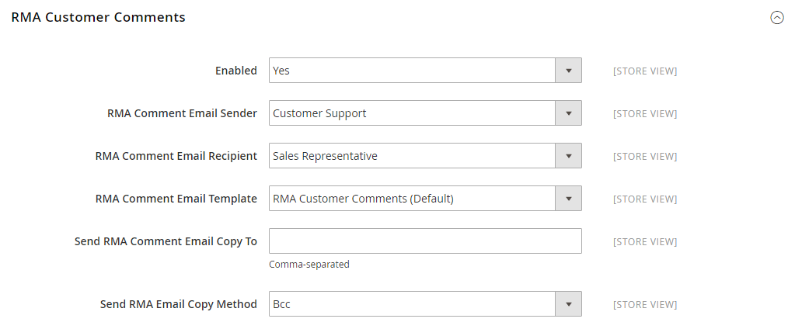

# [!UICONTROL Sales] > [!UICONTROL Sales Emails]

{{config}}

## [!UICONTROL General Settings]

<!-- zoom -->

<!-- [General Settings](https://experienceleague.adobe.com/nl/docs/commerce-admin/systems/communications/email-communications) -->

| Veld | [ Reikwijdte ](../../getting-started/websites-stores-views.md#scope-settings) | Beschrijving |
|--- |--- |--- |
| [!UICONTROL Asynchronous sending] | Algemeen | Hiermee bepaalt u of e-mails over verkopen asynchroon worden verzonden. U wordt aangeraden Asynchroon verzenden in te schakelen. Opties:  **`Disable`**- (Standaard) e-mails over verkopen worden verzonden wanneer deze door een gebeurtenis worden geactiveerd. **`Enable`** - (Aanbevolen) Verkoop-e-mails worden op vooraf bepaalde, regelmatige tijdstippen verzonden. |

{style="table-layout:auto"}

## [!UICONTROL Order]

<!-- zoom -->

<!-- [Order](https://experienceleague.adobe.com/nl/docs/commerce-admin/stores-sales/order-management/orders/orders) -->

| Veld | [ Reikwijdte ](../../getting-started/websites-stores-views.md#scope-settings) | Beschrijving |
|--- |--- |--- |
| [!UICONTROL Enabled] | Winkelweergave | Als deze optie is ingeschakeld, wordt een transactie-e-mail verzonden voor elke geplaatste bestelling. Opties: `Yes` / `No` |
| [!UICONTROL New Order Confirmation Email Sender] | Winkelweergave | Identificeert het opslagcontact dat als berichtafzender verschijnt. Standaardafzender: `Sales Representative` |
| [!UICONTROL New Order Confirmation Template] | Winkelweergave | Identificeert het malplaatje dat wordt verzonden om nieuwe die orden te bevestigen door klanten worden geplaatst. Standaardsjabloon: `New Order` |
| [!UICONTROL New Order Confirmation Template for Guest] | Winkelweergave | Identificeert het malplaatje dat wordt verzonden om nieuwe orden te bevestigen die door gasten worden geplaatst. Standaardsjabloon: `New Order for Guest` |
| [!UICONTROL Send Order Email Copy To] | Winkelweergave | Verstrekt het e-mailadres van iedereen om een exemplaar van een orde e-mail te ontvangen. Scheid meerdere adressen met een komma. |
| [!UICONTROL Send Order Email Copy Method] | Winkelweergave | Geeft de e-mailmethode aan die wordt gebruikt om de kopie te verzenden. U kunt onder andere de volgende opties kiezen:  **`Bcc`**- Hiermee wordt een blinde, hoffelijke kopie verzonden door de ontvanger op te nemen in de koptekst van dezelfde e-mail die naar de klant wordt verzonden. De ontvanger BCC is niet zichtbaar aan de klant. **`Separate Email`** - Verzendt de kopie als een aparte e-mail. |

{style="table-layout:auto"}

## [!UICONTROL Order Comments]

<!-- zoom -->

<!-- [Order Comments](https://experienceleague.adobe.com/nl/docs/commerce-admin/stores-sales/order-management/orders/order-processing#process-an-order) -->

| Veld | [ Reikwijdte ](../../getting-started/websites-stores-views.md#scope-settings) | Beschrijving |
|--- |--- |--- |
| [!UICONTROL Enabled] | Winkelweergave | Als deze optie is ingeschakeld, wordt een transactie-e-mail verzonden voor elke orderopmerking. Opties: `Yes` / `No` |
| [!UICONTROL Order Comment Email Sender] | Winkelweergave | Identificeert het opslagcontact dat als berichtafzender verschijnt. Standaardafzender: `Sales Representative` |
| [!UICONTROL Order Comment Email Template] | Winkelweergave | Identificeert het malplaatje dat wordt verzonden wanneer een commentaar aan een klantenorde wordt toegevoegd. Standaardsjabloon: `Order Update` |
| [!UICONTROL New Order Confirmation Template for Guest] | Winkelweergave | Identificeert het malplaatje dat wordt verzonden wanneer een commentaar aan een gastorde wordt toegevoegd. Standaardsjabloon: `Order Update for Guest` |
| [!UICONTROL Send Order Email Copy To|Store View] | Verstrekt het e-mailadres van iedereen om een exemplaar van een bericht van de ordecommentaar te ontvangen. Scheid meerdere adressen met een komma. |
| [!UICONTROL Send Order Email Copy Method] | Winkelweergave | Geeft de methode aan die wordt gebruikt om de kopie te verzenden. U kunt onder andere de volgende opties kiezen:  **`Bcc`**- Hiermee wordt een blinde, hoffelijke kopie verzonden door de ontvanger op te nemen in de koptekst van dezelfde e-mail die naar de klant wordt verzonden. De ontvanger BCC is niet zichtbaar aan de klant. **`Separate Email`** - Verzendt de kopie als een aparte e-mail. |

{style="table-layout:auto"}

## [!UICONTROL Invoice]

<!-- zoom -->

<!-- [Invoice](https://experienceleague.adobe.com/nl/docs/commerce-admin/stores-sales/order-management/invoices) -->

| Veld | [ Reikwijdte ](../../getting-started/websites-stores-views.md#scope-settings) | Beschrijving |
|--- |--- |--- |
| [!UICONTROL Enabled] | Winkelweergave | Als deze optie is ingeschakeld, wordt een transactie-e-mail verzonden voor elke gegenereerde factuur. Opties: `Yes` / `No` |
| [!UICONTROL Invoice Email Sender] | Winkelweergave | Identificeert het opslagcontact dat als berichtafzender verschijnt. Standaardafzender: `Sales Representative` |
| [!UICONTROL Invoice Email Template] | Winkelweergave | Identificeert het malplaatje dat wordt verzonden wanneer een factuur voor een klant wordt geproduceerd. Standaardsjabloon: `New Invoice` |
| [!UICONTROL Invoice Email Template for Guest] | Winkelweergave | Identificeert het malplaatje dat wordt verzonden wanneer een factuur voor een gast wordt geproduceerd. Standaardsjabloon: `New Invoice for Guest` |
| [!UICONTROL Send Invoice Email Copy To] | Winkelweergave | Verstrekt het e-mailadres van iedereen om een exemplaar van een factuur e-mail te ontvangen. Scheid meerdere adressen met een komma. |
| [!UICONTROL Send Invoice Email Copy Method] | Winkelweergave | Geeft de methode aan die wordt gebruikt om de kopie te verzenden. U kunt onder andere de volgende opties kiezen:  **`Bcc`**- Hiermee wordt een blinde, hoffelijke kopie verzonden door de ontvanger op te nemen in de koptekst van dezelfde e-mail die naar de klant wordt verzonden. De ontvanger BCC is niet zichtbaar aan de klant. **`Separate Email`** - Verzendt de kopie als een aparte e-mail. |

{style="table-layout:auto"}

## [!UICONTROL Invoice Comments]

<!-- zoom -->

<!-- [Invoice Comments](https://experienceleague.adobe.com/nl/docs/commerce-admin/stores-sales/order-management/invoices#create-an-invoice) -->

| Veld | [ Reikwijdte ](../../getting-started/websites-stores-views.md#scope-settings) | Beschrijving |
|--- |--- |--- |
| [!UICONTROL Enabled] | Winkelweergave | Als deze optie is ingeschakeld, wordt een transactie-e-mail verzonden voor elke factuuropmerking. Opties: `Yes` / `No` |
| [!UICONTROL Invoice Comment Email Sender] | Winkelweergave | Identificeert het opslagcontact dat als berichtafzender verschijnt. Standaardafzender: `Sales Representative` |
| [!UICONTROL Invoice Comment Email Template] | Winkelweergave | Hiermee wordt de sjabloon aangegeven die wordt verzonden wanneer een opmerking wordt toegevoegd aan een klantfactuur. Standaardsjabloon: `Invoice Update` |
| [!UICONTROL Invoice Comment Email Template for Guest] | Winkelweergave | Identificeert het malplaatje dat wordt verzonden wanneer een commentaar aan een gastfactuur wordt toegevoegd. Standaardsjabloon: `Invoice Update for Guest` |
| [!UICONTROL Send Invoice Comment Email Copy To] | Winkelweergave | Verstrekt het e-mailadres van iedereen om een exemplaar van een de opmerkingsbericht van de factuur te ontvangen. Scheid meerdere adressen met een komma. |
| [!UICONTROL Send Invoice Comments Email Copy Method] | Winkelweergave | Geeft de e-mailmethode aan die wordt gebruikt om de kopie te verzenden. U kunt onder andere de volgende opties kiezen:  **`Bcc`**- Hiermee wordt een blinde, hoffelijke kopie verzonden door de ontvanger op te nemen in de koptekst van dezelfde e-mail die naar de klant wordt verzonden. De ontvanger BCC is niet zichtbaar aan de klant. **`Separate Email`** - Verzendt de kopie als een aparte e-mail. |

{style="table-layout:auto"}

## [!UICONTROL Shipment]

<!-- zoom -->

<!-- [Shipment](https://experienceleague.adobe.com/nl/docs/commerce-admin/stores-sales/order-management/shipments) -->

| Veld | [ Reikwijdte ](../../getting-started/websites-stores-views.md#scope-settings) | Beschrijving |
|--- |--- |--- |
| [!UICONTROL Enabled] | Winkelweergave | Als deze optie is ingeschakeld, wordt een transactie-e-mail verzonden voor elke gegenereerde verzending. Opties: `Yes` / `No` |
| [!UICONTROL Shipment Email Sender] | Winkelweergave | Identificeert het opslagcontact dat als afzender van het bericht verschijnt. Standaardafzender: `Sales Representative` |
| [!UICONTROL Shipment Email Template] | Winkelweergave | Identificeert het malplaatje dat wordt verzonden wanneer een verzending voor een klant wordt geproduceerd. Standaardsjabloon: `New Shipment` |
| [!UICONTROL Shipment Email Template for Guest] | Winkelweergave | Identificeert het malplaatje dat wordt verzonden wanneer een verzending voor een gast wordt geproduceerd. Standaardsjabloon: `New Shipment for Guest` |
| [!UICONTROL Send Shipment Email Copy To] | Winkelweergave | Verstrekt het e-mailadres van iedereen die een exemplaar van een verzending e-mail zou moeten ontvangen. Scheid meerdere adressen met een komma. |
| [!UICONTROL Send Shipment Email Copy Method] | Winkelweergave | Geeft de methode aan die wordt gebruikt om de kopie te verzenden. U kunt onder andere de volgende opties kiezen:  **`Bcc`**- Hiermee wordt een blinde, hoffelijke kopie verzonden door de ontvanger op te nemen in de koptekst van dezelfde e-mail die naar de klant wordt verzonden. De ontvanger BCC is niet zichtbaar aan de klant. **`Separate Email`** - Verzendt de kopie als een aparte e-mail. |

{style="table-layout:auto"}

## [!UICONTROL Shipment Comments]

<!-- zoom -->

<!-- [Shipment Comments](https://experienceleague.adobe.com/nl/docs/commerce-admin/stores-sales/order-management/shipments) -->

| Veld | [ Reikwijdte ](../../getting-started/websites-stores-views.md#scope-settings) | Beschrijving |
|--- |--- |--- |
| [!UICONTROL Enabled] | Winkelweergave | Als deze optie is ingeschakeld, wordt een transactie-e-mail verzonden voor elke opmerking bij de verzending. Opties: `Yes` / `No` |
| [!UICONTROL Shipment Comment Email Sender] | Winkelweergave | Identificeert het opslagcontact dat als berichtafzender verschijnt. Standaardafzender: `Sales Representative` |
| [!UICONTROL Shipment Comment Email Template] | Winkelweergave | Identificeert het malplaatje dat wordt verzonden wanneer een commentaar aan een klantenverzending wordt toegevoegd. Standaardsjabloon: `Shipment Update` |
| [!UICONTROL Shipment Comment Email Template for Guest] | Winkelweergave | Identificeert het malplaatje dat wordt verzonden wanneer een commentaar aan een gastverzending wordt toegevoegd. Standaardsjabloon: `Shipment Update for Guest` |
| [!UICONTROL Send Shipment Comment Email Copy To] | Winkelweergave | Verstrekt het e-mailadres van iedereen om een exemplaar van een verzending commentaare-mail te ontvangen. Scheid meerdere adressen met een komma. |
| [!UICONTROL Send Shipment Comments Email Copy Method] | Winkelweergave | Geeft de e-mailmethode aan die wordt gebruikt om de kopie te verzenden. U kunt onder andere de volgende opties kiezen:  **`Bcc`**- Hiermee wordt een blinde, hoffelijke kopie verzonden door de ontvanger op te nemen in de koptekst van dezelfde e-mail die naar de klant wordt verzonden. De ontvanger BCC is niet zichtbaar aan de klant. **`Separate Email`** - Verzendt de kopie als een aparte e-mail. |

{style="table-layout:auto"}

## [!UICONTROL Credit Memo]

<!-- zoom -->

<!-- [Credit Memo](https://experienceleague.adobe.com/nl/docs/commerce-admin/stores-sales/order-management/credit-memos/credit-memos) -->

| Veld | [ Reikwijdte ](../../getting-started/websites-stores-views.md#scope-settings) | Beschrijving |
|--- |--- |--- |
| [!UICONTROL Enabled] | Winkelweergave | Hiermee activeert u de transactie-e-mail voor elk gegenereerd creditnota. Opties: `Yes` / `No` |
| [!UICONTROL Credit Memo Email Sender] | Winkelweergave | Identificeert het opslagcontact dat als afzender van het bericht verschijnt. Standaardafzender: `Sales Representative` |
| [!UICONTROL Credit Memo Email Template] | Winkelweergave | Identificeert het malplaatje dat wordt verzonden wanneer een creditnota voor een klant wordt geproduceerd. Standaardsjabloon: `New Credit Memo` |
| [!UICONTROL Credit Memo Email Template for Guest] | Winkelweergave | Identificeert het malplaatje dat wordt verzonden wanneer een creditmemo voor een gast wordt geproduceerd. Standaardsjabloon: `New Credit Memo for Guest` |
| [!UICONTROL Send Credit Memo Email Copy To] | Winkelweergave | Verstrekt het e-mailadres van iedereen die een exemplaar van een creditmemo e-mail zou moeten ontvangen. Scheid meerdere adressen met een komma. |
| [!UICONTROL Send Credit Memo Email Copy Method] | Winkelweergave | Geeft de methode aan die wordt gebruikt om de kopie te verzenden. U kunt onder andere de volgende opties kiezen:  **`Bcc`**- Hiermee wordt een blinde, hoffelijke kopie verzonden door de ontvanger op te nemen in de koptekst van dezelfde e-mail die naar de klant wordt verzonden. De ontvanger BCC is niet zichtbaar aan de klant. **`Separate Email`** - Verzendt de kopie als een aparte e-mail. |

{style="table-layout:auto"}

## [!UICONTROL Credit Memo Comments]

<!-- zoom -->

<!-- [Credit Memo Comments](https://experienceleague.adobe.com/nl/docs/commerce-admin/stores-sales/order-management/credit-memos/credit-memo-create) -->

| Veld | [ Reikwijdte ](../../getting-started/websites-stores-views.md#scope-settings) | Beschrijving |
|--- |--- |--- |
| [!UICONTROL Enabled] | Winkelweergave | Als deze optie is ingeschakeld, wordt een transactie-e-mail verzonden voor elke opmerking in het creditnota. Opties: `Yes` / `No` |
| [!UICONTROL Credit Memo Comment Email Sender] | Winkelweergave | Identificeert het opslagcontact dat als berichtafzender verschijnt. Standaardafzender: `Sales Representative` |
| [!UICONTROL Credit Memo Comment Email Template] | Winkelweergave | Identificeert het malplaatje dat wordt verzonden wanneer een commentaar aan een klantencreditnota wordt toegevoegd. Standaardsjabloon: `Credit Memo Update` |
| [!UICONTROL Credit Memo Comment Email Template for Guest] | Winkelweergave | Identificeert het malplaatje dat wordt verzonden wanneer een commentaar aan een gastkredietmemo wordt toegevoegd. Standaardsjabloon: `Credit Memo Update for Guest` |
| [!UICONTROL Send Credit Memo Comment Email Copy To] | Winkelweergave | Hier geeft u het e-mailadres op van iedereen die een kopie van een e-mail met opmerkingen over creditnota&#39;s ontvangt. Scheid meerdere adressen met een komma. |
| [!UICONTROL Send Credit Memo Comments Email Copy Method] | Winkelweergave | Geeft de e-mailmethode aan die wordt gebruikt om de kopie te verzenden. U kunt onder andere de volgende opties kiezen:  **`Bcc`**- Hiermee wordt een blinde, hoffelijke kopie verzonden door de ontvanger op te nemen in de koptekst van dezelfde e-mail die naar de klant wordt verzonden. De ontvanger BCC is niet zichtbaar aan de klant. **`Separate Email`** - Verzendt de kopie als een aparte e-mail. |

{style="table-layout:auto"}

## [!UICONTROL Order Ready For Pickup in Store]

<!-- zoom -->

<!-- [Order Ready For Pickup in Store](https://experienceleague.adobe.com/nl/docs/commerce-admin/stores-sales/delivery/basic-methods/shipping-in-store-delivery) -->

| Veld | [ Reikwijdte ](../../getting-started/websites-stores-views.md#scope-settings) | Beschrijving |
|--- |--- |--- |
| [!UICONTROL Enabled] | Winkelweergave | Als deze optie is ingeschakeld, wordt een transactie-e-mail verzonden wanneer een bestelling gereed is voor ophalen in de winkel. Opties: `Yes` / `No` |
| [!UICONTROL Order Ready For Pickup Email Sender] | Winkelweergave | Identificeert het opslagcontact dat als berichtafzender verschijnt. Standaardafzender: `General Contact` |
| [!UICONTROL Order Ready For Pickup Email Template] | Winkelweergave | Identificeert het malplaatje dat voor transactie e-mail voor elke orde wordt gebruikt die voor bestelling in opslag voor een geregistreerde klant klaar is. Standaardsjabloon: `Order is Ready for Pickup` |
| [!UICONTROL Order Ready For Pickup Email Template for Guest] | Winkelweergave | Identificeert het malplaatje dat voor transactie e-mail voor elke orde wordt gebruikt die voor bestelling in opslag voor een gast klaar is. Standaardsjabloon: `Order is Ready for Pickup for Guest` |
| Bestelling gereed voor afhalen e-mailkopie naar | Winkelweergave | Specificeert het e-mailadres van iedereen om een exemplaar van a _Klaar de Orde voor Bestelwagen_ e-mail te ontvangen. Scheid meerdere adressen met een komma. |
| [!UICONTROL Send Order Ready For Pickup Email Copy Method] | Winkelweergave | Geeft de e-mailmethode aan die wordt gebruikt om de kopie te verzenden. Opties:  **`Bcc`**- hiermee wordt een blinde, hoffelijke kopie verzonden door de ontvanger op te nemen in de koptekst van dezelfde e-mail die naar de klant is verzonden. De ontvanger BCC is niet zichtbaar aan de klant. **`Separate Email`** - Verzendt de kopie als een aparte e-mail. |

{style="table-layout:auto"}

## [!UICONTROL Purchase Order Approval]

{{b2b-feature}}

<!-- zoom -->

| Veld | [ Reikwijdte ](../../getting-started/websites-stores-views.md#scope-settings) | Beschrijving |
|--- |--- |--- |
| [!UICONTROL Enabled] | Winkelweergave | Als deze optie is ingeschakeld, worden tijdens het inkooporderproces e-mails verzonden. Opties: `Yes` / `No` |
| [!UICONTROL Created and requires Approval Purchase Order (to Buyer)] | Winkelweergave | Hiermee stuurt u een e-mailbevestiging naar de maker van de kooporder. |
| [!UICONTROL Created and Automatically approved Purchase Order (to Buyer)] | Winkelweergave | Hiermee stuurt u een e-mailbevestiging naar de maker van de kooporder. |
| [!UICONTROL Approved Purchase Order (to Buyer)] | Winkelweergave | Hiermee stuurt u een e-mail naar de maker bij goedkeuring van de inkooporder. |
| [!UICONTROL Rejected Purchase Order (to Buyer)] | Winkelweergave | Hiermee stuurt u een e-mail naar de maker wanneer het inkooporder is geweigerd. |
| [!UICONTROL Comment added to Purchase Order] | Winkelweergave | Verstuurt een e-mail naar de maker wanneer een opmerking is toegevoegd aan de inkooporder. |
| [!UICONTROL Error creating Order from Purchase Order (to Buyer)] | Winkelweergave | Meldt de maker dat een fout voorkwam wanneer het omzetten van een PO in een orde. |
| [!UICONTROL Purchase Order required Approval (to Approver)] | Winkelweergave | Hiermee verzendt u een e-mail met de kennisgeving aan de fiatteur dat voor de inkooporder goedkeuring is vereist. |

{style="table-layout:auto"}

## [!UICONTROL Quote]

{{b2b-feature}}

<!-- zoom -->

<!-- [Quotes](https://experienceleague.adobe.com/nl/docs/commerce-admin/b2b/quotes/account-dashboard-my-quotes) -->

| Veld | [ Reikwijdte ](../../getting-started/websites-stores-views.md#scope-settings) | Beschrijving |
|--- |--- |--- |
| [!UICONTROL Enabled] | Winkelweergave | Hiermee kunt u aanhalingstekens verzenden vanuit de huidige winkelweergave. Opties: `Yes` / `No` |
| [!UICONTROL Updated Quote Template (to Buyer)] | Winkelweergave | Bepaalt de e-mailtemplate die wordt gebruikt voor meldingen die naar de koper worden verzonden wanneer een bijgewerkte prijsopgave beschikbaar is. Standaardsjabloon: `Updated Quote` |
| [!UICONTROL Declined Quote Template (to Buyer)] | Winkelweergave | Bepaalt de e-mailtemplate die wordt gebruikt voor meldingen die naar de koper worden verzonden wanneer een prijsopgave wordt afgewezen. Standaardsjabloon: `Declined Quote` |
| [!UICONTROL New Quote Template (to Seller)] | Winkelweergave | Bepaalt de e-mailtemplate die wordt gebruikt voor meldingen die naar de verkoper worden verzonden wanneer een aanvraag voor een nieuwe prijsopgave wordt ontvangen. Standaardsjabloon: `New Quote` |
| [!UICONTROL Updated Quote Template (to Seller)] | Winkelweergave | Bepaalt de e-mailtemplate die wordt gebruikt voor meldingen die naar de verkoper worden verzonden wanneer een bijgewerkte prijsopgave wordt ontvangen. Standaardsjabloon: `Updated Quote` |
| [!UICONTROL Quote Expiration (in 48 hrs)] | Winkelweergave | Hier geeft u de e-mailsjabloon op die wordt gebruikt voor de vervalmelding die 48 uur voordat het aanhalingsteken vervalt wordt verzonden. Standaardsjabloon: `Expiration Warning` |
| [!UICONTROL Quote Expiration (in 24 hrs)] | Winkelweergave | Hier geeft u de e-mailsjabloon op die wordt gebruikt voor de vervalmelding die 24 uur vóór het verlopen van het citaat wordt verzonden. Standaardsjabloon: `Expiration Warning 1` |
| [!UICONTROL Expiration Date Reset] | Winkelweergave | Hier geeft u de e-mailsjabloon op die wordt gebruikt voor de kennisgeving die wordt verzonden wanneer de vervaldatum verandert. Standaardsjabloon: `Expiration Date Reset` |
| [!UICONTROL Send Quote Email Copy To] | Winkelweergave | Hier geeft u het e-mailadres op van elke persoon die een kopie van de aanhalingstekst moet ontvangen. Scheid meerdere adressen met een komma. |
| [!UICONTROL Send Quote Email Copy Method] | Winkelweergave | Geeft de e-mailmethode aan die wordt gebruikt om de kopie te verzenden. U kunt onder andere de volgende opties kiezen:  **`Bcc`**- Hiermee wordt een blinde, hoffelijke kopie verzonden door de ontvanger op te nemen in de koptekst van dezelfde e-mail die naar de klant wordt verzonden. De ontvanger BCC is niet zichtbaar aan de klant. **`Separate Email`** - Verzendt de kopie als een aparte e-mail. |

{style="table-layout:auto"}

## [!UICONTROL RMA]

{{ee-feature}}

<!-- zoom -->

<!-- [RMA](https://experienceleague.adobe.com/nl/docs/commerce-admin/stores-sales/order-management/returns/returns) -->

| Veld | [ Reikwijdte ](../../getting-started/websites-stores-views.md#scope-settings) | Beschrijving |
|--- |--- |--- |
| [!UICONTROL Enabled] | Winkelweergave | Activeert e-mailbericht voor elke gegenereerde RMA. Opties: `Yes` / `No` |
| [!UICONTROL RMA Email Sender] | Winkelweergave | Identificeert het [ opslagcontact ](../../getting-started/store-details.md#store-email-addresses) dat als afzender van het bericht verschijnt. Standaardwaarde: `Sales Representative` |
| [!UICONTROL RMA Email Template] | Winkelweergave | Bepaalt het [ e-mailmalplaatje ](../../systems/email-templates.md) dat voor het bericht wordt gebruikt dat wordt verzonden wanneer RMA voor een klant wordt geproduceerd. Standaardsjabloon: `New RMA` |
| [!UICONTROL RMA Email Template for Guest] | Winkelweergave | Bepaalt het malplaatje dat wordt verzonden wanneer RMA voor een gast wordt geproduceerd. Standaardsjabloon: `New RMA for Guest` |
| [!UICONTROL Send RMA Email Copy To] | Winkelweergave | Verstrekt het e-mailadres van iedereen die een exemplaar van een e-mail RMA zou moeten ontvangen. Scheid meerdere adressen met een komma. |
| [!UICONTROL Send RMA  Email Copy Method] | Winkelweergave | Geeft de e-mailmethode aan die wordt gebruikt om de kopie te verzenden. U kunt onder andere de volgende opties kiezen:  **`Bcc`**- Hiermee wordt een blinde, hoffelijke kopie verzonden door de ontvanger op te nemen in de koptekst van dezelfde e-mail die naar de klant wordt verzonden. De ontvanger BCC is niet zichtbaar aan de klant. **`Separate Email`** - Verzendt de kopie als een aparte e-mail. |

{style="table-layout:auto"}

## [!UICONTROL RMA Authorization]

{{ee-feature}}

<!-- zoom -->

<!-- [RMA Authorization](https://experienceleague.adobe.com/nl/docs/commerce-admin/stores-sales/order-management/returns/rma-configure) -->

| Veld | [ Reikwijdte ](../../getting-started/websites-stores-views.md#scope-settings) | Beschrijving |
|--- |--- |--- |
| [!UICONTROL Enabled] | Winkelweergave | Wanneer toegelaten, verzendt een e-mailbericht voor elke vergunning RMA. Opties: `Yes` / `No` |
| [!UICONTROL RMA Authorization Email Sender] | Winkelweergave | Identificeert het [ opslagcontact ](../../getting-started/store-details.md#store-email-addresses) dat als berichtafzender verschijnt. Standaardwaarde: `Sales Representative` |
| [!UICONTROL RMA Authorization Email Template] | Winkelweergave | Bepaalt het [ e-mailmalplaatje ](../../systems/email-templates.md) dat wordt gebruikt wanneer een RMA vergunningsbericht wordt verzonden. Standaardsjabloon: `RMA Authorization` |
| [!UICONTROL RMA Authorization Email Template for Guest] | Winkelweergave | Bepaalt het malplaatje dat wordt gebruikt wanneer een RMA vergunningsbericht wordt verzonden naar een gast. Standaardsjabloon: `RMA Authorization for Guest` |
| [!UICONTROL Send RMA Authorization Email Copy To] | Winkelweergave | Verstrekt het e-mailadres van iedereen om een exemplaar van een RMA vergunningse-mail te ontvangen. Scheid meerdere adressen met een komma. |
| [!UICONTROL Send RMA Authorization Email Copy Method] | Winkelweergave | Geeft de e-mailmethode aan die wordt gebruikt om de kopie te verzenden. U kunt onder andere de volgende opties kiezen:  **`Bcc`**- Hiermee wordt een blinde, hoffelijke kopie verzonden door de ontvanger op te nemen in de koptekst van dezelfde e-mail die naar de klant wordt verzonden. De ontvanger BCC is niet zichtbaar aan de klant. **`Separate Email`** - Verzendt de kopie als een aparte e-mail. |

{style="table-layout:auto"}

## [!UICONTROL RMA Admin Comments]

{{ee-feature}}

<!-- zoom -->

| Veld | [ Reikwijdte ](../../getting-started/websites-stores-views.md#scope-settings) | Beschrijving |
|--- |--- |--- |
| [!UICONTROL Enabled] | Winkelweergave | Als deze optie is ingeschakeld, wordt een e-mailbericht verzonden voor elke opmerking van RMA-beheerder. Opties: `Yes` / `No` |
| [!UICONTROL RMA Comment Email Sender] | Winkelweergave | Identificeert het [ opslagcontact ](../../getting-started/store-details.md#store-email-addresses) dat als berichtafzender verschijnt. Standaardwaarde: `Sales Representative` |
| [!UICONTROL RMA Comment Email Template] | Winkelweergave | Bepaalt het [ e-mailmalplaatje ](../../systems/email-templates.md) dat wordt gebruikt wanneer Admin een commentaar aan RMA voor een klant toevoegt. Standaardsjabloon: `RMA Admin Comments` |
| [!UICONTROL RMA Comment Email Template for Guest] | Winkelweergave | Bepaalt het malplaatje dat wordt gebruikt wanneer Admin een commentaar aan RMA voor een gast toevoegt. Standaardsjabloon: `RMA Admin Comments for Guest` |
| [!UICONTROL Send RMA Comment Email Copy To] | Winkelweergave | Verstrekt het e-mailadres van iedereen om een exemplaar van het bericht te ontvangen. Scheid meerdere adressen met een komma. |
| [!UICONTROL Send RMA Comments Email Copy Method] | Winkelweergave | Geeft de e-mailmethode aan die wordt gebruikt om de kopie te verzenden. U kunt onder andere de volgende opties kiezen:  **`Bcc`**- Hiermee wordt een blinde, hoffelijke kopie verzonden door de ontvanger op te nemen in de koptekst van dezelfde e-mail die naar de klant wordt verzonden. De ontvanger BCC is niet zichtbaar aan de klant. **`Separate Email`** - Verzendt de kopie als een aparte e-mail. |

{style="table-layout:auto"}

## [!UICONTROL RMA Customer Comments]

{{ee-feature}}

<!-- zoom -->

<!-- [RMA Customer Comments](https://experienceleague.adobe.com/nl/docs/commerce-admin/stores-sales/order-management/returns/returns) -->

| Veld | [ Reikwijdte ](../../getting-started/websites-stores-views.md#scope-settings) | Beschrijving |
|--- |--- |--- |
| [!UICONTROL Enabled] | Winkelweergave | Wanneer toegelaten, verzendt een e-mailbericht voor elke RMA klantencommentaar. Opties: `Yes` / `No` |
| [!UICONTROL RMA Comment Email Sender] | Winkelweergave | Identificeert het [ opslagcontact ](../../getting-started/store-details.md#store-email-addresses) dat als berichtafzender verschijnt. Standaardwaarde: `Customer Support` |
| [!UICONTROL RMA Comment Email Recipient] | Winkelweergave | Identificeert het opslagcontact dat de ontvanger van de klantencommentaare-mail is. Standaardwaarde: `Sales Representative` |
| [!UICONTROL RMA Comment Email Template] | Winkelweergave | Bepaalt het [ e-mailmalplaatje ](../../systems/email-templates.md) dat wordt gebruikt wanneer een klant een commentaar aan RMA toevoegt. Standaardsjabloon: `RMA Admin Comments` |
| [!UICONTROL Send RMA Comment Email Copy To] | Winkelweergave | Verstrekt het e-mailadres van iedereen om een exemplaar van het bericht te ontvangen. Scheid meerdere adressen met een komma. |
| [!UICONTROL Send RMA Comments Email Copy Method] | Winkelweergave | Geeft de e-mailmethode aan die wordt gebruikt om de kopie te verzenden. U kunt onder andere de volgende opties kiezen:  **`Bcc`**- Hiermee wordt een blinde, hoffelijke kopie verzonden door de ontvanger op te nemen in de koptekst van dezelfde e-mail die naar de klant wordt verzonden. De ontvanger BCC is niet zichtbaar aan de klant. **`Separate Email`** - Verzendt de kopie als een aparte e-mail. |

{style="table-layout:auto"}
