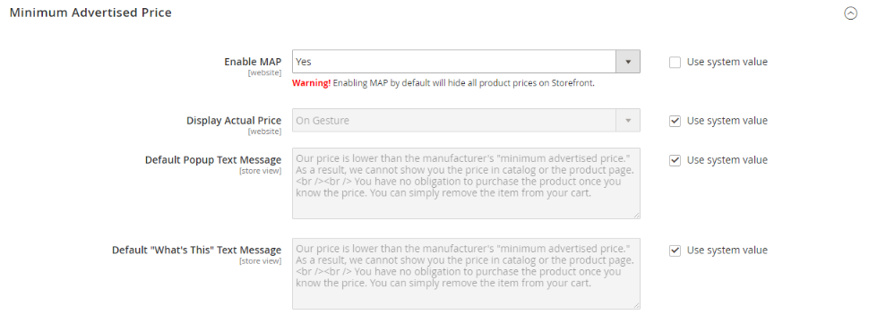
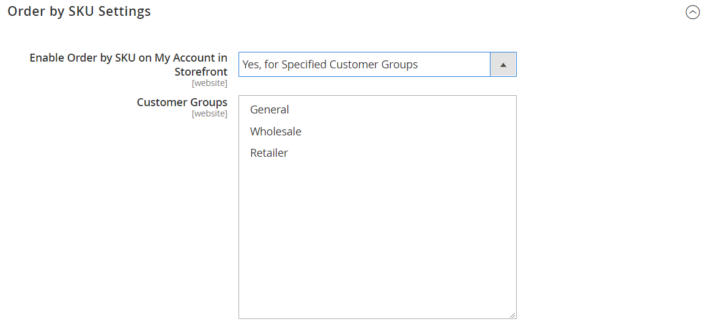

# [!UICONTROL Sales] > [!UICONTROL Sales]

{{config}}

## [!UICONTROL General]

<!-- zoom -->

<!-- [General](https://docs.magento.com/user-guide/marketing/sales-documents-ref-id.html) -->

| Veld | [Toepassingsgebied](../../getting-started/websites-stores-views.md#scope-settings) | Beschrijving |
|--- |--- |--- |
| [!UICONTROL Hide Customer IP] | Winkelweergave | Hiermee bepaalt u of het IP-adres van de klant wordt weergegeven op bestellingen, facturen, verzendingen en creditnota&#39;s. Opties: `Yes` / `No` |

{style="table-layout:auto"}

## [!UICONTROL Checkout Totals Sort Order]

<!-- zoom -->

<!-- [Checkout Totals Sort Order](https://docs.magento.com/user-guide/sales/checkout-totals-sort-order.html) -->

| Veld | [Toepassingsgebied](../../getting-started/websites-stores-views.md#scope-settings) | Beschrijving |
|--- |--- |--- |
| [!UICONTROL Subtotal] | Website | Een getal dat bepaalt wanneer het subtotaal wordt berekend ten opzichte van andere uitchecktotalen. Standaardwaarde: `10` |
| [!UICONTROL Discount] | Website | Een getal dat bepaalt wanneer de korting wordt berekend ten opzichte van andere uitchecktotalen. Standaardwaarde: `20` |
| [!UICONTROL Shipping] | Website | Een getal dat bepaalt wanneer de verzendkosten worden berekend ten opzichte van andere uitchecktotalen. Standaardwaarde: `30` |
| [!UICONTROL Tax] | Website | Een getal dat bepaalt wanneer belasting wordt berekend ten opzichte van andere uitchecktotalen. Standaardwaarde: `40` |
| [!UICONTROL Fixed Product Tax] | Website | Een getal dat bepaalt wanneer de Vaste productbelasting wordt berekend ten opzichte van andere uitchecktotalen. Standaardwaarde: `50` |
| [!UICONTROL Grand Total] | Website | Een getal dat bepaalt wanneer het Eindtotaal wordt berekend ten opzichte van andere uitchecktotalen. Standaardwaarde: `100` |

{style="table-layout:auto"}

## [!UICONTROL Reorder]

<!-- zoom -->

<!-- [Reorder](https://docs.magento.com/user-guide/sales/reorders-allow.html) -->

| Veld | [Toepassingsgebied](../../getting-started/websites-stores-views.md#scope-settings) | Beschrijving |
|--- |--- |--- |
| [!UICONTROL Allow Reorder] | Winkelweergave | Hiermee bepaalt u of de klanten de volgorde van hun accounts kunnen wijzigen. Opties: `Yes` / `No` |

{style="table-layout:auto"}

## [!UICONTROL Allow Zero Grand Total]

| Veld | [Toepassingsgebied](../../getting-started/websites-stores-views.md#scope-settings) | Beschrijving |
|--- |--- |--- |
| [!UICONTROL Allow Zero Grand Total for Credit Memo] | Winkelweergave | Bepaalt de mogelijkheid om een creditmemo met een totaal nul te creëren. Opties: `Yes` / `No` |

{style="table-layout:auto"}

## [!UICONTROL Invoice and Packing Slip Design]

<!-- zoom -->

<!-- [Invoice and Packing Slip Design](https://docs.magento.com/user-guide/marketing/sales-document-pdf-logo.html) -->

| Veld | [Toepassingsgebied](../../getting-started/websites-stores-views.md#scope-settings) | Beschrijving |
|--- |--- |--- |
| [!UICONTROL Logo for PDF Print-outs] | Winkelweergave | Hiermee geeft u het logobestand aan dat wordt weergegeven in de koptekst van PDF-facturen en verpakkingsslips. Toegestane bestandstypen:  JPG/JPEG  TIF/TIFF  PNG |
| [!UICONTROL Logo for HTML Print View] | Winkelweergave | Hiermee wordt het logobestand aangegeven dat wordt weergegeven in de koptekst van de HTML-afdrukweergave van facturen en verpakkingsschuifregelaars. Toegestane bestandstypen:  JPG/JPEG  GIF  PNG |
| [!UICONTROL Address] | Winkelweergave | Het adres van de winkel waar u het wilt weergeven op facturen en pakslips. |

{style="table-layout:auto"}

## [!UICONTROL Minimum Order Amount]

<!-- zoom -->

<!-- [Minimum Order Amount](https://docs.magento.com/user-guide/sales/cart-minimum-order-amount.html) -->

| Veld | [Toepassingsgebied](../../getting-started/websites-stores-views.md#scope-settings) | Beschrijving |
|--- |--- |--- |
| [!UICONTROL Enable] | Website | Hiermee wordt bepaald of een minimale orderhoeveelheid is ingesteld voor de site. Opties: `Yes` / `No` |
| [!UICONTROL Minimum Amount] | Website | Hiermee wordt het minimale subtotaal opgegeven. De volgorde na kortingen wordt toegepast. |
| [!UICONTROL Include Discount Amount] | Website | Hiermee wordt bepaald of het minimumorderbedrag toegepaste kortingen omvat. Opties: `Yes` / `No` |
| [!UICONTROL Include Tax to Amount] | Website | Hiermee wordt bepaald of het minimumbedrag van de bestelling inclusief belasting is. Opties: `Yes` / `No` |
| [!UICONTROL Description Message] | Winkelweergave | Hiermee bepaalt u het bericht dat boven aan het winkelwagentje wordt weergegeven wanneer het aantal winkelwagentjes lager is dan het minimale aantal bestellingen. Indien leeg gelaten, verschijnt het volgende standaardbericht: `Minimum order amount is $[minimum_amount]` |
| [!UICONTROL Error to Show in Shopping Cart] | Winkelweergave | Hiermee bepaalt u het bericht dat wordt weergegeven van de mini-winkelwagen of de uitcheckkoppeling wanneer het orderbedrag lager is dan het vereiste minimale orderbedrag. Als deze optie leeg blijft, wordt een standaardbericht weergegeven. |
| [!UICONTROL Validate Each Address Separately in Multi-address Checkout] | Website | Voor multi-item orden, bepaalt als de orde punten die aan afzonderlijke adressen gaan veel aan het minimumordebedrag voldoen. Opties: `Yes` / `No` |
| [!UICONTROL Multi-address Description Message] | Winkelweergave | Voor multi-adresorden, bepaalt het bericht dat in het het winkelwagentje verschijnt als de punten die naar een adres worden verzonden minder dan het minimumordebedrag zijn. |
| [!UICONTROL Multi-address Error to Show in Shopping Cart] | Winkelweergave | Voor multi-adresorden, bepaalt het bericht dat van de mini kart of controleverbinding verschijnt wanneer het ordebedrag minder dan het vereiste minimumordebedrag is. Als deze optie leeg blijft, wordt een standaardbericht weergegeven. |

{style="table-layout:auto"}

## [!UICONTROL Dashboard]

<!-- zoom -->

<!-- [Dashboard](https://docs.magento.com/user-guide/stores/admin-dashboard.html) -->

| Veld | [Toepassingsgebied](../../getting-started/websites-stores-views.md#scope-settings) | Beschrijving |
|--- |--- |--- |
| [!UICONTROL Use Aggregated Data] | Algemeen | Hiermee bepaalt u of real-time, samengevoegde verkoopgegevens worden gebruikt om momentopnamerapporten van het dashboard te maken. Als u een grote hoeveelheid gegevens hebt te verwerken, kunnen de prestaties worden verbeterd door de weergave van realtime gegevens uit te schakelen. Opties: `Yes` / `No` |

{style="table-layout:auto"}

## [!UICONTROL Orders Cron Settings]

<!-- zoom -->

<!-- [Orders Cron Settings](https://docs.magento.com/user-guide/system/cron.html) -->

| Veld | [Toepassingsgebied](../../getting-started/websites-stores-views.md#scope-settings) | Beschrijving |
|--- |--- |--- |
| [!UICONTROL Pending Payment Order Lifetime] | Website | Bepaalt de levensduur van lopende orders in minuten. Standaardinstelling: `480` minuten (8 uur) |

{style="table-layout:auto"}

## [!UICONTROL Gift Options]

<!-- zoom -->

<!-- [Gift Options](https://docs.magento.com/user-guide/sales/gift-options.html) -->

| Veld | [Toepassingsgebied](../../getting-started/websites-stores-views.md#scope-settings) | Beschrijving |
|--- |--- |--- |
| [!UICONTROL Allow Gift Messages on Order Level] | Website | Geef op of u een geschenk voor de gehele bestelling wilt toevoegen. |
| [!UICONTROL Allow Gift Messages on Order Items] | Website | Geef op of een cadeaubericht kan worden toegevoegd voor een afzonderlijk orderitem. |
| [!UICONTROL Allow Gift Wrapping on Order Level] | Website |  (Alleen Adobe Commerce) Geef op of het oppakken van cadeautjes kan worden toegevoegd voor de volledige bestelling. |
| [!UICONTROL Allow Gift Wrapping for Order Items] | Website |  (Alleen Adobe Commerce) Geef op of een cadeauverpakking kan worden toegevoegd voor het afzonderlijke orderitem. |
| [!UICONTROL Allow Gift Receipt] | Website |  (Alleen Adobe Commerce) Geef op of een kwitantie kan worden toegevoegd voor de bestelling. |
| [!UICONTROL Allow Printed Card] | Website |  (Alleen Adobe Commerce) Geef op of een afgedrukte kaart voor de bestelling kan worden toegevoegd. |
| [!UICONTROL Default Price for Printed Card] | Website |  (Alleen Adobe Commerce) Geef de standaardprijs op voor de afgedrukte kaart. |

{style="table-layout:auto"}

## [!UICONTROL Minimum Advertised Price]

<!-- zoom -->

<!-- [Minimum Advertised Price](https://docs.magento.com/user-guide/catalog/product-price-minimum-advertised.html) -->

| Veld | [Toepassingsgebied](../../getting-started/websites-stores-views.md#scope-settings) | Beschrijving |
|--- |--- |--- |
| [!UICONTROL Enable MAP] | Website | Hiermee activeert u de minimale geadverteerde prijs voor je winkel. Opties: `Yes` / `No` |
| [!UICONTROL Display Actual Price] | Website | Hiermee bepaalt u waar de werkelijke prijs van een product zichtbaar is voor de klant. Opties:  **`In Cart`**- Geeft de werkelijke productprijs weer in het winkelwagentje. **`Before Order Confirmation`** - Geeft de werkelijke productprijs weer aan het einde van het afrekenproces, vlak voordat de bestelling wordt bevestigd.  **`On Gesture`**- Geeft de werkelijke prijs van het product weer in een pop-up wanneer de klant klikt op de optie &quot;Klik voor prijs&quot; of &quot;Wat is dit?&quot; koppeling. |
| [!UICONTROL Default Popup Text Message] | Winkelweergave | Het tekstbericht dat wordt weergegeven wanneer de klant de koppeling &quot;Klik voor prijs&quot; selecteert in een categorielijst of productweergavepagina. |
| [!UICONTROL Default "What's This" Text Message] | Winkelweergave | Het tekstbericht dat verschijnt wanneer de klant &quot;wat is dit?&quot;klikt koppeling op de pagina met productweergave. |
| [!UICONTROL Manufacturer's Suggested Retail Price] | Algemeen | De door de fabrikant voorgestelde eindgebruikersprijs (MSRP). |

{style="table-layout:auto"}

## [!UICONTROL Multicoupon Settings]

{{ee-feature}}

<!-- zoom -->

| Veld | [Toepassingsgebied](../../getting-started/websites-stores-views.md#scope-settings) | Beschrijving |
|--- |--- |--- |
| [!UICONTROL Maximum number of coupons per order] | Website | Hiermee bepaalt u het maximum aantal toegestane coupons per bestelling |

{style="table-layout:auto"}

## [!UICONTROL Order by SKU Settings]

{{ee-feature}}

<!-- zoom -->

<!-- [Order by SKU Settings](https://docs.magento.com/user-guide/customers/account-dashboard-order-by-sku.html) -->

<!-- zoom -->

| Veld | [Toepassingsgebied](../../getting-started/websites-stores-views.md#scope-settings) | Beschrijving |
|--- |--- |--- |
| [!UICONTROL Enable Order by SKU on My Account in Storefront] | Website | Bepaalt als de Orde door SKU in het dashboard van de klantenrekening beschikbaar is. Opties:  **`Yes, for Everyone`**- Het tabblad Order by SKU wordt weergegeven in het accountdashboard van alle klanten. **`Yes, for Specified Customer Groups`** - Het tabblad Volgorde per SKU wordt weergegeven in het accountdashboard voor leden van opgegeven groepen of een gedeelde catalogus.  **`No`**- Het tabblad Order by SKU is niet beschikbaar in de klantenaccount. |
| [!UICONTROL Customer Groups] | Website | Bepaalt de Klantengroepen. Opties: `General` / `Retailer` / `Wholesale` |

{style="table-layout:auto"}

## [!UICONTROL Instant Purchase]

<!-- zoom -->

<!-- [Instant Purchase](https://docs.magento.com/user-guide/sales/checkout-instant-purchase.html) -->

| Veld | [Toepassingsgebied](../../getting-started/websites-stores-views.md#scope-settings) | Beschrijving |
|--- |--- |--- |
| [!UICONTROL Enabled] | Winkelweergave | Hiermee schakelt u Onmiddellijk aanschaffen in voor de winkelweergave, als de betalingsmethode, zoals Braintree, vault heeft ingeschakeld. Opties: `Yes` / `No` |
| [!UICONTROL Button Text] | Winkelweergave | Hiermee geeft u de tekst op die op de knop Onmiddellijk aanschaffen wordt weergegeven. De standaardtekst is `Instant Purchase`. |

{style="table-layout:auto"}

## [!UICONTROL Rate Limiting]

<!-- zoom -->

| Veld | [Toepassingsgebied](../../getting-started/websites-stores-views.md#scope-settings) | Beschrijving |
|--------------------------------------------------------|--- |------------------------------------------------------------------------------------------------------------------------------------------------------------------------------------|
| [!UICONTROL Enable rate limiting for placing orders] | Winkelweergave | Bepaalt als tarief het beperken wordt gebruikt voor het plaatsen van orden van de archiefmening (gebrek is `No`). Opties: `Yes` / `No`. |
| [!UICONTROL Requests limit per authenticated customer] | Winkelweergave | Het aantal koopverzoeken dat een voor authentiek verklaarde klant tijdens de periode kan maken. De standaardlimiet is `10`. |
| [!UICONTROL Requests limit per guest] | Winkelweergave | Het aantal koopverzoeken dat een niet-geverifieerde klant tijdens de opgegeven periode kan indienen. De standaardwaarde is `50`. |
| [!UICONTROL Counter resets in a ...] | Winkelweergave | De periode waarin een voor authentiek verklaarde/niet voor authentiek verklaarde klant een bepaald aantal koopverzoeken kan doen (gebrek is `Minute`). Opties: `Minute` / `Hour` /`Day` |

{style="table-layout:auto"}

## [!UICONTROL Orders, Invoices, Shipments, Credit Memos Archiving]

{{ee-feature}}

<!-- zoom -->

Zie voor meer informatie over het wijzigen van deze instellingen [Het orderarchief configureren](../../stores-purchase/order-archive.md#configure-the-order-archive) in de _Handleiding voor winkels en aanschaf_.

| Veld | [Toepassingsgebied](../../getting-started/websites-stores-views.md#scope-settings) | Beschrijving |
|--- |--- |--- |
| [!UICONTROL Enable Archiving] | Algemeen | Hiermee wordt bepaald of archiveren is ingeschakeld. Opties: `Yes` / `No` |
| [!UICONTROL Archive Orders Purchased] | Algemeen | Hiermee bepaalt u het aantal dagen dat doorgaat voordat een voltooide bestelling wordt gearchiveerd. Standaardwaarde: `30` |
| [!UICONTROL Order  Statuses to be Archived] | Algemeen | Hiermee bepaalt u de [status](../../stores-purchase/order-status.md) van te archiveren orders. Standaard worden bestellingen met de status Voltooid of Gesloten gearchiveerd. Opties: `Pending` / `Processing` / `Suspected Fraud` / `Complete` / `Closed` / `Canceled` / `On Hold` |

{style="table-layout:auto"}

## [!UICONTROL RMA Settings]

{{ee-feature}}

<!-- zoom -->

Zie voor meer informatie over het wijzigen van deze instellingen [Terugkeer configureren](../../stores-purchase/rma-configure.md) in de _Handleiding voor winkels en aanschaf_.

| Veld | [Toepassingsgebied](../../getting-started/websites-stores-views.md#scope-settings) | Beschrijving |
|--- |--- |--- |
| [!UICONTROL Enable RMA on Storefront] | Website | Bepaalt als de klanten RMA- verzoeken van de storefront kunnen tot stand brengen en bekijken. RMA kan op zowel nieuwe als bestaande orden worden toegepast. Standaard is RMA niet ingeschakeld voor de storefront. Opties: `Yes` / `No` |
| [!UICONTROL Enable RMA on Product Level] | Website | Bepaalt de standaardwaarde voor het Enable gebied RMA in productinformatie. |
| [!UICONTROL Use Store Address] | Website | Hiermee bepaalt u de naam en het adres van de contactpersoon die wordt gebruikt voor zendingen geretourneerde goederen. Opties:  **`Yes`**- Gebruikt de [Oorsprongpunt](../../stores-purchase/shipping-settings.md#point-of-origin) adres van Verzendinstellingen. **`No`** - Hiermee opent u het adresformulier, zodat u een ander adres kunt invoeren. |

{style="table-layout:auto"}
