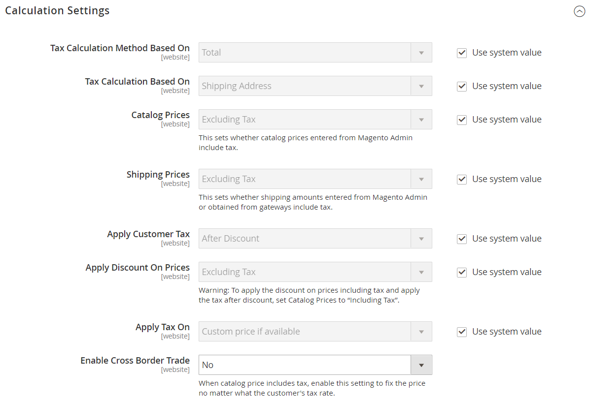

# [!UICONTROL Sales] > [!UICONTROL Tax]

>[!NOTE]
>
>In de versies 2.4.0 tot en met 2.4.3 van Adobe Commerce en Magento Open Source is de extensie opgenomen die door de leverancier van hoekpunten is ontwikkeld en die wordt gebruikt voor integratie met de [!UICONTROL Vertex Cloud] . Vanaf de versie 2.4.4 wordt deze extensie niet meer gebundeld met de kernrelease en moet deze worden geïnstalleerd en bijgewerkt vanaf de Commerce Marketplace. De Marketplace biedt ook toegang tot de huidige documentatie die wordt geleverd door de ontwikkelaar van de extensie.
>  
>Als u de gebundelde toegelaten en gevormde uitbreiding hebt, moet u uw composer.json- dossier als deel van het 2.4.4 verbeteringsproces bijwerken en om extensie updates te beheren die door:gaan. Zie [ modules en uitbreidingen van de Verbetering ](https://experienceleague.adobe.com/docs/commerce-operations/upgrade-guide/modules/upgrade.html) in de _Gids van de Verbetering_ voor meer informatie.

{{config}}

## [!UICONTROL Tax Classes]

<!-- zoom -->

Voor meer informatie over het veranderen van deze montages, zie [ Belastingklassen ](../../stores-purchase/tax-class.md) in de _Gids van de Opslag en van de Ervaring van de Aankoop_.

| Veld | [ Reikwijdte ](../../getting-started/websites-stores-views.md#scope-settings) | Beschrijving |
|--- |--- |--- |
| [!UICONTROL Tax Class for Shipping] | Website | Hiermee wordt de belastingklasse aangegeven die wordt gebruikt voor verzending. De opties omvatten alle beschikbare productbelastingklassen: `None` / `Taxable Goods` / `Shipping` / `Tax Exempt` |
| [!UICONTROL Tax Class for Gift Options] | Website |  (Adobe Commerce slechts) identificeert de standaard belastingklasse die voor geschenkopties wordt gebruikt. |
| [!UICONTROL Default Tax Class for Product] | Algemeen | Identificeert de standaardbelastingklasse die voor producten wordt gebruikt. |
| [!UICONTROL Default Tax Class for Customer] | Algemeen | Identificeert de standaardbelastingklasse die voor klanten wordt gebruikt. |

{style="table-layout:auto"}

## [!UICONTROL Calculation Settings]

<!-- zoom -->

| Veld | [ Reikwijdte ](../../getting-started/websites-stores-views.md#scope-settings) | Beschrijving |
|--- |--- |--- |
| [!UICONTROL Tax Calculation Method Based On] | Website | Bepaalt de methode die wordt gebruikt om de belasting voor een orde te berekenen. Opties: **`Unit Price`**- De belastingberekeningen zijn gebaseerd op de eenheidsprijs van elk product. **`Row Total`** - Belastingberekeningen zijn gebaseerd op het totaal van het regelitem.  **`Total`**- Belastingberekeningen zijn gebaseerd op het totaal van de bestellingen.  _ **&#x200B; Nota:**&#x200B;_als een uitbreiding van de belastingberekening van de Marketplace, zoals _de Wolk van de Hoekpunt_ wordt geïnstalleerd, is de uitbreidingsdienst vermeld als optie. |
| [!UICONTROL Tax Calculation Based On] | Website | Hiermee wordt bepaald of de berekening van de belasting is gebaseerd op het verzendadres, het factuuradres of de oorsprong van de verzending. Opties: `Shipping Address` / `Billing Address` / `Shipping Origin` |
| [!UICONTROL Catalog Prices] | Website | Hiermee wordt bepaald of catalogusprijzen belasting bevatten of uitsluiten. Opties: `Excluding Tax` / `Including Tax` |
| [!UICONTROL Shipping Prices] | Website | In de verzendprijzen wordt belasting opgenomen of uitgesloten. Opties: `Excluding Tax` / `Including Tax` |
| [!UICONTROL Apply Customer Tax] | Website | Hiermee wordt bepaald of belasting wordt toegepast vóór of na een korting. Opties: `Before Discount` / `After Discount` |
| [!UICONTROL Apply Discount on Prices] | Website | Hiermee wordt bepaald of in de kortingsprijzen belastingen zijn begrepen of niet. Opties: `Excluding Tax` / `Including Tax` |
| [!UICONTROL Apply Tax On] | Website | Hiermee wordt bepaald of de belasting van toepassing is op de oorspronkelijke prijs of op een aangepaste prijs, indien beschikbaar. Opties: `Custom price if available` / `Original price only` |
| [!UICONTROL Enable Cross Border Trade] | Website | Indien ingeschakeld past u consistente prijzen toe over de grenzen van regio&#39;s met verschillende belastingtarieven. Opties: `Yes` / `No`   **_Nota:_**&#x200B;het gebruiken van grensoverschrijdende handel past de winstmarge door belastingtarief aan. |

{style="table-layout:auto"}

## [!UICONTROL Default Tax Destination Calculation]

<!-- zoom -->

| Veld | [ Reikwijdte ](../../getting-started/websites-stores-views.md#scope-settings) | Beschrijving |
|--- |--- |--- |
| [!UICONTROL Default Country] | Winkelweergave | Bepaalt het land waarop de belastingberekeningen zijn gebaseerd. |
| [!UICONTROL Default State] | Winkelweergave | Bepaalt de staat waarop de belastingberekeningen zijn gebaseerd. Een sterretje (*) kan als jokerteken fungeren om alle staten in het geselecteerde land aan te geven. |
| [!UICONTROL Default Post Code] | Winkelweergave | Identificeert de postcode of postcode waarop de belastingberekeningen zijn gebaseerd. Een asterisk (*) kan als vervanging functioneren om op alle postcodes binnen de geselecteerde staat te wijzen. |

{style="table-layout:auto"}

## [!UICONTROL Price Display Settings]

<!-- zoom -->

Voor meer informatie over het veranderen van deze montages, zie [ de montages van de prijsvertoning ](../../stores-purchase/display-settings.md#configure-price-display-settings) in de _Gids van de Opslag en van de Ervaring van de Aankoop_ vormen.

| Veld | [ Reikwijdte ](../../getting-started/websites-stores-views.md#scope-settings) | Beschrijving |
|--- |--- |--- |
| [!UICONTROL Display Product Prices in Catalog] | Winkelweergave | Hiermee bepaalt u of in de catalogus gepubliceerde productprijzen belasting bevatten of uitsluiten, of twee versies van de prijs weergeven: één met en de andere zonder belasting. Opties: `Excluding Tax` / `Including Tax` / `Including and Excluding Tax`   **_Nota:_**&#x200B;als u het gebied van de Prijzen van het Product van de Vertoning aan `Including Tax` plaatst, verschijnt de belasting slechts als er een belastingregel is die de belastingoorsprong aanpast of er een klantenadres is dat de belastingregel aanpast. Gebeurtenissen die een overeenkomst kunnen activeren, zijn onder andere het aanmaken van een klantenaccount, aanmelding of het gebruik van het taxatieprogramma BTW en verzendkosten in het winkelwagentje. |
| [!UICONTROL Display Shipping Prices] | Winkelweergave | Hiermee bepaalt u of verzendprijzen belasting bevatten of uitsluiten, of twee versies van de verzendprijs weergeven: één met en de andere zonder belasting. Opties: `Excluding Tax` / `Including Tax` / `Including and Excluding Tax` |

{style="table-layout:auto"}

## [!UICONTROL Shopping Cart Display Settings]

<!-- zoom -->

Voor meer informatie over het veranderen van deze montages, zie [ de montages van de het winkelwagentvertoning ](../../stores-purchase/display-settings.md#step-2-configure-shopping-cart-display-settings) in de _Gids van de Opslag en van de Ervaring van de Aankoop_ vormen.

| Veld | [ Reikwijdte ](../../getting-started/websites-stores-views.md#scope-settings) | Beschrijving |
|--- |--- |--- |
| [!UICONTROL Display Prices] | Winkelweergave | Hiermee bepaalt u of winkelwagenprijzen belasting bevatten of uitsluiten of twee versies van de prijs weergeven: één met en één zonder belasting. Opties: `Excluding Tax` / `Including Tax` / `Including and Excluding Tax` |
| [!UICONTROL Display Subtotal|Store View] | Hiermee wordt bepaald of het subtotaal van het winkelwagentje belasting bevat of uitsluit, of twee versies van het subtotaal weergeeft; één met en de andere zonder belasting. Opties: `Excluding Tax` / `Including Tax` / `Including and Excluding Tax` |
| [!UICONTROL Display Shipping Amount] | Winkelweergave | Hiermee bepaalt u of het verzendbedrag van de winkelwagentje belasting bevat of uitsluit, of twee versies van het verzendbedrag weergeeft: één met en de andere zonder belasting. Opties: `Excluding Tax` / `Including Tax` / `Including and Excluding Tax` |
| [!UICONTROL Additionally Show Order Total Without Tax] | Winkelweergave | Hiermee wordt bepaald of er een extra regel met het totale bedrag in grote bedragen zonder belasting wordt weergegeven in het winkelwagentje. Opties: `Yes` / `No` |
| [!UICONTROL Display Full Tax Summary] | Winkelweergave | Hiermee wordt bepaald of het winkelwagentje een volledige belastingsamenvatting bevat. Opties: `Yes` / `No` |
| [!UICONTROL Display Zero Tax Subtotal] | Winkelweergave | Hiermee wordt bepaald of het winkelwagentje een fiscaal subtotaal bevat wanneer de belasting nul is. Opties: `Yes` / `No` |

{style="table-layout:auto"}

## [!UICONTROL Orders, Invoices, Credit Memos Display Settings]

<!-- zoom -->

Voor meer informatie over het veranderen van deze montages, zie [ orde, factuur, en de montages van de creditmemovertoning ](../../stores-purchase/display-settings.md#step-3-configure-order-invoice-and-credit-memo-display-settings) in de _Gids van de Opslag en van de Ervaring van de Aankoop_ vormen.

| Veld | [ Reikwijdte ](../../getting-started/websites-stores-views.md#scope-settings) | Beschrijving |
|--- |--- |--- |
| [!UICONTROL Display Prices] | Winkelweergave | Hiermee wordt bepaald of de prijzen op verkoopdocumenten belastingen bevatten of uitsluiten, of dat in elk document twee versies van de prijs worden weergegeven: een met en een zonder belasting. Opties: `Excluding Tax` / `Including Tax` / `Including and Excluding Tax` |
| [!UICONTROL Display Subtotal] | Winkelweergave | Hiermee wordt bepaald of het subtotaal op verkoopdocumenten belasting bevat of uitsluit, of dat in elk document twee versies van het subtotaal worden weergegeven: één met en één zonder belasting. Opties: `Excluding Tax` / `Including Tax` / `Including and Excluding Tax` |
| [!UICONTROL Display Shipping Amount] | Winkelweergave | Hiermee wordt bepaald of het verzendbedrag op verkoopdocumenten belasting bevat of uitsluit, of dat in elk document twee versies van het subtotaal worden weergegeven, waarvan er een met en een zonder belasting. Opties: `Excluding Tax` / `Including Tax` / `Including and Excluding Tax` |
| [!UICONTROL Additionally Show Order Total Without Tax] | Winkelweergave | Hiermee wordt bepaald of een extra regel met het totaal-generaal bedrag zonder belasting wordt weergegeven in de verkoopdocumenten. Opties: `Yes` / `No` |
| [!UICONTROL Display Full Tax Summary] | Winkelweergave | Hiermee bepaalt u of het volledige belastingoverzicht wordt weergegeven in de verkoopdocumenten. Opties: `Yes` / `No` |
| [!UICONTROL Display Zero Tax Subtotal] | Winkelweergave | Hiermee bepaalt u het subtotaal in de verkoopdocumenten wanneer er geen belasting wordt geheven. Opties: `Yes` / `No` |
| [!UICONTROL Display Gift Wrapping Prices] | Winkelweergave |  (Adobe Commerce slechts) bepaalt als gift-verpakkende prijzen in subtotal inbegrepen zijn. Opties: `Excluding Tax` / `Including Tax` / `Including and Excluding Tax` |
| [!UICONTROL Display Printed Card Prices] | Winkelweergave |  (Adobe Commerce slechts) bepaalt als de gedrukte kaartprijzen in subtotal inbegrepen zijn. Opties: `Excluding Tax` / `Including Tax` / `Including and Excluding Tax` |

{style="table-layout:auto"}

## [!UICONTROL Fixed Product Taxes]

<!-- zoom -->

Voor meer informatie over het veranderen van deze montages, zie [ Vaste productbelasting (FPT) ](../../stores-purchase/fixed-product-tax.md) in de _Gids van de Opslag en van de Ervaring van de Aankoop_.

| Veld | [ Reikwijdte ](../../getting-started/websites-stores-views.md#scope-settings) | Beschrijving |
|--- |--- |--- |
| [!UICONTROL Enable FPT] | Website | Hiermee wordt bepaald of FPT beschikbaar is. Opties: `Yes` / `No` |
| [!UICONTROL Display Prices in Product Lists] | Website | Bepaalt de weergave van FPT in productlijsten. Opties:  **`Including FPT Only`** - Weergegeven prijzen omvatten vaste productbelastingen. De hoeveelheid FPT wordt niet afzonderlijk weergegeven. **`Including FPT and FPT description`**- Weergegeven prijzen omvatten vaste productbelastingen. De hoeveelheid FPT wordt afzonderlijk weergegeven. **`Excluding FPT. Including FPT description and final price`** - Weergegeven prijzen omvatten geen vaste productbelastingen. De hoeveelheid FPT wordt afzonderlijk weergegeven. **`Excluding FPT`**- Weergegeven prijzen omvatten geen vaste productbelastingen. De hoeveelheid FPT wordt niet afzonderlijk weergegeven. |
| [!UICONTROL Display Prices On Product View Page] | Website | Bepaalt de weergave van FPT op de productpagina. Opties:  **`Including FPT Only`** - Weergegeven prijzen omvatten vaste productbelastingen. De hoeveelheid FPT wordt niet afzonderlijk weergegeven. **`Including FPT and FPT description`**- Weergegeven prijzen omvatten vaste productbelastingen. De hoeveelheid FPT wordt afzonderlijk weergegeven. **`Excluding FPT. Including FPT description and final price`** - Weergegeven prijzen omvatten geen vaste productbelastingen. De hoeveelheid FPT wordt afzonderlijk weergegeven. **`Excluding FPT`**- Weergegeven prijzen omvatten geen vaste productbelastingen. De hoeveelheid FPT wordt niet afzonderlijk weergegeven. |
| [!UICONTROL Display Prices in Sales Modules] | Website | Hiermee regelt u de weergave van FPT in het winkelwagentje en tijdens het uitchecken. Opties:  **`Including FPT Only`** - Weergegeven prijzen omvatten vaste productbelastingen. De hoeveelheid FPT wordt niet afzonderlijk weergegeven. **`Including FPT and FPT description`**- Weergegeven prijzen omvatten vaste productbelastingen. De hoeveelheid FPT wordt afzonderlijk weergegeven. **`Excluding FPT. Including FPT description and final price`** - Weergegeven prijzen omvatten geen vaste productbelastingen. De hoeveelheid FPT wordt afzonderlijk weergegeven. **`Excluding FPT`**- Weergegeven prijzen omvatten geen vaste productbelastingen. De hoeveelheid FPT wordt niet afzonderlijk weergegeven. |
| [!UICONTROL Display Prices in Emails] | Website | Hiermee bepaalt u de weergave van FPT in e-mail. Opties:  **`Including FPT Only`** - Weergegeven prijzen omvatten vaste productbelastingen. De hoeveelheid FPT wordt niet afzonderlijk weergegeven. **`Including FPT and FPT description`**- Weergegeven prijzen omvatten vaste productbelastingen. De hoeveelheid FPT wordt afzonderlijk weergegeven. **&#x200B; Excluding FPT. Inclusief FPT-beschrijving en uiteindelijke prijs &#x200B;**- De weergegeven prijzen omvatten geen vaste productbelastingen. De hoeveelheid FPT wordt afzonderlijk weergegeven. **`Excluding FPT`** - Weergegeven prijzen omvatten geen vaste productbelastingen. De hoeveelheid FPT wordt niet afzonderlijk weergegeven. |
| [!UICONTROL Apply Tax to FPT] | Website | Hiermee wordt bepaald of belasting wordt toegepast op het FPT-bedrag. Opties: `Yes` / `No` |
| [!UICONTROL Include FPT in Subtotal] | Website | Hiermee wordt bepaald of FPT is opgenomen in het subtotaal van het winkelwagentje. Opties:  **`Yes`**- Neemt FPT op in het winkelwagentje subtotaal. **`No`** - FPT is niet opgenomen in het subtotaal en wordt na het subtotaal in het winkelwagentje geplaatst. |

{style="table-layout:auto"}
