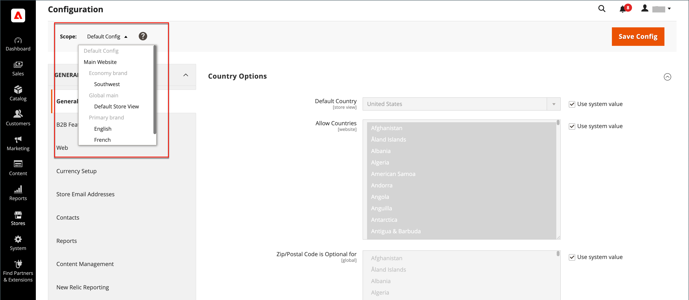

# Configuratiebereik

De kiezer van de Mening van de Opslag in de upper-left hoek van vele configuratiepagina&#39;s filtert de mening van de pagina voor een specifiek werkingsgebied, en plaatst de waarde van sommige entiteiten die door Handel worden gebruikt. Het maakt een lijst van elk niveau in de hiërarchie door naam, en wordt gebruikt om het werkingsgebied in een ander niveau te veranderen. Alle instellingen die het huidige bereik vertegenwoordigen, worden grijs weergegeven. Alleen de instellingen die de huidige bereikinstelling vertegenwoordigen, zijn dus beschikbaar. Het bereik is aanvankelijk ingesteld op _Standaardconfiguratie_. Voor Admin-gebruikers met beperkte toegang bevat de lijst met beschikbare archiefweergaven alleen de weergaven waartoe de gebruiker toegang heeft [machtiging](../systems/permissions.md) om toegang te krijgen.

| Niveau | Beschrijving |
|--- |--- |
| [!UICONTROL Default Config] | De standaardsysteemconfiguratie. |
| [!UICONTROL Main Website] | De naam van de website boven in de hiërarchie. |
| [!UICONTROL Main Website Store] | De naam van de standaardwinkel die aan de bovenliggende website is gekoppeld. |
| [!UICONTROL Default Store View] | De naam van de standaardopslagweergave die aan de bovenliggende opslag is gekoppeld. |
| [!UICONTROL Stores Configuration] | Springt naar het raster Stores en is hetzelfde als kiezen [!UICONTROL Stores] > [!UICONTROL All Stores] in de zijbalk Beheerder. |

{style="table-layout:auto"}

{width="700" zoomable="yes"}

## [!UICONTROL Use system value]

De _[!UICONTROL Use System Value]_checkbox rechts van vele configuratiemontages wordt gebruikt om of de standaardgebiedwaarde binnen het huidige configuratiewerkingsgebied toe te passen of met voeten te treden. De standaardwaarde voor het veld kan niet worden gewijzigd wanneer het selectievakje is ingeschakeld. Als u de waarde wilt wijzigen, schakelt u het selectievakje uit en voert u de nieuwe waarde in. U wordt gevraagd te bevestigen wanneer u de systeemwaarde wijzigt.

Het label van het selectievakje verandert afhankelijk van het huidige bereik en verwijst altijd naar het bovenliggende niveau dat één stap hoger in de hiërarchie van het bereik is. Omdat het ouderniveau een container voor alle punten onder dat niveau is, wordt het werkingsgebied dat van het ouderniveau plaatst geërft tenzij het wordt met voeten getreden.

## Standaardopties voor waarden

| Selectievakje | Beschrijving |
|--- |--- |
| [!UICONTROL Use system value] | Dit selectievakje wordt weergegeven wanneer het configuratiebereik is ingesteld op `Default Config`. |
| [!UICONTROL Use Default] | Dit selectievakje verschijnt wanneer het configuratiebereik is ingesteld op Hoofd `Website`en verwijst naar de standaardwinkel die aan de website is toegewezen. |
| [!UICONTROL Use Website] | Dit checkbox verschijnt wanneer het configuratiewerkingsgebied aan een specifieke opslagmening wordt geplaatst. Als deze optie is geselecteerd, wordt de instelling gebruikt van de bovenliggende website die is gekoppeld aan de winkelweergave. In dit geval wordt het opslagniveau overgeslagen omdat het van toepassing is op de standaardwinkel die aan de website is gekoppeld. |

{style="table-layout:auto"}

## Bereik instellen

Ga als volgt te werk voordat u een configuratie-instelling maakt die alleen van toepassing is op een specifieke website, op een specifieke opslagweergave of op een specifieke opslagweergave:

1. Op de _Beheerder_ Voer een van de volgende handelingen uit op de zijbalk:

   - Ga voor de meeste configuratie-instellingen naar **[!UICONTROL Stores]** > _[!UICONTROL Settings]_>**[!UICONTROL Configuration]**.

   - Voor [ontwerpinstellingen](../content-design/configuration.md), ga naar **[!UICONTROL Content]** > _[!UICONTROL Design]_>**[!UICONTROL Configuration]**. Kies vervolgens in het raster de toepasselijke winkelweergave.

1. Navigeer naar de configuratie die u wilt wijzigen en voer de volgende handelingen uit:

   - In de linkerbovenhoek, plaats **[!UICONTROL Store View]** op de specifieke weergave waarop de configuratie van toepassing is. Wanneer ertoe aangezet om werkingsgebiedomschakeling te bevestigen, klik **[!UICONTROL OK]**.

     Na elk veld wordt een selectievakje weergegeven en er kunnen extra velden beschikbaar komen.

   - Wis de **[!UICONTROL Use system value]** Schakel het selectievakje in na een veld dat u wilt bewerken. Werk vervolgens de waarde voor de weergave bij.

   - Herhaal dit proces voor elk veld dat op de pagina moet worden bijgewerkt.

   {width="700" zoomable="yes"}

1. Klik op **[!UICONTROL Save Config]**.

## Snelle naslaggids voor bereik

| Toepassingsgebied | Beschrijving |
|--- |--- |
| **[!UICONTROL Global]** |  |
| Beheerder | Alle websites, winkels en winkelweergaven in de installatie worden beheerd vanuit dezelfde beheerder. |
| Standaardconfiguratie | De wereld [standaardconfiguratie](../getting-started/websites-stores-views.md#scope-settings) instellingen worden gebruikt in de opslaghiërarchie, tenzij ze op een lager niveau worden overschreven. |
| Catalogus | De term _catalogus_ verwijst naar de productdatabase als geheel en is beschikbaar in de gehele installatie. |
| Productprijzen | Productprijzen kunnen globaal of op websiteniveau worden geconfigureerd voor toepassing. |
| Productconfiguraties | Kenmerken die worden gebruikt als [configureerbaar product](../catalog/product-create-configurable.md) de opties moeten een mondiaal bereik hebben . |
| Klanten | Klantenaccounts kunnen worden geconfigureerd voor toepassing op algemeen niveau of op de website. Elke website kan een aparte set [klantenaccounts](../customers/customer-account-scope.md) of deel klantenrekeningen met andere websites in de installatie. |
| **[!UICONTROL Website]** |  |
| Domein | Extra [websites](../stores-purchase/introduction.md#store-structure) kan opstelling als subdomeinen van het primaire domein zijn, of afzonderlijke IP adressen en specifieke domeinen hebben. |
| Klanten | Klantenaccounts kunnen worden geconfigureerd voor toepassing op algemeen niveau of op de website. Elke website kan een aparte set [klantenaccounts](../customers/customer-account-scope.md) of deel klantenrekeningen met andere websites in de installatie. |
| Valuta | Aan elke website kan een andere website worden toegewezen [basisvaluta](../stores-purchase/currency-configuration.md). De basisvaluta wordt gebruikt om alle transacties te verwerken, hoewel de klant een andere weergavevaluta kan zien, afhankelijk van de landinstelling van de winkelweergave. |
| Producten | Afzonderlijke producten worden op websiteniveau aan de hiërarchie toegewezen. Het raster Producten bevat een lijst met alle producten in de catalogus en de websites waar deze beschikbaar zijn. De [Product op websites](../catalog/settings-basic-websites.md) het plaatsen identificeert elke website waar het product beschikbaar is. |
| Productprijzen | [Productprijzen](../catalog/catalog-price-scope.md) kan voor toepassing op of globaal of websiteniveau worden gevormd. |
| Betalingsmethoden | [Betalingsmethoden](../stores-purchase/payments.md) worden geconfigureerd op websiteniveau, maar de titel en instructies kunnen worden geconfigureerd voor elke winkelweergave. |
| Afhandeling | De [kassa](../stores-purchase/checkout-process.md) vindt plaats op websiteniveau, hoewel sommige vertoningsopties voor elke archiefmening kunnen worden gevormd. Alle aan een website gekoppelde winkels hebben dezelfde [uitcheckconfiguratie](../stores-purchase/checkout-process.md#checkout-options). |
| Toegestane landen | Toegestane landen kunnen op websiteniveau worden geconfigureerd. De [toegestane landen](../getting-started/store-details.md#country-options) de instellingen worden gebruikt bij het afrekenen om te beperken waar een klant vandaan kan komen. |
| **[!UICONTROL Store]** |  |
| Domein | Met veelvoudige opslag, kan elke opslag het zelfde domein, subdomain, of duidelijk verschillende domeinen hebben. Raadpleeg voor meer informatie [Winkels toevoegen](../stores-purchase/stores.md#add-stores). |
| Basiscategorie | Elke winkel kan een aparte set producten en een hoofdmenu hebben dat is gebaseerd op een categorie en subcategorieën van het type &quot;root&quot;. Elke catalogus bevat een [hoofdcategorie](../catalog/category-root.md) die op het archiefniveau wordt toegewezen. |
| **[!UICONTROL Store View]** |  |
| Subcategorieën | De [subcategorieën](../catalog/category-create.md#category-structure) die het hoofdmenu vormen (onder de basis), worden toegewezen op het niveau van de archiefweergave. |
| Landinstelling | Aan elke winkelweergave kunnen een andere [landinstelling](../getting-started/store-details.md#locale-options). De weergaverevaluta, maateenheden en beheerinterface zijn specifiek voor de landinstelling. |
| Talen | Om meerdere talen te ondersteunen, moet alle inhoud, inclusief productbeschrijvingen, [vertaald](../stores-purchase/store-localize.md#localize-products) voor elke winkelweergave. |
| Valuta weergeven | Een andere [weergaverevaluta](../stores-purchase/currency-configuration.md) kan worden gebruikt voor elke winkelweergave, hoewel de transacties op websiteniveau worden verwerkt met behulp van de basisvaluta. |

{style="table-layout:auto"}
