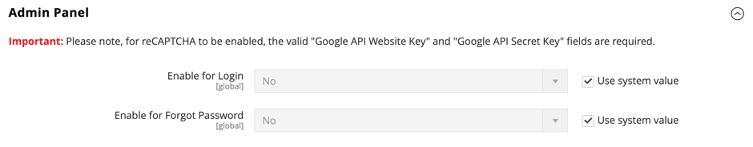

# [!UICONTROL Security] > [!UICONTROL Google reCAPTCHA Admin Panel]

>[!IMPORTANT]
>
>Voordat Google reCAPTCHA kan worden geconfigureerd, moet u ervoor zorgen dat uw `PHP.ini` -bestand de volgende instelling bevat: `allow_url_fopen = 1` . Hiervoor kan hulp van ontwikkelaars nodig zijn. Zie [ Vereiste PHP Montages ](https://experienceleague.adobe.com/docs/commerce-operations/installation-guide/prerequisites/php-settings.html) in de _Gids van de Installatie_.

{{config}}

Voor meer informatie over het veranderen van deze montages, zie [ Google reCAPTCHA ](../../systems/security-google-recaptcha.md) in de _Gids van Systemen Admin_.

## [!UICONTROL reCAPTCHA v2 ("I am not a robot")]

<!-- zoom -->

| Veld | [ Reikwijdte ](../../getting-started/websites-stores-views.md#scope-settings) | Beschrijving |
|--|--|--|
| [!UICONTROL Google API Website Key] | Algemeen | De websitecode die wordt gemaakt wanneer u uw Google reCAPTCHA-account registreert. |
| [!UICONTROL Google API Secret Key] | Algemeen | De geheime sleutel die aan uw Google reCAPTCHA-account is gekoppeld. |
| [!UICONTROL Size] | Algemeen | De grootte van het Google reCAPTCHA-vak dat tijdens de aanmelding wordt weergegeven. Opties: `Normal` (standaardwaarde) / `Compact` |
| [!UICONTROL Theme] | Algemeen | Bepaalt de stijl van het vak Google reCAPTCHA. Opties: `Light Theme` (standaardwaarde) / `Dark Theme` |
| [!UICONTROL Language Code] | Algemeen | A [ twee-karakter code ](https://developers.google.com/recaptcha/docs/language) die de taal specificeert die voor de tekst en het overseinen van Google reCAPTCHA wordt gebruikt. |

{style="table-layout:auto"}

## [!UICONTROL reCAPTCHA v2 Invisible]

<!-- zoom -->

| Veld | [ Reikwijdte ](../../getting-started/websites-stores-views.md#scope-settings) | Beschrijving |
|--|--|--|
| [!UICONTROL Google API Website Key] | Algemeen | De websitecode die wordt gemaakt wanneer u uw Google reCAPTCHA-account registreert. |
| [!UICONTROL Google API Secret Key] | Algemeen | De geheime sleutel die aan uw Google reCAPTCHA-account is gekoppeld. |
| [!UICONTROL Invisible Badge Position] | Algemeen | De positie van de onzichtbare reCAPTCHA-badge op elke pagina. Opties: `Inline` / `Bottom Right` / `Bottom Left` |
| [!UICONTROL Theme] | Algemeen | Bepaalt de stijl van het vak Google reCAPTCHA. Opties: `Light Theme` (standaardwaarde) / `Dark Theme` |
| [!UICONTROL Language Code] | Algemeen | A [ twee-karakter code ](https://developers.google.com/recaptcha/docs/language) die de taal specificeert die voor de tekst en het overseinen van Google reCAPTCHA wordt gebruikt. |

{style="table-layout:auto"}

## [!UICONTROL reCAPTCHA v3 Invisible]

<!-- zoom -->

| Veld | [ Reikwijdte ](../../getting-started/websites-stores-views.md#scope-settings) | Beschrijving |
|--|--|--|
| [!UICONTROL Google API Website Key] | Algemeen | De websitecode die wordt gemaakt wanneer u uw Google reCAPTCHA-account registreert. |
| [!UICONTROL Google API Secret Key] | Algemeen | De geheime sleutel die aan uw Google reCAPTCHA-account is gekoppeld. |
| [!UICONTROL Minimum Score Threshold] | Algemeen | De minimumscore die een gebruikersinteractie als potentieel risico identificeert, waar 1.0 een typische gebruikersinteractie is, en 0.0 waarschijnlijk is een bot. Standaard: `0.5` |
| [!UICONTROL Invisible Badge Position] | Algemeen | De positie van de onzichtbare reCAPTCHA-badge op elke pagina. Opties: `Inline` / `Bottom Right` / `Bottom Left` |
| [!UICONTROL Theme] | Algemeen | Bepaalt de stijl van het vak Google reCAPTCHA. Opties: `Light Theme` (standaardwaarde) / `Dark Theme` |
| [!UICONTROL Language Code] | Algemeen | A [ twee-karakter code ](https://developers.google.com/recaptcha/docs/language) die de taal specificeert die voor de tekst en het overseinen van Google reCAPTCHA wordt gebruikt. |

{style="table-layout:auto"}

## [!UICONTROL reCAPTCHA Failure Messages]

<!-- zoom -->

| Veld | [ Reikwijdte ](../../getting-started/websites-stores-views.md#scope-settings) | Beschrijving |
|--|--|--|
| [!UICONTROL reCAPTCHA Validation Failure Message] | Algemeen | Het bericht dat in Admin wordt getoond als de controle ontbreekt. Standaardtekst: `reCAPTCHA verification failed.` |
| [!UICONTROL reCAPTCHA Technical Failure Message] | Algemeen | Het bericht dat in Admin wordt getoond als reCAPTCHA er niet in slaagt om een controleresultaat terug te keren. Standaardtekst: `Something went wrong with reCAPTCHA. Please contact the store owner.` |

{style="table-layout:auto"}

## [!UICONTROL Admin Panel]

<!-- zoom -->

>[!NOTE]
>
>Het reCAPTCHA-type dat u kiest, moet overeenkomen met het type dat is gekoppeld aan de API-sleutel van uw Google reCAPTCHA-account.

>[!WARNING]
>
>Wanneer u reCAPTCHA versie 3 gebruikt, kan een echte gebruiker met een lage score niet doorgaan. Voor versie 2 ontvangt een echte gebruiker met een lage score een uitdaging. Overweeg zorgvuldig of echte gebruikers met een lage score de kans moeten hebben om een uitdaging (versie 2) op te lossen of geblokkeerd te worden (versie 3).

| Veld | [ Reikwijdte ](../../getting-started/websites-stores-views.md#scope-settings) | Beschrijving |
|--|--|--|
| [!UICONTROL Enable for Login] | Algemeen | Bepaalt het type van reCAPTCHA dat voor [ login Admin ](https://experienceleague.adobe.com/docs/commerce-admin/start/admin/admin-signin.html) wordt toegelaten. Opties: **`No`**- (gebrek) bevestigt niet login Admin. **`reCAPTCHA v2 ("I am not a robot")`** - Vereist de gebruiker om _te selecteren I ben geen robot_ checkbox. **`Invisible reCAPTCHA v2`**- Valideert het gedrag van de gebruiker op de achtergrond zonder interactie op basis van de score te vereisen. **`Invisible reCAPTCHA v3`** - (Aanbevolen) Hiermee wordt het gebruikersgedrag op de achtergrond gevalideerd op basis van de interactiescore. |
| [!UICONTROL Enable for Forgot Password] | Algemeen | Bepaalt het type van reCAPTCHA dat wordt toegelaten om een [ terug te stellen wachtwoord Admin ](https://experienceleague.adobe.com/docs/commerce-admin/start/admin/admin-signin.html#reset-your-password) te verzoeken. Opties: **`No`**- (gebrek) bevestigt niet het verzoek van het wachtwoordterugstellen. **`reCAPTCHA v2 ("I am not a robot")`** - Vereist de gebruiker om _te selecteren I ben geen robot_ checkbox. **`Invisible reCAPTCHA v2`**- Valideert het gedrag van de gebruiker op de achtergrond zonder interactie op basis van de score te vereisen. **`Invisible reCaptcha v3`** - (Aanbevolen) Hiermee wordt het gebruikersgedrag op de achtergrond gevalideerd op basis van de interactiescore. |

{style="table-layout:auto"}
