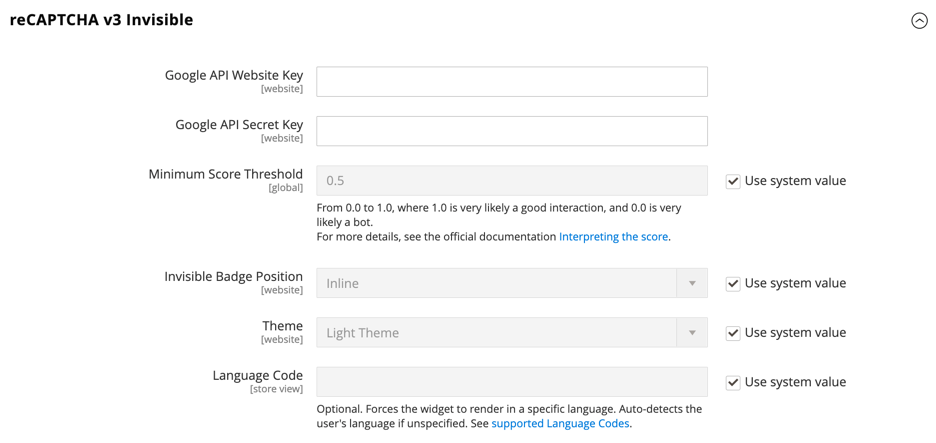

# [!UICONTROL Security] > [!UICONTROL Google reCAPTCHA Storefront]

>[!IMPORTANT]
>
>Voordat Google reCAPTCHA kan worden geconfigureerd, moet u ervoor zorgen dat uw `PHP.ini` Het bestand bevat de volgende instelling: `allow_url_fopen = 1`. Hiervoor kan hulp van ontwikkelaars nodig zijn. Zie [PHP-instellingen](https://experienceleague.adobe.com/docs/commerce-operations/installation-guide/prerequisites/php-settings.html) in de _Installatiehandleiding_.

{{config}}

Ga voor meer informatie over het gebruik van Google reCAPTCHA om je winkel te beveiligen naar Google [reCAPTCHA](../../systems/security-google-recaptcha.md) in de _Admin Systems Guide_.

## [!UICONTROL reCAPTCHA v2 ("I am not a robot")]

<!-- zoom -->

| Veld | [Toepassingsgebied](../../getting-started/websites-stores-views.md#scope-settings) | Beschrijving |
|--|--|--|
| [!UICONTROL Google API Website Key] | Website | De websitecode die wordt gemaakt wanneer u uw Google reCAPTCHA-account registreert. |
| [!UICONTROL Google API Secret Key] | Website | De geheime sleutel die aan uw Google reCAPTCHA-account is gekoppeld. |
| [!UICONTROL Size] | Website | De grootte van het Google reCAPTCHA-vak dat wordt weergegeven wanneer een klant zich aanmeldt bij zijn of haar account. Opties: `Normal` (standaardwaarde) / `Compact` |
| [!UICONTROL Theme] | Website | Bepaalt de stijl van het vak Google reCAPTCHA. Opties: `Light Theme` (standaardwaarde) / `Dark Theme` |
| [!UICONTROL Language Code] | Winkelweergave | De [code van twee tekens](https://developers.google.com/recaptcha/docs/language) dat de taal specificeert die voor de tekst en het overseinen van Google reCAPTCHA wordt gebruikt. |

{style="table-layout:auto"}

## [!UICONTROL reCAPTCHA v2 Invisible]

<!-- zoom -->

| Veld | [Toepassingsgebied](../../getting-started/websites-stores-views.md#scope-settings) | Beschrijving |
|--|--|--|
| [!UICONTROL Google API Website Key] | Website | De websitecode die wordt gemaakt wanneer u uw Google reCAPTCHA-account registreert. |
| [!UICONTROL Google API Secret Key] | Website | De geheime sleutel die aan uw Google reCAPTCHA-account is gekoppeld. |
| [!UICONTROL Invisible Badge Position] | Website | De positie van de onzichtbare reCAPTCHA-badge op elke pagina. Opties: `Inline` / `Bottom Right` / `Bottom Left` |
| [!UICONTROL Theme] | Algemeen | Bepaalt de stijl van het vak Google reCAPTCHA. Opties: `Light Theme` (standaardwaarde) / `Dark Theme` |
| [!UICONTROL Language Code] | Winkelweergave | A [code van twee tekens](https://developers.google.com/recaptcha/docs/language) dat de taal specificeert die voor de tekst en het overseinen van Google reCAPTCHA wordt gebruikt. |

{style="table-layout:auto"}

## [!UICONTROL reCAPTCHA v3 Invisible]

<!-- zoom -->

| Veld | [Toepassingsgebied](../../getting-started/websites-stores-views.md#scope-settings) | Beschrijving |
|--|--|--|
| [!UICONTROL Google API Website Key] | Website | De websitecode die wordt gemaakt wanneer u uw Google reCAPTCHA-account registreert. |
| [!UICONTROL Google API Secret Key] | Website | De geheime sleutel die aan uw Google reCAPTCHA-account is gekoppeld. |
| [!UICONTROL Minimum Score Threshold] | Algemeen | De minimumscore die een gebruikersinteractie als potentieel risico identificeert, waar 1.0 een typische gebruikersinteractie is, en 0.0 waarschijnlijk is een bot. Standaard: `0.5` |
| [!UICONTROL Invisible Badge Position] | Website | De positie van de onzichtbare reCAPTCHA-badge op elke pagina. Opties: `Inline` / `Bottom Right` / `Bottom Left` |
| [!UICONTROL Theme] | Website | Bepaalt de stijl van het vak Google reCAPTCHA. Opties: `Light Theme` (standaardwaarde) / `Dark Theme` |
| [!UICONTROL Language Code] | Winkelweergave | A [code van twee tekens](https://developers.google.com/recaptcha/docs/language) dat de taal specificeert die voor de tekst en het overseinen van Google reCAPTCHA wordt gebruikt. |

{style="table-layout:auto"}

## [!UICONTROL reCAPTCHA Failure Messages]

<!-- zoom -->

| Veld | [Toepassingsgebied](../../getting-started/websites-stores-views.md#scope-settings) | Beschrijving |
|--|--|--|
| [!UICONTROL reCAPTCHA Validation Failure Message] | Winkelweergave | Het bericht dat in de opslagruimte wordt weergegeven als de verificatie mislukt. Standaardtekst: `reCAPTCHA verification failed.` |
| [!UICONTROL reCAPTCHA Technical Failure Message] | Winkelweergave | Het bericht dat in de storefront wordt getoond als reCAPTCHA er niet in slaagt om een controleresultaat terug te keren. Standaardtekst: `Something went wrong with reCAPTCHA. Please contact the store owner.` |

{style="table-layout:auto"}

## [!UICONTROL Storefront]

<!-- zoom -->

>[!NOTE]
>
>Het reCAPTCHA-type dat u kiest, moet overeenkomen met het type dat is gekoppeld aan de API-sleutel van uw Google reCAPTCHA-account.

>[!WARNING]
>
>Wanneer u reCAPTCHA versie 3 gebruikt, kan een echte gebruiker met een lage score niet doorgaan. Voor versie 2 ontvangt een echte gebruiker met een lage score een uitdaging. Overweeg zorgvuldig of echte gebruikers met een lage score de kans moeten hebben om een uitdaging (versie 2) op te lossen of geblokkeerd te worden (versie 3).

| Veld | [Toepassingsgebied](../../getting-started/websites-stores-views.md#scope-settings) | Beschrijving |
|--|--|--|
| [!UICONTROL Enable for Customer Login] | Website | Geeft het type reCAPTCHA aan dat wordt gebruikt wanneer klanten [aanmelden](../../customers/customer-sign-in.md) op hun rekeningen. Opties: **`No`**- (standaardwaarde) Hiermee wordt de aanmeldingsaanvraag niet gevalideerd. **`reCAPTCHA v2 ("I am not a robot")`** - Vereist dat de gebruiker de _Ik ben geen robot_ selectievakje. **`Invisible reCAPTCHA v2`**- Valideert het gedrag van de gebruiker op de achtergrond zonder interactie op basis van de score te vereisen. **`Invisible reCAPTCHA v3`** - (Aanbevolen) Hiermee wordt het gedrag van de gebruiker op de achtergrond gevalideerd op basis van de interactiescore. |
| [!UICONTROL Enable for Forgot Password] | Website | Geeft het type reCAPTCHA aan dat wordt gebruikt wanneer klanten een [wachtwoord opnieuw instellen](../../customers/password-reset.md). Opties: **`No`**- (standaardwaarde) Hiermee wordt de aanvraag voor het opnieuw instellen van het wachtwoord niet gevalideerd. **`reCAPTCHA v2 ("I am not a robot")`** - Vereist dat de gebruiker de _Ik ben geen robot_ selectievakje. **`Invisible reCAPTCHA v2`**- Valideert het gedrag van de gebruiker op de achtergrond zonder interactie op basis van de score te vereisen. **`Invisible reCAPTCHA v3`** - (Aanbevolen) Hiermee wordt het gedrag van de gebruiker op de achtergrond gevalideerd op basis van de interactiescore. |
| [!UICONTROL Enable for Create New Customer Account] | Website | Hiermee wordt het type reCAPTCHA opgegeven dat wordt gebruikt wanneer de klant zich aanmeldt voor een [nieuwe account](../../customers/account-create.md). Opties: **`No`**- (standaard) Hiermee wordt de accountaanvraag niet gevalideerd. **`reCAPTCHA v2 ("I am not a robot")`** - Vereist dat de gebruiker de _Ik ben geen robot_ selectievakje. **`Invisible reCAPTCHA v2`**- Valideert het gedrag van de gebruiker op de achtergrond zonder interactie op basis van de score te vereisen. **`Invisible reCAPTCHA v3`** - (Aanbevolen) Hiermee wordt het gedrag van de gebruiker op de achtergrond gevalideerd op basis van de interactiescore. |
| [!UICONTROL Enable for Edit Customer Account] | Website | Geeft het type reCAPTCHA aan dat wordt gebruikt wanneer de klant zijn [accountgegevens](../../customers/account-dashboard-account-information.md). Opties: **`No`**- (standaard) Hiermee wordt de accountaanvraag niet gevalideerd. **`reCAPTCHA v2 ("I am not a robot")`** - Vereist dat de gebruiker de _Ik ben geen robot_ selectievakje. **`Invisible reCAPTCHA v2`**- Valideert het gedrag van de gebruiker op de achtergrond zonder interactie op basis van de score te vereisen. **`Invisible reCAPTCHA v3`** - (Aanbevolen) Hiermee wordt het gedrag van de gebruiker op de achtergrond gevalideerd op basis van de interactiescore. |
| [!UICONTROL Enable for Create New Company Account] | Website |  (Alleen beschikbaar bij B2B voor Adobe Commerce) Hiermee wordt het type reCAPTCHA opgegeven dat wordt gebruikt bij een nieuwe [bedrijfsaccount](../../b2b/account-company-create.md) wordt gemaakt. Opties: **`No`**- (standaard) Hiermee wordt de accountaanvraag niet gevalideerd. **`reCAPTCHA v2 ("I am not a robot")`** - Vereist dat de gebruiker de _Ik ben geen robot_ selectievakje. **`Invisible reCAPTCHA v2`**- Valideert het gedrag van de gebruiker op de achtergrond zonder interactie op basis van de score te vereisen. **`Invisible reCAPTCHA v3`** - (Aanbevolen) Hiermee wordt het gedrag van de gebruiker op de achtergrond gevalideerd op basis van de interactiescore. |
| [!UICONTROL Enable for Contact Us] | Website | Hiermee wordt het type reCAPTCHA opgegeven dat wordt gebruikt om een bericht te verzenden vanuit de [Contact opnemen](../../getting-started/store-details.md#contact-us-form) van je winkel. Opties: **`No`**- (standaardwaarde) Hiermee wordt de berichtaanvraag niet gevalideerd. **`reCAPTCHA v2 ("I am not a robot")`** - Vereist dat de gebruiker de _Ik ben geen robot_ selectievakje. **`Invisible reCAPTCHA v2`**- Valideert het gedrag van de gebruiker op de achtergrond zonder interactie op basis van de score te vereisen. **`Invisible reCAPTCHA v3`** - (Aanbevolen) Hiermee wordt het gedrag van de gebruiker op de achtergrond gevalideerd op basis van de interactiescore. |
| [!UICONTROL Enable for Product Review] | Website | Geeft het type reCAPTCHA aan dat wordt gebruikt wanneer klanten een [productbeoordeling](../../merchandising-promotions/product-reviews.md). Opties: **`No`**- (standaard) Hiermee wordt het verzoek om een nieuw product te controleren niet gevalideerd. **`reCAPTCHA v2 ("I am not a robot")`** - Vereist dat de gebruiker de _Ik ben geen robot_ selectievakje. **`Invisible reCAPTCHA v2`**- Valideert het gedrag van de gebruiker op de achtergrond zonder interactie op basis van de score te vereisen. **`Invisible reCAPTCHA v3`** - (Aanbevolen) Hiermee wordt het gedrag van de gebruiker op de achtergrond gevalideerd op basis van de interactiescore. |
| [!UICONTROL Enable for Newsletter Subscription] | Website | Hiermee wordt het type onzichtbare reCAPTCHA opgegeven dat wordt gebruikt wanneer klanten zich aanmelden voor een [abonnement op nieuwsbrief](../../merchandising-promotions/newsletter-subscribers.md). Opties: **`No`**- (standaard) Hiermee wordt de aanvraag voor een abonnement op nieuwsbrief niet gevalideerd. **`reCAPTCHA v2 ("I am not a robot")`** - Vereist dat de gebruiker de _Ik ben geen robot_ selectievakje. **`Invisible reCAPTCHA v2`**- Valideert het gedrag van de gebruiker op de achtergrond zonder interactie op basis van de score te vereisen. **`Invisible reCAPTCHA v3`** - (Aanbevolen) Hiermee wordt het gedrag van de gebruiker op de achtergrond gevalideerd op basis van de interactiescore. |
| [!UICONTROL Enable for Gift Card] | Website |  (Alleen Adobe Commerce) Geeft het type reCAPTCHA aan dat wordt gebruikt wanneer klanten een [cadeaukaart](../../catalog/product-gift-card-create.md) code. Opties: **`No`**- (standaard) De verzending van de kaartencode voor cadeautjes wordt niet gevalideerd. **`reCAPTCHA v2 ("I am not a robot")`** - Vereist dat de gebruiker de _Ik ben geen robot_ selectievakje. **`Invisible reCAPTCHA v2`**- Valideert het gedrag van de gebruiker op de achtergrond zonder interacties op basis van de score te vereisen. **`Invisible reCAPTCHA v3`** - (Aanbevolen) Hiermee wordt het gedrag van de gebruiker op de achtergrond gevalideerd op basis van de interactiescore. |
| [!UICONTROL Enable for Invitation Create Account] | Website | Geeft het type reCAPTCHA aan dat wordt gebruikt wanneer klanten een account maken [uitnodiging](../../merchandising-promotions/invitations.md) code. Opties: **`No`**- (standaard) De verzending van de uitnodigings-e-mail wordt niet gevalideerd. **`reCAPTCHA v2 ("I am not a robot")`** - Vereist dat de gebruiker de _Ik ben geen robot_ selectievakje. **`Invisible reCAPTCHA v2`**- Valideert het gedrag van de gebruiker op de achtergrond zonder interacties op basis van de score te vereisen. **`Invisible reCAPTCHA v3`** - (Aanbevolen) Hiermee wordt het gedrag van de gebruiker op de achtergrond gevalideerd op basis van de interactiescore. |
| [!UICONTROL Enable for Send to Friend] | Website | Geeft het type reCAPTCHA aan dat wordt gebruikt wanneer klanten [een product delen](../../stores-purchase/email-a-friend.md) met een vriend. Opties: **`No`**- (standaard) De verzending van de e-mail wordt niet gevalideerd. **`reCAPTCHA v2 ("I am not a robot")`** - Vereist dat de gebruiker de _Ik ben geen robot_ selectievakje. **`Invisible reCAPTCHA v2`**- Valideert het gedrag van de gebruiker op de achtergrond zonder interactie op basis van de score te vereisen. **`Invisible reCAPTCHA v3`** - (Aanbevolen) Hiermee wordt het gedrag van de gebruiker op de achtergrond gevalideerd op basis van de interactiescore. |
| [!UICONTROL Enable for Wishlist Sharing] | Website | Geeft het type reCAPTCHA aan dat wordt gebruikt wanneer klanten [delen op een wenslijst](../../stores-purchase/wishlist-storefront.md#share-the-wish-list). Opties: **`No`**- (standaard) Hiermee worden het bericht en de verzending van e-mail niet gevalideerd. **`reCAPTCHA v2 ("I am not a robot")`** - Vereist dat de gebruiker de _Ik ben geen robot_ selectievakje. **`Invisible reCAPTCHA v2`**- Valideert het gedrag van de gebruiker op de achtergrond zonder interacties op basis van de score te vereisen. **`Invisible reCAPTCHA v3`** - (Aanbevolen) Hiermee wordt het gedrag van de gebruiker op de achtergrond gevalideerd op basis van de interactiescore. |
| [!UICONTROL Enable for Coupon Codes] | Website | Geeft het type reCAPTCHA aan dat wordt gebruikt wanneer klanten een [couponcode](../../merchandising-promotions/price-rules-cart-coupon.md). Opties: **`No`**- (standaard) De verzending van de waardeboncode wordt niet gevalideerd. **`reCAPTCHA v2 ("I am not a robot")`** - Vereist dat de gebruiker de _Ik ben geen robot_ selectievakje. **`Invisible reCAPTCHA v2`**- Valideert het gedrag van de gebruiker op de achtergrond zonder interacties op basis van de score te vereisen. **`Invisible reCAPTCHA v3`** - (Aanbevolen) Hiermee wordt het gedrag van de gebruiker op de achtergrond gevalideerd op basis van de interactiescore. |
| [!UICONTROL Enable for PayPal Payflow Pro payment form] | Website | Geeft het type reCAPTCHA aan dat wordt gebruikt wanneer klanten voor een aankoop betalen met [PayPal Payflow Pro](../../stores-purchase/paypal-payflow-pro.md). Opties: **`No`**- (standaardwaarde) Hiermee wordt de aanvraag voor het opnieuw instellen van het wachtwoord niet gevalideerd. **`reCAPTCHA v2 ("I am not a robot")`** - Vereist dat de gebruiker de _Ik ben geen robot_ selectievakje. **`Invisible reCAPTCHA v2`**- Valideert het gedrag van de gebruiker op de achtergrond zonder interactie op basis van de score te vereisen. **`Invisible reCAPTCHA v3`** - (Aanbevolen) Hiermee wordt het gedrag van de gebruiker op de achtergrond gevalideerd op basis van de interactiescore. |

{style="table-layout:auto"}
