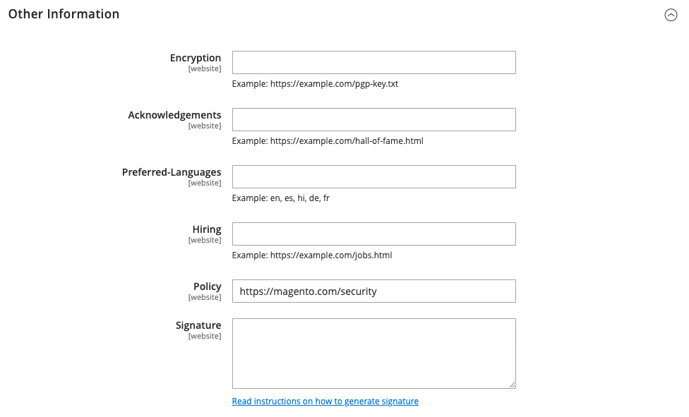

# [!UICONTROL Security] > [!UICONTROL Security.txt]

Voor meer informatie over het veranderen van deze configuratiemontages, zie [&#x200B; kwestie van de Veiligheid die &#x200B;](../../systems/security-issue-reporting.md) meldt.

{{config}}

## [!UICONTROL General]

<!-- zoom -->

| Veld | [&#x200B; Reikwijdte &#x200B;](../../getting-started/websites-stores-views.md#scope-settings) | Beschrijving |
|--- |--- |--- |
| [!UICONTROL Enable] | Website | Als deze optie is ingeschakeld, wordt een `security.txt` -bestand opgeslagen dat informatie bevat die beveiligingsonderzoekers nodig hebben om potentiële kwetsbaarheden aan u te melden. Opties: **`Yes`**- creeert het `security.txt` dossier dat op informatie wordt gebaseerd in de _informatie van het Contact_ wordt ingegaan en _Andere informatie_ secties. **`No`** - (standaardwaarde) Maakt het `security.txt` -bestand niet. |

{style="table-layout:auto"}

## [!UICONTROL Contact information]

<!-- zoom -->

| Veld | [&#x200B; Reikwijdte &#x200B;](../../getting-started/websites-stores-views.md#scope-settings) | Beschrijving |
|--- |--- |--- |
| [!UICONTROL Email] | Website | Het e-mailadres waar beveiligingsrapporten kunnen worden verzonden. |
| [!UICONTROL Phone] | Website | Een telefoonnummer dat kan worden gebruikt om beveiligingsproblemen te melden. |
| [!UICONTROL Contact Page] | Website | URL van een pagina op uw plaats die van veiligheidscontacten, of uw _pagina van het Contact van ons_ een lijst maakt. Voorbeelden:  `https://mystore.com/security-contact.html` `https://mystore.com/contact/` |

{style="table-layout:auto"}

## [!UICONTROL Other information]

<!-- zoom -->

| Veld | [&#x200B; Reikwijdte &#x200B;](../../getting-started/websites-stores-views.md#scope-settings) | Beschrijving |
|--- |--- |--- |
| [!UICONTROL Encryption] | Website | Een URL die wijst naar de locatie van een coderingssleutel die beveiligingsonderzoekers kunnen gebruiken om gecodeerde communicatie te verzenden. _&#x200B;**ga niet de encryptiesleutel op dit gebied in.**&#x200B;_    Het is de verantwoordelijkheid van de onderzoeker om te verifiëren dat de sleutel van een betrouwbare bron is. Onderzoekers mogen er niet van uitgaan dat de sleutel gelijk is aan de sleutel waarmee de digitale handtekening is gegenereerd. Voorbeeld:  OpenPGP sleutel van Webserver - `https://mystore.com/pgp-key.txt` |
| [!UICONTROL Acknowledgments] | Website | Een URL die naar een pagina in uw opslag wijst waar de veiligheidsonderzoekers, zoals `https://mystore.com/hall-of-fame.html` worden erkend. Als u toekomstige aanvallen wilt voorkomen, neemt u alleen een algemene beschrijving op zonder specifieke informatie over kwetsbaarheidsproblemen te onthullen. Voorbeeld:  wij zouden de volgende onderzoekers willen bedanken:  (yyyy/mm/dd) Justin Thyme - SQL injectie |
| [!UICONTROL Preferred Languages] | Website | Geeft minstens één voorkeurstaal voor beveiligingsrapporten op. Scheid veelvoudige twee karakter [&#x200B; taalcodes &#x200B;](https://en.wikipedia.org/wiki/List_of_ISO_639-1_codes) met een komma. Alle opgegeven talen hebben dezelfde prioriteit. Als u bijvoorbeeld Engels, Spaans en Frans wilt opgeven, voert u `en, es, fr` in. |
| [!UICONTROL Hiring] | Website | De URL van een pagina op de site die een lijst bevat met beveiliginggerelateerde taakposities. Voorbeeld: `https://mystore.com/jobs.html` |
| [!UICONTROL Policy] | Website | De URL van de pagina die uw beveiligingsbeleid en praktijken voor het melden van kwetsbaarheden beschrijft. Voorbeeld: `https://mystore.com/security-reporting.html` Default: `https://mystore.com/security` |
| [!UICONTROL Signature] | Website | Een koppeling naar het digitale handtekeningbestand. De digitale handtekening moet worden gegenereerd via de opdrachtregel en wordt opgeslagen in de map `.well-known` op de server. Voor meer informatie, zie [&#x200B; Security.txt &#x200B;](https://github.com/magento/security-package/blob/1.0-develop/Securitytxt/README.md) op GitHub. Voorbeeld: `https://mystore.com/.well-known/security.txt.sig` |

{style="table-layout:auto"}
