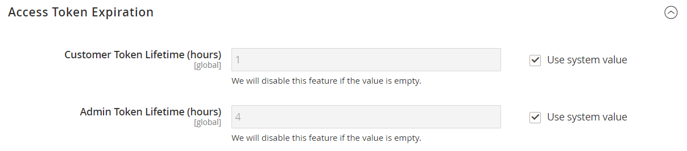
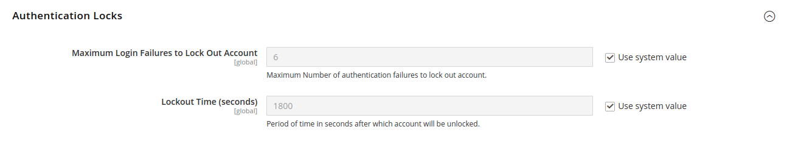

# [!UICONTROL Services] > [!UICONTROL OAuth]

{{config}}

## [!UICONTROL Access Token Expiration]

<!-- zoom -->

| Veld | [Toepassingsgebied](../../getting-started/websites-stores-views.md#scope-settings) | Beschrijving |
|--- |--- |--- |
| [!UICONTROL Customer Token Lifetime (hours]) | Algemeen | Bepaalt de tijdsduur in uren alvorens een klant API teken verloopt. De klanttoken verloopt nooit wanneer het veld leeg is. Standaardwaarde: `1` |
| [!UICONTROL Admin Token Lifetime (hours)] | Algemeen | Hiermee bepaalt u de tijdsduur in uren voordat een API-beheertoken verloopt. De beheerderstoken verloopt nooit wanneer het veld leeg is. Standaardwaarde: `4` |

{style="table-layout:auto"}

>[!NOTE]
>
>Leven- en versleutelingsalgoritmen voor bidirectionele klanten en beheerders-API worden beheerd door de [JWT-verificatie](magento-web-api.md#jwt-authentication) configuratie-instellingen.

## [!UICONTROL Cleanup Settings]

<!-- zoom -->

| Veld | [Toepassingsgebied](../../getting-started/websites-stores-views.md#scope-settings) | Beschrijving |
|--- |--- |--- |
| [!UICONTROL Cleanup Probability] | Algemeen | Hiermee geeft u het aantal OAuth-verzoeken op voordat opschoning wordt gestart. Niet invoeren `0` om opruimen uit te schakelen. |
| [!UICONTROL Enable WSDL Cache] | Algemeen | Hiermee bepaalt u de leeftijd van de items in minuten voordat ze worden schoongemaakt. |

{style="table-layout:auto"}

## [!UICONTROL Consumer Settings]

<!-- zoom -->

| Veld | [Toepassingsgebied](../../getting-started/websites-stores-views.md#scope-settings) | Beschrijving |
|--- |--- |--- |
| [!UICONTROL OAuth consumer credentials HTTP Post timeout] | Algemeen | Geeft het aantal seconden aan dat het systeem nodig heeft om de time-out op te geven wanneer klanten hun gegevens posten. |
| [!UICONTROL OAuth consumer credentials HTTP Post maxredirects] | Algemeen | Hiermee wordt het maximale aantal omleidingen aangegeven dat betrekking heeft op het posten van de geloofsbrieven van de consument. |
| [!UICONTROL Expiration Period] | Algemeen | Bepaalt het aantal seconden alvorens een ongebruikte sleutel/een geheim verloopt nadat de symbolische uitwisseling OAuth begint. |

{style="table-layout:auto"}

## [!UICONTROL Authentication Locks]

<!-- zoom -->

| Veld | [Toepassingsgebied](../../getting-started/websites-stores-views.md#scope-settings) | Beschrijving |
|--- |--- |--- |
| [!UICONTROL Maximum Login Failures to Lock Out Account] | Algemeen | Hiermee geeft u het maximum aantal verificatiefouten op waarmee account kan worden afgesloten. |
| [!UICONTROL Lockout Time (seconds)] | Algemeen | Hiermee geeft u de periode op in seconden waarna het account wordt ontgrendeld. |

{style="table-layout:auto"}
