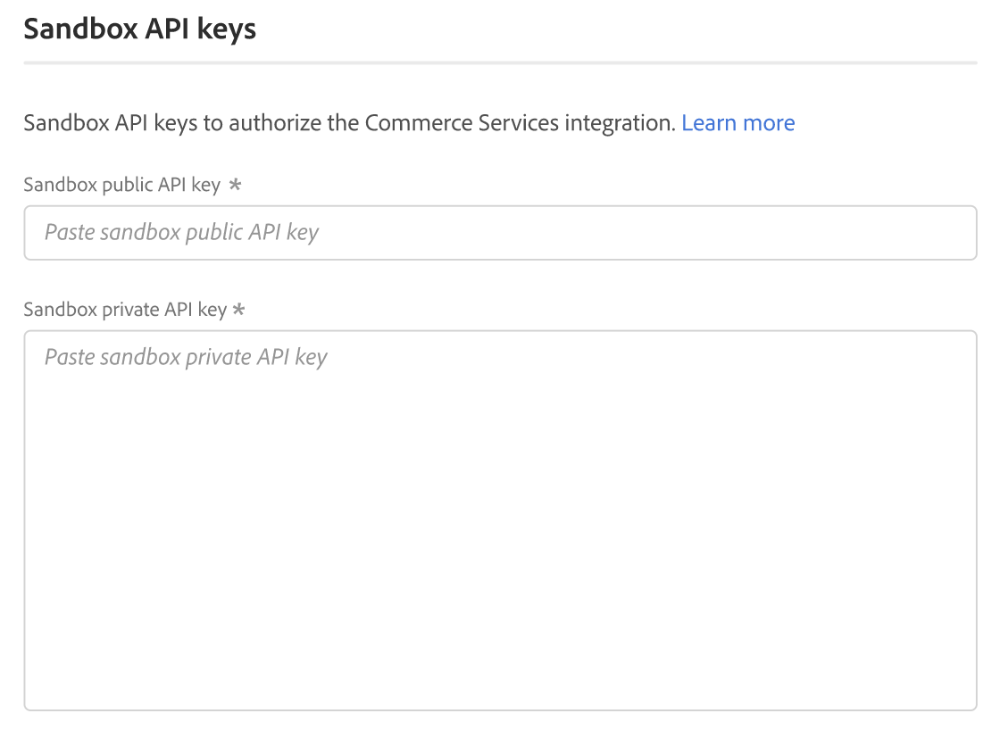

# [!UICONTROL Services] > [!UICONTROL Commerce Services Connector]

Ga voor meer informatie over hoe u een verbinding tot stand kunt brengen tussen uw winkel en Adobe Commerce-services naar [Commerciële diensten](https://experienceleague.adobe.com/docs/commerce-merchant-services/user-guides/integration-services/saas.html).

{{config}}

## [!UICONTROL Sandbox API Keys]

<!-- zoom -->

| Veld | [Toepassingsgebied](../../getting-started/websites-stores-views.md#scope-settings) | Beschrijving |
|--- |--- |--- |
| [!UICONTROL Sandbox public API key] | Algemeen | API-sleutel die de auteur en zijn eventuele rechten identificeert. |
| [!UICONTROL Sandbox private API key] | Algemeen | Een persoonlijke sleutel die aan de API-sleutel is gekoppeld. |

{:style=&quot;table-layout:auto&quot;}

## [!UICONTROL Production Keys]

<!-- zoom -->

| Veld | [Toepassingsgebied](../../getting-started/websites-stores-views.md#scope-settings) | Beschrijving |
|--- |--- |--- |
| [!UICONTROL Production public API key] | Algemeen | API-sleutel die de auteur en zijn eventuele rechten identificeert. |
| [!UICONTROL Production private API key] | Algemeen | Een persoonlijke sleutel die aan de API-sleutel is gekoppeld. |

{:style=&quot;table-layout:auto&quot;}

## [!UICONTROL SaaS Identifier]

<!-- zoom -->

| Veld | [Toepassingsgebied](../../getting-started/websites-stores-views.md#scope-settings) | Beschrijving |
|--- |--- |--- |
| [!UICONTROL Project] | Algemeen | Naam van het project SaaS dat elk van uw gegevensruimten SaaS groepeert. A _Project maken_ verschijnt als geen projecten SaaS bestaan. |
| [!UICONTROL Data Space] | Algemeen | Maakt een lijst van de gegevensruimten SaaS in het gespecificeerde project SaaS. Het aantal SaaS gegevensruimten hangt van uw af [Handelsvergunning](https://experienceleague.adobe.com/docs/commerce-merchant-services/user-guides/integration-services/saas.html): Adobe Commerce - Eén productiedespatiëntruimte; twee testgegevenspaties; Magento Open Source - Eén gegevensruimte voor productie; geen gegevensruimten voor tests |

{:style=&quot;table-layout:auto&quot;}

## [!UICONTROL IMS Organization]

<!-- zoom -->

| Veld | Beschrijving |
|--- |--- |
| [!UICONTROL Sign in using Adobe ID] | De Adobe ID is meestal het e-mailadres dat u hebt gebruikt toen u aan het lidmaatschap begon of een Adobe-toepassing of -service hebt aangeschaft. Je Adobe ID is de sleutel die je nodig hebt voor toegang tot je Adobe account. |

{:style=&quot;table-layout:auto&quot;}
