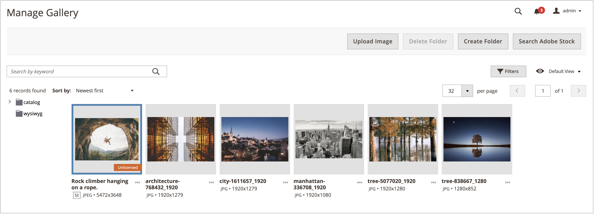

# Een Adobe Stock-afbeelding in licentie geven

Adobe Stock-middelen die u voor uw productie wilt gebruiken in Adobe Commerce- en Magento Open Source-winkels moeten een licentie hebben. Dit verlenen van vergunningen verzekert u wettelijke toegang tot het beeld en om het watermerk van Adobe Stock te elimineren dat op alle [&#x200B; beeldvoorproeven &#x200B;](./adobe-stock-save-preview.md) aanwezig is. Als u een licentie voor afbeeldingen wilt geven of afbeeldingen met een licentie wilt opslaan, moet u zijn aangemeld bij uw Adobe-account.

De nieuwe [[!DNL Media Gallery]](media-gallery.md) biedt een directe integratie met Adobe Stock, waardoor het eenvoudig is om rechtstreeks vanaf de galeriepagina een licentie voor uw afbeeldingen te maken.

>[!BEGINSHADEBOX]

**Eerste vereisten**

De Adobe Stock verlenen van vergunningen eigenschap is beschikbaar slechts als de [&#x200B; Integratie van Adobe Stock &#x200B;](./adobe-stock.md) geïnstalleerd en gevormd is. Het verlenen van vergunningen [&#x200B; beelden van Adobe Stock &#x200B;](https://stock.adobe.com) vereist een betaald plan van Adobe Stock en een [&#x200B; rekening van Adobe &#x200B;](https://helpx.adobe.com/manage-account/using/access-adobe-id-account.html).

>[!ENDSHADEBOX]

## Een licentie geven voor een afbeelding uit het nieuwe bestand [!DNL Media Gallery]

1. Voor _Admin_ sidebar, ga **[!UICONTROL Content]** > _[!UICONTROL Media]_>**[!UICONTROL Media Gallery]**.

1. Volg de stappen op [&#x200B; Gebruikend de Beelden van Adobe Stock &#x200B;](./adobe-stock-manage.md) aan login en sparen voorproefbeelden aan de [&#x200B; media opslag &#x200B;](./media-storage.md).

   {width="600" zoomable="yes"}

1. Klik de drie punten onder het beeld ({width="10" zoomable="no"}), en klik dan **[!UICONTROL License]**.

   {width="600" zoomable="yes"}

   >[!NOTE]
   >
   >Als u niet bent aangemeld, wordt het aanmeldingsformulier weergegeven. Voor meer informatie over login, zie [&#x200B; Gebruikend de Beelden van Adobe Stock &#x200B;](./adobe-stock-manage.md).

1. Klik in het dialoogvenster voor licentiebevestiging op **[!UICONTROL Confirm]** om een licentie voor de afbeelding te maken.

   {width="350" zoomable="yes"}

   >[!NOTE]
   >
   >U moet beschikbare [&#x200B; credits van Adobe Stock &#x200B;](https://helpx.adobe.com/stock/help/credit-packs.html) in uw rekening hebben om het beeld in licentie te geven.

## Een licentie geven voor een afbeelding van de standaard opslagmedia

1. [ heb toegang tot het net van het Onderzoek van Adobe Stock ][adobe-stock-manage.md].

1. Om [ de beelddetails ][adobe-stock-manage.md#view-image-details] te bekijken, klik een beeld in het onderzoeksnet in orde.

1. Voer afhankelijk van de huidige licentiestatus van de afbeelding een van de volgende handelingen uit:

   - Als voor de afbeelding al een licentie is verleend, klikt u op **[!UICONTROL Save]** .

   - Als het beeld __ niet **[!UICONTROL License and Save]** vergunning heeft gekregen, klik.

     >[!NOTE]
     >
     >U moet beschikbare [&#x200B; credits van Adobe Stock &#x200B;](https://helpx.adobe.com/stock/help/credit-packs.html) in uw rekening hebben om het beeld in licentie te geven.

   Deze actie toont een herinnering voor u om een dossier te specificeren - naam die wordt gebruikt om het beeld aan de [&#x200B; media opslag &#x200B;](./media-storage.md) te bewaren. Er is een standaardbestandsnaam opgegeven, maar u kunt de naam aanpassen aan uw voorkeuren.

   {width="550" zoomable="yes"}

1. Klik op **[!UICONTROL Confirm]**.

   De pagina wordt omgeleid naar de mediaopslag en de opgeslagen voorvertoning wordt weergegeven.
