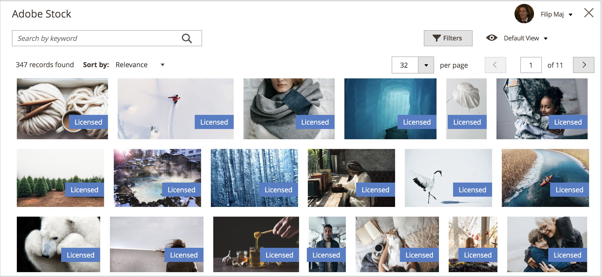

# Adobe Stock-afbeeldingen gebruiken

[ Adobe Stock ](https://stock.adobe.com) beelden kunnen in plaats van het uploaden van uw eigen beeldinhoud worden gebruikt. Bij het maken van een pagina wordt vaak afbeeldingsinhoud geüpload en geplaatst.

[[!DNL Media Gallery]](media-gallery.md) biedt een directe integratie met Adobe Stock, waardoor het eenvoudig is om rechtstreeks vanaf de galeriepagina een licentie voor uw afbeeldingen te maken.

## Het Adobe Stock-zoekraster openen

Het het onderzoekspaneel van Adobe Stock is toegankelijk wanneer u [ toevoegt of een pagina ](page-add.md) uitgeeft, wanneer u [ een categorie ](../catalog/category-create.md) creeert of uitgeeft, of wanneer u [ beelden via de Inhoudsredacteur ](editor-insert-image.md) opneemt.

**_om de activa van Adobe Stock te zoeken en een voorraadbeeld aan een pagina toe te voegen:_**

1. Voor _Admin_ sidebar, ga **[!UICONTROL Content]** > _[!UICONTROL Elements]_>**[!UICONTROL Pages]**.

1. Klik op **[!UICONTROL Add a New Page]**.

   Als u een bestaande pagina wilt bewerken, klikt u op de kolom _[!UICONTROL Action]_&#x200B;en kiest u **[!UICONTROL Edit]**.**[!UICONTROL Select]**

1. Breid  de **[!UICONTROL Content]** sectie uit en doe het volgende:

   - Als u de [ toegelaten redacteur van WYSIWYG ](editor.md) hebt, klik **[!UICONTROL Show/Hide Editor]** en klik dan **[!UICONTROL Insert Image]**.

   - Als u [ toegelaten Bouwer van de Pagina ](../page-builder/setup.md) hebt, breid het **[!UICONTROL Media]** paneel uit en sleep **[!UICONTROL Image]** placeholder aan de doelcontainer. Klik vervolgens op **[!UICONTROL Select from Gallery]** .

     {width="600" zoomable="yes"}

1. Klik op **[!UICONTROL Search Adobe Stock]**.

**_om de activa van Adobe Stock te zoeken en een voorraadbeeld aan een categorie toe te voegen:_**

1. Voor _Admin_ sidebar, ga **[!UICONTROL Catalog]** > **[!UICONTROL Categories]**.

1. Klik op **[!UICONTROL Add Root Category]** of **[!UICONTROL Add Subcategory]** .

   Als u de afbeelding wilt toevoegen aan een bestaande categorie, klikt u op de categorienaam in de lijst aan de linkerkant.

1. Vouw de sectie **[!UICONTROL Content]** uit en klik onder _[!UICONTROL Category Image]_&#x200B;click **[!UICONTROL Select from Gallery]**.

1. Klik op **[!UICONTROL Search Adobe Stock]**.

U kunt als volgt Adobe Stock-elementen zoeken en een voorraadafbeelding toevoegen vanuit de WYSIWYG Editor:

1. Klik op **[!UICONTROL Show/Hide Editor]** .

1. Klik op **[!UICONTROL Insert Image]**.

1. Klik op **[!UICONTROL Search Adobe Stock]**.

   {width="600" zoomable="yes"}

## Filteren en zoeken naar Adobe Stock-middelen

Het [ het onderzoeksNet van Adobe Stock ](#access-the-adobe-stock-search-grid) verstrekt het vragen en het filtreren functionaliteit om u te helpen het perfecte beeld voor uw [!DNL Commerce] opslag vinden.

Standaard zijn de weergegeven zoekresultaten afkomstig van een galerie met Adobe Stock-curven van een paar honderd resultaten. Wanneer u uw eigen trefwoordzoekopdracht toepast, zoekt u de miljoenen beschikbare middelen via Adobe Stock.

### Adobe Stock-elementen zoeken op trefwoorden

1. [ heb toegang tot het net van het Onderzoek van Adobe Stock ](#access-the-adobe-stock-search-grid).

1. Ga uw sleutelwoordonderzoek in het **[!UICONTROL Search by keyword]** inputgebied in top-left in en klik het vergrootende glas of druk **binnengaan**.

   {width="600" zoomable="yes"}

### Adobe Stock-middelen filteren

1. [ stel een sleutelwoordonderzoek voor de activa van Adobe Stock in werking ](#search-for-adobe-stock-assets-by-keywords).

1. Klik op **[!UICONTROL Filters]**.

   Er zijn verschillende filters beschikbaar waarmee u de zoekresultaten kunt verfijnen:

   | Filter | Beschrijving |
   |---|---|
   | [!UICONTROL Subcategory] | Filter voor beelden die **Foto&#39;s** of **Afbeeldingen** zijn |
   | [!UICONTROL Orientation] | Filter voor afbeeldingen op grootte, vorm en aspect |
   | [!UICONTROL Color] | Een kleurenpalet gebruiken om voor afbeeldingen op kleur te filteren |
   | [!UICONTROL Price] | Filter voor afbeeldingen op basis van de kosten |
   | [!UICONTROL Safe search] | Veilig zoeken in- of uitschakelen |
   | [!UICONTROL Isolated Assets] | Beperk de vertoning tot slechts _geïsoleerde activa_, die onderwerpen alleen op een stevige achtergrond hebben verschijnen |

   {style="table-layout:auto"}

   {width="600" zoomable="yes"}

1. Klik op **[!UICONTROL Apply Filters]**.

   Het raster met zoekresultaten wordt bijgewerkt met uw verfijnde zoekopdracht.

## Afbeeldingsdetails weergeven

Elke afbeelding bevat details die u kunt weergeven. De extra beeld-specifieke acties, zoals [ sparen beeldvoorproeven ](adobe-stock-save-preview.md) of [ het bewaren (en naar keuze vergunning gevend) beelden ](adobe-stock-license-image.md), zijn beschikbaar via deze gedetailleerde mening.

1. [ heb toegang tot het het onderzoeksnet van Adobe Stock ](#access-the-adobe-stock-search-grid).

1. Klik op een afbeelding in de zoekresultaten.

   Er worden meer details van de afbeelding weergegeven, zoals:

   - Een grotere versie van de afbeelding
   - De meta-gegevens van het beeld, zoals _[!UICONTROL Dimensions]_,_[!UICONTROL File type]_, _[!UICONTROL Category]_,_[!UICONTROL File]_, en _Trefwoorden_
   - Verwante beelden, zoals beelden van de zelfde _reeksen_ of _model_
   - Knoppen voor handelingen, zoals [[!UICONTROL Save Preview]](adobe-stock-save-preview.md) en [[!UICONTROL Save (and optionally license) Image]](adobe-stock-license-image.md)

     {width="600" zoomable="yes"}

## Aanmelden bij uw Adobe-account

Om volledige toegang tot een beeld te verkrijgen en het watermerk van Adobe Stock te elimineren, moet u [ binnen met een rekening van Adobe ](https://helpx.adobe.com/nl/manage-account/using/access-adobe-id-account.html) ondertekenen en kredieten aan vergunningsrechten kopen om een beeld te gebruiken.

1. [ heb toegang tot het net van het Onderzoek van Adobe Stock ](#access-the-adobe-stock-search-grid).

1. Klik op **[!UICONTROL Sign In]** rechtsboven.

   Een nieuw browser venstergidsen u door het [ Adobe login proces ](https://helpx.adobe.com/nl/manage-account/using/access-adobe-id-account.html).

   Nadat u het aanmeldingsproces hebt voltooid, wordt de gelicentieerde status van afbeeldingen in de zoekresultaten weergegeven als een label.

   {width="600" zoomable="yes"}

### De gelicentieerde status van zoekresultaten weergeven

[ Login aan uw rekening van Adobe ](#log-in-to-your-adobe-account).

Op alle afbeeldingen met licentie die aan uw Adobe-account zijn gekoppeld, wordt een label weergegeven, zodat duidelijk is welke afbeeldingen u een licentie hebt.

{width="600" zoomable="yes"}

### Afbeeldingen opslaan in de mediaopslag

De beelden die worden gezocht gebruikend de integratie van Adobe Stock kunnen aan [!DNL Commerce] [ worden bewaard media opslag ](media-storage.md) voor gemakkelijk hergebruik over uw [!DNL Commerce] opslag.

U kunt twee soorten beelden bewaren: een [ beeldvoorproef ](adobe-stock-save-preview.md) of a [ vergunning gegeven beeld ](adobe-stock-license-image.md).

#### Een voorvertoning van een afbeelding opslaan

Een voorvertoning van een afbeelding is een versie van een Adobe Stock-element met watermerk. Voorvertoningen van afbeeldingen zijn gratis en zijn een goede manier om met verschillende afbeeldingen te experimenteren voordat u besluit een licentie voor specifieke afbeeldingen te kopen en deze in uw productiewinkels te gebruiken.

1. [ heb toegang tot het het onderzoeksnet van Adobe Stock ](#access-the-adobe-stock-search-grid).

1. Om [ de beelddetails ](#view-image-details) te bekijken, klik een beeld in het onderzoeksnet.

1. Klik op **[!UICONTROL Save Preview]**.

   Met deze handeling wordt u gevraagd een bestandsnaam op te geven waarmee de afbeelding wordt opgeslagen in de mediaopslagruimte. Er is een standaardbestandsnaam opgegeven, maar u kunt de naam aanpassen aan uw voorkeuren.

   {width="500" zoomable="yes"}

1. Klik op **[!UICONTROL Confirm]**.

   De pagina wordt omgeleid naar de mediaopslag en de opgeslagen voorvertoning wordt weergegeven.

#### Een afbeelding met een licentie opslaan

Adobe Stock-elementen die u voor uw [!DNL Commerce] -productiewinkels wilt gebruiken, moeten een licentie hebben. Het verlenen van vergunningen zorgt ervoor dat u wettelijke toegang tot het beeld hebt en om het watermerk van Adobe Stock te elimineren dat op alle [ beeldvoorproeven ](adobe-stock-save-preview.md) aanwezig is. Als u een licentie voor afbeeldingen wilt geven of afbeeldingen met een licentie wilt opslaan, moet u zijn aangemeld bij uw Adobe-account.

1. [ Login aan uw rekening van Adobe ](#log-in-to-your-adobe-account).

1. Om [ de beelddetails ](#view-image-details) te bekijken, klik een beeld in het onderzoeksnet.

1. Voer afhankelijk van de huidige licentiestatus van de afbeelding een van de volgende handelingen uit:

   - Als voor de afbeelding al een licentie is verleend, klikt u op **[!UICONTROL Save]** .

   - Als het beeld __ niet **[!UICONTROL License and Save]** vergunning heeft gekregen, klik.

     >[!NOTE]
     >
     >U moet beschikbare [ credits van Adobe Stock ](https://helpx.adobe.com/nl/stock/help/credit-packs.html) in uw rekening hebben om het beeld in licentie te geven.

   Deze actie toont een herinnering voor u om een dossier te specificeren - naam die wordt gebruikt om het beeld aan de [ media opslag ](media-storage.md) te bewaren. Er is een standaardbestandsnaam opgegeven, maar u kunt de naam aanpassen aan uw voorkeuren.

1. Klik op **[!UICONTROL Confirm]**.

   De pagina wordt omgeleid naar de mediaopslag en de opgeslagen voorvertoning wordt weergegeven.
