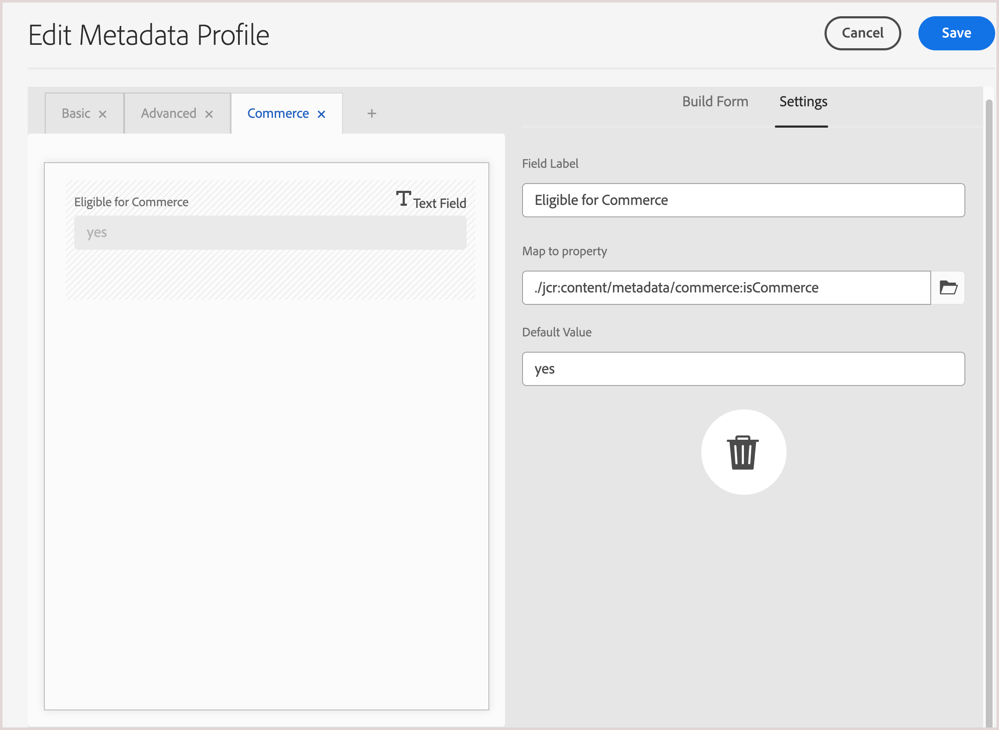

# Experience Manager Assets configureren

{{$include /help/_includes/aem-assets-integration-beta-note.md}}

Als u media-elementen voor uw winkel wilt beheren met de AEM Assets-integratie voor Commerce, moet u voor uw AEM Assets-project bepaalde metagegevens toevoegen om ervoor te zorgen dat u eenvoudig Commerce-elementen kunt zoeken en beheren. Deze metagegevens vergemakkelijken ook de synchronisatie van elementen tussen Adobe Commerce en Experience Manager Assets. Nadat u de metagegevensvelden hebt gedefinieerd, wordt de eerste toewijzing van deze velden automatisch uitgevoerd wanneer een Commerce-element voor het eerst wordt gedeeld met Experience Manager Assets.

Voor de integratie, vormt u twee soorten meta-gegevens:

- **[het profiel van Meta-gegevens ](https://experienceleague.adobe.com/en/docs/experience-manager-cloud-service/content/assets/manage/metadata-profiles)** laat u standaardmeta-gegevens op activa binnen een omslag toepassen. Alle elementen in de map nemen de standaardmetagegevens over die in het profiel zijn geconfigureerd.

- **[het schema van Meta-gegevens ](https://experienceleague.adobe.com/en/docs/experience-manager-cloud-service/content/assets/manage/metadata-schemas)** bepaalt de lay-out van de eigenschappen pagina en de reeks gebieden die als meta-gegevenseigenschappen op een AEM activa kunnen worden gebruikt.

## Metagegevens configureren

Voor het eerste instapmodel voegt u de volgende Commerce-metagegevens toe aan zowel een AEM Assets-metagegevensprofiel als een metagegevensschema.

| Veldtype | Label | Eigenschap | Standaardwaarde |
|------ | ------- | ---------- | ------------- |
| Tekst | **bestaat het in Adobe Commerce?** | `./jcr:content/metadata/commerce:isCommerce` | ja |
| Meerdere waardetekst | **SKUs** | `./jcr:content/metadata/commerce:skus` | none |
| Meerdere waardetekst | **Posities** | `./jcr:content/metadata/commerce:positions` | none |
| Meerdere waardetekst | **Rollen** | `./jcr:content/metadata/commerce:roles` | none |

### Commerce-velden toevoegen aan een metagegevensprofiel

1. Ga in de Adobe Experience Manager-werkruimte naar de werkruimte voor het beheer van inhoud voor auteurs voor AEM Assets door op het Adobe Experience Manager-pictogram te klikken.

   {width="600" zoomable="yes"}

1. Open de Hulpmiddelen van de Beheerder door het hamerpictogram te selecteren.

   {width="600" zoomable="yes"}

1. Open de pagina voor profielconfiguratie door op **[!UICONTROL Metadata Profiles]** te klikken.

1. **[!UICONTROL Create]** een metagegevensprofiel voor de Commerce-integratie.

   {width="600" zoomable="yes"}

1. Voeg een tabblad toe voor Commerce-metagegevens.

   1. Klik links op **[!UICONTROL Settings]** .

   1. Klik op **[!UICONTROL +]** in de tabsectie en geef vervolgens de **[!UICONTROL Tab Name]** , `Commerce` op.

1. Voeg de [ meta-gegevensgebieden ](#configure-metadata) aan de vorm toe.

   {width="600" zoomable="yes"}

1. Sla de update op.

1. Pas het metagegevensprofiel `Commerce integration` toe op de map waarin Commerce-elementen zijn opgeslagen.

   1. Van de [!UICONTROL  Metadata Profiles] pagina, selecteer het de integratieprofiel van Commerce.

   1. Selecteer **[!UICONTROL Apply Metadata Profiles to Folder(s)]** in het menu Handeling.

   1. Selecteer de map met Commerce-elementen.

      Maak een Commerce-map als deze niet bestaat.

   1. Klik op **[!UICONTROL Apply]**.

### Commerce-velden toevoegen aan een metagegevensschemaformulier

1. Open **[!UICONTROL Metadata Schemas]** ([!UICONTROL Manage metadata schema forms]) in het beheervenster Inhoud AEM auteur voor Assets.

   {width="600" zoomable="yes"}

1. **[!UICONTROL Create]** een metagegevensschema voor Commerce.

   {width="600" zoomable="yes"}

1. Maak in [!UICONTROL Metadata Schema Form] de velden `Does Commerce exist?` en `Commerce mappings` en wijs de eigenschappen toe.

1. Klik op **[!UICONTROL Save]**.

## Publish een middel

Nadat u de AEM metagegevens en het schemaprofiel voor Commerce-elementen hebt geconfigureerd, maakt u het eerste Commerce-element waarmee de metagegevensvelden van Commerce worden toegewezen.

1. Van Experience Manager, ga naar [!UICONTROL Assets > Files] selecteer de **omslag van Commerce**.

1. Upload een afbeelding voor een Commerce-project door het bestand naar de map te slepen of door op **[!UICONTROL Add Assets]** te klikken.

1. Verifieer de meta-gegevensconfiguratie: **isCommerce** wordt geplaatst aan `true`, en dat het `commerce:skus` bezit aan SKU voor het product van Commerce verbonden aan het beeld wordt geplaatst.

1. Het element goedkeuren.

## Middelen toevoegen aan de Commerce-map

Maak ten minste één element in de AEM Assets Commerce-map waaraan de metagegevenskenmerken van Commerce zijn toegewezen.

Dit element is vereist voor het instellen van synchronisatie tussen uw Commerce-exemplaar en AEM Assets.

## Metagegevens toewijzen voor elementen

Metagegevens worden toegewezen wanneer een Commerce-element voor het eerst wordt gepubliceerd.  voor het eerst uit Commerce. De eerste keer dat een element naar Experience Manager Assets wordt verzonden, worden media-elementen met de ingebouwde of aangepaste velden automatisch toegewezen aan de opgegeven velden.

Voordat u kunt beginnen met middelentoewijzing, moet u de volgende taken uitvoeren:

- [De AEM Assets Integration voor Commerce installeren en configureren](aem-assets-configure-commerce.md)
- [Synchronisatieservices instellen om elementen over te brengen tussen uw Adobe Commerce-projectomgeving en de AEM Assets-projectomgeving](aem-assets-setup-synchronization.md)
