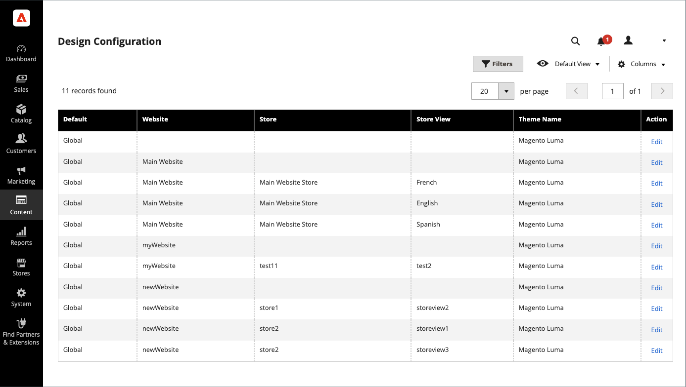

# Ontwerpconfiguratie

De configuratie van het Ontwerp maakt het gemakkelijk om op ontwerp betrekking hebbende regels en configuratiemontages uit te geven door de montages op één enkele pagina te tonen.

{width="700" zoomable="yes"}

## De ontwerpconfiguratie wijzigen

1. Op de _Beheerder_ zijbalk, ga naar **[!UICONTROL Content]** > _[!UICONTROL Design]_>**[!UICONTROL Configuration]**.

1. Zoek de archiefmening die u wilt vormen en klikken **[!UICONTROL Edit]** in de _[!UICONTROL Action]_kolom.

   Op de pagina worden de huidige ontwerpinstellingen voor de winkelweergave weergegeven.

1. Als u het standaardthema wilt wijzigen, stelt u **[!UICONTROL Applied Theme]** op het thema dat u wilt toepassen op de weergave.

   Als geen thema wordt gespecificeerd, wordt het systeemstandaardthema gebruikt. Sommige externe extensies wijzigen het standaardthema van het systeem.

1. Als het thema alleen voor een bepaald apparaat moet worden gebruikt, stelt u de optie **[!UICONTROL User Agent Rules]**.

   {width="400" zoomable="yes"}

   Voor elk apparatentype waar u een thema wilt specificeren:

   - Klik op **[!UICONTROL Add New User Agent Rule]**.

   - Voor **[!UICONTROL Search String]**, voert u de browser-id voor het specifieke apparaat in.

     Een zoektekenreeks kan een normale expressie of een PCRE (Perl Compatible Regular Expression) zijn (zie [Gebruikersagent](https://en.wikipedia.org/wiki/User_agent) voor meer informatie ) . De volgende zoekreeks identificeert Firefox:

         /^mozilla/i
     
   - Voor **[!UICONTROL Theme Name]** kiest u het thema dat u voor het opgegeven apparaat wilt gebruiken.

   >[!NOTE]
   >
   >U kunt zoveel regels toevoegen voor de apparaten die u wilt aanwijzen. De zoekreeksen komen overeen in de volgorde waarin ze worden ingevoerd.

1. Onder _[!UICONTROL Other Settings]_, breid elke sectie uit en volg de instructies in de verbonden onderwerpen om de montages uit te geven zoals nodig.

   - [[!UICONTROL Pagination]](../catalog/navigation-product-listings.md#pagination-controls)
   - [[!UICONTROL HTML Head]](page-setup.md#html-head)
   - [[!UICONTROL Header]](page-setup.md#header)
   - [[!UICONTROL Footer]](page-setup.md#footer)
   - [[!UICONTROL Search Engine Robots]](../merchandising-promotions/seo-overview.md#search-engine-robots)
   - [[!UICONTROL Product Image Watermarks]](../catalog/product-image.md#watermarks)
   - [[!UICONTROL Transactional Emails]](../systems/email-templates.md#configure-email-templates)

   {width="500" zoomable="yes"}

1. Klik op **[!UICONTROL Save Configuration]**.
