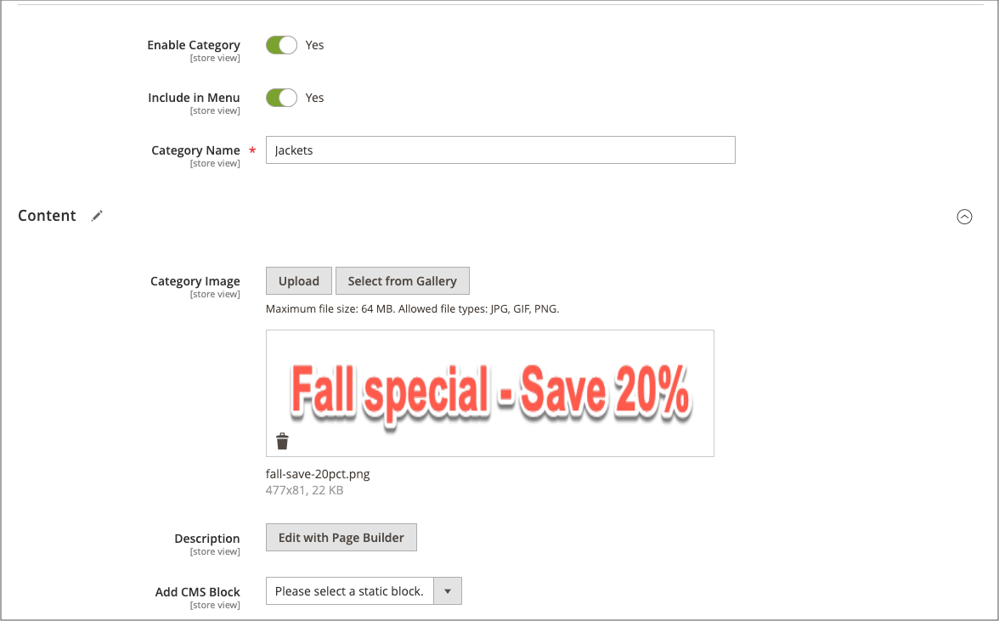

# Een item toevoegen aan een campagne

{{ee-feature}}

In het volgende voorbeeld wordt tijdens de campagne een promotieafbeelding aan de categoriepagina toegevoegd. U kunt hetzelfde ook doen voor een productpagina of CMS-pagina.

## Het campagneitem toevoegen voor een categorie

1. Voor _Admin_ sidebar, ga **[!UICONTROL Catalog]** > **[!UICONTROL Categories]**.

1. Zoek de categorie die u in de campagne wilt gebruiken en open deze in de bewerkingsmodus.

1. Klik op **[!UICONTROL Schedule New Update]**.

1. Selecteer **[!UICONTROL Assign to Existing Campaign]** .

1. Selecteer in de lijst de campagne die u wilt wijzigen.

   {width="600" zoomable="yes"}

1. Breid  **[!UICONTROL Content]** uit.

1. Voor **[!UICONTROL Category Image]** klikt u op **[!UICONTROL Upload]** en selecteert u de afbeelding die tijdens de campagne op de categoriepagina moet worden weergegeven.

   {width="600" zoomable="yes"}

1. Klik op **[!UICONTROL Save]** als de bewerking is voltooid.

## Het item valideren

1. Voor _Admin_ sidebar, ga **[!UICONTROL Content]** > _[!UICONTROL Content Staging]_>**[!UICONTROL Dashboard]**.

1. Zoek de campagne in de weergegeven lijst of tijdlijn en open de campagne voor toegang tot de details:

   - Klik voor een lijstweergave op **[!UICONTROL Select]** en vervolgens op **[!UICONTROL View/Edit]** in de kolom _[!UICONTROL Action]_.
   - Klik eenmaal voor een tijdlijnweergave om het overzicht weer te geven en klik vervolgens op **[!UICONTROL View/Edit]** .

   {width="600" zoomable="yes"}

1. Breid  **[!UICONTROL Categories]** uit om de lijst van toegewezen categorieën te bekijken.

1. Als u de pagina&#39;s voor de categorie wilt bekijken terwijl de campagne actief is, gaat u terug naar het dashboard, klikt u opnieuw op de campagne en klikt u vervolgens op **[!UICONTROL Preview]** .
