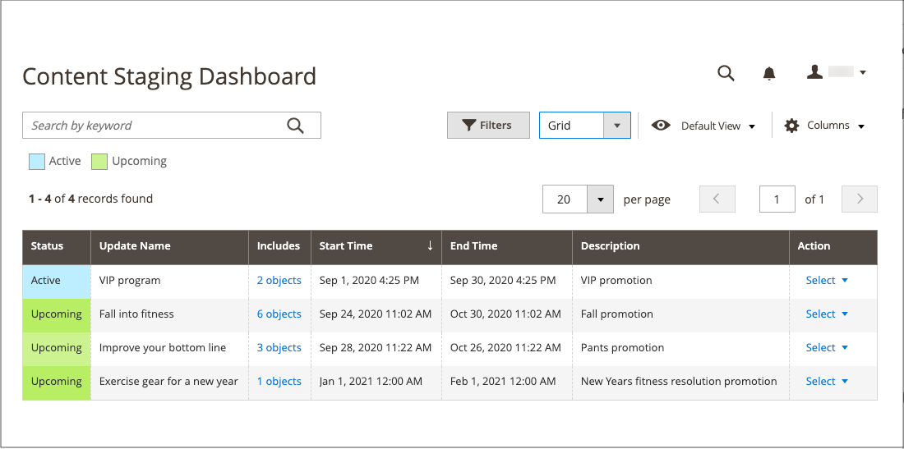
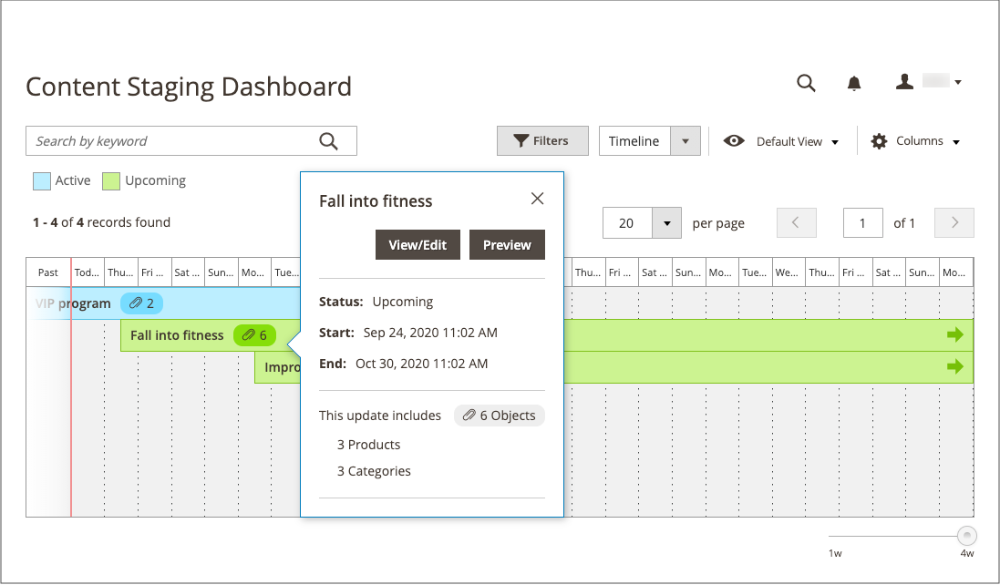
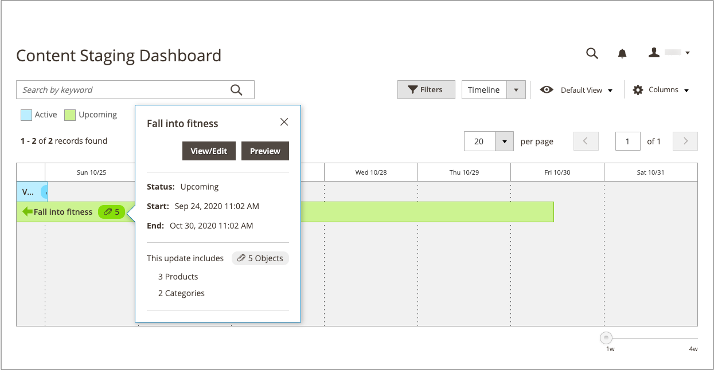

# Inhoudsopmaakdashboard

{{ee-feature}}

Het dashboard van [!UICONTROL Content Staging] biedt een overzicht van alle actieve en komende campagnes. De indeling van het dashboard kan worden gewijzigd van een raster in een tijdlijn. U kunt filters ook gebruiken om campagnes te zoeken, de kolomlay-out aan te passen, en verschillende meningen van het net te bewaren. Voor meer informatie over de werkruimtecontroles, zie [&#x200B; werkruimte Admin &#x200B;](../getting-started/admin-workspace.md).

{width="600" zoomable="yes"}

## Het testdashboard weergeven

1. Voor _Admin_ sidebar, ga **[!UICONTROL Content]** > _[!UICONTROL Content Staging]_>**[!UICONTROL Dashboard]**.

1. Als u de indeling van het dashboard wilt wijzigen, stelt u het besturingselement **[!UICONTROL View As]** in op `list` , `Grid` of `Timeline` .

   {width="600" zoomable="yes"}

   Wanneer de tijdlijn wordt weergegeven, kunt u de schuifregelaar in de rechterbenedenhoek gebruiken om de weergave van een tot vier weken aan te passen. Elke kolom vertegenwoordigt één dag.

1. Als de tijdlijn wordt weergegeven, sleept u de schuifregelaar naar de `4w` -positie helemaal rechts om een langere tijdsperiode weer te geven.

   {width="600" zoomable="yes"}

1. Klik op een item op de pagina om algemene informatie over de campagne weer te geven.

   - Klik op **[!UICONTROL View/Edit]** om de campagne te openen.

   - Als u wilt zien hoe de campagne eruit ziet voor klanten in de winkel op die dag, klikt u op **[!UICONTROL Preview]** .

   {width="600" zoomable="yes"}

## Kolombeschrijvingen van het dashboard opvoeren

| Kolom | Beschrijving |
|--- |--- |
| [!UICONTROL Status] | Status van de campagne. `Active` of `Upcoming` . |
| [!UICONTROL Update Name] | De naam van de campagne. |
| [!UICONTROL Includes] | Hiermee bepaalt u hoeveel objecten in de campagne worden opgenomen. |
| [!UICONTROL Start Time] | De datum waarop de campagne start. |
| [!UICONTROL End Time] | De datum waarop de campagne wordt beëindigd. |
| [!UICONTROL Description] | Aanvullende beschrijving van elke campagne. |
| [!UICONTROL Action] | De acties die op een individueel verslag kunnen worden toegepast omvatten: **[!UICONTROL View/Edit]**- opent de campagne in geef wijze uit. **[!UICONTROL Preview]** - Geeft de campagne weer in de voorvertoningsmodus. |

{style="table-layout:auto"}

## Een campagne bewerken

Bestaande campagneobjecten kunnen worden bewerkt vanaf het testdashboard, behalve prijsregelcampagnes die geen einddatum hebben.

>[!NOTE]
>
>Als een actieve campagne in eerste instantie zonder einddatum wordt gemaakt, kan de campagne later niet worden bewerkt om een einddatum op te nemen. In dat geval moet een dubbele campagne worden gemaakt en moet de gewenste einddatum worden ingevoerd.

{width="600" zoomable="yes"}

De campagne in dit voorbeeld omvat twee categorieën en drie afzonderlijke producten.

Voer de onderstaande stappen uit om objecten in deze campagne te bewerken.

1. Voor _Admin_ sidebar, ga **[!UICONTROL Content]** > _[!UICONTROL Content Staging]_>**[!UICONTROL Dashboard]**.

1. Zoek de campagne in de weergegeven lijst of tijdlijn en open de campagne voor toegang tot de details:

   - Klik voor een lijstweergave op **[!UICONTROL Select]** en vervolgens op **[!UICONTROL View/Edit]** in de kolom _[!UICONTROL Action]_.
   - Klik eenmaal voor een tijdlijnweergave om het overzicht weer te geven en klik vervolgens op **[!UICONTROL View/Edit]** .

1. Werk de instellingen in de sectie _[!UICONTROL General]_&#x200B;naar wens bij.

1. Breid  uit om het even welke sectie die een punt bevat dat moet worden uitgegeven.

   {width="600" zoomable="yes"}

1. Klik op **[!UICONTROL Save]**.
