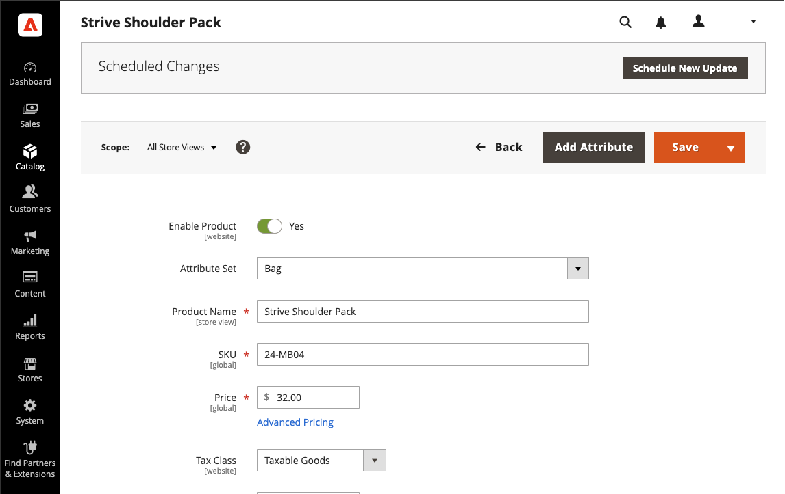

# Een inhoudsupdate plannen

{{ee-feature}}

In het volgende voorbeeld ziet u hoe u een tijdelijke prijswijziging voor een product kunt plannen. Dit omvat het plannen en voorvertonen van wijzigingen en het weergeven van geplande updates in de kalender. Hoewel dit voorbeeld slechts één wijziging bevat, kan een campagne meerdere wijzigingen in producten, prijsregels, CMS-pagina&#39;s en andere entiteiten bevatten die op hetzelfde moment moeten plaatsvinden. Volg een vergelijkbare methode om de datum van/tot voor het kenmerk [!UICONTROL Set Product As New] op te geven.

>[!NOTE]
>U moet een geplande update maken om een begin- (en einddatum) voor [!UICONTROL Set Product As New] op te geven. Voor [!UICONTROL Special Price] en [!UICONTROL Design Change] worden de van/tot-datumvelden verwijderd uit Adobe Commerce en alleen beschikbaar in Magento Open Source.
>
>Alle geplande updates worden opeenvolgend toegepast, wat betekent dat elke entiteit slechts één geplande update tegelijk kan hebben. Elke geplande update wordt toegepast op alle winkelweergaven binnen de opgegeven tijdsperiode. Dientengevolge, kan een entiteit geen verschillende geplande update voor verschillende opslagmeningen tezelfdertijd hebben. Alle waarden van entiteitattributen binnen alle opslagmeningen, die niet door de huidige geplande update worden beïnvloed, worden genomen van de standaardwaarden, en niet van de vorige geplande update.

## Een update voor een product plannen

1. Open in het _[!UICONTROL Products]_-raster een product in de bewerkingsmodus.

1. Klik in het vak _[!UICONTROL Scheduled Changes]_&#x200B;boven aan de pagina op **[!UICONTROL Schedule New Update]**.

   {width="600" zoomable="yes"}

1. Selecteer de optie **[!UICONTROL Save as a New Update]** en stel de basisparameters voor de update in:

   - Voer bij **[!UICONTROL Update Name]** een naam in voor de nieuwe campagne voor het opslaan van inhoud.

   - Voer een korte **[!UICONTROL Description]** in van de update en hoe deze moet worden gebruikt.

   - Gebruik het hulpmiddel van de Kalender () om de **Datum van het Begin** en **Datum van het Eind** voor de campagne te kiezen.

     Geef geen einddatum op als u een campagne met een open einde wilt maken. Voor dit voorbeeld is de campagne gepland om vanaf middernacht te beginnen voor het nieuwe jaar, 1 januari 2021 om 12:00 uur PST.

     Voor een prijsregelcampagne die zonder einddatum is gemaakt, kan een einddatum niet later worden toegevoegd. In dat geval moet een campagne worden opgezet en moet de begindatum worden ingesteld op de datum waarop de oude campagne moet worden beëindigd en de nieuwe campagne moet worden gestart. Op die begindatum eindigt de oude campagne en begint de nieuwe campagne zoals gedefinieerd.

     {width="600" zoomable="yes"}

     >[!NOTE]
     >
     >De de begindatum en einddatum van de campagne moeten worden bepaald door de **_gebrek_** tijdzone van Admin te gebruiken, die van de lokale tijdzone van elke website wordt omgezet. Wanneer u bijvoorbeeld meerdere websites in verschillende tijdzones hebt, maar u wilt een campagne starten op basis van een tijdzone in de VS (de standaardtijdzone), moet u een afzonderlijke update voor elke lokale tijdzone plannen. In dit geval stelt u **[!UICONTROL Start Date]** en **[!UICONTROL End Date]** in als omgezet van elke tijdzone van de lokale website naar de standaardtijdzone van Admin.

1. Schuif omlaag naar _[!UICONTROL Price]_&#x200B;en klik op **[!UICONTROL Advanced Pricing]**.

1. Voer een **[!UICONTROL Special Price]** voor het product in tijdens de geplande campagne en klik op **[!UICONTROL Done]** .

1. Klik op **[!UICONTROL Save]** als de bewerking is voltooid.

   De geplande wijziging wordt boven aan de productpagina weergegeven met de begin- en einddatum van de campagne.

   {width="600" zoomable="yes"}

## De geplande wijziging bewerken

1. In _Geplande Veranderingen_ doos bij de bovenkant van de pagina, klik **[!UICONTROL View/Edit]**.

1. Breng de benodigde wijzigingen aan in de geplande update.

1. Klik op **[!UICONTROL Save]**.

## Voorbeeld van geplande wijziging bekijken

In _Geplande Veranderingen_ doos bij de bovenkant van de pagina, klik **[!UICONTROL Preview]**.

De voorvertoning opent een nieuw browsertabblad en toont hoe het product tijdens de geplande campagne wordt weergegeven.

>[!NOTE]
>
>Een het opvoeren voorproef voor een geplande update begint altijd van de **standaard** opslagmening, die de ervaring van de klant navigeert om door de het opvoeren updatecampagne te navigeren.

Voor meer informatie over het gebruiken van de hulpmiddelen van de voorproefinhoud om de datum en het werkingsgebied van de voorproef te veranderen, zie [ Previewing een Campagne ](content-staging-preview.md). U kunt ook een koppeling naar de voorvertoning van de winkel delen met uw collega&#39;s.
