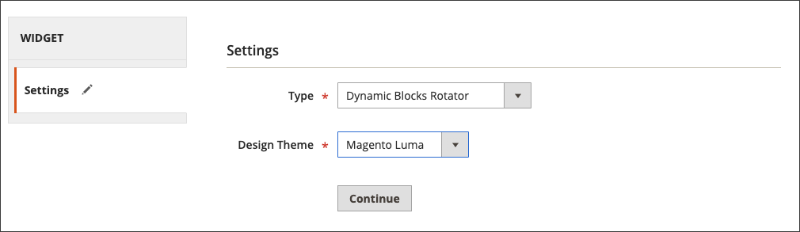

# Een roterend dynamisch blok toevoegen

{{ee-feature}}

Om een diashow van interactieve inhoud voor te stellen, kunt u veelvoudige [ dynamische blokken ](dynamic-blocks.md) aan een rotator toevoegen. Het [ widget ](widgets.md) hulpmiddel wordt gebruikt om de rotator bij een specifieke plaats op één of één enkele pagina, of op veelvoudige pagina&#39;s door uw opslag te plaatsen.

{width="700" zoomable="yes"}

## Stap 1: afzonderlijke dynamische blokken maken

Om [ tot de dynamische blokken ](dynamic-blocks.md) te leiden die u in rotator wilt plaatsen, deze instructies volgen:

## Stap 2: Een dynamische blokrotator-widget toevoegen

1. Voor _Admin_ sidebar, ga **[!UICONTROL Content]** > _[!UICONTROL Elements]_>**[!UICONTROL Widgets]**.

1. Klik in de rechterbovenhoek op **[!UICONTROL Add Widget]** .

1. Onder _Montages_, plaats **[!UICONTROL Type]** aan `Dynamic Blocks Rotator`.

1. Kies de huidige **[!UICONTROL Design Theme]** van de winkel.

   Dit het plaatsen identificeert het huidige pakket of [ thema ](themes.md) dat de paginalay-out van de opslag bepaalt.

1. Klik op **[!UICONTROL Continue]**.

   {width="600" zoomable="yes"}

## Stap 3: De opties voltooien

1. Onder _Eigenschappen Storefront_, plaats de opties:

   - Voer een **[!UICONTROL Title]** in voor de rotator.

   - In de **[!UICONTROL Assign to Store Views]** lijst, selecteer de [ opslagmeningen ](../getting-started/websites-stores-views.md) waar de rotator beschikbaar is.

   - (Optioneel) Voer een **[!UICONTROL Sort Order]** -getal in om de positie van de rotator in de doelcontainer te bepalen. Het is relatief ten opzichte van andere widgets die aan dezelfde container kunnen worden toegewezen.

   {width="600" zoomable="yes"}

1. Onder _Opties van de Lay-out_, klik **[!UICONTROL Add Layout Update]** en doe het volgende:

   - Stel **[!UICONTROL Display on]** in op de pagina, of op het type pagina, waar de rotator moet worden weergegeven.

      - `Categories` - Toont de rotator op of [ anker ](../catalog/navigation-layered.md) of niet-ankercategoriepagina&#39;s. Opties: Ankercategorieën / Niet-ankercategorieën
      - `Products` - Geeft de rotator weer op een specifiek type productpagina of op alle productpagina&#39;s. Opties: Alle Types van Product / [ Eenvoudig Product ](../catalog/product-create-simple.md) / [ Virtueel Product ](../catalog/product-create-virtual.md) / [ BundelProduct ](../catalog/product-create-bundle.md) / [ Downloadbaar Product ](../catalog/product-create-downloadable.md) / [ Kaart van het Cadeautje ](../catalog/product-gift-card-create.md) / [ Configureerbaar Product ](../catalog/product-create-configurable.md) / [ Gegroepeerd Product ](../catalog/product-create-grouped.md)
      - `Generic Pages` - Geeft de rotator weer op alle pagina&#39;s, op een specifieke pagina of alleen op pagina&#39;s met een bepaalde indeling. Opties: `All Pages` / `Specified Page` / `Page Layouts`

     In het voorbeeld moet de rotator op een `Specified Page` worden geplaatst.

   - Selecteer de specifieke **[!UICONTROL Page]** locatie waar de rotator moet worden weergegeven.

   - Plaats **[!UICONTROL Container]** aan het deel van de [ paginalay-out ](page-layout.md#standard-page-layouts) waar de rotator moet verschijnen.

     Als andere widgets aan dezelfde container worden toegewezen, worden ze op volgorde weergegeven volgens de sorteervolgorde.

   - Accepteer `Dynamic Block Template` als de standaardwaarde **[!UICONTROL Template]** .

     Deze instelling bepaalt de sjabloon die wordt gebruikt om de rotator op te maken, op basis van het feit of de rotator zelfstandig moet staan of in bestaande tekst moet worden geplaatst.

     {width="600" zoomable="yes"}

   - Klik op **[!UICONTROL Save and Continue Edit]**.

1. Kies **[!UICONTROL Widget Options]** in het linkerdeelvenster.

1. Accepteer `Specified Dynamic Blocks` voor de **[!UICONTROL Dynamic Blocks to Display]** .

   Deze instelling bepaalt het type dynamische blokken dat in de rotator is opgenomen.

   - `Specified Dynamic Blocks` - Bevat alleen specifieke dynamische blokken.
   - `Cart Price Rule Related` - Bevat alleen dynamische blokken die zijn gekoppeld aan een regel voor de winkelwagenprijs.
   - `Catalog Price Rule Related` - Bevat alleen dynamische blokken die zijn gekoppeld aan de regel voor catalogusprijzen.

1. Selecteer `Content Area` als u **[!UICONTROL Restrict the Dynamic Block Types]** wilt gebruiken dat met de widget kan worden gebruikt.

   Met deze instelling beperkt u de banner tot een specifiek gedeelte van de pagina-indeling.

   - `Content Area` - Plaatst het dynamische blok in het belangrijkste inhoudsgebied van de pagina.
   - `Footer` - Hiermee plaatst u het dynamische blok in de voettekst van de pagina.
   - `Header` - Plaatst het dynamische blok in de paginakoptekst.
   - `Left Column` - Plaatst het dynamische blok in de linkerkolom van de paginalay-out, als beschikbaar.
   - `Right Column` - Plaatst het dynamische blok in de juiste kolom van de paginalay-out, als beschikbaar.

1. Stel **[!UICONTROL Rotation Mode]** in op een van de volgende opties:

   - `Display all instead of rotating` - Geeft een stapel dynamische blokken weer, waarin alle blokken zichtbaar zijn.
   - `One at a time, Random` - Geeft de opgegeven dynamische blokken in willekeurige volgorde weer. Wanneer de pagina wordt vernieuwd, wordt een ander (en willekeurig) dynamisch blok weergegeven.
   - `One at the time, Series` - Geeft de opgegeven dynamische blokken weer in de volgorde waarin ze zijn toegevoegd. Wanneer de pagina wordt vernieuwd, wordt het volgende dynamische blok in de reeks weergegeven.
   - `One at the time, Shuffle` - Hiermee wordt één dynamisch blok tegelijk in willekeurige volgorde weergegeven. Deze optie lijkt op de optie `One at a time, Random` , maar hetzelfde dynamische blok wordt niet herhaald.

     {width="600" zoomable="yes"}

1. Selecteer in het **[!UICONTROL Specify Dynamic Blocks]** -raster het selectievakje van elk dynamisch blok dat u in de rotator wilt opnemen.

1. Klik op **[!UICONTROL Save]** als de bewerking is voltooid.
