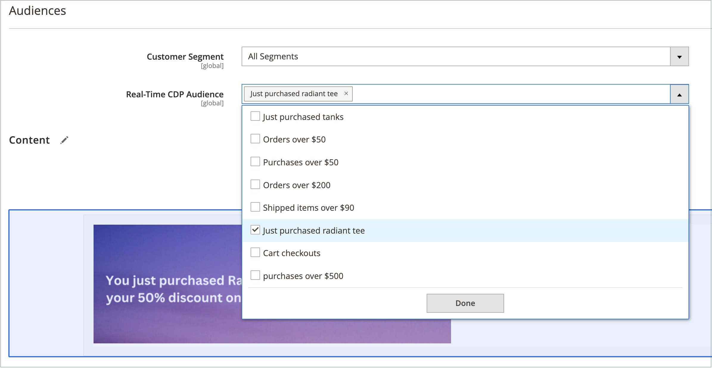

# Dynamische blokken

{{ee-feature}}

Rijke, interactieve inhoud maken die door logica wordt aangedreven [prijsregels](../merchandising-promotions/introduction.md#price-rules) en [klantsegmenten](../customers/customer-segments.md). Bestaande [dynamische blokken](../page-builder/dynamic-block.md) rechtstreeks aan de [!DNL Page Builder] [stadium](../page-builder/workspace.md). Voor een gedetailleerd, geleidelijke voorbeeld voor het gebruiken van dynamische blokken, zie [Lesbestand 2: Blokken](../page-builder/2-blocks.md).

>[!NOTE]
>
>De _[!UICONTROL Banner]_in de [[!UICONTROL Content] menu](content-menu.md) is vervangen in punt 2.3.1 en verwijderd in punt 2.4.0. De functionaliteit ervan wordt vervangen door Dynamische blokken.

![[!DNL Page Builder] - dynamisch blok met prijsregel en klantensegment](../page-builder/assets/pb-tutorial2-dynamic-block-storefront.png){width="600" zoomable="yes"}

## Stap 1: Een dynamisch blok maken

1. Op de _Beheerder_ zijbalk, ga naar **[!UICONTROL Content]** > _[!UICONTROL Elements]_>**[!UICONTROL Dynamic Blocks]**.

   {width="600" zoomable="yes"}

1. Klik in de rechterbovenhoek op **[!UICONTROL Add Dynamic Block]**.

   {width="600" zoomable="yes"}

1. Indien van toepassing, instellen **[!UICONTROL Store View]** naar een specifieke winkelweergave waar het dynamische blok moet worden weergegeven.

1. Als u het dynamische blok wilt activeren, stelt u **[!UICONTROL Enable Dynamic Block]** tot `Yes`.

1. Voer een beschrijving in voor interne referentie **[!UICONTROL Dynamic Block Name]**.

1. Set **[!UICONTROL Dynamic Block Type]** naar het gebied van de pagina waar u het dynamische blok wilt weergeven en klik op **[!UICONTROL Done]**.

   {width="500" zoomable="yes"}

1. In de **[!UICONTROL Customer Segment]** lijst, selecteer checkbox van elk segment dat u het dynamische blok wilt zien en klik **[!UICONTROL Done]** om de instelling op te slaan.

   {width="500" zoomable="yes"}

   >[!NOTE]
   >
   >- Als er geen segment wordt gemaakt, is het dynamische blok voor iedereen zichtbaar.
   >- Als de klant niet tot een segment behoort en het dynamische blok voor alle segmenten wordt gecreeerd, wordt de inhoud van het dynamische blok nog getoond.
   >- Als alle klantensegmenten die aan een Dynamisch Blok worden toegewezen worden geschrapt, is zijn inhoud dan zichtbaar aan iedereen.

### Real-Time CDP-publiek gebruiken in dynamische blokken

Als u [geïnstalleerd](../customers/audience-activation.md#install-the-extension) en [geconfigureerd](../customers/audience-activation.md#configure-the-extension) de [!DNL Audience Activation] extensie, wordt een sectie met de naam **[!UICONTROL Audiences]**.

{width="600" zoomable="yes"}

In de **[!UICONTROL Real-Time CDP Audience]** Selecteer het selectievakje van elk publiek dat u het dynamische blok wilt zien en klik op **[!UICONTROL Done]** om de instelling op te slaan.

## Stap 2: De inhoud voltooien

Gebruik de [!DNL Page Builder] [werkruimte](../page-builder/workspace.md) om de inhoud te voltooien.

![[!DNL Page Builder] - de dynamische blokwerkruimte](../page-builder/assets/pb-dynamic-block-workspace.png){width="600" zoomable="yes"}

## Stap 3: Een verwante aanbieding kiezen

1. Omlaag schuiven en uitbreiden  **[!UICONTROL Related Promotions]**.

1. Klik op het soort promotie dat u wilt koppelen aan het dynamische blok:

   - **[!UICONTROL Add Cart Price Rules]** (zie [Lijnen met winkelprijzen](../merchandising-promotions/price-rules-cart.md))

   - **[!UICONTROL Add Catalog Price Rules]** (zie [Catalogusprijsregels](../merchandising-promotions/price-rules-catalog.md))

   >[!NOTE]
   >
   >Catalogusprijsregels worden niet ondersteund voor Real-Time CDP-gebruikers.

1. Selecteer in de lijst met beschikbare regels het selectievakje van elke regel die u wilt gebruiken en klik op **[!UICONTROL Add Selected]**.

1. Wanneer het dynamische blok is voltooid, klikt u op **[!UICONTROL Save]**.

## Stap 4: Voeg het dynamische blok toe aan een pagina

1. Open de pagina waar u het dynamische blok wilt weergeven.

1. Gebruik de [[!UICONTROL Add Dynamic Block]](../page-builder/dynamic-block.md) inhoudstype om het dynamische blok aan het werkgebied toe te voegen.

## Beschrijving van veld en gereedschap

| Veld | Beschrijving |
|--- |--- |
| [!UICONTROL Store View] | Hiermee geeft u de winkelweergaven op waarin het dynamische blok beschikbaar moet zijn. |
| [!UICONTROL Enable Dynamic Block] | Hiermee activeert of deactiveert u het dynamische blok. Opties: Ja/Nee |
| [!UICONTROL Dynamic Block Name] | Een beschrijvende naam die het dynamische blok in Admin identificeert. |
| [!UICONTROL Dynamic Block Type] | Identificeert de plaats in [standaardpagina-indeling](layout-updates.md) waar het dynamische blok wordt geplaatst. Opties:  **[!UICONTROL Content Area]**- Plaatst het dynamische blok in het hoofdgedeelte [inhoudsgebied](layout-updates.md) van de pagina. **[!UICONTROL Footer]** - Plaatst het dynamische blok op de pagina [voettekst](page-setup.md#footer).  **[!UICONTROL Header]**- Plaatst het dynamische blok op de pagina [header](page-setup.md#header). **[!UICONTROL Left Column]** - Plaatst het dynamische blok in de [linkerzijbalk](page-layout.md#standard-page-layouts) met een indeling met twee of drie kolommen.  **[!UICONTROL Right Column]**- Plaatst het dynamische blok in de [rechterzijbalk](page-layout.md#standard-page-layouts) met een indeling met twee of drie kolommen. |
| Klantsegment | Associeert een klantensegment met het dynamische blok om te bepalen welke klanten het kunnen zien. |
| Real-Time CDP-publiek | Associates a [Real-Time CDP-publiek](../customers/audience-activation.md) met het dynamische blok om te bepalen welke klanten het kunnen zien. |

{style="table-layout:auto"}

### Inhoud

| Veld | Beschrijving |
|--- |--- |
| [!UICONTROL Layout] | Voeg rijen, kolommen of tabs toe aan het werkgebied. |
| [!UICONTROL Elements] | Voeg tekst, koppen, knoppen, scheidingslijnen en HTML-code toe aan elke lay-outcontainer in het werkgebied. |
| [!UICONTROL Media] | Voeg afbeeldingen, video, banners, schuifregelaars en Google Maps toe aan een bestaande lay-outcontainer in het werkgebied. |
| [!UICONTROL Add Content] | Voeg bestaande blokken, dynamische blokken en producten toe aan het werkgebied. |

{style="table-layout:auto"}

### Verwante aanbiedingen

| Veld | Beschrijving |
|--- |--- |
| [!UICONTROL Related Cart Price Rule] | **[!UICONTROL Add Cart Price Rules]** - Een bestaande koppeling maken [kartonnen prijsregel](../merchandising-promotions/price-rules-cart.md) met het dynamische blok als een promotie. |
| [!UICONTROL Related Catalog Price Rule] | **[!UICONTROL Add Catalog Price Rules]** - Een bestaande koppeling maken [catalogusprijsregel](../merchandising-promotions/price-rules-catalog.md) met het dynamische blok als een promotie. |

{style="table-layout:auto"}
